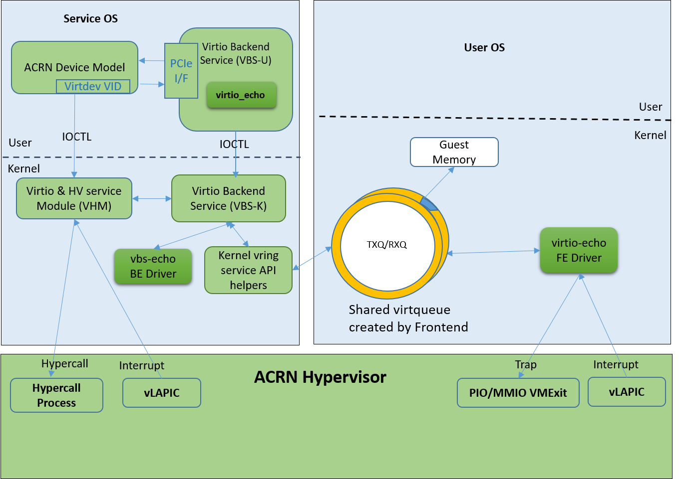
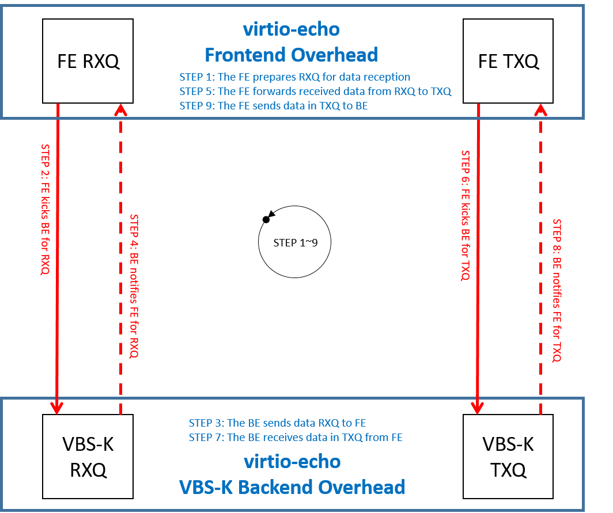
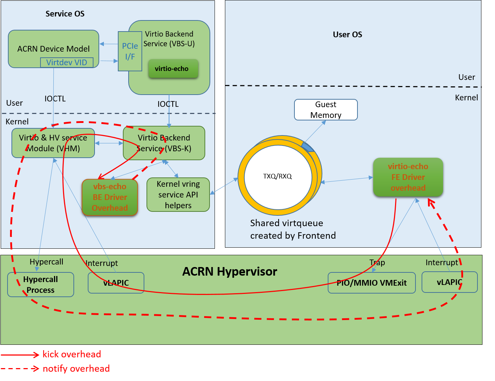

.. _vbsk-overhead:

VBS-K Framework Virtualization Overhead Analysis
################################################

Introduction
************

The ACRN Hypervisor follows the Virtual I/O Device (virtio)
specification to realize I/O virtualization for many
performance-critical devices supported in the ACRN project. The
hypervisor provides the virtio backend service (VBS) APIs, that make it
very straightforward to implement a virtio device in the hypervisor. We
can evaluate the virtio backend service in kernel-land (VBS-K) framework
overhead through a test virtual device called virtio-echo. The total
overhead of a frontend-backend application based on VBS-K consists
of VBS-K framework overhead and application-specific overhead. The
application-specific overhead depends on the specific frontend-backend
design, from microseconds to seconds. In our HW case, the overall VBS-K
framework overhead is on the microsecond level, sufficient to meet the
needs of most applications.

Architecture of VIRTIO-ECHO
***************************

virtio-echo is a virtual device based on virtio, and designed for
testing ACRN virtio backend services in the kernel (VBS-K) framework. It
includes a virtio-echo frontend driver, a virtio-echo driver in ACRN
device model (DM) for initialization, and a virtio-echo driver based on
VBS-K for data reception and transmission. For more virtualization
background introduction, please refer to:

* :ref:`introduction`
* :ref:`virtio-hld`

virtio-echo is implemented as a virtio legacy device in the ACRN device
model (DM), and  is registered as a PCI virtio device to the guest OS
(UOS). The virtio-echo software  has three parts:

-  **virtio-echo Frontend Driver**: This driver runs in the UOS. It prepares
   the RXQ and notifies the backend for receiving incoming data when the
   UOS starts. Second, it copies the received data from the RXQ to TXQ
   and sends them to the backend. After receiving the message that the
   transmission is completed, it starts again another round of reception
   and transmission, and keeps running until a specified number of cycle
   is reached.
-  **virtio-echo Driver in DM**: This driver is used for initialization
   configuration. It simulates a virtual PCI device for the frontend
   driver use, and sets necessary information such as the device
   configuration and virtqueue information to the VBS-K. After
   initialization, all data exchange are taken over by the VBS-K
   vbs-echo driver.
-  **vbs-echo Backend Driver**: This driver sets all frontend RX buffers to
   be a specific value and sends the data to the frontend driver. After
   receiving the data in RXQ, the fronted driver copies the data to the
   TXQ, and then sends them back to the backend. The backend driver then
   notifies the frontend driver that the data in the TXQ has
   been successfully received. In virtio-echo, the backend driver
   doesn't process or use the received data.

:numref:`vbsk-virtio-echo-arch` shows the whole architecture of virtio-echo.

   virtio-echo Architecture

Virtualization Overhead Analysis
********************************

Let's analyze the overhead of the VBS-K framework. As we know, the VBS-K
handles notifications in the SOS kernel instead of in the SOS user space
DM. This can avoid overhead from switching between kernel space and user
space. Virtqueues are allocated by UOS, and virtqueue information is
configured to VBS-K backend by the virtio-echo driver in DM, thus
virtqueues can be shared between UOS and SOS. There is no copy overhead
in this sense. The overhead of VBS-K framework mainly contains two
parts: kick overhead and notify overhead.

-  **Kick Overhead**: The UOS gets trapped when it executes sensitive
   instructions that notify the hypervisor first. The notification is
   assembled into an IOREQ, saved in a shared IO page, and then
   forwarded to the VHM module by the hypervisor. The VHM notifies its
   client for this IOREQ, in this case, the client is the vbs-echo
   backend driver. Kick overhead is defined as the interval from the
   beginning of UOS trap to a specific VBS-K driver e.g. when
   virtio-echo gets notified.
-  **Notify Overhead**: After the data in virtqueue being processed by the
   backend driver, vbs-echo calls the VHM module to inject an interrupt
   into the frontend. The VHM then uses the hypercall provided by the
   hypervisor, which causes a UOS VMEXIT. The hypervisor finally injects
   an interrupt into the vLAPIC of the UOS and resumes it. The UOS
   therefore receives the interrupt notification.  Notify overhead is
   defined as the interval from the beginning of the interrupt injection
   to when the UOS starts interrupt processing.

The overhead of a specific application based on VBS-K includes two
parts: VBS-K framework overhead and application-specific overhead.

-  **VBS-K Framework Overhead**: As defined above, VBS-K framework overhead
   refers to kick overhead and notify overhead.
-  **Application-Specific Overhead**: A specific virtual device has its own
   frontend driver and backend driver. The application-specific overhead
   depends on its own design.

:numref:`vbsk-virtio-echo-e2e` shows the overhead of one end-to-end
operation in virtio-echo.  Overhead of steps marked as red are caused by
the virtualization scheme based on VBS-K framework. Costs of one "kick"
operation and one "notify" operation are both on a microsecond level.
Overhead of steps marked as blue depend on specific frontend and backend
virtual device drivers. For virtio-echo, the whole end-to-end process
(from step1 to step 9) costs about 4 dozens of microsecond. That's
because virtio-echo does little things in its frontend and backend
driver which is just for testing and there is very little process
overhead.

   End to End Overhead of virtio-echo

:numref:`vbsk-virtio-echo-path` details the path of kick and notify
operation shown in :numref:`vbsk-virtio-echo-e2e`. The VBS-K framework
overhead is caused by operations through these paths. As we can see, all
these operations are processed in kernel mode which avoids extra
overhead of passing IOREQ to userspace processing.

   Path of VBS-K Framework Overhead

Conclusion
**********

Unlike VBS-U processing in user mode, VBS-K moves things into the kernel
mode and can be used to accelerate processing. A virtual device
virtio-echo based on VBS-K framework is used to evaluate the VBS-K
framework overhead. In our test, the VBS-K framework overhead (one kick
operation and one notify operation) is on the microsecond level which
can meet the needs of most applications.
