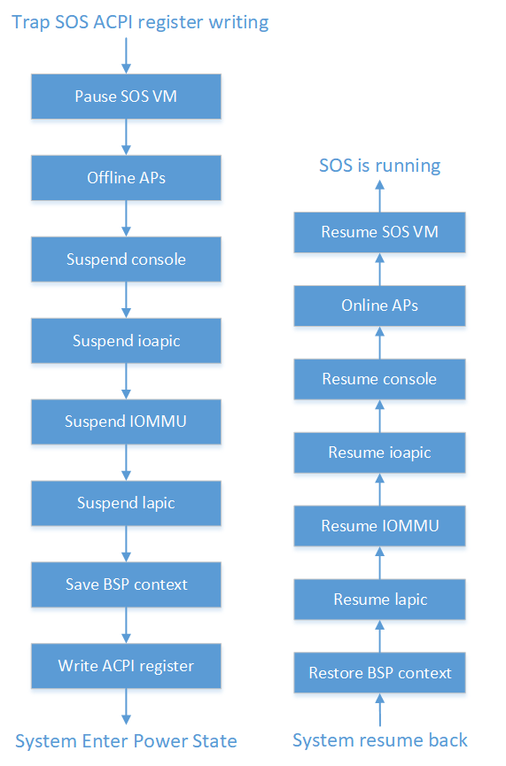

.. _pm_hld:

Power Management
################

System PM module
****************

The PM module in the hypervisor does three things:

-  When all UOSes enter low power state, VM management will notify the SOS
   lifecycle service and trigger the SOS to enter a low-power state.
   SOS follows its own standard low-power state entry process and
   writes the ACPI control register to put SOS into low-power state.
   Hypervisor traps the ACPI control register writing and
   emulates SOS low-power state entry.

-  Once SOS low-power emulation is done, Hypervisor handles its
   own low-power state transition

-  Once system resumes from low-power mode, the hypervisor handles its
   own resume and emulates SOS resume too.

It is assumed that SOS does not trigger any power state transition until
the VM manager of ACRN notifies it that all UOSes are inactive and SOS
offlines all its virtual APs.

:numref:`pm-low-power-transition` shows the SOS/Hypervisor low-power
state transition process.  SOS triggers power state transition by
writing ACPI control register on its virtual BSP (which is pinned to the
physical BSP). The hypervisor then does the following in sequence before
it writes to the physical ACPI control register to trigger physical
power state transition:

-  Pauses SOS.
-  Offlines all physical APs.
-  Save the context of console, ioapic of SOS, I/O MMU, lapic of SOS,
   virtual BSP.
-  Save the context of physical BSP.

When exiting from low-power mode, the hypervisor does similar steps in
reverse order to restore contexts, start APs and resume SOS. SOS is
responsible for starting its own virtual APs as well as UOSes.

   SOS/Hypervisor low power state transition process
