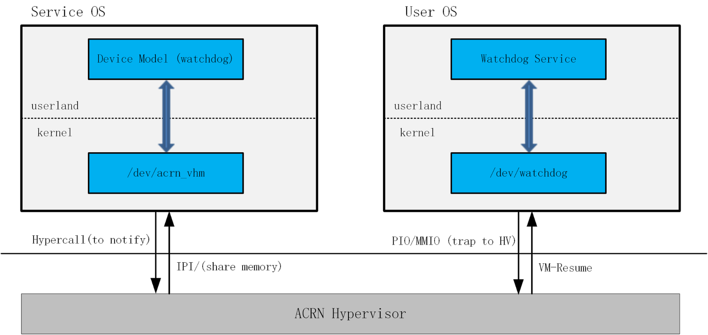
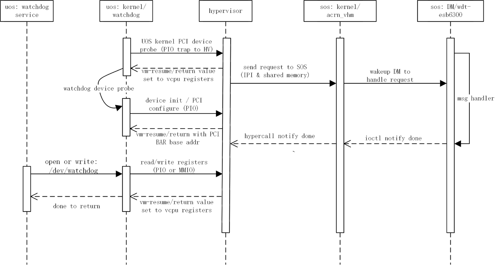

.. _watchdog-hld:

Watchdog Virtualization in Device Model
#######################################

This document describes the watchdog virtualization implementation in
ACRN device model.

Overview
********

A watchdog is an important hardware component in embedded systems, used
to monitor the system's running status, and resets the processor if the
software crashes. In general,  hardware watchdogs rely on a piece of
software running on the machine which must "kick" the watchdog device
regularly, say every 10 seconds. If the watchdog doesn't get "kicked"
after 60 seconds, for example, then the watchdog device asserts the
RESET line which results in a hard reboot.

For ACRN we emulate the watchdog hardware in the Intel 6300ESB chipset
as a PCI device called 6300ESB watchdog and is added into the Device
Model following the PCI device framework. The following
:numref:`watchdog-device` shows the watchdog device workflow:

   Watchdog device flow

The DM in the Service OS (SOS) treats the watchdog as a passive device.
It receives read/write commands from the watchdog driver, does the
actions, and returns.  In ACRN, the commands are from User OS (UOS)
watchdog driver.

UOS watchdog work flow
**********************

When the UOS does a read or write operation on the watchdog device's
registers or memory space (Port IO or Memory map I/O), it will trap into
the hypervisor.   The hypervisor delivers the operation to the SOS/DM
through IPI (inter-process interrupt) or shared memory, and the DM
dispatches the operation to the watchdog emulation code.

After the DM watchdog finishes emulating the read or write operation, it
then calls ``ioctl`` to the SOS/kernel (``/dev/acrn_vhm``). VHM will call a
hypercall to trap into the hypervisor to tell it the operation is done, and
the hypervisor will set UOS-related VCPU registers and resume UOS so the
UOS watchdog driver will get the return values (or return status). The
:numref:`watchdog-workflow` below is a typical operation flow: 
from UOS to SOS and return back:

   Watchdog operation workflow

Implementation in ACRN and how to use it
****************************************

In ACRN, the Intel 6300ESB watchdog device emulation is added into the
DM PCI device tree. Its interface structure is (see
``devicemodel/include/pci_core.h``):

.. code-block:: c

   struct pci_vdev_ops pci_ops_wdt = {
      .class_name     = "wdt-i6300esb",
      .vdev_init      = pci_wdt_init,
      .vdev_deinit    = pci_wdt_deinit,
      .vdev_cfgwrite  = pci_wdt_cfg_write,
      .vdev_cfgread   = pci_wdt_cfg_read,
      .vdev_barwrite  = pci_wdt_bar_write,
      .vdev_barread   = pci_wdt_bar_read
   };

All functions follow the ``pci_vdev_ops`` definitions for PCI device
emulation.

The main part in the watchdog emulation is the timer thread. It emulates
the watchdog device timeout management. When it gets the kick action
from the UOS, it resets the timer. If the timer expires before getting a
timely kick action, it will call DM API to reboot that UOS.

In the UOS launch script, add: ``-s xx,wdt-i6300esb`` into DM parameters.
(xx is the virtual PCI BDF number as with other PCI devices)

Make sure the UOS kernel has the I6300ESB driver enabled:
``CONFIG_I6300ESB_WDT=y``. After the UOS boots up, the watchdog device
will be created as node ``/dev/watchdog``, and can be used as a normal
device file.

Usually the UOS needs a watchdog service (daemon) to run in userland and
kick the watchdog periodically. If something prevents the daemon from
kicking the watchdog, for example the UOS system is hung, the watchdog
will timeout and the DM will reboot the UOS.
