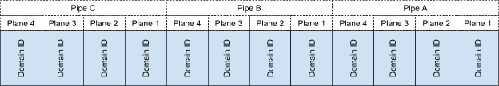
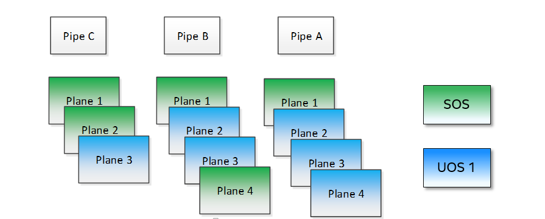
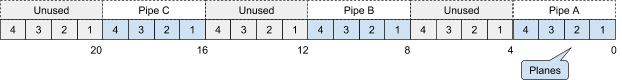
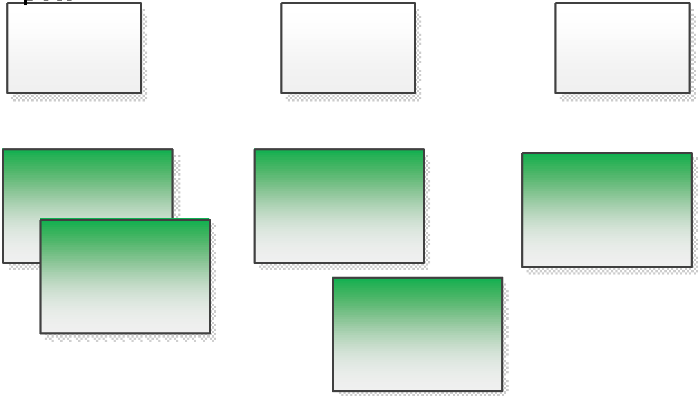
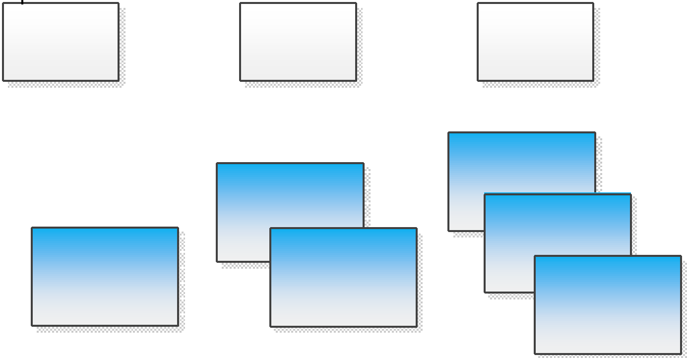

.. _GVT-g-kernel-options:

GVT-g (AcrnGT) Kernel Options
#############################

AcrnGT supports flexible configurations so customers can configure
AcrnGT easily, according to their requirements. This document introduces
the kernel command line options that are related to AcrnGT.

i915.enable_gvt
***************

This option enables support for Intel GVT-g graphics virtualization
support in the host. By default, it's not enabled, so we need to add
``i915.enable_gvt=1`` in the SOS kernel command line.  This is a Service
OS only parameter, and cannot be enabled in the User OS.

i915.enable_pvmmio
******************

We introduce the feature named **Para-Virtualized MMIO** (PVMMIO)
to improve graphics performance of the GVT-g guest.
This feature batches sequential MMIO writes into a
shared buffer between the Service OS and User OS, and then submits a
para-virtualized command to notify to GVT-g in Service OS. This
effectively reduces the trap numbers of MMIO operations and improves
overall graphics performance.

The ``i915.enable_pvmmio`` option controls
the optimization levels of the PVMMIO feature: each bit represents a
sub-feature of the optimization. By default, all
sub-features of PVMMIO are enabled. They can also be selectively
enabled or disabled..

The PVMMIO optimization levels are:

* PVMMIO_ELSP_SUBMIT = 0x1 - Batch submission of the guest graphics
  workloads
* PVMMIO_PLANE_UPDATE = 0x2 - Batch plane register update operations
* PVMMIO_PLANE_WM_UPDATE = 0x4 - Batch watermark registers update operations
* PVMMIO_MASTER_IRQ = 0x8 - Batch IRQ related registers
* PVMMIO_PPGTT_UPDATE = 0x10 - Use PVMMIO method to update the PPGTT table
  of guest.

.. note:: This parameter works in both the Service OS and User OS, but
   changes to one will affect the other. For example, if either SOS or UOS
   disables the PVMMIO_PPGTT_UPDATE feature, this optimization will be
   disabled for both.

i915.gvt_workload_priority
**************************

AcrnGT supports **Prioritized Rendering** as described in the
:ref:`GVT-g-prioritized-rendering` high-level design.  This
configuration option controls the priority level of GVT-g guests.
Priority levels range from -1023 to 1023.

The default priority is zero, the same priority as the Service OS. If
the level is less than zero, the guest's priority will be lower than the
Service OS, so graphics preemption will work and the prioritized
rendering feature will be enabled.  If the level is greater than zero,
UOS graphics workloads will preempt most of the SOS graphics workloads,
except for display updating related workloads that use a default highest
priority (1023).

Currently, all UOSes share the same priority.
This is a Service OS only parameters, and does
not work in the User OS.

i915.enable_initial_modeset
***************************

At time, kernel graphics must be initialized with a valid display
configuration with full display pipeline programming in place before the
user space is initialized and without a fbdev & fb console.

When ``i915.enable_initial_modeset=1``, the FBDEV of i915 will not be
initialized, so users would not be able to see the fb console on screen.
If there is no graphics UI running by default, users will see black
screens displayed.

When ``i915.enable_initial_modeset=0`` in SOS, the plane restriction
(also known as plane-based domain ownership) feature will be disabled.
(See the next section and :ref:`plane_restriction` in the ACRN GVT-g
High Level Design for more information about this feature.)

In the current configuration, we will set
``i915.enable_initial_modeset=1`` in SOS and
``i915.enable_initial_modeset=0`` in UOS.

This parmeter is not used on UEFI platforms.

i915.avail_planes_per_pipe and i915.domain_plane_owners
*******************************************************

Both Service OS and User OS are provided a set of HW planes where they
can display their contents.  Since each domain provides its content,
there is no need for any extra composition to be done through SOS.
``i915.avail_planes_per_pipe`` and ``i915.domain_plane_owners`` work
together to provide the plane restriction (or plan-based domain
ownership) feature.

i915.domain_plane_owners
========================

On Intel's display
hardware, each pipeline contains several planes, which are blended
together by their Z-order and rendered to the display monitors. In
AcrnGT, we can control each planes' ownership so that the domains can
display contents on the planes they own.

The ``i915.domain_plane_owners`` parameter controls the ownership of all
the planes in the system, as shown in :numref:`i915-planes-pipes`. Each
4-bit nibble identifies the domain id owner for that plane and a group
of 4 nibbles represents a pipe. This is a Service OS only configuration
and cannot be modified at runtime.  Domain ID 0x0 is for the Service OS,
the User OS use domain IDs from 0x1 to 0xF.

   i915.domain_plane_owners

For example, if we set ``i915.domain_plane_owners=0x010001101110``, the
plane ownership will be as shown in :numref:`i915-planes-example1` - SOS
(green) owns plane 1A, 1B, 4B, 1C, and 2C, and UOS #1 owns plane 2A, 3A,
4A, 2B, 3B and 3C.

   i915.domain_plane_owners example

Some other examples:

* i915.domain_plane_owners=0x022211110000 - SOS (0x0) owns planes on pipe A;
  UOS #1 (0x1) owns all planes on pipe B; and UOS #2 (0x2) owns all
  planes on pipe C (since, in the representation in
  :numref:`i915-planes-pipes` above, there are only 3 planes attached to
  pipe C).

* i915.domain_plane_owners=0x000001110000 - SOS owns all planes on pipe A
  and pipe C; UOS #1 owns plane 1, 2 and 3 on pipe B. Plane 4 on pipe B
  is owned by the SOS so that if it wants to display notice message, it
  can display on top of the UOS.

i915.avail_planes_per_pipe
==========================

Option ``i915.avail_planes_per_pipe`` is a bitmask (shown in
:numref:`i915-avail-planes`) that tells the i915
driver which planes are available and can be exposed to the compositor.
This is a parameter that must to be set in each domain. If
``i915.avail_planes_per_pipe=0``, the plane restriction feature is disabled.

   i915.avail_planes_per_pipe

For example, if we set ``i915.avail_planes_per_pipe=0x030901`` in SOS
and ``i915.avail_planes_per_pipe=0x04060E`` in UOS, the planes will be as
shown in :numref:`i915-avail-planes-example1` and
:numref:`i915-avail-planes-example1`:

   SOS i915.avail_planes_per_pipe

   UOS i915.avail_planes_per_pipe

``i915.avail_planes_per_pipe`` controls the view of planes from i915 drivers
inside of every domain, and ``i915.domain_plane_owners`` is the global
arbiter controlling which domain can present its content onto the
real hardware.  Generally, they are aligned. For example, we can set
``i915.domain_plane_owners= 0x011111110000``,
``i915.avail_planes_per_pipe=0x00000F`` in SOS, and
``i915.avail_planes_per_pipe=0x070F00`` in domain 1, so every domain will
only flip on the planes they owns.

However, we don't force alignment: ``avail_planes_per_pipe`` might
not be aligned with the
setting of ``domain_plane_owners``. Consider this example:
``i915.domain_plane_owners=0x011111110000``,
``i915.avail_planes_per_pipe=0x01010F`` in SOS and
``i915.avail_planes_per_pipe=0x070F00`` in domain 1.
With this configuration, SOS will be able to render on plane 1B and
plane 1C, however, the content of plane 1B and plane 1C will not be
flipped onto the real hardware.

i915.domain_scaler_owner
************************

On each Intel GPU display pipeline, there are several plane scalers
to zoom in/out the planes. For example, if a 720p video is played
full-screen on a 1080p display monitor, the kernel driver will use a
scaler to zoom in the video plane to a 1080p image and present it onto a
display pipeline. (Refer to "Intel Open Source Graphics PRM Vol 7:
display" for the details.)

On Broxton platforms, Pipe A and Pipe B each
have two plane scalers, and Pipe C has one plane scaler. To support the
plane scaling in AcrnGT guest OS, we introduced the parameter
``i915.domain_scaler_owner``, to assign a specific scaler to the target
guest OS.

As with the parameter ``i915.domain_plane_owners``, each nibble of
``i915.domain_scaler_owner`` represents the domain id that owns the scaler;
every nibble (4 bits) represents a scaler and every group of 2 nibbles
represents a pipe. This is a Service OS only configuration and cannot be
modified at runtime. Domain ID 0x0 is for the Service OS, the User OS
use domain IDs from 0x1 to 0xF.

For example, if we set ``i915.domain_scaler_owner=0x021100``, the SOS
owns scaler 1A, 2A; UOS #1 owns scaler 1B, 2B; and UOS #2 owns scaler
1C.

i915.enable_hangcheck
*********************

This parameter enable detection of a GPU hang. When enabled, the i915
will start a timer to check if the workload is completed in a specific
time. If not, i915 will treat it as a GPU hang and trigger a GPU reset.

In AcrnGT, the workload in SOS and UOS can be set to different
priorities. If SOS is assigned a higher priority than the UOS, the UOS's
workload might not be able to run on the HW on time. This may lead to
the guest i915 triggering a hangcheck and lead to a guest GPU reset.
This reset is unnecessary so we use ``i915.enable_hangcheck=0`` to
disable this timeout check and prevent guest from triggering unnecessary
GPU resets.
