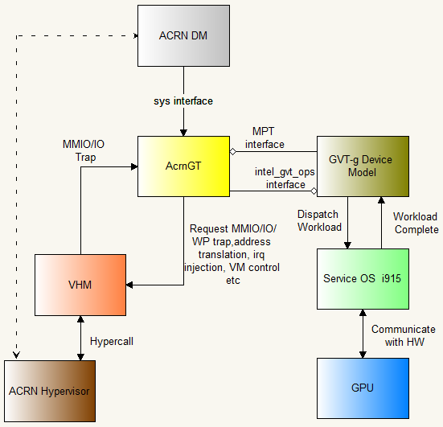

.. _GVT-g-porting:

GVT-g Enabling and Porting Guide
################################

Introduction
************

GVT-g is Intel's Open Source GPU virtualization solution, up-streamed to
the Linux kernel. Its implementation over KVM is named KVMGT, over Xen
is named XenGT, and over ACRN is named AcrnGT. GVT-g can export
multiple virtual-GPU (vGPU) instances for virtual machine (VM) system. A
VM can be assigned one instance of a vGPU. The guest OS graphic driver
needs only minor modifications to drive the vGPU adapter in a VM. Every
vGPU instance adopts the full HW GPU's acceleration capability for
media, 3D rendering, and display.

AcrnGT refers to the glue layer between the ACRN hypervisor and GVT-g
core device model. It works as the agent of hypervisor-related services.
It is the only layer that needs to be rewritten when porting GVT-g to
other specific hypervisors.

For simplicity, in the rest of this document, the term GVT is used to
refer to the core device model component of GVT-g, specifically
corresponding to ``gvt.ko`` when build as a module.

Purpose of this document
************************

This document explains the relationship between components of GVT-g in
the ACRN hypervisor, shows how to enable GVT-g on ACRN, and guides
developers  porting GVT-g to work on other hypervisors.

This document describes:

-  the overall components of GVT-g
-  interaction interface of each components
-  core interaction scenarios

APIs of each component interface can be found in the :ref:`GVT-g_api`
documentation.

Overall Components
******************

For the GVT-g solution for the ACRN  hypervisor, there are two
key modules: AcrnGT and GVT:

AcrnGT module
  Compiled from ``drivers/gpu/drm/i915/gvt/acrn_gvt.c``, the AcrnGT
  module acts as a glue layer between the ACRN hypervisor and the
  interface to the ACRN-DM in user space.

  AcrnGT is the agent of hypervisor related services, including I/O trap
  request, IRQ injection, address translation, VM controls, etc. It also
  listens to ACRN hypervisor in ``acrngt_emulation_thread``, and informs GVT
  module of I/O traps.

  It calls into the GVT module's :ref:`intel_gvt_ops_interface` to invoke
  Device Model's routines, and receives request from GVT module through
  the :ref:`MPT_interface`.

  User space programs, such as ACRN-DM, communicate with AcrnGT through
  the :ref:`sysfs_interface` by writing to sysfs node
  ``/sys/kernel/gvt/control/create_gvt_instance``.

  This is the only module that needs to be rewritten when porting to
  another embedded device hypervisor.

GVT module
  This Device Model service is the central part of all
  GVT-g components. It receives workloads from each vGPU, shadows the
  workloads, and dispatches the workloads to Dom0's i915 module to deliver
  workloads to real hardware. It also emulates the virtual display to each
  VM.

VHM module
  This is a kernel module that requires an interrupt (vIRQ) number,
  and exposes APIs to external kernel modules such as GVT-g, and the
  virtIO BE service running in kernel space. It exposes a char device node
  in user space, and only interacts with the DM. The DM routes I/O
  requests and responses between other modules to and from the VHM module
  via the char device. DM may use the VHM for hypervisor service
  (including remote memory map), and VHM may directly service the request
  such as for the remote memory map, or invoking hypercall. It also sends
  I/O responses to user space modules, notified by vIRQ injections.

   GVT-g components and interfaces

Core scenario interaction sequences
***********************************

vGPU creation scenario
======================

In this scenario, AcrnGT receives a create request from ACRN-DM. It
calls GVT's :ref:`intel_gvt_ops_interface` to inform GVT of vGPU
creation. This interface sets up all vGPU resources such as MMIO, GMA,
PVINFO, GTT, DISPLAY, and Execlists, and calls back to the AcrnGT
module through the :ref:`MPT_interface` ``attach_vgpu``. Then, the
AcrnGT module sets up an I/O request server and asks to trap the PCI
configure space of the vGPU (virtual device 0:2:0) via VHM's APIs.
Finally, the AcrnGT module launches a AcrnGT emulation thread to
listen to I/O trap notifications from HVM and ACRN hypervisor.

vGPU destroy scenario
=====================

In this scenario, AcrnGT receives a destroy request from ACRN-DM. It
calls GVT's :ref:`intel_gvt_ops_interface` to inform GVT of the vGPU destroy
request, and cleans up all vGPU resources.

vGPU pci configure space write scenario
=======================================

ACRN traps the vGPU's PCI config space write, notifies AcrnGT's
``acrngt_emulation_thread``, which calls ``acrngt_hvm_pio_emulation`` to
handle all I/O trap notifications. This routine calls the GVT's
:ref:`intel_gvt_ops_interface` ``emulate_cfg_write`` to emulate the vGPU PCI
config space write:

#. If it's BAR0 (GTTMMIO) write, turn on/off GTTMMIO trap, according to
   the write value.
#. If it's BAR1 (Aperture) write, maps/unmaps vGPU's aperture to its
   corresponding part in the host's aperture.
#. Otherwise, write to the virtual PCI configuration space of the vGPU.

pci configure space read scenario
=================================

Call sequence is almost the same as the write scenario above,
but instead it calls the GVT's :ref:`intel_gvt_ops_interface`
``emulate_cfg_read`` to emulate the vGPU PCI config space read.

GGTT read/write scenario
========================

GGTT's trap is set up in the pci configure space write
scenario above.

MMIO read/write scenario
========================

MMIO's trap is set up in the pci configure space write
scenario above.

PPGTT write protection page set/unset scenario
==============================================

PPGTT write protection page is set by calling ``acrn_ioreq_add_iorange``
with range type as ``REQ_WP``, and trap its write to device model while
allowing read without trap.

PPGTT write protection page is unset by calling ``acrn_ioreq_del_range``.

PPGTT write protection page write
=================================

In the VHM module, ioreq for PPGTT WP and MMIO trap is the same. It will
also be trapped into the routine ``intel_vgpu_emulate_mmio_write()``.

API details
***********

APIs of each component interface can be found in the :ref:`GVT-g_api`
documentation.
