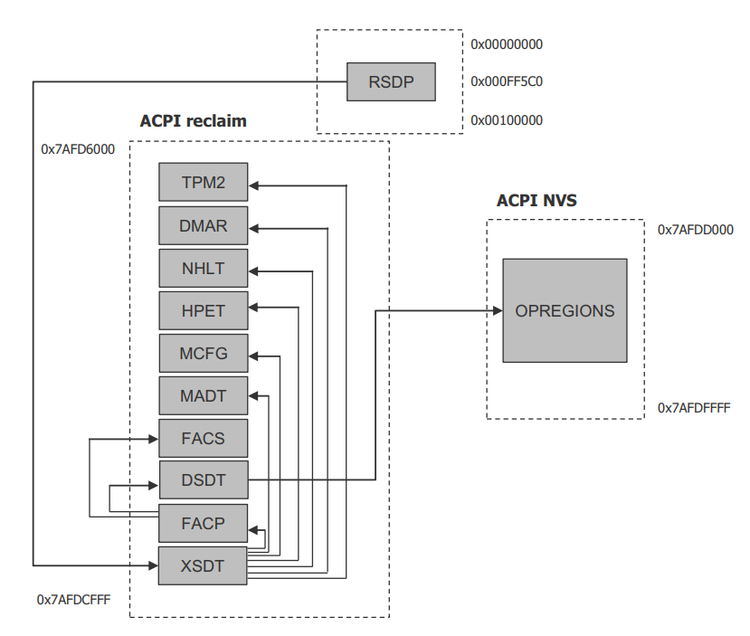
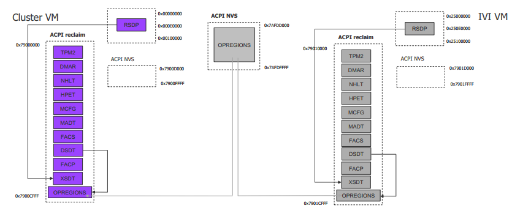
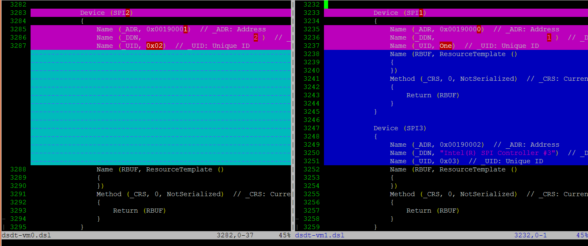
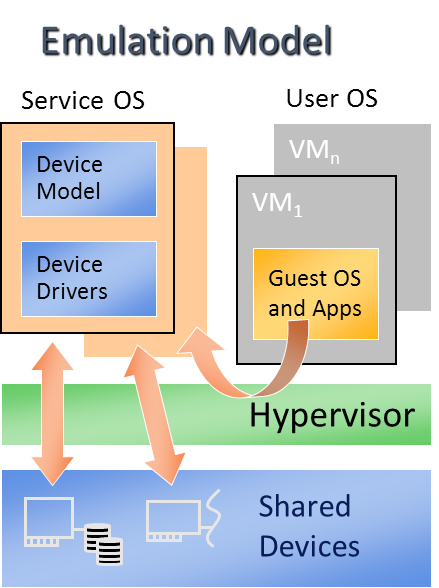

.. _acpi-virt-HLD:

ACPI Virtualization high-level design
#####################################

ACPI introduction
*****************

Advanced Configuration and Power Interface (ACPI) provides an open
standard that operating systems can use to discover and configure
computer hardware components to perform power management for example, by
monitoring status and putting unused components to sleep.

Functions implemented by ACPI include:

-  System/Device/Processor power management
-  Device/Processor performance management
-  Configuration / Plug and Play
-  System event
-  Battery management
-  Thermal management

ACPI enumerates and lists the different DMA engines in the platform, and
device scope relationships between PCI devices and which DMA engine
controls them. All critical functions depend on ACPI tables. Here's an
example on an Apollo Lake platform (APL) with Linux installed:

.. code-block:: none

   root@:Dom0 ~ $ ls /sys/firmware/acpi/tables/
   APIC  data  DMAR  DSDT  dynamic  FACP  FACS  HPET  MCFG  NHLT  TPM2

These tables provide different information and functions:

-  Advanced Programmable Interrupt Controller (APIC) for Symmetric
   Multiprocessor systems (SMP),
-  DMA remapping (DMAR) for Intel |reg| Virtualization Technology for
   Directed I/O (VT-d),
-  Non-HD Audio Link Table (NHLT) for supporting audio device,
-  and Differentiated System Description Table (DSDT) for system
   configuration info. DSDT is a major ACPI table used to describe what
   peripherals the machine has, and information on PCI IRQ mappings and
   power management

Most of the ACPI functionality is provided in ACPI Machine Language
(AML) bytecode stored in the ACPI tables. To make use of these tables,
Linux implements an interpreter for the AML bytecode. At BIOS
development time, the AML bytecode is compiled from the ASL (ACPI Source
Language) code.  The ``iasl`` command is used to disassemble the ACPI table
and display its contents:

.. code-block:: none

   root@:Dom0 ~ $ cp /sys/firmware/acpi/tables/DMAR .
   root@:Dom0 ~ $ iasl -d DMAR

   Intel ACPI Component Architecture
   ASL+ Optimizing Compiler/Disassembler version 20170728
   Copyright (c) 2000 - 2017 Intel Corporation
   Input file DMAR, Length 0xB0 (176) bytes
   ACPI: DMAR 0x0000000000000000 0000B0 (v01 INTEL  BDW      00000001 INTL 00000001)
   Acpi Data Table [DMAR] decoded
   Formatted output:  DMAR.dsl - 5286 bytes

   root@:Dom0 ~ $ cat DMAR.dsl
   [000h 0000   4]                    Signature : "DMAR"    [DMA Remapping table]
   [004h 0004   4]                 Table Length : 000000B0
   [008h 0008   1]                     Revision : 01
   ...
   [030h 0048   2]                Subtable Type : 0000 [Hardware Unit Definition]
   [032h 0050   2]                       Length : 0018
   [034h 0052   1]                        Flags : 00
   [035h 0053   1]                     Reserved : 00
   [036h 0054   2]           PCI Segment Number : 0000
   [038h 0056   8]        Register Base Address : 00000000FED64000

From the displayed ASL, we can see some generic table fields, such as
the version information, and one VTd remapping engine description with
FED64000 as base address.

We can modify DMAR.dsl and assemble it again to AML:

.. code-block:: none

   root@:Dom0 ~ $ iasl DMAR.dsl
   Intel ACPI Component Architecture
   ASL+ Optimizing Compiler/Disassembler version 20170728
   Copyright (c) 2000 - 2017 Intel Corporation
   Table Input:   DMAR.dsl - 113 lines, 5286 bytes, 72 fields
   Binary Output: DMAR.aml - 176 bytes
   Compilation complete. 0 Errors, 0 Warnings, 0 Remarks

We can see the new AML file ``DMAR.aml`` is created.

There are many ACPI tables in the system, linked together via table
pointers.  In all ACPI-compatible system, the OS can enumerate all
needed tables starting with the Root System Description Pointer (RSDP)
provided at a known place in the system low address space, and pointing
to  an XSDT (Extended System Description Table). The following picture
shows a typical ACPI table layout in an Intel APL platform:

   Typical ACPI table layout in an Intel APL platform

ACPI virtualization
*******************

Most modern OSes requires ACPI, so ACRN provides ACPI virtualization to
emulate an ACPI-capable virtual platform for the guest OS. To achieve
this, there are two options, depending on physical device and ACPI
resources are abstracted: Partitioning and Emulation.

Partitioning
============

One option is to assign and partition physical devices and ACPI
resources among all guest OSes. That means each guest OS owns specific
devices with passthrough, such as shown below:

+--------------------------+--------------------------+--------------------------+
| PCI Devices              | VM0(Cluster VM)          | VM1(IVI VM)              |
+--------------------------+--------------------------+--------------------------+
| I2C                      | I2C3, I2C0               | I2C1, I2C2, I2C4, I2C5,  |
|                          |                          | I2C6, I2C7               |
+--------------------------+--------------------------+--------------------------+
| SPI                      | SPI1                     | SPI0, SPI2               |
+--------------------------+--------------------------+--------------------------+
| USB                      |                          | USB-Host (xHCI) and      |
|                          |                          | USB-Device (xDCI)        |
+--------------------------+--------------------------+--------------------------+
| SDIO                     |                          | SDIO                     |
+--------------------------+--------------------------+--------------------------+
| IPU                      |                          | IPU                      |
+--------------------------+--------------------------+--------------------------+
| Ethernet                 | Ethernet                 |                          |
+--------------------------+--------------------------+--------------------------+
| WIFI                     |                          | WIFI                     |
+--------------------------+--------------------------+--------------------------+
| Bluetooth                |                          | Bluetooth                |
+--------------------------+--------------------------+--------------------------+
| Audio                    |                          | Audio                    |
+--------------------------+--------------------------+--------------------------+
| GPIO                     | GPIO                     |                          |
+--------------------------+--------------------------+--------------------------+
| UART                     | UART                     |                          |
+--------------------------+--------------------------+--------------------------+

In an early ACRN development phase, partitioning was used for
simplicity. To implement partitioning, we need to hack the PCI logic to
make different VMs see a different subset of devices, and create one
copy of the ACPI tables for each of them, as shown in the following
picture:

For each VM, its ACPI tables are standalone copies and not related to
other VMs. Opregion also needs to be copied for different VM.

For each table, we make modifications, based on the physical table, to
reflect the assigned devices to a particular VM. In the picture below,
we can see keep SP2(0:19.1) for VM0, and SP1(0:19.0)/SP3(0:19.2) for
VM1. Any time a partition policy changes, we need to modify both tables
again, including dissembling, modification, and assembling, which is
tricky and bug-prone.

Emulation
---------

A second option is for the SOS (VM0) to "own" all devices and emulate a
set of virtual devices for each of the UOS (VM1). This is the most
popular model for virtualization, as show below. ACRN currently uses
device emulation plus some device passthrough for UOS.

Regarding ACPI virtualization in ACRN, different policy are used for
different components:

-  Hypervisor - ACPI is transparent to the Hypervisor, which has no
   knowledge of ACPI at all.
-  SOS - All ACPI resources are physically owned by the SOS, which
   enumerates all ACPI tables and devices.
-  UOS - Virtual ACPI resources exposed by the device model are owned by
   UOS.

Source for the ACPI emulation code for the device model is found in
``hw/platform/acpi/acpi.c``.

Each entry in ``basl_ftables`` is related to each virtual ACPI table,
including following elements:

-  wsect - output handler to write related ACPI table contents to
   specific file
-  offset - related ACPI table offset in the memory
-  valid - dynamically indicate if this table is needed

.. code-block:: c

   static struct {
       int (*wsect)(FILE *fp, struct vmctx *ctx);
       uint64_t  offset;
       bool    valid;
   } basl_ftables[] = {
       { basl_fwrite_rsdp, 0,       true  },
       { basl_fwrite_rsdt, RSDT_OFFSET, true  },
       { basl_fwrite_xsdt, XSDT_OFFSET, true  },
       { basl_fwrite_madt, MADT_OFFSET, true  },
       { basl_fwrite_fadt, FADT_OFFSET, true  },
       { basl_fwrite_hpet, HPET_OFFSET, true  },
       { basl_fwrite_mcfg, MCFG_OFFSET, true  },
       { basl_fwrite_facs, FACS_OFFSET, true  },
       { basl_fwrite_nhlt, NHLT_OFFSET, false }, /*valid with audio ptdev*/
       { basl_fwrite_dsdt, DSDT_OFFSET, true  }
   };

The main function to create virtual ACPI tables is ``acpi_build`` that
calls ``basl_compile`` for each table and performs the following:

#. create two temp files: infile and outfile
#. with output handler, write table contents stream to infile
#. use ``iasl`` tool to assemble infile into outfile
#. load outfile contents to the required memory offset

.. code-block:: c

    static int
    basl_compile(struct vmctx *ctx,
            int (*fwrite_section)(FILE *, struct vmctx *),
            uint64_t offset)
    {
        struct basl_fio io[2];
        static char iaslbuf[3*MAXPATHLEN + 10];
        int err;

        err = basl_start(&io[0], &io[1]);
        if (!err) {
            err = (*fwrite_section)(io[0].fp, ctx);

            if (!err) {
                /*
                 * iasl sends the results of the compilation to
                 * stdout. Shut this down by using the shell to
                 * redirect stdout to /dev/null, unless the user
                 * has requested verbose output for debugging
                 * purposes
                 */
                if (basl_verbose_iasl)
                    snprintf(iaslbuf, sizeof(iaslbuf),
                         "%s -p %s %s",
                         ASL_COMPILER,
                         io[1].f_name, io[0].f_name);
                else
                    snprintf(iaslbuf, sizeof(iaslbuf),
                         "/bin/sh -c \"%s -p %s %s\" 1> /dev/null",
                         ASL_COMPILER,
                         io[1].f_name, io[0].f_name);

                err = system(iaslbuf);

                if (!err) {
                    /*
                     * Copy the aml output file into guest
                     * memory at the specified location
                     */
                    err = basl_load(ctx, io[1].fd, offset);
                } else
                    err = -1;
            }
            basl_end(&io[0], &io[1]);
        }

After processing each entry, the virtual ACPI tables are present in UOS
memory.

For pass-through devices in UOS, we likely need to add some ACPI
description in the UOS virtual DSDT table. There is one hook
(``passthrough_write_dsdt``) in ``hw/pci/passthrough.c`` for it. The following
source code shows calls to different functions to add different contents
for each vendor and device id.

.. code-block:: c

    static void
    passthru_write_dsdt(struct pci_vdev *dev)
    {
        struct passthru_dev *ptdev = (struct passthru_dev *) dev->arg;
        uint32_t vendor = 0, device = 0;

        vendor = read_config(ptdev->phys_dev, PCIR_VENDOR, 2);

        if (vendor != 0x8086)
            return;

        device = read_config(ptdev->phys_dev, PCIR_DEVICE, 2);

        /* Provides ACPI extra info */
        if (device == 0x5aaa)
            /* XDCI @ 00:15.1 to enable ADB */
            write_dsdt_xhci(dev);
        else if (device == 0x5ab4)
            /* HDAC @ 00:17.0 as codec */
            write_dsdt_hdac(dev);
        else if (device == 0x5a98)
            /* HDAS @ 00:e.0 */
            write_dsdt_hdas(dev);
        else if (device == 0x5aac)
            /* i2c @ 00:16.0 for ipu */
            write_dsdt_ipu_i2c(dev);
        else if (device == 0x5abc)
            /* URT1 @ 00:18.0 for bluetooth*/
            write_dsdt_urt1(dev);

    }

For instance, ``write_dsdt_urt1`` provides ACPI contents for Bluetooth
UART device when pass-throughed to the UOS. It provides virtual PCI
device/function as ``_ADR``, with other descriptions possible for Bluetooth
UART enumeration.

.. code-block:: c

    static void
    write_dsdt_urt1(struct pci_vdev *dev)
    {
        printf("write virt-%x:%x.%x in dsdt for URT1 @ 00:18.0\n",
               dev->bus,
               dev->slot,
               dev->func);
        dsdt_line("Device (URT1)");
        dsdt_line("{");
        dsdt_line("    Name (_ADR, 0x%04X%04X)", dev->slot, dev->func);
        dsdt_line("    Name (_DDN, \"Intel(R) HS-UART Controller #1\")");
        dsdt_line("    Name (_UID, One)");
        dsdt_line("    Name (RBUF, ResourceTemplate ()");
        dsdt_line("    {");
        dsdt_line("    })");
        dsdt_line("    Method (_CRS, 0, NotSerialized)");
        dsdt_line("    {");
        dsdt_line("        Return (RBUF)");
        dsdt_line("    }");
        dsdt_line("}");
    }

This document introduces basic ACPI virtualization. Other topics such as
power management virtualization, adds more requirement for ACPI, and
will be discussed in the power management documentation.
