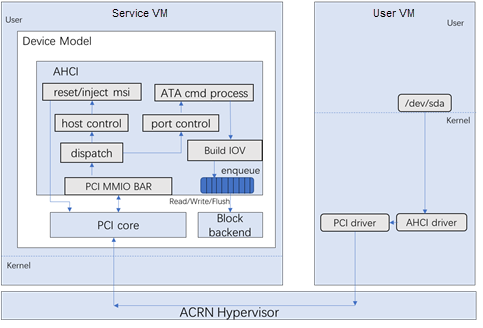

.. _ahci-hld:

AHCI Virtualization in Device Model
###################################

AHCI (Advanced Host Controller Interface) is a hardware mechanism
that allows software to communicate with Serial ATA devices. AHCI HBA
(host bus adapters) is a PCI class device that acts as a data movement
engine between system memory and Serial ATA devices. The ACPI HBA in
ACRN supports both ATA and ATAPI devices. The architecture is shown in
the below diagram.

HBA is registered to the PCI system with device id 0x2821 and vendor id
0x8086. Its memory registers are mapped in BAR 5. It only supports 6
ports (refer to ICH8 AHCI). AHCI driver in the User VM can access HBA in DM
through the PCI BAR. And HBA can inject MSI interrupts through the PCI
framework.

When the application in the User VM reads data from /dev/sda, the request will
send through the AHCI driver and then the PCI driver. The User VM will trap to
hypervisor, and hypervisor dispatch the request to DM. According to the
offset in the BAR, the request will dispatch to port control handler.
Then the request is parse to a block I/O request which can be processed
by Block backend model.

Usage:

***-s <slot>,ahci,<type:><filepath>***

Type:  'hd' and 'cd' are available.

Filepath:  the path for the backend file, could be a partition or a
regular file.

For example,

    System VM: -s 20,ahci,\ `hd:/dev/mmcblk0p1 <http://hd/dev/mmcblk0p1>`__

    User VM: /dev/sda
