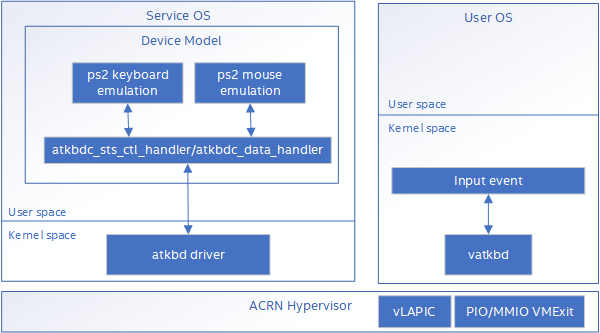

.. _atkbdc_virt_hld:

AT Keyboard Controller Emulation
################################

This document describes the AT keyboard controller emulation implementation in the ACRN device model. The Atkbdc device emulates a PS2 keyboard and mouse.

Overview
********

The PS2 port is a 6-pin mini-Din connector used for connecting keyboards and mice to a PC-compatible computer system. Its name comes from the IBM Personal System/2 series of personal computers, with which it was introduced in 1987. PS2 keyboard/mouse emulation is based on ACPI Emulation. We can add ACPI description of PS2 keyboard/mouse into virtual DSDT table to emulate keyboard/mouse in the User VM.

   AT keyboard controller emulation architecture

PS2 Keyboard Emulation
**********************

ACRN supports the AT keyboard controller for PS2 keyboard that can be accessed through I/O ports (0x60 and 0x64). 0x60 is used to access AT keyboard controller data register; 0x64 is used to access AT keyboard controller address register.

The PS2 keyboard ACPI description as below::

        Device (KBD)
        {
                Name (_HID, EisaId ("PNP0303") /* IBM Enhanced Keyboard (101/102-key, PS/2 Mouse) */) // _HID: Hardware ID
                Name (_CRS, ResourceTemplate () // _CRS: Current Resource Settings
                {
                        IO (Decode16,
                            0x0060, // Range Minimum
                            0x0060, // Range Maximum
                            0x01, // Alignment
                            0x01, // Length
                            )
                        IO (Decode16,
                            0x0064, // Range Minimum
                            0x0064, // Range Maximum
                            0x01, // Alignment
                            0x01, // Length
                            )
                        IRQNoFlags ()
                           {1}
                })
        }

PS2 Mouse Emulation
*******************

ACRN supports AT keyboard controller for PS2 mouse that can be accessed through I/O ports (0x60 and 0x64).
0x60 is used to access AT keyboard controller data register; 0x64 is used to access AT keyboard controller address register.

The PS2 mouse ACPI description as below::

        Device (MOU)
        {
                Name (_HID, EisaId ("PNP0F13") /* PS/2 Mouse */) // _HID: Hardware ID
                Name (_CRS, ResourceTemplate () // _CRS: Current Resource Settings
                {
                        IO (Decode16,
                            0x0060, // Range Minimum
                            0x0060, // Range Maximum
                            0x01, // Alignment
                            0x01, // Length
                            )
                        IO (Decode16,
                            0x0064, // Range Minimum
                            0x0064, // Range Maximum
                            0x01, // Alignment
                            0x01, // Length
                            )
                        IRQNoFlags ()
                           {12}
                })
        }

