.. _APL_GVT-g-hld:

GVT-g high-level design
#######################

Introduction
************

Purpose of this Document
========================

This high-level design (HLD) document describes the usage requirements
and high level design for Intel |reg| Graphics Virtualization Technology for
shared virtual :term:`GPU` technology (:term:`GVT-g`) on Apollo Lake-I
SoCs.

This document describes:

-  The different GPU virtualization techniques
-  GVT-g mediated pass-through
-  High level design
-  Key components
-  GVT-g new architecture differentiation

Audience
========

This document is for developers, validation teams, architects and
maintainers of Intel |reg| GVT-g for the Apollo Lake SoCs.

The reader should have some familiarity with the basic concepts of
system virtualization and Intel processor graphics.

Reference Documents
===================

The following documents were used as references for this specification:

-  Paper in USENIX ATC '14 - *Full GPU Virtualization Solution with
   Mediated Pass-Through* - https://www.usenix.org/node/183932

-  Hardware Specification - PRMs -
   https://01.org/linuxgraphics/documentation/hardware-specification-prms

Background
**********

Intel GVT-g is an enabling technology in emerging graphics
virtualization scenarios. It adopts a full GPU virtualization approach
based on mediated pass-through technology, to achieve good performance,
scalability and secure isolation among Virtual Machines (VMs). A virtual
GPU (vGPU), with full GPU features, is presented to each VM so that a
native graphics driver can run directly inside a VM.

Intel GVT-g technology for Apollo Lake (APL) has been implemented in
open source hypervisors or Virtual Machine Monitors (VMMs):

-  Intel GVT-g for ACRN, also known as, "AcrnGT"
-  Intel GVT-g for KVM, also known as, "KVMGT"
-  Intel GVT-g for Xen, also known as, "XenGT"

The core vGPU device model is released under BSD/MIT dual license, so it
can be reused in other proprietary hypervisors.

Intel has a portfolio of graphics virtualization technologies
(:term:`GVT-g`, :term:`GVT-d` and :term:`GVT-s`). GVT-d and GVT-s are
outside of the scope of this document.

This HLD applies to the Apollo Lake platform only. Support of other
hardware is outside the scope of this HLD.

Targeted Usages
===============

The main targeted usage of GVT-g is in automotive applications, such as:

-  An Instrument cluster running in one domain
-  An In Vehicle Infotainment (IVI) solution running in another domain
-  Additional domains for specific purposes, such as Rear Seat
   Entertainment or video camera capturing.

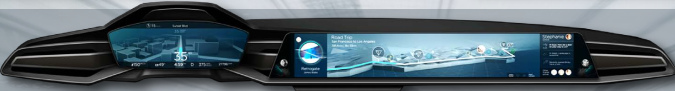

   IVE Use Case

Existing Techniques
===================

A graphics device is no different from any other I/O device, with
respect to how the device I/O interface is virtualized. Therefore,
existing I/O virtualization techniques can be applied to graphics
virtualization. However, none of the existing techniques can meet the
general requirement of performance, scalability, and secure isolation
simultaneously. In this section, we review the pros and cons of each
technique in detail, enabling the audience to understand the rationale
behind the entire GVT-g effort.

Emulation
---------

A device can be emulated fully in software, including its I/O registers
and internal functional blocks. There would be no dependency on the
underlying hardware capability, therefore compatibility can be achieved
across platforms. However, due to the CPU emulation cost, this technique
is usually used for legacy devices, such as a keyboard, mouse, and VGA
card.  There would be great complexity and extremely low performance to
fully emulate a modern accelerator, such as a GPU. It may be acceptable
for use in a simulation environment, but it is definitely not suitable
for production usage.

API Forwarding
--------------

API forwarding, or a split driver model, is another widely-used I/O
virtualization technology. It has been used in commercial virtualization
productions, for example, VMware*, PCoIP*, and Microsoft* RemoteFx*.
It is a natural path when researchers study a new type of
I/O virtualization usage, for example, when GPGPU computing in VM was
initially proposed. Intel GVT-s is based on this approach.

The architecture of API forwarding is shown in :numref:`api-forwarding`:

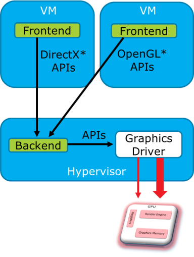

   API Forwarding

A frontend driver is employed to forward high-level API calls (OpenGL,
Directx, and so on) inside a VM, to a Backend driver in the Hypervisor
for acceleration. The Backend may be using a different graphics stack,
so API translation between different graphics protocols may be required.
The Backend driver allocates a physical GPU resource for each VM,
behaving like a normal graphics application in a Hypervisor.  Shared
memory may be used to reduce memory copying between the host and guest
graphic stacks.

API forwarding can bring hardware acceleration capability into a VM,
with other merits such as vendor independence and high density. However, it
also suffers from the following intrinsic limitations:

-  Lagging features - Every new API version needs to be specifically
   handled, so it means slow time-to-market (TTM) to support new standards.
   For example,
   only DirectX9 is supported, when DirectX11 is already in the market.
   Also, there is a big gap in supporting media and compute usages.

-  Compatibility issues - A GPU is very complex, and consequently so are
   high level graphics APIs. Different protocols are not 100% compatible
   on every subtle API, so the customer can observe feature/quality loss
   for specific applications.

-  Maintenance burden - Occurs when supported protocols and specific
   versions are incremented.

-  Performance overhead - Different API forwarding implementations
   exhibit quite different performance, which gives rise to a need for a
   fine-grained graphics tuning effort.

Direct Pass-Through
-------------------

"Direct pass-through" dedicates the GPU to a single VM, providing full
features and good performance, but at the cost of device sharing
capability among VMs. Only one VM at a time can use the hardware
acceleration capability of the GPU, which is a major limitation of this
technique.  However, it is still a good approach to enable graphics
virtualization usages on Intel server platforms, as an intermediate
solution. Intel GVT-d uses this mechanism.

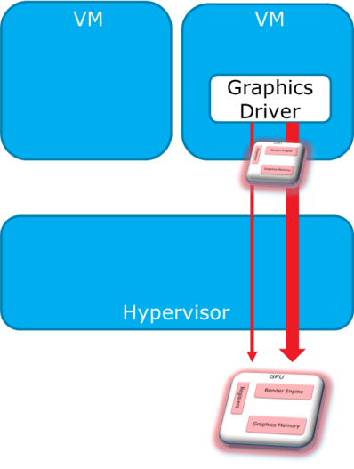

   Pass-Through

SR-IOV
------

Single Root IO Virtualization (SR-IOV) implements I/O virtualization
directly on a device. Multiple Virtual Functions (VFs) are implemented,
with each VF directly assignable to a VM.

.. _Graphic_mediation:

Mediated Pass-Through
*********************

Intel GVT-g achieves full GPU virtualization using a "mediated
pass-through" technique.

Concept
=======

Mediated pass-through allows a VM to access performance-critical I/O
resources (usually partitioned) directly, without intervention from the
hypervisor in most cases. Privileged operations from this VM are
trapped-and-emulated to provide secure isolation among VMs.

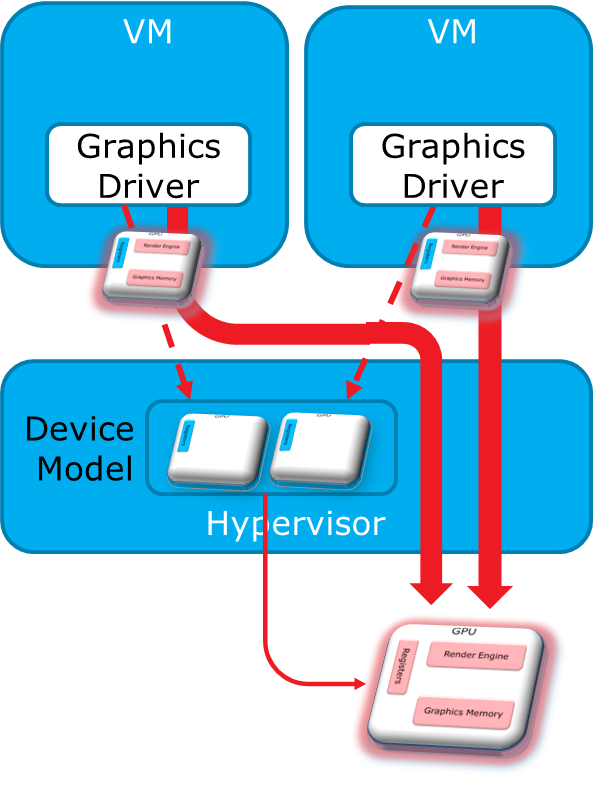

   Mediated Pass-Through

The Hypervisor must ensure that no vulnerability is exposed when
assigning performance-critical resource to each VM. When a
performance-critical resource cannot be partitioned, a scheduler must be
implemented (either in software or hardware) to allow time-based sharing
among multiple VMs. In this case, the device must allow the hypervisor
to save and restore the hardware state associated with the shared resource,
either through direct I/O register reads and writes (when there is no software
invisible state) or through a device-specific context save and restore
mechanism (where there is a software invisible state).

Examples of performance-critical I/O resources include the following:

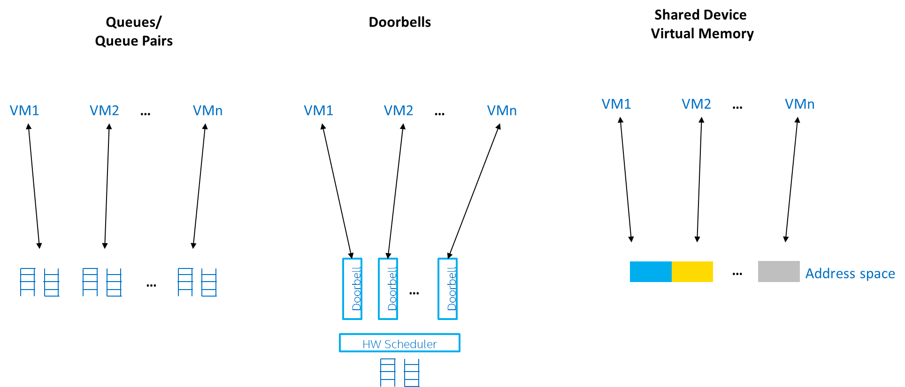

   Performance-Critical I/O Resources

The key to implementing mediated pass-through for a specific device is
to define the right policy for various I/O resources.

Virtualization Policies for GPU Resources
=========================================

:numref:`graphics-arch` shows how Intel Processor Graphics works at a high level.
Software drivers write commands into a command buffer through the CPU.
The Render Engine in the GPU fetches these commands and executes them.
The Display Engine fetches pixel data from the Frame Buffer and sends
them to the external monitors for display.

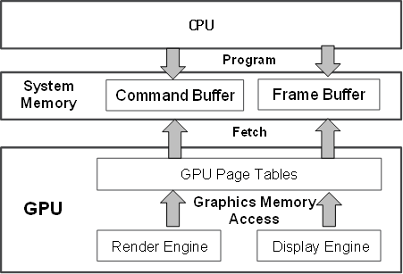

   Architecture of Intel Processor Graphics

This architecture abstraction applies to most modern GPUs, but may
differ in how graphics memory is implemented. Intel Processor Graphics
uses system memory as graphics memory. System memory can be mapped into
multiple virtual address spaces by GPU page tables. A 4 GB global
virtual address space called "global graphics memory", accessible from
both the GPU and CPU, is mapped through a global page table. Local
graphics memory spaces are supported in the form of multiple 4 GB local
virtual address spaces, but are only limited to access by the Render
Engine through local page tables. Global graphics memory is mostly used
for the Frame Buffer and also serves as the Command Buffer. Massive data
accesses are made to local graphics memory when hardware acceleration is
in progress. Other GPUs have similar page table mechanism accompanying
the on-die memory.

The CPU programs the GPU through GPU-specific commands, shown in
:numref:`graphics-arch`, using a producer-consumer model. The graphics
driver programs GPU commands into the Command Buffer, including primary
buffer and batch buffer, according to the high-level programming APIs,
such as OpenGL* or DirectX*. Then, the GPU fetches and executes the
commands. The primary buffer (called a ring buffer) may chain other
batch buffers together. The primary buffer and ring buffer are used
interchangeably thereafter. The batch buffer is used to convey the
majority of the commands (up to ~98% of them) per programming model. A
register tuple (head, tail) is used to control the ring buffer. The CPU
submits the commands to the GPU by updating the tail, while the GPU
fetches commands from the head, and then notifies the CPU by updating
the head, after the commands have finished execution. Therefore, when
the GPU has executed all commands from the ring buffer, the head and
tail pointers are the same.

Having introduced the GPU architecture abstraction, it is important for
us to understand how real-world graphics applications use the GPU
hardware so that we can virtualize it in VMs efficiently. To do so, we
characterized, for some representative GPU-intensive 3D workloads (the
Phoronix Test Suite), the usages of the four critical interfaces:

1) the Frame Buffer,
2) the Command Buffer,
3) the GPU Page Table Entries (PTEs), which carry the GPU page tables, and
4) the I/O registers, including Memory-Mapped I/O (MMIO) registers,
   Port I/O (PIO) registers, and PCI configuration space registers
   for internal state.

:numref:`access-patterns` shows the average access frequency of running
Phoronix 3D workloads on the four interfaces.

The Frame Buffer and Command Buffer exhibit the most
performance-critical resources, as shown in :numref:`access-patterns`.
When the applications are being loaded, lots of source vertices and
pixels are written by the CPU, so the Frame Buffer accesses occur in the
range of hundreds of thousands per second. Then at run-time, the CPU
programs the GPU through the commands, to render the Frame Buffer, so
the Command Buffer accesses become the largest group, also in the
hundreds of thousands per second. PTE and I/O accesses are minor in both
load and run-time phases ranging in tens of thousands per second.

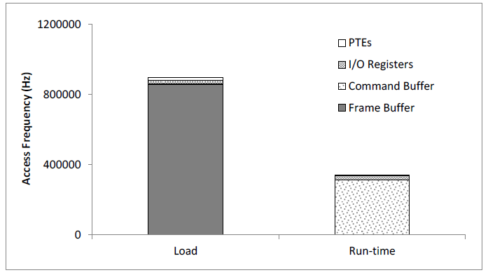

   Access Patterns of Running 3D Workloads

High Level Architecture
***********************

:numref:`gvt-arch` shows the overall architecture of GVT-g, based on the
ACRN hypervisor, with SOS as the privileged VM, and multiple user
guests. A GVT-g device model working with the ACRN hypervisor,
implements the policies of trap and pass-through. Each guest runs the
native graphics driver and can directly access performance-critical
resources: the Frame Buffer and Command Buffer, with resource
partitioning (as presented later). To protect privileged resources, that
is, the I/O registers and PTEs, corresponding accesses from the graphics
driver in user VMs are trapped and forwarded to the GVT device model in
SOS for emulation. The device model leverages i915 interfaces to access
the physical GPU.

In addition, the device model implements a GPU scheduler that runs
concurrently with the CPU scheduler in ACRN to share the physical GPU
timeslot among the VMs. GVT-g uses the physical GPU to directly execute
all the commands submitted from a VM, so it avoids the complexity of
emulating the Render Engine, which is the most complex part of the GPU.
In the meantime, the resource pass-through of both the Frame Buffer and
Command Buffer minimizes the hypervisor's intervention of CPU accesses,
while the GPU scheduler guarantees every VM a quantum time-slice for
direct GPU execution. With that, GVT-g can achieve near-native
performance for a VM workload.

In :numref:`gvt-arch`, the yellow GVT device model works as a client on
top of an i915 driver in the SOS. It has a generic Mediated Pass-Through
(MPT) interface, compatible with all types of hypervisors. For ACRN,
some extra development work is needed for such MPT interfaces. For
example, we need some changes in ACRN-DM to make ACRN compatible with
the MPT framework. The vGPU lifecycle is the same as the lifecycle of
the guest VM creation through ACRN-DM. They interact through sysfs,
exposed by the GVT device model.

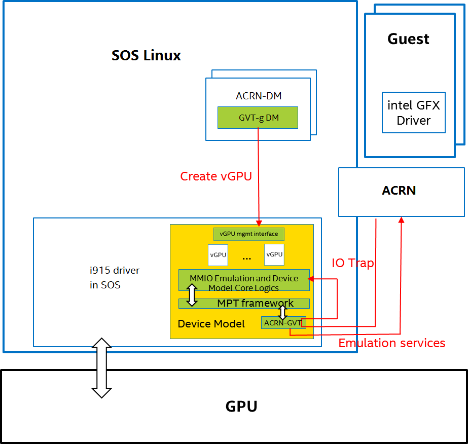

   AcrnGT High-level Architecture

Key Techniques
**************

vGPU Device Model
=================

The vGPU Device model is the main component because it constructs the
vGPU instance for each guest to satisfy every GPU request from the guest
and gives the corresponding result back to the guest.

The vGPU Device Model provides the basic framework to do
trap-and-emulation, including MMIO virtualization, interrupt
virtualization, and display virtualization. It also handles and
processes all the requests internally, such as, command scan and shadow,
schedules them in the proper manner, and finally submits to
the SOS i915 driver.

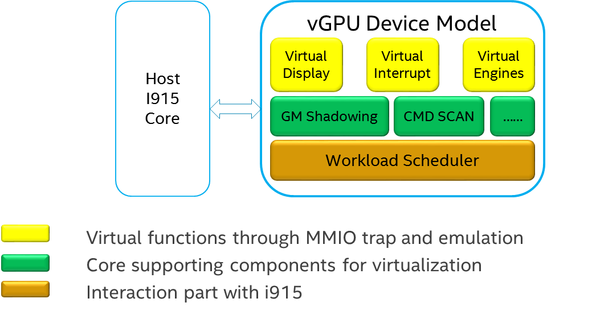

   GVT-g Device Model

MMIO Virtualization
-------------------

Intel Processor Graphics implements two PCI MMIO BARs:

-  **GTTMMADR BAR**: Combines both :term:`GGTT` modification range and Memory
   Mapped IO range. It is 16 MB on :term:`BDW`, with 2 MB used by MMIO, 6 MB
   reserved and 8 MB allocated to GGTT. GGTT starts from
   :term:`GTTMMADR` + 8 MB. In this section, we focus on virtualization of
   the MMIO range, discussing GGTT virtualization later.

-  **GMADR BAR**: As the PCI aperture is used by the CPU to access tiled
   graphics memory, GVT-g partitions this aperture range among VMs for
   performance reasons.

A 2 MB virtual MMIO structure is allocated per vGPU instance.

All the virtual MMIO registers are emulated as simple in-memory
read-write, that is, guest driver will read back the same value that was
programmed earlier. A common emulation handler (for example,
intel_gvt_emulate_read/write) is enough to handle such general
emulation requirements. However, some registers need to be emulated with
specific logic, for example, affected by change of other states or
additional audit or translation when updating the virtual register.
Therefore, a specific emulation handler must be installed for those
special registers.

The graphics driver may have assumptions about the initial device state,
which stays with the point when the BIOS transitions to the OS. To meet
the driver expectation, we need to provide an initial state of vGPU that
a driver may observe on a pGPU. So the host graphics driver is expected
to generate a snapshot of physical GPU state, which it does before guest
driver's initialization. This snapshot is used as the initial vGPU state
by the device model.

PCI Configuration Space Virtualization
--------------------------------------

PCI configuration space also needs to be virtualized in the device
model. Different implementations may choose to implement the logic
within the vGPU device model or in default system device model (for
example, ACRN-DM). GVT-g emulates the logic in the device model.

Some information is vital for the vGPU device model, including:
Guest PCI BAR, Guest PCI MSI, and Base of ACPI OpRegion.

Legacy VGA Port I/O Virtualization
----------------------------------

Legacy VGA is not supported in the vGPU device model. We rely on the
default device model (for example, :term:`QEMU`) to provide legacy VGA
emulation, which means either ISA VGA emulation or
PCI VGA emulation.

Interrupt Virtualization
------------------------

The GVT device model does not touch the hardware interrupt in the new
architecture, since it is hard to combine the interrupt controlling
logic between the virtual device model and the host driver. To prevent
architectural changes in the host driver, the host GPU interrupt does
not go to the virtual device model and the virtual device model has to
handle the GPU interrupt virtualization by itself. Virtual GPU
interrupts are categorized into three types:

-  Periodic GPU interrupts are emulated by timers. However, a notable
   exception to this is the VBlank interrupt. Due to the demands of user
   space compositors, such as Wayland, which requires a flip done event
   to be synchronized with a VBlank, this interrupt is forwarded from
   SOS to UOS when SOS receives it from the hardware.

-  Event-based GPU interrupts are emulated by the emulation logic. For
   example, AUX Channel Interrupt.

-  GPU command interrupts are emulated by a command parser and workload
   dispatcher. The command parser marks out which GPU command interrupts
   are generated during the command execution and the workload
   dispatcher injects those interrupts into the VM after the workload is
   finished.

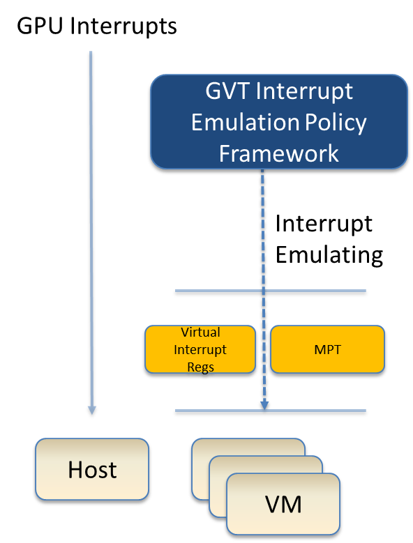

   Interrupt Virtualization

Workload Scheduler
------------------

The scheduling policy and workload scheduler are decoupled for
scalability reasons. For example, a future QoS enhancement will only
impact the scheduling policy, any i915 interface change or HW submission
interface change (from execlist to :term:`GuC`) will only need workload
scheduler updates.

The scheduling policy framework is the core of the vGPU workload
scheduling system. It controls all of the scheduling actions and
provides the developer with a generic framework for easy development of
scheduling policies. The scheduling policy framework controls the work
scheduling process without caring about how the workload is dispatched
or completed. All the detailed workload dispatching is hidden in the
workload scheduler, which is the actual executer of a vGPU workload.

The workload scheduler handles everything about one vGPU workload. Each
hardware ring is backed by one workload scheduler kernel thread. The
workload scheduler picks the workload from current vGPU workload queue
and communicates with the virtual HW submission interface to emulate the
"schedule-in" status for the vGPU. It performs context shadow, Command
Buffer scan and shadow, PPGTT page table pin/unpin/out-of-sync, before
submitting this workload to the host i915 driver. When the vGPU workload
is completed, the workload scheduler asks the virtual HW submission
interface to emulate the "schedule-out" status for the vGPU. The VM
graphics driver then knows that a GPU workload is finished.

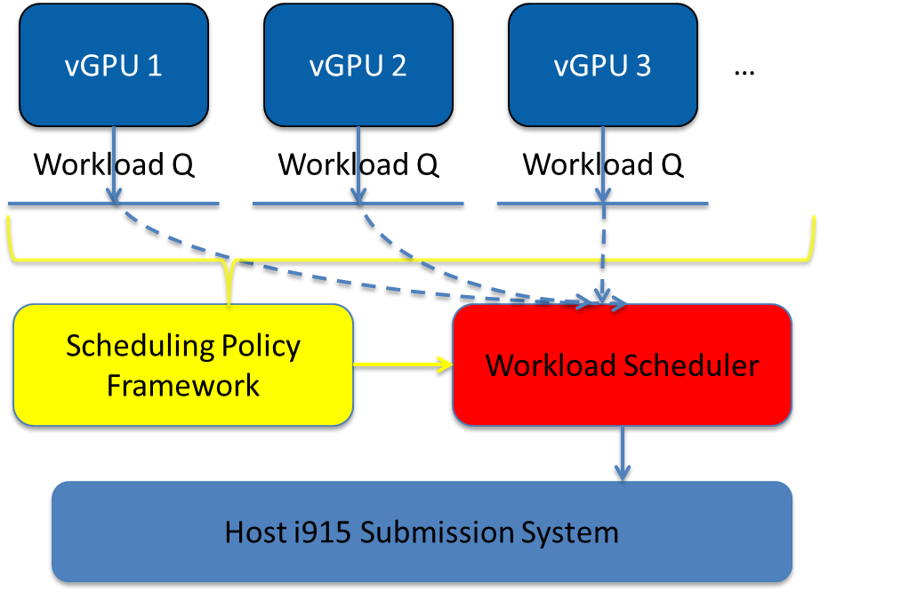

   GVT-g Scheduling Framework

Workload Submission Path
------------------------

Software submits the workload using the legacy ring buffer mode on Intel
Processor Graphics before Broadwell, which is no longer supported by the
GVT-g virtual device model. A new HW submission interface named
"Execlist" is introduced since Broadwell. With the new HW submission
interface, software can achieve better programmability and easier
context management. In Intel GVT-g, the vGPU submits the workload
through the virtual HW submission interface. Each workload in submission
will be represented as an ``intel_vgpu_workload`` data structure, a vGPU
workload, which will be put on a per-vGPU and per-engine workload queue
later after performing a few basic checks and verifications.

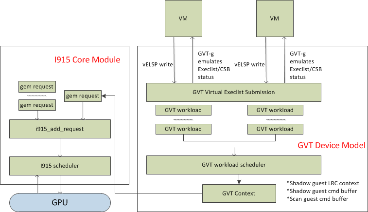

   GVT-g Workload Submission

Display Virtualization
----------------------

GVT-g reuses the i915 graphics driver in the SOS to initialize the Display
Engine, and then manages the Display Engine to show different VM frame
buffers. When two vGPUs have the same resolution, only the frame buffer
locations are switched.

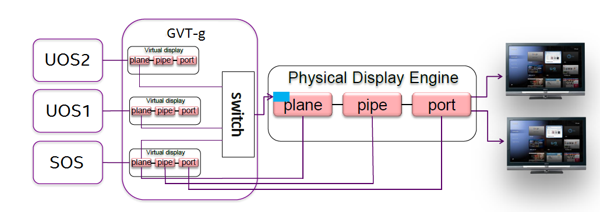

   Display Virtualization

Direct Display Model
--------------------

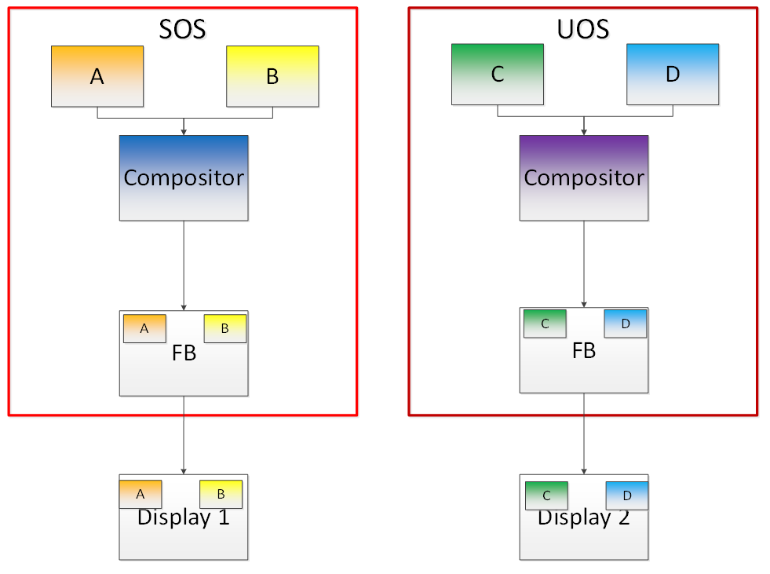

   Direct Display Model

A typical automotive use case is where there are two displays in the car
and each one needs to show one domain's content, with the two domains
being the Instrument cluster and the In Vehicle Infotainment (IVI). As
shown in :numref:`direct-display`, this can be accomplished through the direct
display model of GVT-g, where the SOS and UOS are each assigned all HW
planes of two different pipes. GVT-g has a concept of display owner on a
per HW plane basis. If it determines that a particular domain is the
owner of a HW plane, then it allows the domain's MMIO register write to
flip a frame buffer to that plane to go through to the HW. Otherwise,
such writes are blocked by the GVT-g.

Indirect Display Model
----------------------

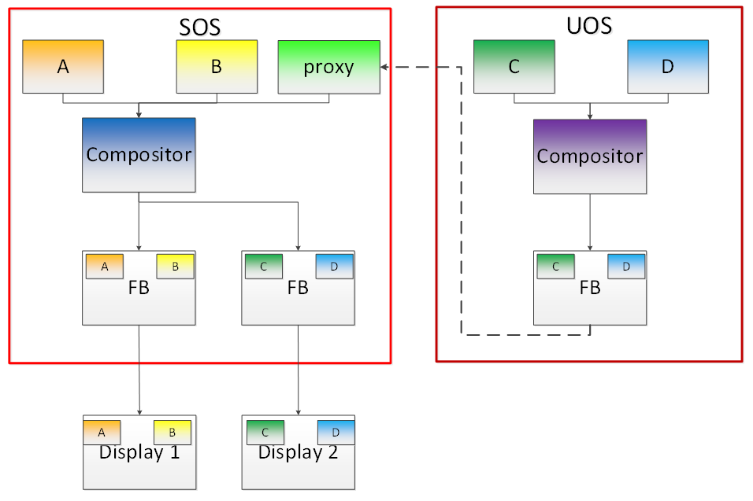

   Indirect Display Model

For security or fastboot reasons, it may be determined that the UOS is
either not allowed to display its content directly on the HW or it may
be too late before it boots up and displays its content. In such a
scenario, the responsibility of displaying content on all displays lies
with the SOS. One of the use cases that can be realized is to display the
entire frame buffer of the UOS on a secondary display. GVT-g allows for this
model by first trapping all MMIO writes by the UOS to the HW. A proxy
application can then capture the address in GGTT where the UOS has written
its frame buffer and using the help of the Hypervisor and the SOS's i915
driver, can convert the Guest Physical Addresses (GPAs) into Host
Physical Addresses (HPAs) before making a texture source or EGL image
out of the frame buffer and then either post processing it further or
simply displaying it on a HW plane of the secondary display.

GGTT-Based Surface Sharing
--------------------------

One of the major automotive use case is called "surface sharing". This
use case requires that the SOS accesses an individual surface or a set of
surfaces from the UOS without having to access the entire frame buffer of
the UOS. Unlike the previous two models, where the UOS did not have to do
anything to show its content and therefore a completely unmodified UOS
could continue to run, this model requires changes to the UOS.

This model can be considered an extension of the indirect display model.
Under the indirect display model, the UOS's frame buffer was temporarily
pinned by it in the video memory access through the Global graphics
translation table. This GGTT-based surface sharing model takes this a
step further by having a compositor of the UOS to temporarily pin all
application buffers into GGTT. It then also requires the compositor to
create a metadata table with relevant surface information such as width,
height, and GGTT offset, and flip that in lieu of the frame buffer.
In the SOS, the proxy application knows that the GGTT offset has been
flipped, maps it, and through it can access the GGTT offset of an
application that it wants to access. It is worth mentioning that in this
model, UOS applications did not require any changes, and only the
compositor, Mesa, and i915 driver had to be modified.

This model has a major benefit and a major limitation. The
benefit is that since it builds on top of the indirect display model,
there are no special drivers necessary for it on either SOS or UOS.
Therefore, any Real Time Operating System (RTOS) that use
this model can simply do so without having to implement a driver, the
infrastructure for which may not be present in their operating system.
The limitation of this model is that video memory dedicated for a UOS is
generally limited to a couple of hundred MBs. This can easily be
exhausted by a few application buffers so the number and size of buffers
is limited. Since it is not a highly-scalable model, in general, Intel
recommends the Hyper DMA buffer sharing model, described next.

Hyper DMA Buffer Sharing
------------------------

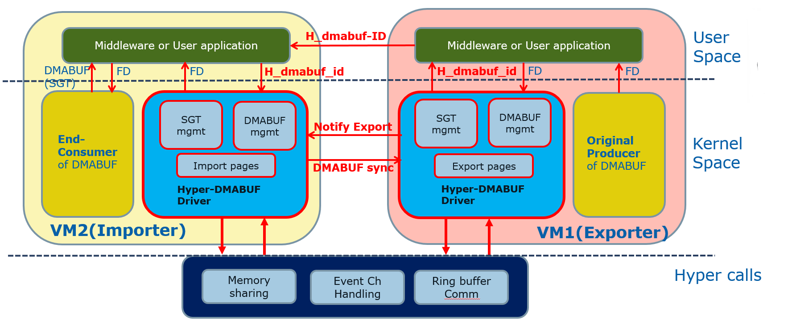

   Hyper DMA Buffer Design

Another approach to surface sharing is Hyper DMA Buffer sharing. This
model extends the Linux DMA buffer sharing mechanism where one driver is
able to share its pages with another driver within one domain.

Applications buffers are backed by i915 Graphics Execution Manager
Buffer Objects (GEM BOs).  As in GGTT surface
sharing, this model also requires compositor changes. The compositor of
UOS requests i915 to export these application GEM BOs and then passes
them on to a special driver called the Hyper DMA Buf exporter whose job
is to create a scatter gather list of pages mapped by PDEs and PTEs and
export a Hyper DMA Buf ID back to the compositor.

The compositor then shares this Hyper DMA Buf ID with the SOS's Hyper DMA
Buf importer driver which then maps the memory represented by this ID in
the SOS. A proxy application in the SOS can then provide the ID of this driver
to the SOS i915, which can create its own GEM BO. Finally, the application
can use it as an EGL image and do any post processing required before
either providing it to the SOS compositor or directly flipping it on a
HW plane in the compositor's absence.

This model is highly scalable and can be used to share up to 4 GB worth
of pages. It is also not limited to only sharing graphics buffers. Other
buffers for the IPU and others, can also be shared with it. However, it
does require that the SOS port the Hyper DMA Buffer importer driver. Also,
the SOS OS must comprehend and implement the DMA buffer sharing model.

For detailed information about this model, please refer to the `Linux
HYPER_DMABUF Driver High Level Design
<https://github.com/downor/linux_hyper_dmabuf/blob/hyper_dmabuf_integration_v4/Documentation/hyper-dmabuf-sharing.txt>`_.

.. _plane_restriction:

Plane-Based Domain Ownership
----------------------------

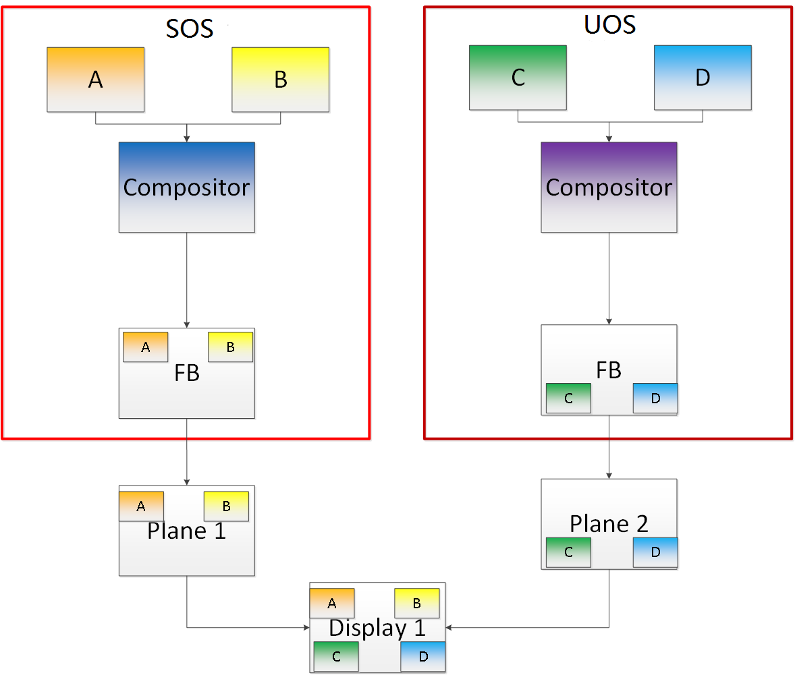

   Plane-Based Domain Ownership

Yet another mechanism for showing content of both the SOS and UOS on the
same physical display is called plane-based domain ownership. Under this
model, both the SOS and UOS are provided a set of HW planes that they can
flip their contents on to. Since each domain provides its content, there
is no need for any extra composition to be done through the SOS. The display
controller handles alpha blending contents of different domains on a
single pipe. This saves on any complexity on either the SOS or the UOS
SW stack.

It is important to provide only specific planes and have them statically
assigned to different Domains. To achieve this, the i915 driver of both
domains is provided a command line parameter that specifies the exact
planes that this domain has access to. The i915 driver then enumerates
only those HW planes and exposes them to its compositor. It is then left
to the compositor configuration to use these planes appropriately and
show the correct content on them. No other changes are necessary.

While the biggest benefit of this model is that is extremely simple and
quick to implement, it also has some drawbacks. First, since each domain
is responsible for showing the content on the screen, there is no
control of the UOS by the SOS. If the UOS is untrusted, this could
potentially cause some unwanted content to be displayed. Also, there is
no post processing capability, except that provided by the display
controller (for example, scaling, rotation, and so on). So each domain
must provide finished buffers with the expectation that alpha blending
with another domain will not cause any corruption or unwanted artifacts.

Graphics Memory Virtualization
==============================

To achieve near-to-native graphics performance, GVT-g passes through the
performance-critical operations, such as Frame Buffer and Command Buffer
from the VM. For the global graphics memory space, GVT-g uses graphics
memory resource partitioning and an address space ballooning mechanism.
For local graphics memory spaces, GVT-g implements per-VM local graphics
memory through a render context switch because local graphics memory is
only accessible by the GPU.

Global Graphics Memory
----------------------

Graphics Memory Resource Partitioning
%%%%%%%%%%%%%%%%%%%%%%%%%%%%%%%%%%%%%

GVT-g partitions the global graphics memory among VMs. Splitting the
CPU/GPU scheduling mechanism requires that the global graphics memory of
different VMs can be accessed by the CPU and the GPU simultaneously.
Consequently, GVT-g must, at any time, present each VM with its own
resource, leading to the resource partitioning approaching, for global
graphics memory, as shown in :numref:`mem-part`.

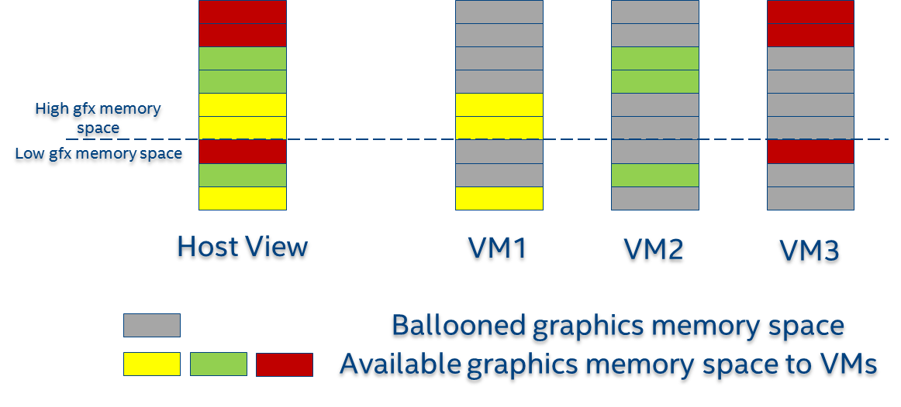

   Memory Partition and Ballooning

The performance impact of reduced global graphics memory resource
due to memory partitioning is very limited according to various test
results.

Address Space Ballooning
%%%%%%%%%%%%%%%%%%%%%%%%

The address space ballooning technique is introduced to eliminate the
address translation overhead, shown in :numref:`mem-part`. GVT-g exposes the
partitioning information to the VM graphics driver through the PVINFO
MMIO window. The graphics driver marks the other VMs' regions as
'ballooned', and reserves them as not being used from its graphics
memory allocator. Under this design, the guest view of global graphics
memory space is exactly the same as the host view and the driver
programmed addresses, using guest physical address, can be directly used
by the hardware. Address space ballooning is different from traditional
memory ballooning techniques. Memory ballooning is for memory usage
control concerning the number of ballooned pages, while address space
ballooning is to balloon special memory address ranges.

Another benefit of address space ballooning is that there is no address
translation overhead as we use the guest Command Buffer for direct GPU
execution.

Per-VM Local Graphics Memory
----------------------------

GVT-g allows each VM to use the full local graphics memory spaces of its
own, similar to the virtual address spaces on the CPU. The local
graphics memory spaces are only visible to the Render Engine in the GPU.
Therefore, any valid local graphics memory address, programmed by a VM,
can be used directly by the GPU. The GVT-g device model switches the
local graphics memory spaces, between VMs, when switching render
ownership.

GPU Page Table Virtualization
=============================

Shared Shadow GGTT
------------------

To achieve resource partitioning and address space ballooning, GVT-g
implements a shared shadow global page table for all VMs. Each VM has
its own guest global page table to translate the graphics memory page
number to the Guest memory Page Number (GPN). The shadow global page
table is then translated from the graphics memory page number to the
Host memory Page Number (HPN).

The shared shadow global page table maintains the translations for all
VMs to support concurrent accesses from the CPU and GPU concurrently.
Therefore, GVT-g implements a single, shared shadow global page table by
trapping guest PTE updates, as shown in :numref:`shared-shadow`. The
global page table, in MMIO space, has 1024K PTE entries, each pointing
to a 4 KB system memory page, so the global page table overall creates a
4 GB global graphics memory space. GVT-g audits the guest PTE values
according to the address space ballooning information before updating
the shadow PTE entries.

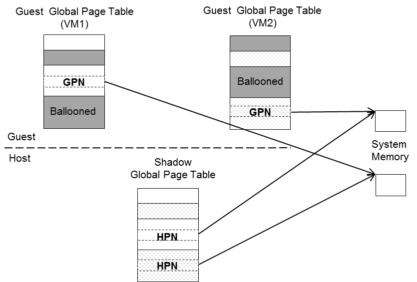

   Shared Shadow Global Page Table

Per-VM Shadow PPGTT
-------------------

To support local graphics memory access pass-through, GVT-g implements
per-VM shadow local page tables. The local graphics memory is only
accessible from the Render Engine. The local page tables have two-level
paging structures, as shown in :numref:`per-vm-shadow`.

The first level, Page Directory Entries (PDEs), located in the global
page table, points to the second level, Page Table Entries (PTEs) in
system memory, so guest accesses to the PDE are trapped and emulated,
through the implementation of shared shadow global page table.

GVT-g also write-protects a list of guest PTE pages for each VM. The
GVT-g device model synchronizes the shadow page with the guest page, at
the time of write-protection page fault, and switches the shadow local
page tables at render context switches.

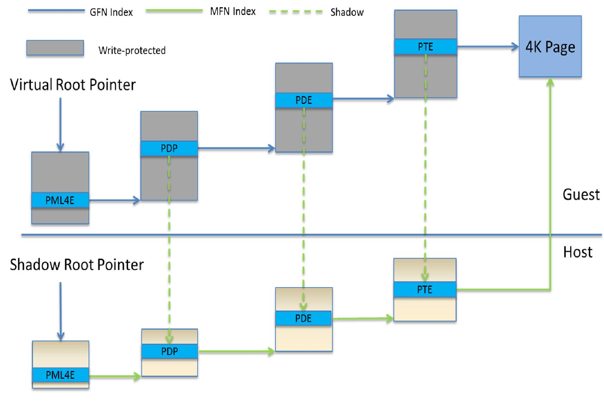

   Per-VM Shadow PPGTT

.. _GVT-g-prioritized-rendering:

Prioritized Rendering and Preemption
====================================

Different Schedulers and Their Roles
------------------------------------

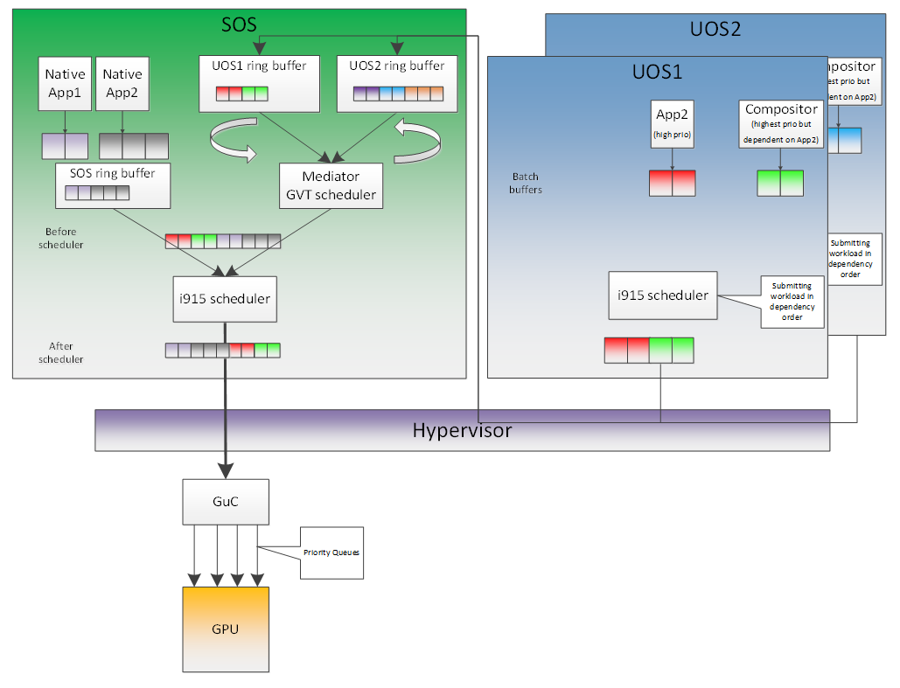

   Scheduling Policy

In the system, there are three different schedulers for the GPU:

-  i915 UOS scheduler
-  Mediator GVT scheduler
-  i915 SOS scheduler

Since UOS always uses the host-based command submission (ELSP) model,
and it never accesses the GPU or the Graphic Micro Controller (GuC)
directly, its scheduler cannot do any preemption by itself.
The i915 scheduler does ensure batch buffers are
submitted in dependency order, that is, if a compositor had to wait for
an application buffer to finish before its workload can be submitted to
the GPU, then the i915 scheduler of the UOS ensures that this happens.

The UOS assumes that by submitting its batch buffers to the Execlist
Submission Port (ELSP), the GPU will start working on them. However,
the MMIO write to the ELSP is captured by the Hypervisor, which forwards
these requests to the GVT module. GVT then creates a shadow context
based on this batch buffer and submits the shadow context to the SOS
i915 driver.

However, it is dependent on a second scheduler called the GVT
scheduler. This scheduler is time based and uses a round robin algorithm
to provide a specific time for each UOS to submit its workload when it
is considered as a "render owner". The workload of the UOSs that are not
render owners during a specific time period end up waiting in the
virtual GPU context until the GVT scheduler makes them render owners.
The GVT shadow context submits only one workload at
a time, and once the workload is finished by the GPU, it copies any
context state back to DomU and sends the appropriate interrupts before
picking up any other workloads from either this UOS or another one. This
also implies that this scheduler does not do any preemption of
workloads.

Finally, there is the i915 scheduler in the SOS. This scheduler uses the
GuC or ELSP to do command submission of SOS local content as well as any
content that GVT is submitting to it on behalf of the UOSs. This
scheduler uses GuC or ELSP to preempt workloads. GuC has four different
priority queues, but the SOS i915 driver uses only two of them. One of
them is considered high priority and the other is normal priority with a
GuC rule being that any command submitted on the high priority queue
would immediately try to preempt any workload submitted on the normal
priority queue. For ELSP submission, the i915 will submit a preempt
context to preempt the current running context and then wait for the GPU
engine to be idle.

While the identification of workloads to be preempted is decided by
customizable scheduling policies, once a candidate for preemption is
identified, the i915 scheduler simply submits a preemption request to
the GuC high-priority queue. Based on the HW's ability to preempt (on an
Apollo Lake SoC, 3D workload is preemptible on a 3D primitive level with
some exceptions), the currently executing workload is saved and
preempted. The GuC informs the driver using an interrupt of a preemption
event occurring. After handling the interrupt, the driver submits the
high-priority workload through the normal priority GuC queue. As such,
the normal priority GuC queue is used for actual execbuf submission most
of the time with the high-priority GuC queue only being used for the
preemption of lower-priority workload.

Scheduling policies are customizable and left to customers to change if
they are not satisfied with the built-in i915 driver policy, where all
workloads of the SOS are considered higher priority than those of the
UOS. This policy can be enforced through an SOS i915 kernel command line
parameter, and can replace the default in-order command submission (no
preemption) policy.

AcrnGT
*******

ACRN is a flexible, lightweight reference hypervisor, built with
real-time and safety-criticality in mind, optimized to streamline
embedded development through an open source platform.

AcrnGT is the GVT-g implementation on the ACRN hypervisor. It adapts
the MPT interface of GVT-g onto ACRN by using the kernel APIs provided
by ACRN.

:numref:`full-pic` shows the full architecture of AcrnGT with a Linux Guest
OS and an Android Guest OS.

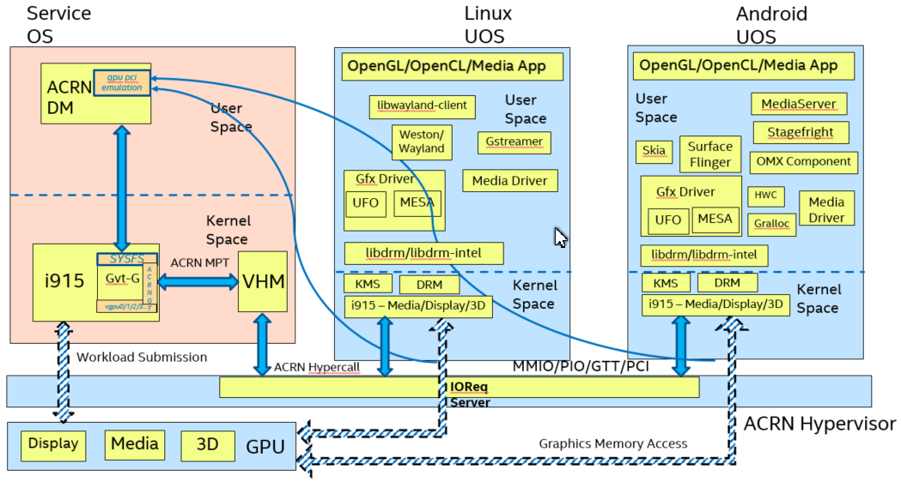

   Full picture of the AcrnGT

AcrnGT in kernel
=================

The AcrnGT module in the SOS kernel acts as an adaption layer to connect
between GVT-g in the i915, the VHM module, and the ACRN-DM user space
application:

-  AcrnGT module implements the MPT interface of GVT-g to provide
   services to it, including set and unset trap areas, set and unset
   write-protection pages, etc.

-  It calls the VHM APIs provided by the ACRN VHM module in the SOS
   kernel, to eventually call into the routines provided by ACRN
   hypervisor through hyper-calls.

-  It provides user space interfaces through ``sysfs`` to the user space
   ACRN-DM, so that DM can manage the lifecycle of the virtual GPUs.

AcrnGT in DM
=============

To emulate a PCI device to a Guest, we need an AcrnGT sub-module in the
ACRN-DM.  This sub-module is responsible for:

-  registering the virtual GPU device to the PCI device tree presented to
   guest;

-  registerng the MMIO resources to ACRN-DM so that it can reserve
   resources in ACPI table;

-  managing the lifecycle of the virtual GPU device, such as creation,
   destruction, and resetting according to the state of the virtual
   machine.
