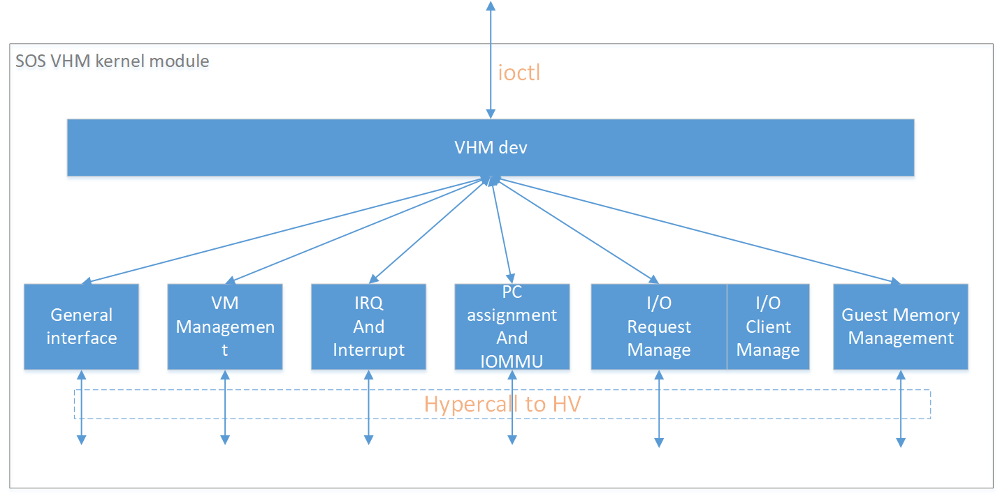
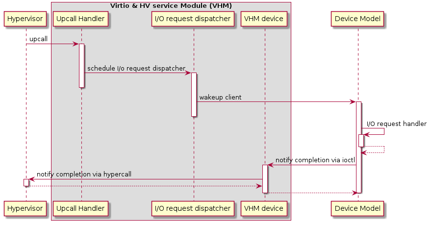

.. _hld-devicemodel:

Device Model high-level design
##############################

Hypervisor Device Model (DM) is a QEMU-like application in Service VM
responsible for creating a User VM and then performing devices emulation
based on command line configurations.

   Device Model Framework

:numref:`dm-framework` above gives a big picture overview of DM
framework. There are 3 major subsystems in Service VM:

-  **Device Emulation**: DM provides backend device emulation routines for
   frontend User VM device drivers. These routines register their I/O
   handlers to the I/O dispatcher inside the DM. When the VHM
   assigns any I/O request to the DM, the I/O dispatcher
   dispatches this request to the corresponding device emulation
   routine to do the emulation.

-  I/O Path in Service VM:

   -  HV initializes an I/O request and notifies VHM driver in Service VM
      through upcall.
   -  VHM driver dispatches I/O requests to I/O clients and notifies the
      clients (in this case the client is the DM which is notified
      through char device)
   -  DM I/O dispatcher calls corresponding I/O handlers
   -  I/O dispatcher notifies VHM driver the I/O request is completed
      through char device
   -  VHM driver notifies HV on the completion through hypercall
   -  DM injects VIRQ to User VM frontend device through hypercall

-  VHM: Virtio and Hypervisor Service Module is a kernel module in Service VM as a
   middle layer to support DM. Refer to :ref:`virtio-APIs` for details

This section introduces how the acrn-dm application is configured and
walks through the DM overall flow. We'll then elaborate on device,
ISA, and PCI emulation.

Configuration
*************

The acrn-dm runs using these command line configuration
options:

.. code-block:: none

  acrn-dm [-hAWYv] [-B bootargs] [-c vcpus] [-E elf_image_path]
               [-G GVT_args] [-i ioc_mediator_parameters] [-k kernel_image_path]
               [-l lpc] [-m mem] [-p vcpu:hostcpu] [-r ramdisk_image_path]
               [-s pci] [-U uuid] [--vsbl vsbl_file_name] [--ovmf ovmf_file_path]
               [--part_info part_info_name] [--enable_trusty] [--intr_monitor param_setting]
               [--acpidev_pt HID] [--mmiodev_pt MMIO_regions]
               [--vtpm2 sock_path] [--virtio_poll interval] [--mac_seed seed_string]
               [--ptdev_no_reset] [--debugexit]
               [--lapic_pt] <vm>
       -A: create ACPI tables
       -B: bootargs for kernel
       -c: # cpus (default 1)
       -E: elf image path
       -G: GVT args: low_gm_size, high_gm_size, fence_sz
       -h: help
       -i: ioc boot parameters
       -k: kernel image path
       -l: LPC device configuration
       -m: memory size in MB
       -p: pin 'vcpu' to 'hostcpu'
       -r: ramdisk image path
       -s: <slot,driver,configinfo> PCI slot config
       -U: uuid
       -v: version
       -W: force virtio to use single-vector MSI
       -Y: disable MPtable generation
       --mac_seed: set a platform unique string as a seed for generate mac address
       --vsbl: vsbl file path
       --ovmf: ovmf file path
       --part_info: guest partition info file path
       --enable_trusty: enable trusty for guest
       --ptdev_no_reset: disable reset check for ptdev
       --debugexit: enable debug exit function
       --intr_monitor: enable interrupt storm monitor
            its params: threshold/s,probe-period(s),delay_time(ms),delay_duration(ms),
       --virtio_poll: enable virtio poll mode with poll interval with ns
       --acpidev_pt: acpi device ID args: HID in ACPI Table
       --mmiodev_pt: MMIO resources args: physical MMIO regions
       --vtpm2: Virtual TPM2 args: sock_path=$PATH_OF_SWTPM_SOCKET
       --lapic_pt: enable local apic passthrough
       --rtvm: indicate that the guest is rtvm
       --logger_setting: params like console,level=4;kmsg,level=3
       --pm_notify_channel: define the channel used to notify guest about power event
       --pm_by_vuart:pty,/run/acrn/vuart_vmname or tty,/dev/ttySn

See :ref:`acrn-dm_parameters` for more detailed descriptions of these
configuration options.

Here's an example showing how to run a VM with:

-  Build ACPI table
-  vSBL as the boot ROM
-  UART device on PCI 00:01.0
-  GPU device on PCI 00:02.0
-  Virtio-block device on PCI 00:03.0
-  Virtio-net device on PCI 00:04.0
-  TPM2 MSFT0101

.. code-block:: bash

   acrn-dm -A -m 2048M -c 3 \
     -s 0:0,hostbridge \
     -s 1:0,lpc -l com1,stdio \
     -s 5,virtio-console,@pty:pty_port \
     -s 3,virtio-blk,b,/data/clearlinux/clearlinux.img \
     -s 4,virtio-net,tap_LaaG --vsbl /usr/share/acrn/bios/VSBL.bin \
     --acpidev_pt MSFT0101 \
     --intr_monitor 10000,10,1,100 \
     -B "root=/dev/vda2 rw rootwait maxcpus=3 nohpet console=hvc0 \
     console=ttyS0 no_timer_check ignore_loglevel log_buf_len=16M \
     consoleblank=0 tsc=reliable i915.avail_planes_per_pipe=0x070F00 \
     i915.enable_guc_loading=0 \
     i915.enable_hangcheck=0 i915.nuclear_pageflip=1 \
     i915.enable_guc_submission=0 i915.enable_guc=0" vm1

DM Initialization
*****************

:numref:`dm-boot-flow` shows the overall flow for the DM boot up:

   Device Model Boot Flow

-  **DM Start**: DM application starts to run.

-  **Option Parsing**: DM parse options from command line inputs.

-  **VM Create**: DM calls ioctl to Service VM VHM, then Service VM VHM makes
   hypercalls to HV to create a VM, it returns a vmid for a
   dedicated VM.

-  **Set I/O Request Buffer**: the I/O request buffer is a page buffer
   allocated by DM for a specific VM in user space. This buffer is
   shared between DM, VHM and HV. **Set I/O Request buffer** calls
   an ioctl executing a hypercall to share this unique page buffer
   with VHM and HV.  Refer to :ref:`hld-io-emulation` and
   :ref:`IO-emulation-in-sos` for more details.

-  **Memory Setup**: User VM memory is allocated from Service VM
   memory. This section of memory will use Service VM hugetlbfs to allocate
   linear continuous host physical address for guest memory. It will
   try to get the page size as big as possible to guarantee maximum
   utilization of TLB. It then invokes a hypercall to HV for its EPT
   mapping, and maps the memory segments into user space.

-  **PIO/MMIO Handler Init**: PIO/MMIO handlers provide callbacks for
   trapped PIO/MMIO request which are triggered from I/O request
   server in HV for DM owned device emulation. This is the endpoint
   of I/O path in DM. After this initialization, device emulation
   driver in DM could register its MMIO handler by *register_mem()*
   API and PIO handler by *register_inout()* API or INOUT_PORT()
   macro.

-  **PCI Init**: PCI initialization scans the PCI bus/slot/function to
   identify each configured PCI device on the acrn-dm command line
   and initializes their configuration space by calling their
   dedicated vdev_init() function. For more details on the DM PCI
   emulation, refer to `PCI Emulation`_.

-  **ACPI Build**: If there is "-A" option in acrn-dm command line, DM
   will build ACPI table into its VM's F-Segment (0xf2400). This
   ACPI table includes full tables for RSDP, RSDT, XSDT, MADT, FADT,
   HPET, MCFG, FACS, and DSDT. All these items are programed
   according to acrn-dm command line configuration and derived from
   their default value.

-  **SW Load**: DM prepares User VM's SW configuration such as kernel,
   ramdisk, and zeropage, according to these memory locations:

   .. code-block:: c

      #define RAMDISK_LOAD_OFF(ctx)  (ctx->lowmem - 4*MB)
      #define BOOTARGS_LOAD_OFF(ctx) (ctx->lowmem - 8*KB)
      #define KERNEL_ENTRY_OFF(ctx)  (ctx->lowmem - 6*KB)
      #define ZEROPAGE_LOAD_OFF(ctx) (ctx->lowmem - 4*KB)
      #define KERNEL_LOAD_OFF(ctx)   (16*MB)

   For example, if the User VM memory is set as 800M size, then **SW Load**
   will prepare its ramdisk (if there is) at 0x31c00000 (796M), bootargs at
   0x31ffe000 (800M - 8K), kernel entry at 0x31ffe800(800M - 6K) and zero
   page at 0x31fff000 (800M - 4K). The hypervisor will finally run VM based
   on these configurations.

   Note that the zero page above also includes e820 setting for this VM.
   The DM defines its VM e820 table according to this configuration:

   .. code-block:: c

      /*
       * Default e820 mem map:
       *
       * there is reserved memory hole for PCI hole and APIC etc
       * so the memory layout could be separated into lowmem & highmem.
       * - if request memory size <= ctx->lowmem_limit, then there is only
       *   map[0]:0~ctx->lowmem for RAM
       *   ctx->lowmem = request_memory_size
       * - if request memory size > ctx->lowmem_limit, then there are
       *   map[0]:0~ctx->lowmem_limit & map[2]:4G~ctx->highmem for RAM
       *   ctx->highmem = request_memory_size - ctx->lowmem_limit
       *
       *             Begin      End         Type         Length
       * 0:             0 -     0xef000     RAM          0xEF000
       * 1        0xef000 -     0x100000    (reserved)   0x11000
       * 2       0x100000 -     lowmem      RAM          lowmem - 0x100000
       * 3:        lowmem -     bff_fffff   (reserved)   0xc00_00000-lowmem
       * 4:   0xc00_00000 -     dff_fffff   PCI hole     512MB
       * 5:   0xe00_00000 -     fff_fffff   (reserved)   512MB
       * 6:   1_000_00000 -     highmem     RAM          highmem-4G
       */

-  **VM Loop Thread**: DM kicks this VM loop thread to create I/O
   request client for DM, runs VM, and then enters I/O request
   handling loop:

   .. code-block:: c

      vm_loop(struct vmctx *ctx)
      {
          int error;

          ctx->ioreq_client = vm_create_ioreq_client(ctx);
          assert(ctx->ioreq_client > 0);

          error = vm_run(ctx);
          assert(error == 0);

          while (1) {
              int vcpu_id;
              struct vhm_request *vhm_req;

              error = vm_attach_ioreq_client(ctx);
              if (error)
                  break;

              for (vcpu_id = 0; vcpu_id < 4; vcpu_id++) {
                  vhm_req = &vhm_req_buf[vcpu_id];
                  if ((atomic_load(&vhm_req->processed) == REQ_STATE_PROCESSING)
                      && (vhm_req->client == ctx->ioreq_client))
                      handle_vmexit(ctx, vhm_req, vcpu_id);
              }

              if (VM_SUSPEND_FULL_RESET == vm_get_suspend_mode() ||
                VM_SUSPEND_POWEROFF == vm_get_suspend_mode()) {
                break;
              }

              if (VM_SUSPEND_SYSTEM_RESET == vm_get_suspend_mode()) {
                  vm_system_reset(ctx);
              }

              if (VM_SUSPEND_SUSPEND == vm_get_suspend_mode()) {
                  vm_suspend_resume(ctx);
              }
          }
          printf("VM loop exit\n");
      }

-  **Mevent Dispatch Loop**: It's the final loop of the main acrn-dm
   thread. mevent dispatch will do polling for potential async
   event.

VHM
***

VHM overview
============

Device Model manages User VM by accessing interfaces exported from VHM
module. VHM module is an Service VM kernel driver. The ``/dev/acrn_vhm`` node is
created when VHM module is initialized. Device Model follows the standard
Linux char device API (ioctl) to access the functionality of VHM.

In most of ioctl, VHM converts the ioctl command to a corresponding
hypercall to the hypervisor. There are two exceptions:

-  I/O request client management is implemented in VHM.

-  For memory range management of User VM, VHM needs to save all memory
   range info of User VM. The subsequent memory mapping update of User VM
   needs this information.

   Architecture of ACRN VHM

VHM ioctl interfaces
====================

.. note:: Reference API docs for General interface, VM Management,
   IRQ and Interrupts, Device Model management, Guest Memory management,
   PCI assignment, and Power management

.. _IO-emulation-in-sos:

I/O Emulation in Service VM
***************************

I/O requests from the hypervisor are dispatched by VHM in the Service VM kernel
to a registered client, responsible for further processing the
I/O access and notifying the hypervisor on its completion.

Initialization of Shared I/O Request Buffer
===========================================

For each VM, there is a shared 4-KByte memory region used for I/O request
communication between the hypervisor and Service VM. Upon initialization
of a VM, the DM (acrn-dm) in Service VM userland first allocates a 4-KByte
page and passes the GPA of the buffer to HV via hypercall. The buffer is
used as an array of 16 I/O request slots with each I/O request being
256 bytes. This array is indexed by vCPU ID. Thus, each vCPU of the VM
corresponds to one I/O request slot in the request buffer since a vCPU
cannot issue multiple I/O requests at the same time.

.. note:: By this design, a VM supports a maximum of 16 vCPUs.

I/O Clients
===========

An I/O client is either a Service VM userland application or a Service VM kernel space
module responsible for handling I/O access whose address
falls in a certain range. Each VM has an array of registered I/O
clients which are initialized with a fixed I/O address range, plus a PCI
BDF on VM creation. There is a special client in each VM, called the
fallback client, that handles all I/O requests that do not fit into
the range of any other client. In the current design the device model
acts as the fallback client for any VM.

Each I/O client can be configured to handle the I/O requests in the
client thread context or in a separate kernel thread context.
:numref:`vhm-interaction` shows how an I/O client talks to VHM to register
a handler and process the incoming I/O requests in a kernel thread
specifically created for this purpose.

   Interaction of in-kernel I/O clients and VHM

-  On registration, the client requests a fresh ID, registers a
   handler, adds the I/O range (or PCI BDF) to be emulated by this
   client, and finally attaches it to VHM which creates the kicks off
   for a new kernel thread.

-  The kernel thread waits for any I/O request to be handled. When a
   pending I/O request is assigned to the client by VHM, the kernel
   thread wakes up and calls the registered callback function
   to process the request.

-  Before the client is destroyed, VHM ensures that the kernel
   thread exits.

An I/O client can also handle I/O requests in its own thread context.
:numref:`dm-vhm-interaction` shows the interactions in such a case, using the
device model as an example. No callback is registered on
registration and the I/O client (device model in the example) attaches
itself to VHM every time it is ready to process additional I/O requests.
Note also that the DM runs in userland and talks to VHM via the ioctl
interface in `VHM ioctl interfaces`_.

.. figure:: images/dm-image99.png
   :align: center
   :name: dm-vhm-interaction

   Interaction of DM and VHM

Refer to `I/O client interfaces`_ for a list of interfaces for developing
I/O clients.

Processing I/O Requests
=======================

   I/O request handling sequence in Service VM

:numref:`io-sequence-sos` above illustrates the interactions among the
hypervisor, VHM,
and the device model for handling I/O requests. The main interactions
are as follows:

1. The hypervisor makes an upcall to Service VM as an interrupt
   handled by the upcall handler in VHM.

2. The upcall handler schedules the execution of the I/O request
   dispatcher. If the dispatcher is already running, another round
   of execution is scheduled.

3. The I/O request dispatcher looks for I/O requests with the PENDING
   state, assigns them to registered clients based on the address of
   the I/O access, updates their state to PROCESSING, and wakes up
   all clients that have I/O requests to be processed. The flow is
   illustrated in more detail in :numref:`io-dispatcher-flow`.

4. The waked client (the DM in :numref:`io-sequence-sos` above) handles the
   assigned I/O requests, updates their state to COMPLETE, and notifies
   the VHM of the completion via ioctl. :numref:`dm-io-flow` show this
   flow.

5. The VHM device notifies the hypervisor of the completion via
   hypercall.

   I/O dispatcher control flow

.. figure:: images/dm-image74.png
   :align: center
   :name: dm-io-flow

   Device model control flow on handling I/O requests

Emulation of Accesses to PCI Configuration Space
================================================

PCI configuration spaces are accessed by writing to an address to I/O
port 0xcf8 and then reading the I/O port 0xcfc. As the PCI configuration
space of different devices is emulated by different clients, VHM
handles the emulation of accesses to I/O port 0xcf8, caches the BDF of
the device and the offset of the register, and delivers the request to
the client with the same BDF when I/O port 0xcfc is accessed.

The following table summarizes the emulation of accesses to I/O port
0xcf8 and 0xcfc.

+-----------------+------------------------+---------------------------+
|                 | BDF and offset cached  | BDF and offset not cached |
+=================+========================+===========================+
| Load from 0xcf8 | Return value previously stored to port 0xcf8       |
+-----------------+------------------------+---------------------------+
| Store to 0xcf8  | If MSB of value is 1, cache BFD and offset,        |
|                 | otherwise, invalidate cache.                       |
+-----------------+------------------------+---------------------------+
| Load from 0xcfc | Assigned to client     | Return all 1's            |
+-----------------+ with same BDF, or      +---------------------------+
| Store to 0xcfc  | fallback if not any.   | Silently ignored          |
+-----------------+------------------------+---------------------------+

I/O Client Interfaces
=====================

.. note:: replace with reference to API documentation

The APIs for I/O client development are as follows:

For I/O client registration

-  acrn_ioreq_create_client - create ioreq client
-  acrn_ioreq_add_iorange - add iorange monitored by ioreq client
-  acrn_ioreq_intercept_bdf - set intercept bdf info of ioreq client
-  acrn_ioreq_get_reqbuf - get request buffer

I/O client runtime helpers.

-  acrn_ioreq_attach_client - start handle request for ioreq client
-  acrn_ioreq_complete_request - notify guest request handling is
   completed

For I/O client destruction

-  acrn_ioreq_destroy_client - destroy ioreq client
-  acrn_ioreq_del_iorange - del iorange monitored by ioreq client
-  acrn_ioreq_unintercept_bdf - clear intercept bdf info of ioreq
   client

Device Emulation
****************

The DM emulates different kinds of devices, such as RTC,
LPC, UART, PCI devices, virtio block device, etc. It is important
for device emulation can handle I/O requests
from different devices including PIO, MMIO, and PCI CFG
SPACE access. For example, a CMOS RTC device may access 0x70/0x71 PIO to
get CMOS time, a GPU PCI device may access its MMIO or PIO bar space to
complete its framebuffer rendering, or the bootloader may access a PCI
devices' CFG SPACE for BAR reprogramming.

The DM needs to inject interrupts/MSIs to its frontend devices whenever
necessary. For example, a RTC device needs get its ALARM interrupt, or a
PCI device with MSI capability needs to get its MSI.

DM also provides a PIRQ routing mechanism for platform devices.

PIO/MMIO/CFG SPACE Handler
==========================

This chapter will do a quick introduction of different I/O requests.

PIO Handler Register
--------------------

A PIO range structure in DM is like below, it's the parameter needed to
register PIO handler for special PIO range:

.. note:: this should be references to API documentation in
   devicemodel/include/inout.h

.. code-block:: c

   struct inout_port {
           const char      *name;
           int             port;
           int             size;
           int             flags;
           inout_func_t    handler;
           void            *arg;
   };

A PIO emulation handler is defined as:

.. code-block:: c

   /*
    * inout emulation handlers return 0 on success and -1 on failure.
    */
   typedef int (*inout_func_t)(struct vmctx *ctx, int vcpu, int in, int port, int bytes, uint32_t *eax, void *arg);

The DM pre-registers the PIO emulation handlers through MACRO
INOUT_PORT, or registers the PIO emulation handers through
register_inout() function after init_inout():

.. code-block:: c

   #define INOUT_PORT(name, port, flags, handler)                          \
           static struct inout_port __CONCAT(__inout_port, __LINE__) = {   \
                   #name,                                                  \
                   (port),                                                 \
                   1,                                                      \
                   (flags),                                                \
                   (handler),                                              \
                   0                                                       \
           };                                                              \
           DATA_SET(inout_port_set, __CONCAT(__inout_port, __LINE__))

   int register_inout(struct inout_port *iop);
   int unregister_inout(struct inout_port *iop);

MMIO Handler Register
---------------------

A MMIO range structure is defined below. As with PIO, it's the
parameter needed to register MMIO handler for special MMIO range:

.. code-block:: c

   struct mem_range {
           const char      *name;
           int             flags;
           mem_func_t      handler;
           void            *arg1;
           long            arg2;
           uint64_t        base;
           uint64_t        size;
   };

A MMIO emulation handler is defined as:

.. code-block:: c

   typedef int (*mem_func_t)(struct vmctx *ctx, int vcpu, int dir, uint64_t addr,
                             int size, uint64_t *val, void *arg1, long arg2);

DM needs to call register_mem() function to register its emulated
device's MMIO handler:

.. code-block:: c

   int register_mem(struct mem_range *memp);
   int unregister_mem(struct mem_range *memp);

CFG SPACE Handler Register
--------------------------

As VHM intercepts the cf8/cfc PIO access for PCI CFG SPACE, the DM only
needs to provide CFG SPACE read/write handlers directly. Such handlers
are defined as shown below. Normally, a device emulation developer
has no need to update this function.

.. code-block:: c

   int emulate_pci_cfgrw(struct vmctx *ctx, int vcpu, int in, int bus, int slot,
           int func, int reg, int bytes, int *value)
   {
           pci_cfgrw(ctx, vcpu, in, bus, slot, func, reg,
                           bytes, (uint32_t *)value);
           return 0;
   }

Interrupt Interface
===================

DM calls these interrupt functions to send level, edge or MSI interrupt
to destination emulated devices:

.. code-block:: c

   /* Generate one msi interrupt to User VM, the index parameter indicates
    * the msi number from its PCI msi capability. */
   void    pci_generate_msi(struct pci_vdev *pi, int index);

   /* Generate one msix interrupt to User VM, the index parameter indicates
    * the msix number from its PCI msix bar. */
   void    pci_generate_msix(struct pci_vdev *pi, int index);

   /* Assert INTx interrupt line to high or low. */
   void    pci_lintr_assert(struct pci_vdev *pi);
   void    pci_lintr_deassert(struct pci_vdev *pi);

   /* Request and release the INTx interrupt resource.
    * This API will try to find one best INTx pin of this PCI slot and
    * set the "Interrupt pin" field of PCI config space. */
   void    pci_lintr_request(struct pci_vdev *pi);
   void    pci_lintr_release(struct pci_vdev *pi);

PIRQ Routing
============

:numref:`pirq-routing` shows a PCI device PIRQ routing example. On a platform,
there could be more PCI devices than available IRQ pin resources on its
PIC or IOAPIC interrupt controller. ICH HW provides a PIRQ Routing
mechanism to share IRQ pin resources between different PCI devices.

.. figure:: images/dm-image33.png
   :align: center
   :name: pirq-routing

   PIRQ Routing

DM calls pci_lintr_route() to emulate this PIRQ routing:

.. code-block:: c

   static void
   pci_lintr_route(struct pci_vdev *dev)
   {
       struct businfo *bi;
       struct intxinfo *ii;

       if (dev->lintr.pin == 0)
           return;

       bi = pci_businfo[dev->bus];
       assert(bi != NULL);
       ii = &bi->slotinfo[dev->slot].si_intpins[dev->lintr.pin - 1];

       /*
        * Attempt to allocate an I/O APIC pin for this intpin if one
        * is not yet assigned.
        */
       if (ii->ii_ioapic_irq == 0)
           ii->ii_ioapic_irq = ioapic_pci_alloc_irq(dev);
       assert(ii->ii_ioapic_irq > 0);

       /*
        * Attempt to allocate a PIRQ pin for this intpin if one is
        * not yet assigned.
        */
       if (ii->ii_pirq_pin == 0)
           ii->ii_pirq_pin = pirq_alloc_pin(dev);
       assert(ii->ii_pirq_pin > 0);

       dev->lintr.ioapic_irq = ii->ii_ioapic_irq;
       dev->lintr.pirq_pin = ii->ii_pirq_pin;
       pci_set_cfgdata8(dev, PCIR_INTLINE, pirq_irq(ii->ii_pirq_pin));
   }

The PIRQ routing for IOAPIC and PIC is dealt with differently.

* For IOAPIC, the irq pin is allocated in a round-robin fashion within the
  pins permitted for PCI devices. The irq information will be built
  into ACPI DSDT table then passed to guest VM.

* For PIC, the pin2irq information is maintained in a pirqs[] array (the array size is 8
  representing 8 shared PIRQs). When a PCI device tries to allocate a
  pirq pin, it will do a balancing calculation to figure out a best pin
  vs. irq pair. The irq# will be programed into PCI INTLINE config space
  and the pin# will be built into ACPI DSDT table then passed to guest VM.

.. note:: "irq" here is also called as "gsi" in ACPI terminology .

Regarding to INT A/B/C/D for PCI devices, DM just allocates them evenly
prior to PIRQ routing and then programs into PCI INTPIN config space.

ISA and PCI Emulation
*********************

ISA Emulation
=============

There is no explicit ISA emulation structure in DM; it calls the
corresponding device initialization functions directly, and takes the
usage of PIO/MMIO handler and interrupt APIs (described in `I/O Client
Interfaces`_) in its routine.

PCI Emulation
=============

   PCI Emulation Structure

PCI emulation takes care of three interfaces:

-  PCI configuration space update interface
-  BAR IO/MMIO handlers
-  INTR/MSI injection

The core PCI emulation structures are:

.. note:: reference ``struct businfo`` API from devicemodel/hw/pci/core.c

During PCI initialization, ACRN DM will scan each PCI bus, slot and
function and identify the PCI devices configured by acrn-dm command
line. The corresponding PCI device's initialization function will
be called to initialize its config space, allocate its BAR resource, its
irq, and do its irq routing.

.. note:: reference API doc for pci_vdev, pci_vdef_ops

The pci_vdev_ops of the pci_vdev structure could be installed by
customized handlers for cfgwrite/cfgread and barwrite/barread.

The cfgwrite/cfgread handlers will be called from the configuration
space handler. The barwrite/barread will be
called from the PIO/MMIO handler.

The PCI emulation device will make use of interrupt APIs as well for
its interrupt injection.

PCI Host Bridge and hierarchy
=============================

There is PCI host bridge emulation in DM. The bus hierarchy is
determined by acrn-dm command line input. Using this command line, as an
example:

.. code-block:: bash

   acrn-dm -A -m 2048M -c 3 \
     -s 0:0,hostbridge \
     -s 1:0,lpc -l com1,stdio \
     -s 5,virtio-console,@pty:pty_port \
     -s 3,virtio-blk,b,/data/clearlinux/clearlinux.img \
     -s 4,virtio-net,tap_LaaG --vsbl /usr/share/acrn/bios/VSBL.bin \
     -B "root=/dev/vda2 rw rootwait maxcpus=3 nohpet console=hvc0 \
     console=ttyS0 no_timer_check ignore_loglevel log_buf_len=16M \
     consoleblank=0 tsc=reliable i915.avail_planes_per_pipe=0x070F00 \
     i915.enable_guc_loading=0 \
     i915.enable_hangcheck=0 i915.nuclear_pageflip=1 \
     i915.enable_guc_submission=0 i915.enable_guc=0" vm1

the bus hierarchy would be:

.. code-block:: console

   $ lspci
   00:00.0 Host bridge: Network Appliance Corporation Device 1275
   00:01.0 ISA bridge: Intel Corporation 82371SB PIIX3 ISA [Natoma/Triton II]
   00:03.0 SCSI storage controller: Red Hat, Inc. Virtio block device
   00:04.0 Ethernet controller: Red Hat, Inc. Virtio network device
   00:05.0 Serial controller: Red Hat, Inc. Virtio console

.. note:: For Clear Linux OS, the ``lspci`` command can be installed
   from the "sysadmin-basic" bundle.

ACPI Virtualization
*******************

Introduction
============

Advanced Configuration and Power Interface (ACPI) provides an open
standard that operating systems can use to discover and configure
computer hardware components to perform power management for example, by
monitoring status and putting unused components to sleep.

Functions implemented by ACPI include:

-  System/Device/Processor power management
-  Device/Processor performance management
-  Configuration / Plug and Play
-  System event
-  Battery management
-  Thermal management

All critical functions depends on ACPI tables.
On an APL platform with Linux installed we can see these tables using:

.. code-block:: console

   $ ls /sys/firmware/acpi/tables/
   APIC data DMAR DSDT dynamic FACP FACS HPET MCFG NHLT TPM2

These tables provide different information and functions:

-  Advanced Programmable Interrupt Controller (APIC) for Symmetric
   Multiprocessor systems (SMP),
-  DMA remapping (DMAR) for Intel |reg| Virtualization Technology for
   Directed I/O (VT-d),
-  Non-HD Audio Link Table (NHLT) for supporting audio device,
-  and Differentiated System Description Table (DSDT) for system
   configuration info. DSDT is a major ACPI table used to describe what
   peripherals the machine has, and information on PCI IRQ mappings and
   power management

Most of the
ACPI functionality is provided in ACPI Machine Language (AML) bytecode
stored in the ACPI tables. To make use of these tables, Linux implements
an interpreter for the AML bytecode. When the BIOS is built, AML
bytecode is compiled from the ASL (ACPI Source Language) code. To
dissemble the ACPI table, use the ``iasl`` tool:

.. code-block:: console

   root@:Dom0 ~ $ cp /sys/firmware/acpi/tables/DMAR .
   root@:Dom0 ~ $ iasl -d DMAR

   Intel ACPI Component Architecture
   ASL+ Optimizing Compiler/Disassembler version 20170728
   Copyright (c) 2000 - 2017 Intel Corporation
   Input file DMAR, Length 0xB0 (176) bytes
   ACPI: DMAR 0x0000000000000000 0000B0 (v01 INTEL  BDW      00000001 INTL 00000001)
   Acpi Data Table [DMAR] decoded
   Formatted output:  DMAR.dsl - 5286 bytes

   root@:Dom0 ~ $ cat DMAR.dsl
   [000h 0000   4]                    Signature : "DMAR"    [DMA Remapping table]
   [004h 0004   4]                 Table Length : 000000B0
   [008h 0008   1]                     Revision : 01
   ...
   [030h 0048   2]                Subtable Type : 0000 [Hardware Unit Definition]
   [032h 0050   2]                       Length : 0018
   [034h 0052   1]                        Flags : 00
   [035h 0053   1]                     Reserved : 00
   [036h 0054   2]           PCI Segment Number : 0000
   [038h 0056   8]        Register Base Address : 00000000FED64000

From the displayed ASL, we can see some generic table fields, such as
version info, and one VTd remapping engine description with FED64000 as
base address.

We can modify DMAR.dsl and assemble it again to AML:

.. code-block:: console

   root@:Dom0 ~ $ iasl DMAR.dsl
   Intel ACPI Component Architecture
   ASL+ Optimizing Compiler/Disassembler version 20170728
   Copyright (c) 2000 - 2017 Intel Corporation
   Table Input: DMAR.dsl - 113 lines, 5286 bytes, 72 fields
   Binary Output: DMAR.aml - 176 bytes
   Compilation complete. 0 Errors, 0 Warnings, 0 Remarks

A new AML file ``DMAR.aml`` is created.

There are many ACPI tables in the system, linked together via table
pointers.  In all ACPI-compatible system, the OS can enumerate all
needed tables starting with the Root System Description Pointer (RSDP)
provided at a known place in the system low address space, and pointing
to  an XSDT (Extended System Description Table). The following picture
shows a typical ACPI table layout in an Intel APL platform:

.. figure:: images/dm-image36.png
   :align: center

   Typical ACPI table layout on Intel APL platform

ACPI virtualization
===================

Most modern OSes requires ACPI, so we need ACPI virtualization to
emulate one ACPI-capable virtual platform for guest OS. To achieve this,
there are two options, depending on the way to abstract physical device and
ACPI resources: Partitioning and Emulation.

ACPI Partitioning
-----------------

One ACPI resource abstraction option is to partition all physical
devices and ACPI resources between all guest OSes. That means each guest
OS owns part of the devices with passthrough, as shown below:

.. list-table::
   :widths: 33 33 33
   :header-rows: 1

   * - PCI Devices
     - VM0 (Cluster VM)
     - VM1 (IVI VM)

   * - **I2C**
     - I2C3, I2C0
     - I2C1, I2C2, I2C4, I2C5, I2C6, I2C7

   * - **SPI**
     - SPI1
     - SPI0, SPI2

   * - **USB**
     -
     - USB-Host (xHCI) and USB-Device (xDCI)

   * - **SDIO**
     -
     - SDIO

   * - **IPU**
     -
     - IPU

   * - **Ethernet**
     - Ethernet
     -

   * - **Wi-Fi**
     -
     - Wi-Fi

   * - **Bluetooth**
     -
     - Bluetooth

   * - **Audio**
     -
     - Audio

   * - **GPIO**
     - GPIO
     -

   * - **UART**
     - UART
     -

For simplicity, early ACRN development used partitioning. To
achieve the partitions, we hacked the PCI logic to make different VMs see
different subsets of devices, and create one copy of the ACPI tables for
each of them, as shown here:

.. figure:: images/dm-image26.png
   :align: center

For each VM, its ACPI tables are a standalone copy, not related to the
tables for other VMs. Opregion also must be copied for different VMs.

For each table, we make modifications, based on the physical table, to
reflect the assigned devices to this VM. As shown in the figure below,
we keep SP2(0:19.1) for VM0, and SP1(0:19.0)/SP3(0:19.2) for VM1.
Anytime partition policy changes we must modify both tables again,
including dissembling, modifying, and assembling, which is tricky and
potentially error-prone.

ACPI Emulation
--------------

An alternative ACPI resource abstraction option is for the Service VM to
own all devices and emulate a set of virtual devices for the User VM (POST_LAUNCHED_VM).
This is the most popular ACPI resource model for virtualization,
as shown in the picture below. ACRN currently
uses device emulation plus some device passthrough for User VM.

.. figure:: images/dm-image52.png
   :align: center

   ACPI Emulation Model

For ACPI virtualization in ACRN, different policies are used for
different components:

-  **Hypervisor** - ACPI is transparent to the Hypervisor, and has no knowledge
   of ACPI at all.

-  **Service VM** - All ACPI resources are physically owned by Service VM, and enumerates
   all ACPI tables and devices.

-  **User VM** - Virtual ACPI resources, exposed by device model, are owned by
   User VM.

ACPI emulation code of device model is found in
``hw/platform/acpi/acpi.c``

Each entry in ``basl_ftables`` is related to each virtual ACPI table,
including following elements:

-  wsect - output handler to write related ACPI table contents to
   specific file
-  offset - related ACPI table offset in the memory
-  valid - dynamically indicate if this table is needed

.. code-block:: c

   static struct {
       int (*wsect)(FILE *fp, struct vmctx *ctx);
       uint64_t  offset;
       bool    valid;
   } basl_ftables[] = {
       { basl_fwrite_rsdp, 0,       true  },
       { basl_fwrite_rsdt, RSDT_OFFSET, true  },
       { basl_fwrite_xsdt, XSDT_OFFSET, true  },
       { basl_fwrite_madt, MADT_OFFSET, true  },
       { basl_fwrite_fadt, FADT_OFFSET, true  },
       { basl_fwrite_hpet, HPET_OFFSET, true  },
       { basl_fwrite_mcfg, MCFG_OFFSET, true  },
       { basl_fwrite_facs, FACS_OFFSET, true  },
       { basl_fwrite_nhlt, NHLT_OFFSET, false }, /*valid with audio ptdev*/
       { basl_fwrite_tpm2, TPM2_OFFSET, false },
       { basl_fwrite_psds, PSDS_OFFSET, false }, /*valid when psds present in sos */
       { basl_fwrite_dsdt, DSDT_OFFSET, true  }
   };

The main function to create virtual ACPI tables is acpi_build that calls
basl_compile for each table. basl_compile does the following:

1. create two temp files: infile and outfile
2. with output handler, write table contents stream to infile
3. use iasl tool to assemble infile into outfile
4. load outfile contents to the required memory offset

.. code-block:: c

    static int
    basl_compile(struct vmctx *ctx,
            int (*fwrite_section)(FILE *, struct vmctx *),
            uint64_t offset)
    {
        struct basl_fio io[2];
        static char iaslbuf[3*MAXPATHLEN + 10];
        int err;

        err = basl_start(&io[0], &io[1]);
        if (!err) {
            err = (*fwrite_section)(io[0].fp, ctx);

            if (!err) {
                /*
                 * iasl sends the results of the compilation to
                 * stdout. Shut this down by using the shell to
                 * redirect stdout to /dev/null, unless the user
                 * has requested verbose output for debugging
                 * purposes
                 */
                if (basl_verbose_iasl)
                    snprintf(iaslbuf, sizeof(iaslbuf),
                         "%s -p %s %s",
                         ASL_COMPILER,
                         io[1].f_name, io[0].f_name);
                else
                    snprintf(iaslbuf, sizeof(iaslbuf),
                         "/bin/sh -c \"%s -p %s %s\" 1> /dev/null",
                         ASL_COMPILER,
                         io[1].f_name, io[0].f_name);

                err = system(iaslbuf);

                if (!err) {
                    /*
                     * Copy the aml output file into guest
                     * memory at the specified location
                     */
                    err = basl_load(ctx, io[1].fd, offset);
                } else
                    err = -1;
            }
            basl_end(&io[0], &io[1]);
        }

After handling each entry, virtual ACPI tables are present in User VM
memory.

For passthrough dev in User VM, we may need to add some ACPI description
in virtual DSDT table. There is one hook (passthrough_write_dsdt) in
``hw/pci/passthrough.c`` for this.  The following source code, shows
calls different functions to add different contents for each vendor and
device id:

.. code-block:: c

    static void
    passthru_write_dsdt(struct pci_vdev *dev)
    {
        struct passthru_dev *ptdev = (struct passthru_dev *) dev->arg;
        uint32_t vendor = 0, device = 0;

        vendor = read_config(ptdev->phys_dev, PCIR_VENDOR, 2);

        if (vendor != 0x8086)
            return;

        device = read_config(ptdev->phys_dev, PCIR_DEVICE, 2);

        /* Provides ACPI extra info */
        if (device == 0x5aaa)
            /* XDCI @ 00:15.1 to enable ADB */
            write_dsdt_xhci(dev);
        else if (device == 0x5ab4)
            /* HDAC @ 00:17.0 as codec */
            write_dsdt_hdac(dev);
        else if (device == 0x5a98)
            /* HDAS @ 00:e.0 */
            write_dsdt_hdas(dev);
        else if (device == 0x5aac)
            /* i2c @ 00:16.0 for ipu */
            write_dsdt_ipu_i2c(dev);
        else if (device == 0x5abc)
            /* URT1 @ 00:18.0 for bluetooth*/
            write_dsdt_urt1(dev);
        else if (device == 0x5aca)
            /* SDC @ 00:1b.0 */
            write_dsdt_sdc(dev);

    }

For instance, write_dsdt_urt1 provides ACPI contents for Bluetooth
UART device when passthroughed to User VM. It provides virtual PCI
device/function as _ADR. With other description, it could be used for
Bluetooth UART enumeration.

.. code-block:: c

    static void
    write_dsdt_urt1(struct pci_vdev *dev)
    {
        printf("write virt-%x:%x.%x in dsdt for URT1 @ 00:18.0\n",
               dev->bus,
               dev->slot,
               dev->func);
        dsdt_line("Device (URT1)");
        dsdt_line("{");
        dsdt_line("    Name (_ADR, 0x%04X%04X)", dev->slot, dev->func);
        dsdt_line("    Name (_DDN, \"Intel(R) HS-UART Controller #1\")");
        dsdt_line("    Name (_UID, One)");
        dsdt_line("    Name (RBUF, ResourceTemplate ()");
        dsdt_line("    {");
        dsdt_line("    })");
        dsdt_line("    Method (_CRS, 0, NotSerialized)");
        dsdt_line("    {");
        dsdt_line("        Return (RBUF)");
        dsdt_line("    }");
        dsdt_line("}");
    }

PM in Device Model
******************

PM module in Device Model emulate the User VM low power state transition.

Each time User VM writes an ACPI control register to initialize low power
state transition, the writing operation is trapped to DM as an I/O
emulation request by the I/O emulation framework.

To emulate User VM S5 entry, DM will destroy I/O request client, release
allocated User VM memory, stop all created threads, destroy User VM, and exit
DM.  To emulate S5 exit, a fresh DM start by VM manager is used.

To emulate User VM S3 entry, DM pauses the User VM, stops the User VM watchdog,
and waits for a resume signal. When the User VM should exit from S3, DM will
get a wakeup signal and reset the User VM to emulate the User VM exit from
S3.

Passthrough in Device Model
****************************

You may refer to :ref:`hv-device-passthrough` for passthrough realization
in device model and :ref:`mmio-device-passthrough` for MMIO passthrough realization
in device model and ACRN Hypervisor..
