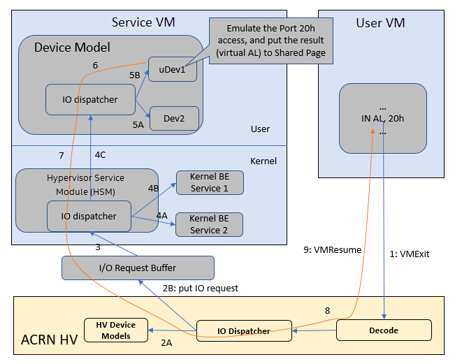
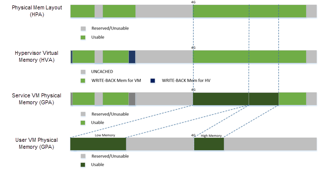
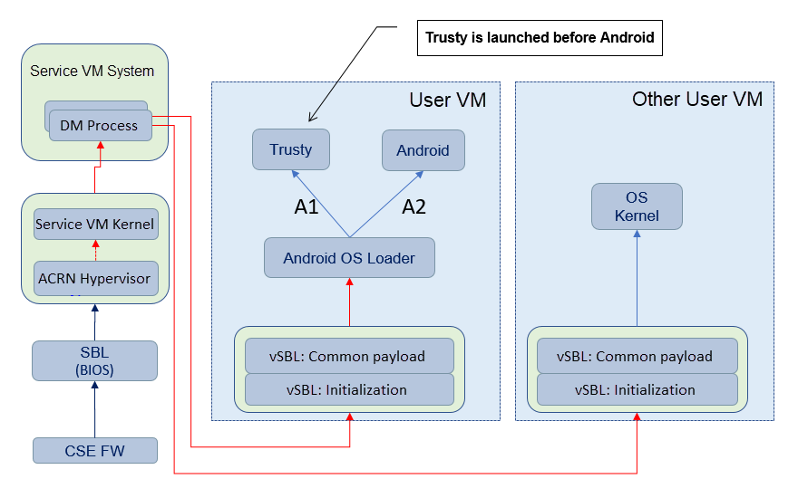

.. _hld-overview:

ACRN high-level design overview
###############################

ACRN is an open source reference hypervisor (HV) running on top of Intel
Apollo Lake platforms for Software Defined Cockpit (SDC) or In-Vehicle
Experience (IVE) solutions. ACRN provides embedded hypervisor vendors
with a reference I/O mediation solution with a permissive license and
provides auto makers a reference software stack for in-vehicle use.

ACRN Supported Use Cases
************************

Software Defined Cockpit
========================

The SDC system consists of multiple systems: the instrument cluster (IC)
system, the In-vehicle Infotainment (IVI) system, and one or more rear
seat entertainment (RSE) systems.  Each system runs as a VM for better
isolation.

The Instrument Control (IC) system manages graphics display of

- driving speed, engine RPM, temperature, fuel level, odometer, trip mile, etc.
- alerts of low fuel or tire pressure
- rear-view camera(RVC) and surround-camera view for driving assistance.

In-Vehicle Infotainment
=======================

A typical In-Vehicle Infotainment (IVI) system would support:

- Navigation systems;
- Radios, audio and video playback;
- Mobile devices connection for  calls, music and applications via voice
  recognition and/or gesture Recognition / Touch.
- Rear-seat RSE services such as:

  - entertainment system
  - virtual office
  - connection to IVI front system and mobile devices (cloud
    connectivity)

ACRN supports guest OSes of Clear Linux OS and Android. OEMs can use the ACRN
hypervisor and Linux or Android guest OS reference code to implement their own
VMs for a customized IC/IVI/RSE.

Hardware Requirements
*********************

Mandatory IA CPU features are support for:

- Long mode
- MTRR
- TSC deadline timer
- NX, SMAP, SMEP
- Intel-VT including VMX, EPT, VT-d, APICv, VPID, invept and invvpid

Recommended Memory: 4GB, 8GB preferred.

ACRN Architecture
*****************

ACRN is a type-I hypervisor, running on top of bare metal. It supports
Intel Apollo Lake platforms and can be easily extended to support future
platforms. ACRN implements a hybrid VMM architecture, using a privileged
service VM running the service OS (SOS) to manage I/O devices and
provide I/O mediation. Multiple user VMs can be supported, running Clear
Linux OS or Android OS as the user OS (UOS).

Instrument cluster applications are critical in the Software Defined
Cockpit (SDC) use case, and may require functional safety certification
in the future. Running the IC system in a separate VM can isolate it from
other VMs and their applications, thereby reducing the attack surface
and minimizing potential interference. However, running the IC system in
a separate VM introduces additional latency for the IC applications.
Some country regulations requires an IVE system to show a rear-view
camera (RVC) within 2 seconds, which is difficult to achieve if a
separate instrument cluster VM is started after the SOS is booted.

:numref:`overview-arch` shows the architecture of ACRN together with IC VM and
service VM. As shown, SOS owns most of platform devices and provides I/O
mediation to VMs. Some of the PCIe devices function as pass-through mode
to UOSs according to VM configuration. In addition, the SOS could run
the IC applications and HV helper applications such as the Device Model,
VM manager, etc. where the VM manager is responsible for VM
start/stop/pause, virtual CPU pause/resume,etc.

   ACRN Architecture

.. _intro-io-emulation:

Device Emulation
================

ACRN adopts various approaches for emulating devices for UOS:

-  **Emulated device**: A virtual device using this approach is emulated in
   the SOS by trapping accesses to the device in UOS. Two sub-categories
   exist for emulated device:

   -  fully emulated, allowing native drivers to be used
      unmodified in the UOS, and
   -  para-virtualized, requiring front-end drivers in
      the UOS to function.

-  **Pass-through device**: A device passed through to UOS is fully
   accessible to UOS without interception. However, interrupts
   are first handled by the hypervisor before
   being injected to the UOS.

-  **Mediated pass-through device**: A mediated pass-through device is a
   hybrid of the previous two approaches. Performance-critical
   resources (mostly data-plane related) are passed-through to UOSes and
   others (mostly control-plane related) are emulated.

I/O Emulation
-------------

The device model (DM) is a place for managing UOS devices: it allocates
memory for UOSes, configures and initializes the devices shared by the
guest, loads the virtual BIOS and initializes the virtual CPU state, and
invokes hypervisor service to execute the guest instructions.

The following diagram illustrates the control flow of emulating a port
I/O read from UOS.

   I/O (PIO/MMIO) Emulation Path

:numref:`overview-io-emu-path` shows an example I/O emulation flow path.
When a guest executes an I/O instruction (port I/O or MMIO), an VM exit
happens. HV takes control, and executes the request based on the VM exit
reason ``VMX_EXIT_REASON_IO_INSTRUCTION`` for port I/O access, for
example.  HV will then fetch the additional guest instructions, if any,
and processes the port I/O instructions at a pre-configured port address
(in ``AL, 20h`` for example), and place the decoded information such as
the port I/O address, size of access, read/write, and target register
into the I/O request in the I/O request buffer (shown in
:numref:`overview-io-emu-path`) and notify/interrupt SOS to process.

The virtio and HV service module (VHM) in SOS intercepts HV interrupts,
and accesses the I/O request buffer for the port I/O instructions. It will
then check if there is any kernel device claiming ownership of the
I/O port. The owning device, if any, executes the requested APIs from a
VM. Otherwise, the VHM module leaves the I/O request in the request buffer
and wakes up the DM thread for processing.

DM follows the same mechanism as VHM. The I/O processing thread of the
DM queries the I/O request buffer to get the PIO instruction details and
checks to see if any (guest) device emulation modules claim ownership of
the I/O port. If yes, the owning module is invoked to execute requested
APIs.

When the DM completes the emulation (port IO 20h access in this example)
of a device such as uDev1, uDev1 will put the result into the request
buffer (register AL). The DM will then return the control to HV
indicating completion of an IO instruction emulation, typically thru
VHM/hypercall. The HV then stores the result to the guest register
context, advances the guest IP to indicate the completion of instruction
execution, and resumes the guest.

MMIO access path is similar except for a VM exit reason of *EPT
violation*.

DMA Emulation
-------------

Currently the only fully virtualized devices to UOS are USB xHCI, UART,
and Automotive I/O controller. None of these require emulating
DMA transactions. ACRN does not currently support virtual DMA.

Hypervisor
**********

ACRN takes advantage of Intel Virtualization Technology (Intel VT).
The ACRN HV runs in Virtual Machine Extension (VMX) root operation,
host mode, or VMM mode, while the SOS and UOS guests run
in VMX non-root operation, or guest mode. (We'll use "root mode"
and "non-root mode" for simplicity).

The VMM mode has 4 rings. ACRN
runs HV in ring 0 privilege only, and leaves ring 1-3 unused. A guest
running in non-root mode, has its own full rings (ring 0 to 3). The
guest kernel runs in ring 0 in guest mode, while guest user land
applications run in ring 3 of guest mode (ring 1 and 2 are usually not
used by commercial OS).

   Architecture of ACRN hypervisor

:numref:`overview-arch-hv` shows an overview of the ACRN hypervisor architecture.

-  A platform initialization layer provides an entry
   point, checking hardware capabilities and initializing the
   processors, memory, and interrupts. Relocation of the hypervisor
   image, derivation of encryption seeds are also supported by this
   component.

-  A hardware management and utilities layer provides services for
   managing physical resources at runtime. Examples include handling
   physical interrupts and low power state changes.

-  A layer siting on top of hardware management enables virtual
   CPUs (or vCPUs), leveraging Intel VT. A vCPU loop runs a vCPU in
   non-root mode and handles VM exit events triggered by the vCPU.
   This layer handles CPU and memory related VM
   exits and provides a way to inject exceptions or interrupts to a
   vCPU.

-  On top of vCPUs are three components for device emulation: one for
   emulation inside the hypervisor, another for communicating with
   SOS for mediation, and the third for managing pass-through
   devices.

-  The highest layer is a VM management module providing
   VM lifecycle and power operations.

-  A library component provides basic utilities for the rest of the
   hypervisor, including encryption algorithms, mutual-exclusion
   primitives, etc.

There are three ways that the hypervisor interacts with SOS:
VM exits (including hypercalls), upcalls, and through the I/O request buffer.
Interaction between the hypervisor and UOS is more restricted, including
only VM exits and hypercalls related to trusty.

SOS
***

SOS (Service OS) is an important guest OS in the ACRN architecture. It
runs in non-root mode, and contains many critical components including VM
manager, device model (DM), ACRN services, kernel mediation, and virtio
and hypercall module (VHM). DM manages UOS (User OS) and
provide device emulation for it. The SOS also provides services
for system power lifecycle management through ACRN service and VM manager,
and services for system debugging through ACRN log/trace tools.

DM
==

DM (Device Model) is an user level QEMU-like application in SOS
responsible for creating an UOS VM and then performing devices emulation
based on command line configurations.

Based on a VHM kernel module, DM interacts with VM manager to create UOS
VM. It then emulates devices through full virtualization in DM user
level, or para-virtualized based on kernel mediator (such as virtio,
GVT), or pass-through based on kernel VHM APIs.

Refer to :ref:`hld-devicemodel` for more details.

VM Manager
==========

VM Manager is an user level service in SOS handling UOS VM creation and
VM state management, according to the application requirements or system
power operations.

VM Manager creates UOS VM based on DM application, and does UOS VM state
management by interacting with lifecycle service in ACRN service.

Please refer to VM management chapter for more details.

ACRN Service
============

ACRN service provides
system lifecycle management based on IOC polling. It communicates with
VM manager to handle UOS VM state, such as S3 and power-off.

VHM
===

VHM (virtio & hypercall module) kernel module is an SOS kernel driver
supporting UOS VM management and device emulation. Device Model follows
the standard Linux char device API (ioctl) to access VHM
functionalities. VHM communicates with the ACRN hypervisor through
hypercall or upcall interrupts.

Please refer to VHM chapter for more details.

Kernel Mediators
================

Kernel mediators are kernel modules providing a para-virtualization method
for the UOS VMs, for example, an i915 gvt driver.

Log/Trace Tools
===============

ACRN Log/Trace tools are user level applications used to
capture ACRN hypervisor log and trace data. The VHM kernel module provides a
middle layer to support these tools.

Refer to :ref:`hld-trace-log` for more details.

UOS
***

Currently, ACRN can boot Linux and Android guest OSes. For Android guest OS, ACRN
provides a VM environment with two worlds: normal world and trusty
world. The Android OS runs in the the normal world. The trusty OS and
security sensitive applications run in the trusty world. The trusty
world can see the memory of normal world, but normal world cannot see
trusty world.

Guest Physical Memory Layout - UOS E820
=======================================

DM will create E820 table for a User OS VM based on these simple rules:

- If requested VM memory size < low memory limitation (currently 2 GB,
  defined in DM), then low memory range = [0, requested VM memory
  size]

- If requested VM memory size > low memory limitation, then low
  memory range = [0, 2G], and high memory range =
  [4G, 4G + requested VM memory size - 2G]

   UOS Physical Memory Layout

UOS Memory Allocation
=====================

DM does UOS memory allocation based on hugetlb mechanism by default.
The real memory mapping may be scattered in SOS physical
memory space, as shown in :numref:`overview-mem-layout`:

   UOS Physical Memory Layout Based on Hugetlb

User OS's memory is allocated by Service OS DM application, it may come
from different huge pages in Service OS as shown in
:numref:`overview-mem-layout`.

As Service OS has full knowledge of these huge pages size,
GPA\ :sup:`SOS` and GPA\ :sup:`UOS`, it works with the hypervisor
to complete UOS's host-to-guest mapping using this pseudo code:

.. code-block: none

   for x in allocated huge pages do
      x.hpa = gpa2hpa_for_sos(x.sos_gpa)
      host2guest_map_for_uos(x.hpa, x.uos_gpa, x.size)
   end

Virtual Slim bootloader
=======================

Virtual Slim bootloader (vSBL) is the virtual bootloader that supports
booting the UOS on the ACRN hypervisor platform. The vSBL design is
derived from Slim Bootloader. It follows a staged design approach that
provides hardware initialization and payload launching that provides the
boot logic. As shown in :numref:`overview-sbl`, the virtual SBL has an
initialization unit to initialize virtual hardware, and a payload unit
to boot Linux or Android guest OS.

   vSBL System Context Diagram

The vSBL image is released as a part of the Service OS (SOS) root
filesystem (rootfs).  The vSBL is copied to UOS memory by the VM manager
in the SOS while creating the UOS virtual BSP of UOS. The SOS passes the
start of vSBL and related information to HV. HV sets guest RIP of UOS
virtual BSP as the start of vSBL and related guest registers, and
launches the UOS virtual BSP. The vSBL starts running in the virtual
real mode within the UOS. Conceptually, vSBL is part of the UOS runtime.

In the current design, the vSBL supports booting Android guest OS or
Linux guest OS using the same vSBL image.

For an Android VM, the vSBL will load and verify trusty OS first, and
trusty OS will then load and verify Android OS according to the Android
OS verification mechanism.

Freedom From Interference
*************************

The hypervisor is critical for preventing inter-VM interference, using
the following mechanisms:

-  Each physical CPU is dedicated to one vCPU.

   Sharing a physical CPU among multiple vCPUs gives rise to multiple
   sources of interference such as the vCPU of one VM flushing the
   L1 & L2 cache for another, or tremendous interrupts for one VM
   delaying the execution of another. It also requires vCPU
   scheduling in the hypervisor to consider more complexities such as
   scheduling latency and vCPU priority, exposing more opportunities
   for one VM to interfere another.

   To prevent such interference, ACRN hypervisor adopts static
   core partitioning by dedicating each physical CPU to one vCPU. The
   physical CPU loops in idle when the vCPU is paused by I/O
   emulation. This makes the vCPU scheduling deterministic and physical
   resource sharing is minimized.

-  Hardware mechanisms including EPT, VT-d, SMAP and SMEP are leveraged
   to prevent unintended memory accesses.

   Memory corruption can be a common failure mode. ACRN hypervisor properly
   sets up the memory-related hardware mechanisms to ensure that:

   1. SOS cannot access the memory of the hypervisor, unless explicitly
      allowed,

   2. UOS cannot access the memory of SOS and the hypervisor, and

   3. The hypervisor does not unintendedly access the memory of SOS or UOS.

-  Destination of external interrupts are set to be the physical core
   where the VM that handles them is running.

   External interrupts are always handled by the hypervisor in ACRN.
   Excessive interrupts to one VM (say VM A) could slow down another
   VM (VM B) if they are handled by the physical core running VM B
   instead of VM A. Two mechanisms are designed to mitigate such
   interference.

   1. The destination of an external interrupt is set to the physical core
      that runs the vCPU where virtual interrupts will be injected.

   2. The hypervisor maintains statistics on the total number of received
      interrupts to SOS via a hypercall, and has a delay mechanism to
      temporarily block certain virtual interrupts from being injected.
      This allows SOS to detect the occurrence of an interrupt storm and
      control the interrupt injection rate when necessary.

-  Mitigation of DMA storm.

   (To be documented later.)

Boot Flow
*********

   ACRN Boot Flow

Power Management
****************

CPU P-state & C-state
=====================

In ACRN, CPU P-state and C-state (Px/Cx) are controlled by the guest OS.
The corresponding governors are managed in SOS/UOS for best power
efficiency and simplicity.

Guest should be able to process the ACPI P/C-state request from OSPM.
The needed ACPI objects for P/C-state management should be ready in
ACPI table.

Hypervisor can restrict guest's P/C-state request (per customer
requirement). MSR accesses of P-state requests could be intercepted by
the hypervisor and forwarded to the host directly if the requested
P-state is valid. Guest MWAIT/Port IO accesses of C-state control could
be passed through to host with no hypervisor interception to minimize
performance impacts.

This diagram shows CPU P/C-state management blocks:

   CPU P/C-state management block diagram

System power state
==================

ACRN supports ACPI standard defined power state: S3 and S5 in system
level. For each guest, ACRN assume guest implements OSPM and controls its
own power state accordingly. ACRN doesn't involve guest OSPM. Instead,
it traps the power state transition request from guest and emulates it.

   ACRN Power Management Diagram Block

:numref:`overview-pm-block` shows the basic diagram block for ACRN PM.
The OSPM in each guest manages the guest power state transition. The
Device Model running in SOS traps and emulates the power state
transition of UOS (Linux VM or Android VM in
:numref:`overview-pm-block`). VM Manager knows all UOS power states and
notifies OSPM of SOS (Service OS in :numref:`overview-pm-block`) once
active UOS is in the required power state.

Then OSPM of the SOS starts the power state transition of SOS which is
trapped to "Sx Agency" in ACRN, and it will start the power state
transition.

Some details about the ACPI table for UOS and SOS:

-  The ACPI table in UOS is emulated by Device Model. The Device Model
   knows which register the UOS writes to trigger power state
   transitions. Device Model must register an I/O handler for it.

-  The ACPI table in SOS is passthru. There is no ACPI parser
   in ACRN HV. The power management related ACPI table is
   generated offline and hardcoded in ACRN HV.
