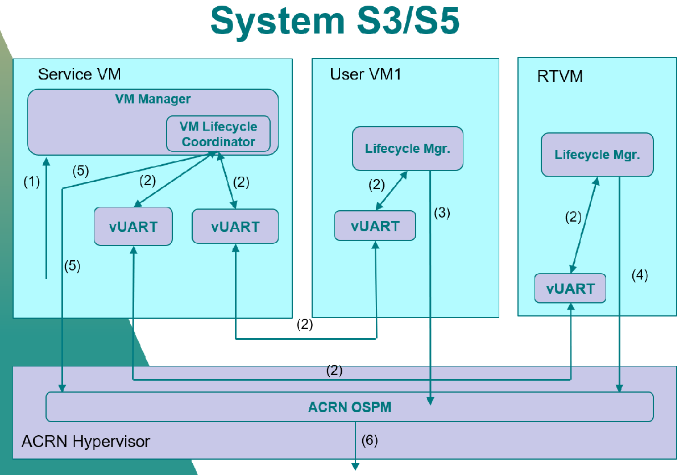

.. _hld-power-management:

Power Management High-Level Design
##################################

P-State/C-State Management
**************************

ACPI Px/Cx Data
===============

CPU P-state/C-state are controlled by the guest OS. The ACPI
P/C-state driver relies on some P/C-state-related ACPI data in the guest
ACPI table.

The Service VM can run the ACPI driver with no problems because it can access the native ACPI table. For the User VM though, we need to prepare the corresponding ACPI data
for the Device Model to build a virtual ACPI table.

The Px/Cx data includes four
ACPI objects: _PCT, _PPC, and _PSS for P-state management, and _CST for
C-state management. All these ACPI data must be consistent with the
native data because the control method is a kind of passthrough.

These ACPI objects data are parsed by an offline tool and hard-coded in a
Hypervisor module named CPU state table:

.. code-block:: c

   struct cpu_pstate_data {
       uint64_t core_frequency;        /* megahertz */
       uint64_t power;                 /* milliWatts */
       uint64_t transition_latency;    /* microseconds */
       uint64_t bus_master_latency;    /* microseconds */
       uint64_t control;               /* control value */
       uint64_t status;                /* success indicator */
   } __attribute__((aligned(8)));

   struct acrn_acpi_generic_address {
       uint8_t     space_id;
       uint8_t     bit_width;
       uint8_t     bit_offset;
       uint8_t     access_size;
       uint64_t    address;
   } __attribute__((aligned(8)));

   struct cpu_cstate_data {
       struct acrn_acpi_generic_address cx_reg;
       uint8_t     type;
       uint32_t    latency;
       uint64_t    power;
   } __attribute__((aligned(8)));

With these Px/Cx data, the Hypervisor is able to intercept the guest's
P/C-state requests with desired restrictions.

Virtual ACPI Table Build Flow
=============================

:numref:`vACPItable` shows how to build the virtual ACPI table with the
Px/Cx data for User VM P/C-state management:

.. figure:: images/hld-pm-image28.png
   :align: center
   :name: vACPItable

   System block for building vACPI table with Px/Cx data

Some ioctl APIs are defined for the Device model to query Px/Cx data from
the Service VM HSM. The Hypervisor needs to provide hypercall APIs to transit
Px/Cx data from the CPU state table to the Service VM HSM.

The build flow is:

1) Use an offline tool (e.g. **iasl**) to parse the Px/Cx data and hard-code to
   a CPU state table in the Hypervisor. The Hypervisor loads the data after
   the system boots.
2) Before User VM launching, the Device mode queries the Px/Cx data from the Service
   VM HSM via ioctl interface.
3) HSM transmits the query request to the Hypervisor by hypercall.
4) The Hypervisor returns the Px/Cx data.
5) The Device model builds the virtual ACPI table with these Px/Cx data

Intercept Policy
================

The Hypervisor should be able to restrict guest's
P/C-state request with a user-customized policy.

Hypervisor should intercept guest P-state request and validate whether
it is a valid P-state. Any invalid P-state (e.g. doesn't exist in CPU state
table) should be rejected.

It is better not to intercept C-state request because the trap would
impact both power and performance.

.. note:: For P-state control, you should pay attention to SoC core
   voltage domain design when doing P-state measurement. The highest
   P-state would win if different P-state requests on the cores shared
   same voltage domain. In this case, APERF/MPERF must be used to see
   what P-state was granted on that core.

S3/S5
*****
ACRN is designed to support the system level S3/S5 with following
assumptions:

1) Guest has complete S3/S5 power state management.
2) Guest follows the ACPI standard to implement S3/S5.
3) Guest is responsible for saving its contents before entering S3/S5.
4) Highest severity guest's power state is promoted to system power state.
5) Guest has lifecycle manager running to handle power state transaction
   requirement and initialize guest power state transaction.
6) S3 is only available on configurations that have no DM launched RTVM.
7) S3 is only supported at platform level - not VM level.

ACRN has a common implementation for notification between lifecycle manager
in different guest. Which is vUART based cross-VM notification. But user
could customize it according to their hardware/software requirements.

:numref:`systempmdiag` shows the basic system level S3/S5 diagram.

.. figure:: images/hld-pm-image62.png
   :align: center
   :name: systempmdiag

   ACRN System S3/S5 diagram

System Low Power State Entry Process
====================================

Each time, when lifecycle manager of User VM starts power state transition,
it will finally write the ACPI register per ACPI spec requirement. With
help of ACRN I/O emulation framework, the User VM ACPI register writing
will be dispatched to Device Model and Device Model will emulate the User VM
power state (pause User VM for S3 and power off User VM for S5)

The VM Manager monitors all User VMs. If all active User VMs are in required
power state, VM Manager will notify lifecycle manager of Service VM to start
Service VM power state transition. lifecycle manager of Service VM follows
a very similar process as User VM for power state transition. The difference
is Service VM ACPI register writing is trapped to ACRN HV. And ACRN HV will
emulate Service VM power state (pause Service VM for S3 and no special
action for S5)

Once Service VM low power state is done, ACRN HV will go through its own low
power state enter path.

The whole system is finally put into low power state.

:numref:`pmworkflow` shows the flow of low power S5 enter process
with typical ISD configuration(S3 follows very similar process)

   ACRN system S5 entry workflow

For system power state entry:

1. Service VM received S5 request.
2. Lifecycle manager in Service VM notifies User VM1 and RTVM through
   vUART for S5 request.
3. Guest lifecycle manager initializes S5 action and guest enters S5.
4. RTOS cleanup RT task, send response of S5 request back to Service
   VM and RTVM enters S5.
5. After get response from RTVM and all User VM are shutdown, Service VM
   enter S5.
6. OSPM in ACRN hypervisor checks all guests are in S5 state and shuts down
   whole system.

System Low Power State Exit Process
===================================

The low power state exit process is in reverse order. The ACRN
hypervisor is awakened first. It will go through its own low power
state exit path. Then, ACRN hypervisor will resume the Service VM to let
Service VM go through Service VM low power state exit path. After that,
the DM is resumed and let User VM go through User VM low power state exit
path. The system is resumed to running state after at least one User VM
is resumed to running state.

According to ACPI standard, S3 is mapped to suspend to RAM and S5 is
mapped to shutdown. So the S5 process is a little different:

- User VM enters S5 -> User VM powers off
- System enters S5 -> System powers off
- System resumes From S5 -> System fresh start
- User VM resumes from S5 -> User VM fresh startup
