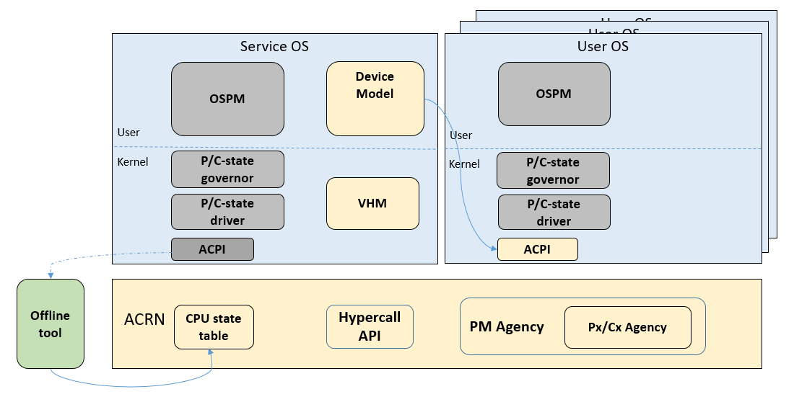

.. _hld-power-management:

Power Management high-level design
##################################

P-state/C-state management
**************************

ACPI Px/Cx data
===============

CPU P-state/C-state are controlled by the guest OS. The ACPI
P/C-state driver relies on some P/C-state-related ACPI data in the guest
ACPI table.

SOS could run ACPI driver with no problem because it can access native
the ACPI table. For UOS though, we need to prepare the corresponding ACPI data
for Device Model to build virtual ACPI table.

The Px/Cx data includes four
ACPI objects: _PCT, _PPC, and _PSS for P-state management, and _CST for
C-state management. All these ACPI data must  be consistent with the
native data because the control method is a kind of pass through.

These ACPI objects data are parsed by an offline tool and hard-coded in a
Hypervisor module named CPU state table:

.. code-block:: c

   struct cpu_px_data {
       uint64_t core_frequency;        /* megahertz */
       uint64_t power;                 /* milliWatts */
       uint64_t transition_latency;    /* microseconds */
       uint64_t bus_master_latency;    /* microseconds */
       uint64_t control;               /* control value */
       uint64_t status;                /* success indicator */
   } __attribute__((aligned(8)));

   struct acpi_generic_address {
       uint8_t     space_id;
       uint8_t     bit_width;
       uint8_t     bit_offset;
       uint8_t     access_size;
       uint64_t    address;
   } __attribute__((aligned(8)));

   struct cpu_cx_data {
       struct acpi_generic_address cx_reg;
       uint8_t     type;
       uint32_t    latency;
       uint64_t    power;
   } __attribute__((aligned(8)));

With these Px/Cx data, the Hypervisor is able to intercept guest's
P/C-state requests with desired restrictions.

Virtual ACPI table build flow
=============================

:numref:`vACPItable` shows how to build virtual ACPI table with
Px/Cx data for UOS P/C-state management:

   System block for building vACPI table with Px/Cx data

Some ioctl APIs are defined for Device model to query Px/Cx data from
SOS VHM. The Hypervisor needs to provide hypercall APIs to transit Px/Cx
data from CPU state table to SOS VHM.

The build flow is:

1) Use offline tool (e.g. **iasl**) to parse the Px/Cx data and hard-code to
   CPU state table in Hypervisor. Hypervisor loads the data after
   system boot up.
2) Before UOS launching, Device mode queries the Px/Cx data from SOS VHM
   via ioctl interface.
3) VHM transmits the query request to Hypervisor by hypercall.
4) Hypervisor returns the Px/Cx data.
5) Device model builds the virtual ACPI table with these Px/Cx data

Intercept Policy
================

Hypervisor should be able to restrict guest's
P/C-state request, with a user-customized poligy.

Hypervisor should intercept guest P-state request and validate whether
it is a valid P-state. Any invalid P-state (e.g. doesn't exist in CPU state
table) should be rejected.

It is better not to intercept C-state request because the trap would
impact both power and performance.

.. note:: For P-state control you should pay attention to SoC core
   voltage domain design when doing P-state measurement. The highest
   P-state would win if different P-state requests on the cores shared
   same voltage domain. In this case APERF/MPERF must be used to see
   what P-state was granted on that core.

S3/S5
*****

ACRN assumes guest has complete S3/S5 power state management and follows
the ACPI standard exactly. System S3/S5 needs to follow well-defined
enter/exit paths and cooperate among different components.

System low power state enter process
====================================

Each time, when OSPM of UOS starts power state transition, it will
finally write the ACPI register per ACPI spec requirement.
With help of ACRN I/O emulation framework, the UOS ACPI
register writing will be dispatched to Device Model and Device Model
will emulate the UOS power state (pause UOS VM for S3 and power off UOS
VM for S5)

The VM Manager monitors all UOS. If all active UOSes are in required power
state, VM Manager will notify OSPM of SOS to start SOS power state
transition. OSPM of SOS follows a very similar process as UOS for power
state transition. The difference is SOS ACPI register writing is trapped
to ACRN HV. And ACRN HV will emulate SOS power state (pause SOS VM for
S3 and no special action for S5)

Once SOS low power state is done, ACRN HV will go through its own low
power state enter path.

The whole system is finally put into low power state.

System low power state exit process
===================================

The low power state exit process is in reverse order. The ACRN
hypervisor is woken up at first. It will go through its own low power
state exit path. Then ACRN hypervisor will resume the SOS to let SOS go
through SOS low power state exit path. After that, the DM is resumed and
let UOS go through UOS low power state exit path. The system is resumed
to running state after at least one UOS is resumed to running state.

:numref:`pmworkflow` shows the flow of low power S3 enter/exit process (S5 follows
very similar process)

.. figure:: images/hld-pm-image62.png
   :align: center
   :name: pmworkflow

   ACRN system power management workflow

For system power state entry:

1. UOS OSPM start UOS S3 entry
2. The UOS S3 entering request is trapped ACPI PM Device of DM
3. DM pauses UOS VM to emulate UOS S3 and notifies VM Manager that the UOS
   dedicated to it is in S3
4. If all UOSes are in S3, VM Manager will notify OSPM of SOS
5. SOS OSPM starts SOS S3 enter
6. SOS S3 entering request is trapped to Sx Agency in ACRN HV
7. ACRN HV pauses SOS VM to emulate SOS S3 and starts ACRN HV S3 entry.

For system power state exit:

1. When system is resumed from S3, native bootloader will jump to wake
   up vector of HV
2. HV resumes S3 and jumps to wake up vector to emulate SOS resume from S3
3. OSPM of SOS is running
4. OSPM of SOS notifies VM Manager that it's ready to wake up UOS
5. VM Manager will notify DM to resume the UOS
6. DM resets the UOS VM to emulate UOS resume from S3

According to ACPI standard, S3 is mapped to suspend to RAM and S5 is
mapped to shutdown. So the S5 process is a little different:

- UOS enters S3 -> UOS powers off
- System enters S3 -> System powers off
- System resumes From S3 -> System fresh start
- UOS resumes from S3 -> UOS fresh startup
