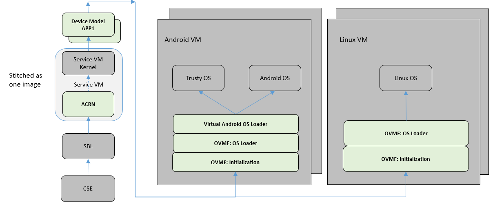
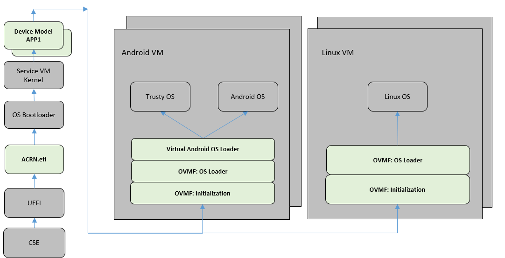
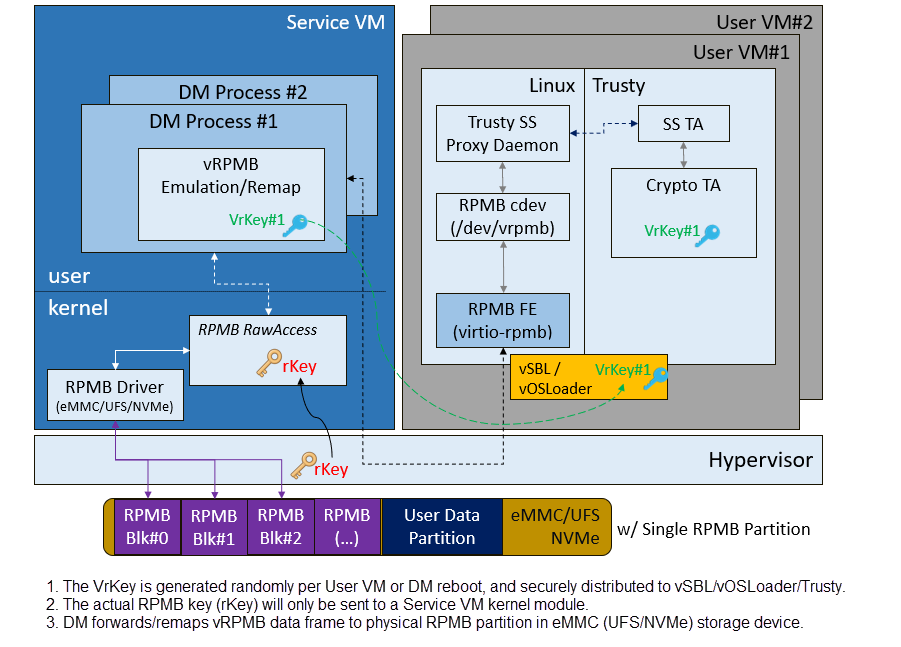

.. _hld-security:

Security High-Level Design
##########################

.. primary author: Bing Zhu
   contributor: Yadong Qi

Introduction
************

This document describes the security high-level design in ACRN,
including information about:

-  Secure booting in ACRN
-  Hypervisor security enhancement, including memory management, secure
   hypervisor interfaces, etc.
-  Platform security features virtualization, such as the virtualization
   of TPM (vTPM) and SGX (vSGX)

This document is for developers, validation teams, architects, and
maintainers of ACRN.

Readers should be familiar with the basic concepts of system
virtualization and the ACRN hypervisor implementation.

Background
**********

The ACRN hypervisor is a type-1 hypervisor, built for running multiple
guest OS instances, typical of an automotive infotainment system, on a
single Apollo Lake-I SoC platform. See :numref:`security-ACRN`.

   ACRN Hypervisor Overview

This document focuses only on the security part of the automotive
system built on top of the ACRN hypervisor. This includes how to build a
secure system as well as how to virtualize the security features that
the system can provide.

Usages
======

As shown in :numref:`security-vehicle`, the ACRN hypervisor can be
used to build a Software Defined Cockpit (SDC) or an In-Vehicle Experience
(IVE) Solution that consolidates multiple VMs together on a single Intel
SoC in-vehicle platform.

.. figure:: images/security-image13.png
   :width: 900px
   :align: center
   :name: security-vehicle

   SDC and IVE System In-Vehicle

In this system, the ACRN hypervisor is running at the most privileged
level, VMX root mode, in virtualization technology terms. The hypervisor
has full control of platform resources, including the processor, memory,
devices, and in some cases, secrets of the guest OS. The ACRN
hypervisor supports multiple guest VMs running in parallel in the less
privileged level called VMX non-root mode.

The Service VM is a special VM. While it runs as a guest VM in
VMX non-root mode, it behaves as a privileged guest VM controlling the
behavior of other guest VMs. The Service VM can create a guest VM, suspend and
resume a guest VM, and provide device mediation services (Device
Models) for other guest VMs it creates.

In an SDC system, the Service VM also contains safety-critical IC (Instrument
Cluster) applications. ACRN is designed to make sure the IC applications
are well isolated from other applications in the Service VM such as Device
Models (Mediators). A crash in other guest VM systems must not impact
the IC applications, and must not cause any DoS (Deny of Service) attacks.
Functional safety is out of scope of this document.

In :numref:`security-ACRN`, the other guest VMs are referred to as User VM.
These other VMs provide infotainment services (such as
navigation, music, and FM/AM radio) for the front seat or rear seat.

The User VM systems can be based on Linux (LaaG, Linux as a Guest) or
Android (AaaG, Android as a Guest) depending on the customer's needs
and board configuration. It can also be a mix of Linux and Android
systems.

In each User VM, a "side-car" OS system can accompany the normal OS system. We
call these two OS systems "secure world" and
"non-secure world", and they are isolated from each other by the
hypervisor. The secure world has a higher "privilege level" than the non-secure
world; for example, the secure world can access the non-secure world's
physical memory but not vice versa. This document discusses how this
security works and why it is required.

Careful consideration should be made when evaluating using the Service
VM as the Trusted Computing Base (TCB). The Service VM may be a
fairly large system running many lines of code; thus, treating it as a
TCB doesn't make sense from a security perspective. To achieve the
design purpose of "defense in depth", system security designers
should always ask themselves, "What if the Service VM is compromised?" and
"What's the impact if this happens?" This HLD document discusses how to
security-harden the Service VM system and mitigate attacks on the Service VM.

ACRN High-Level Security Architecture
*************************************

This chapter provides a high-level architecture design overview of ACRN
security features and their development.

Secure / Verified Boot
======================

The security of the entire system built on top of the ACRN hypervisor
depends on the security from platform boot to User VM launching. Each layer
or module must verify the security of the next layer or module before
transferring control to it. Verification can be checking a
cryptographic signature on the executable of the next step before it is
launched.

Note that measured boot (as described well in this `boot security
technologies document
<https://firmwaresecurity.com/2015/07/29/survey-of-boot-security-technologies/>`_)
is not supported for ACRN and its guest VMs.

Boot Flow
---------
ACRN supports two verified boot sequences.

1) Verified Boot Sequence With SBL
~~~~~~~~~~~~~~~~~~~~~~~~~~~~~~~~~~~~~~
As shown in :numref:`security-bootflow-sbl`, the Converged Security Engine
Firmware (CSE FW) behaves as the root of trust in this platform boot
flow. It authenticates and starts the BIOS (SBL), whereupon the SBL is
responsible for authenticating and verifying the ACRN hypervisor image.
The Service VM kernel is built together with the ACRN hypervisor as
one image bundle, so this whole image signature is verified by SBL
before launching.

   ACRN Boot Flow with SBL

2) Verified Boot Sequence With UEFI
~~~~~~~~~~~~~~~~~~~~~~~~~~~~~~~~~~~
As shown in :numref:`security-bootflow-uefi`, in this boot sequence, UEFI
authenticates and starts the ACRN hypervisor. Then the hypervisor returns
to the UEFI environment to authenticate and load the Service VM kernel
bootloader.

   ACRN Boot Flow with UEFI

As long as the Service VM kernel starts, the Service VM kernel will load all its
subsystems subsequently. In order to launch a User VM, a DM process is
started to launch the virtual BIOS (OVMF). Eventually, the OVMF is
responsible for verifying and launching the User VM kernel (or the
Android OS loader for an Android User VM).

Secure Boot
-----------

In the entire boot flow, the chain of trust must be unbroken. This is
achieved by the secure boot mechanism. Each module in the boot flow must
authenticate and verify the next module by using a cryptographic digital
signature algorithm.

The well-known image signing algorithm uses cryptographic hashing and
public key cryptography with PKCS1.5 padding.

The 2018 minimal requirements for cryptographic strength are:

#. SHA256 for image cryptographic hashing.
#. RSA2048 for cryptographic digital signature signing and verification.

We strongly recommend that SHA512 and RSA3072+ be used for a product shipped
in 2018, especially for a product that has a long production life such as
an automotive vehicle.

The CSE FW image is signed with an Intel RSA private key. All other
images should be signed by the responsible OEM. Our customers and
partners are responsible for image signing, ensuring the key strength
meets security requirements, and storing the secret RSA private key
securely.

Guest Secure Boot With OVMF
---------------------------
Open Virtual Machine Firmware (OVMF) is an EDK II based project to enable UEFI
support for virtual machines in a virtualized environment. In ACRN, OVMF is
deployed to launch a User VM, as if the User VM is booted on a machine with
UEFI firmware.

UEFI Secure Boot defines how a platform's firmware can authenticate a digitally
signed UEFI image, such as an operating system loader or a UEFI driver stored
in an option ROM. This provides the capability to ensure that those UEFI images
are only loaded in an owner-authorized fashion and provides a common means to
ensure the platform's security and integrity over systems running UEFI-based
firmware.
UEFI Secure Boot is already supported by OVMF.

:numref:`security-secure-boot-uefi` shows a Secure Boot overview in UEFI.

   UEFI Secure Boot Overview

UEFI Secure Boot is controlled by a set of UEFI Authenticated Variables that specify
the UEFI Secure Boot Policy; the platform manufacturer or the platform owner enrolls the
policy objects, which include the n-tuple of keys {PK, KEK, db,dbx} as step 1.
During each successive boot, the UEFI secure boot implementation will assess the
policy in order to verify the signed images that are discovered in a host-bus adapter
or on a disk. If the images pass the policy, they are invoked.

UEFI Secure Boot implementations use these keys:

#. Platform Key (PK) is the top-level key in Secure Boot; UEFI supports a single PK,
   which is generally provided by the manufacturer.
#. Key Exchange Key (KEK) is used to sign Signature and Forbidden Signature Database updates.
#. Signature Database (db) contains keys and/or hashes of allowed EFI binaries.

And keys and certificates are in multiple formats:

#. ``.key``  PEM format private keys for EFI binary and EFI signature list signing.
#. ``.crt``  PEM format certificates for sbsign.
#. ``.cer``  DER format certificates for firmware.

In ACRN, User VM Secure Boot can be enabled as follows:

#. Generate keys (PK/KEK/DB) with a key generation tool such as Ubuntu
   KeyGeneration. ``PK.der``, ``KEK.der``, and ``db.der`` will be enrolled in UEFI
   BIOS. ``db.key`` and ``db.crt`` will be used to sign the User VM
   bootloader/kernel.
#. Create a virtual disk to hold ``PK.der``, ``KEK.der``, and ``db.der``, then launch
   the User VM with this virtual disk.
#. Start the OVMF in writeback mode to ensure the keys are persistently stored
   in the OVMF image.
#. Enroll the keys in the OVMF GUI by following the Secure Boot configuration
   flow and enable Secure Boot mode.
#. Perform writeback via reset in OVMF.
#. Sign the User VM images with ``db.key`` and ``db.crt``.
#. Boot the User VM with Secure Boot enabled.

.. _service_vm_hardening:

Service VM Hardening
--------------------

In the ACRN project, the reference Service VM is based on Ubuntu.
Customers may choose to use different open source OSes or their own
proprietary OS systems. To minimize the attack surfaces and achieve the
goal of "defense in depth", there are many common guidelines to ensure the
security of the Service VM system.

As shown in :numref:`security-bootflow-sbl` and
:numref:`security-bootflow-uefi` above, the integrity of the User VM
depends on the integrity of the DM module and vBIOS/vOSloader in the
Service VM. Hence, Service VM integrity is critical to the entire User VM security.
If the Service VM  system is compromised, all the other User VMs may be
jeopardized.

In practice, the Service VM  designer and implementer should obey at least the
following rules:

#. Verify that the Service VM is a closed system and doesn't allow the user to
   install any unauthorized third-party software or components.
#. Verify that external peripherals are constrained.
#. Enable kernel-based hardening techniques, for example, dm-verity (to
   ensure the integrity of the DM and vBIOS/vOSloaders), and kernel module
   signing.
#. Enable system level hardening such as MAC (Mandatory Access Control).

Detailed configurations and policies are out of scope for this document.
For good references on OS system security hardening and enhancement,
see `AGL security
<https://docs.automotivelinux.org/en/lamprey/#2_Architecture_Guides/2_Security_Blueprint/0_Overview/>`_
and `Android security <https://source.android.com/security/>`_.

Hypervisor Security Enhancement
===============================

This section describes the ACRN hypervisor security enhancement for
memory boundary access and interfaces between VMs and the hypervisor,
such as Hypercall APIs, I/O emulations, and EPT violation handling.

The main security goal of the ACRN hypervisor design is to prevent
Privilege Escalation and enforce Isolation, for example:

-  VMM privilege escalation (VMX non-root -> VMX root)
-  Non-secure OS software (running in AaaG) accessing secure world TEE
   assets
-  Unauthorized software from executing in the hypervisor
-  Cross-guest VM attacks
-  Hypervisor secret information leakage

Memory Management Enhancement
-----------------------------

Background
~~~~~~~~~~

The ACRN hypervisor has ultimate access control of all the platform
memory spaces (see :ref:`memmgt-hld`). Note that on the APL platform,
`SGX <https://www.intel.com/content/www/us/en/developer/tools/software-guard-extensions/overview.html>`_ and `TME
<https://itpeernetwork.intel.com/memory-encryption/>`_
are not supported.

The hypervisor can read and write any physical memory space allocated
to any guest VM, and can even fetch instructions and execute the code in
the memory space from any guest VM. If the hypervisor has MMU
misconfiguration or is compromised by an attacker, it must be
constrained in some manner to prevent the hypervisor from accessing
guest memory space either maliciously or accidentally. As a best
security practice, any memory content from a guest VM memory space must
not be trusted by the hypervisor. In other words, there must be a trust
boundary for memory space between the hypervisor and guest VMs.

   Hypervisor and Guest Memory Layout

The hypervisor must appropriately configure the EPT tables to disallow
any guest to access (read/write/execution) the memory space owned by
the hypervisor.

Memory Access Restrictions
~~~~~~~~~~~~~~~~~~~~~~~~~~

The fundamental rules of restricting hypervisor memory access are:

#. By default, prohibit any access to all guest VM memory. This means
   that when the hypervisor initially sets up its own MMU paging tables
   (HVA->HPA mapping), it only grants permissions for hypervisor memory
   space (excluding guest VM memory).
#. Grant access permission for the hypervisor to read/write a specific guest
   VM memory region on demand. The hypervisor must never grant execution
   permission for itself to fetch any code instructions from guest
   memory space because there is no reason to do that.

In addition to these rules, the hypervisor must also implement generic
best-practice memory configurations for access to its own memory in host
CR3 MMU paging tables, such as splitting hypervisor code and data
(stack/heap) sections, and then applying W |oplus| X policy, which means if memory
is Writable, then the hypervisor must make it non-eXecutable. The
hypervisor must configure its code as read-only and executable, and
configure its data as read/write. Optionally, if there are read-only
data sections, it would be best if the hypervisor configures them as
read-only.

The following sections focus on the rules mentioned above for
memory access restriction on guest VM memory (not restrictions on the
hypervisor's own memory access).

SMAP/SMEP Enablement in the Hypervisor
~~~~~~~~~~~~~~~~~~~~~~~~~~~~~~~~~~~~~~

For the hypervisor to isolate access to the guest VM memory space,
three typical solutions exist:

#. **Configure the hypervisor/VMM MMU CR3 paging tables by removing the
   execution permission (setting NX bit) or removing mapping completely
   (setting not-present) for the guest memory space.**

   In practice, this works very well for NX setting to disable
   instruction fetching from any guest memory space. However, it is not
   suitable for read/write access isolation. For example, if the
   hypervisor removes the mapping to a guest memory page in host CR3
   paging tables, when the hypervisor wants to access that specific
   guest memory page, the hypervisor must first add mapping back to its
   CR3 paging tables before accessing that page, and revert the mapping
   after accessing.

   This remapping causes code complexity and a performance penalty and
   may even require the hypervisor to flush the TLB. This solution won't
   be used by the ACRN hypervisor.

#. **Use CR0.WP (write-protection) bit.**

   This processor feature allows
   pages to be protected from supervisor-mode write access.
   If the host/VMM CR0.WP = 0, supervisor-mode write access is
   allowed to linear addresses with read-only access rights. If CR0.WP =
   1, they are not allowed. User-mode write access is never allowed
   for linear addresses with read-only access rights, regardless of the
   value of CR0.WP.

   To implement this WP protection, the hypervisor must first configure
   all the guest memory space as "user-mode" accessible memory, and as
   read-only access. In other words, the corresponding paging table
   entry U/S bit and R/W bit must be set in host CR3 paging tables for
   all those guest memory pages.

   .. figure:: images/security-image3.png
      :width: 500px
      :align: center
      :name: security-gmem

      Configure Guest Memory as User-accessible

   This setting seems meaningless since all the code in the ACRN hypervisor
   is running in Ring 0 (supervisor-mode), and no code in the hypervisor
   will be executed in Ring 3 (no user-mode applications in the hypervisor /
   vmx-root).

   However, these settings are made in order to make use of the CR0.WP
   protection capability, because if CR0.WP = 1, if the hypervisor code is
   running in Ring 0 and maliciously attempts to write a user-accessible
   read-only memory page (in guest memory space), then this malicious
   behavior can be thwarted with a page fault (#PF) by the processor in the
   hypervisor. Whenever the hypervisor has a valid reason to have a write
   access to user-accessible read-only memory (guest memory), it can
   disable CR0.WP (clear CR0.WP) before writing, and then set CR0.WP
   back to 1.

   This solution is better than the 1st solution above because it doesn't
   need to change the host CR3 paging tables to map or unmap guest memory
   pages and doesn't need to flush the TLB.
   However, it cannot prevent the hypervisor (running in Ring 0 mode) from
   reading guest memory space because this CR0.WP bit doesn't control read
   access behaviors. This read access protection is essentially required
   because sometimes there may be secrets in guest memory and if the
   hypervisor can be hacked to read those memory contents, then it may
   cause secret leaking to attackers.

3. **Use processor SMEP and SMAP capabilities.**

   This solution is the best solution because SMAP can prevent the
   hypervisor from both reading and writing guest memory, and SMEP can
   prevent the hypervisor from fetching/executing code in guest memory. This
   solution also has minimal performance impact; like the CR0.WP
   protection, it doesn't require TLB flush (incurring a performance
   penalty) and has less code complexity.

The following sections will focus on this SMEP/SMAP protection. SMEP
and SMAP are widely used by all modern Operating System software such as
Windows and Linux, for isolating kernel and user memory, and can
mitigate many vulnerability exploits.

Guest Memory Execution Prevention
+++++++++++++++++++++++++++++++++

SMEP is designed to prevent user memory malware (typically
attacker-supplied) from being executed in the kernel (Ring 0) privilege
level.  As long as the CR4.SMEP = 1, software operating in supervisor
mode cannot fetch instructions from linear addresses that are accessible
in user mode.

In the ACRN hypervisor, the attacker-supplied memory could be any guest
memory, because the hypervisor doesn't trust all the data/code from guest
memory by design.

In order to activate SMEP protection, the ACRN hypervisor must:

#. Configure all the guest memory as user-accessible memory (U/S = 1).
   No matter what settings for NX bit and R/W bit in corresponding host
   CR3 paging tables.
#. Set CR4.SMEP bit. In the entire life cycle of the hypervisor, this bit
   value always remains one.

As an alternative, NX feature is used for this purpose by setting the
corresponding NX (non-execution) bit for all the guest memory mapping
in host CR3 paging tables.

Since the hypervisor code never runs in Ring 3 mode, either of these two
solutions works very well. Both solutions are enabled in the ACRN
hypervisor.

Guest Memory Access Prevention
++++++++++++++++++++++++++++++

Supervisor Mode Access Prevention (SMAP) is yet another powerful
processor feature that makes it harder for malware to
"trick" the kernel into using instructions or data from a user-space
application program.

This feature is controlled by the CR4.SMAP bit. When that bit is set,
any attempt to access user-accessible memory pages while running in a
privileged or kernel mode will lead to a page fault.

However, there are times when the kernel legitimately needs to work with
user-accessible memory pages. The Intel processor defines a separate
"AC" flag (in RFLAGS register) that control the SMAP feature. If the AC
flag is clear, SMAP protection is in force when CR4.SMAP=1; otherwise
access to user-accessible memory pages is allowed even if CR4.SMAP=1.
The "AC" flag provides suppression for SMAP enforcement.

To manipulate that flag relatively quickly, STAC (set AC flag) and CLAC
(clear AC flag) instructions are introduced for this purpose. Note that
STAC and CLAC can only be executed in kernel mode (CPL=0).

To activate SMAP protection in the ACRN hypervisor:

#. Configure all the guest memory as user-writable memory (U/S bit = 1,
   and R/W bit = 1) in corresponding host CR3 paging table entries, as
   shown in :numref:`security-smap` below.
#. Set CR4.SMAP bit. In the entire life cycle of the hypervisor, this bit
   value always remains one.
#. When needed, use STAC instruction to suppress SMAP protection, and
   use CLAC instruction to restore SMAP protection.

   Setting SMAP and Configuring U/S=1, R/W=1 for All Guest Memory Pages

For example, :numref:`security-smap` shows a module of the hypervisor code
(running in Ring 0 mode) attempting to perform a legitimate read (or
write) access to a data area in guest memory page.

.. figure:: images/security-image4.png
   :width: 500px
   :align: center
   :name: security-hagm

   Hypervisor Access to Guest Memory

The hypervisor can do these steps:

#. Execute STAC instruction to suppress SMAP protection.
#. Perform read/write access on guest DATA area.
#. Execute CLAC instruction to restore SMAP protection.

The attack surface can be minimized because there is only a
very small window between step 1 and step 3 in which the guest memory
can be accessed by hypervisor code running in ring 0.

Rules to Access Guest Memory in the Hypervisor
~~~~~~~~~~~~~~~~~~~~~~~~~~~~~~~~~~~~~~~~~~~~~~

In the ACRN hypervisor, functions ``stac()`` and ``clac()`` wrap
STAC and CLAC instructions respectively, and functions
``copy_to_gpa()`` and ``copy_from_gpa()`` can be used to copy
an arbitrary amount of data to or from the VM memory area.

Whenever the hypervisor needs to perform legitimate read/write access to
guest memory pages, one of the functions above must be used. Otherwise, the
#PF will be triggered by the processor to prevent malware or
unintended access from or to the guest memory pages.

These functions must also internally check the address availabilities,
for example, ensuring the input address accessed by the hypervisor must have
a valid mapping (GVA->GPA mapping, GPA->HPA EPT mapping and HVA->HPA
host MMU mapping), and must not be in the range of the hypervisor memory.
Details of these ordinary checks are out of scope in this document.

Avoidance of Memory Information Leakage
---------------------------------------

Protecting the hypervisor's memory is critical to the security of the
entire platform. The hypervisor must prevent any memory content (e.g.,
stack or heap) from leaking to guest VMs. Some of the hypervisor memory
content may contain platform secrets such as SEEDs, which are used as
the root key for its guest VMs. `Xen Advisories
<https://xenbits.xen.org/xsa/>`_ have many examples of past hypervisor
memory leaks, ACRN developers can refer to this link to understand how
to avoid this in coding.

Memory content from one guest VM might be leaked to another guest VM.
In ACRN and Device Model design, when one guest VM is destroyed or
crashes, its memory content should be scrubbed either by the hypervisor
or the Service VM Device Model process, in case its memory content is
re-allocated to another guest VM that could otherwise leave the
previous guest VM secrets in memory.

.. _secure-hypervisor-interface:

Secure Hypervisor Interface
---------------------------

Hypercall API Interface Hardening
~~~~~~~~~~~~~~~~~~~~~~~~~~~~~~~~~

The hypercall API is the primary interface between a guest VM and the
hypervisor.

   Hypercall Interface Restriction

As shown in :numref:`security-hir`, there are some restrictions for
hypercall invocation in the hypervisor design:

#. Hypercalls from ring 1~3 of any guest VM are not allowed. The
   hypervisor must discard such hypercalls and inject ``#GP(0)`` instead. Only ring-0
   hypercalls from the guest VM are handled by the hypervisor.
#. All the hypercalls (except world\_switch hypercall) must be called
   from the ring-0 driver of the Service VM.
   World\_switch Hypercall is used by the TIPC (Trusty IPC) driver to
   switch guest VM context between secure world and non-secure world.
   Further details will be discussed in the :ref:`secure_trusty` section.
   When a vCPU issues an unpermitted hypercall, the hypervisor shall either
   inject ``#UD`` (if the VM cannot issue hypercalls at all) or return ``-EINVAL``
   (if the VM is allowed to issue hypercalls but not this specific one).
#. For those hypercalls that may result in data inconsistent intra hypervisor
   when they are executed concurrently, such as ``hcall_create_vm()`` or
   ``hcll_destroy_vm()``, spinlock is used to ensure these hypercalls
   are processed in the hypervisor in a serializing way.

In addition to the above rules, there are other regular checks in the
hypercall implementation to prevent hypercalls from being misused. For
example, all the parameters must be sanitized, unexpected hypervisor
memory overwrite must be avoided, any hypervisor memory content/secrets
must not be leaked to guests, and any memory/code injection must be
eliminated.

I/O Emulation Handler
~~~~~~~~~~~~~~~~~~~~~

I/O port monitoring is also widely used by the ACRN hypervisor to
emulate legacy I/O access behaviors.

Typically, the I/O instructions could be IN, INS/INSB/INSW/INSD, OUT,
OUTS/OUTSB/OUTSW/OUTSD with arbitrary port (although not all the I/O
ports are monitored by the hypervisor). As with other interfaces (e.g.,
hypercalls), the hypervisor performs security checks for all the I/O
access parameters to make sure the emulation behaviors are correct.

EPT Violation Handler
~~~~~~~~~~~~~~~~~~~~~

The Extended Page Table (EPT) is typically used by the hypervisor to
monitor MMIO (or other types of ordinary memory access) operation from a
guest VM. The hypervisor then emulates the MMIO instructions with design
behaviors.

As done for I/O emulation, this interface could also be manipulated by
malware in a guest VM to compromise system security.

Other VMEXIT Handlers
~~~~~~~~~~~~~~~~~~~~~

There are some other VMEXIT handlers in the hypervisor that might take
untrusted parameters and registers from a guest VM, for example, MSR write
VMEXIT, APIC VMEXIT.

Sanity checks are performed by the hypervisor to avoid security issues when
handling those special VMEXIT.

Guest Instruction Emulation
~~~~~~~~~~~~~~~~~~~~~~~~~~~

Instruction emulation implemented by the hypervisor must also be checked
securely. Emulating x86 instruction is complicated, and there are many
known security CVEs reported by attackers in the KVM/XEN/QEMU
community. This is a "hotspot" where the hypervisor may potentially
have vulnerability bugs.

Security validation process and secure code review must ensure all the
instruction emulations behave as defined in the `IA32 SDM
document <https://www.intel.com/content/www/us/en/developer/articles/technical/intel-sdm.html>`_.

Virtual Power Life Cycle Management
-----------------------------------

In a virtualization environment, each User VM can have its
virtual power managed just like native behavior. For example, if a User VM
is required to enter S3 (Suspend to RAM) for power consumption saving,
then the hypervisor and DM processor in the Service VM must handle it correctly.
Similarly, virtual cold/warm reboot is also supported. How to implement
virtual power life cycle management is out of scope in this document.

This subsection is intended to describe the security issues for those
power cycles.

User VM Power On and Shutdown
~~~~~~~~~~~~~~~~~~~~~~~~~~~~~

The memory of the User VM is allocated dynamically by the DM
process in the Service VM before the User VM is launched. When the User VM
is shut down (or crashed), its memory will be freed to Service VM memory space.
Later on, if there is a new User VM launch event occurring, DM may potentially allocate
the same memory content (or some overlaps) for this new User VM.

In the virtualization environment, a security goal is to ensure User VM
isolation, not only for runtime memory isolation (e.g., with EPT),
but also for data at rest isolation.

Under this situation, if the memory content of a previous User VM is not
scrubbed by either DM or the hypervisor, then the new launched User VM could
access the previous User VM's secrets by scanning the memory regions
allocated for the new User VM.

In ACRN, the memory content is scrubbed in the Device Model after the guest
VM is shut down.

User VM Reboot
~~~~~~~~~~~~~~

The behaviors of **cold** boot of virtual User VM reboot are the same as those of
previous virtual power-on and shutdown events. There is a special case:
virtual **warm** reboot.

When a User VM encounters a panic, its kernel may trigger a warm reboot, so
that in the next power cycle, a special purpose-built OS image is
launched to dump the memory content for debugging analysis. In a warm
reboot, the memory content must be preserved after a virtual power
cycle. However, this violates the security rules above.

This typically is fine in project ACRN, because in the next virtual
power cycle, the same memory content won't be re-allocated to another
User VM.

But there is a new issue when the secure world (TEE/Trusty) is considered,
because the memory content of the secure world must not be dumped by a
non-secure world User VM. More details will be discussed in
the section on :ref:`platform_root_of_trust`.

Normally, this warm reboot (crashdump) feature is a debug feature, and
must be disabled in a production release. Users who want to use this
feature must possess the private signing key to re-sign the image after
enabling the configuration.

.. _user_vm_suspend_resume:

User VM Suspend/Resume
~~~~~~~~~~~~~~~~~~~~~~

There are no special design considerations for normal User VMs without secure
world supported, as long as the EPT/VT-d memory protection/isolation is
active during the entire suspended time.

The secure world (Trusty/TEE) is a special case for virtual suspend. Unlike
the non-secure world of User VMs, whose memory content can be read/written by
the Service VM, the memory content of the secure world of User VMs must not be
visible to the Service VM. This is designed for security with defense in depth.

During the entire process of User VM sleep/suspend, the memory protection
for the secure world is preserved too. The physical memory region of the
secure world is removed from EPT paging tables of any guest VM,
even including the Service VM.

Third-Party Libraries
---------------------

All the third-party libraries must be examined before use to verify
there are no known vulnerabilities in the library source code.
Typically, the CVE site https://cve.mitre.org/cve/search_cve_list.html
can be used to search for known vulnerabilities.

.. _platform_root_of_trust:

Platform Root of Trust Key/Seed Derivation
==========================================

For security reasons, each guest VM requires a root key, which is used to
derive many other individual keys for different purposes, for example,
secure storage encryption, keystore master key, and HMAC keys.

In the APL platform, CSE FW will generate platform SEED (pSEED, 256bit)
unique per device since it is derived from a unique chipset secret
burned into the chip.

Then on each boot, the SBL BIOS is responsible for retrieving the pSEED
from CSE FW, and deriving two other derivatives (dSEED, and uSEED).

   Platform SEED (pSEED) Derivation

As shown in :numref:`security-seed` above, the hypervisor then derives
multiple child SEEDs for multiple guest VMs. A guest VM must not be able
to know the SEEDs of any other guest VMs.

The algorithm used in the hypervisor to derive keys is HKDF (HMAC-based
Extract-and-Expand Key Derivation Function), `RFC5869
<https://tools.ietf.org/html/rfc5869>`_.  The crypto library `mbedtls
<https://github.com/ARMmbed/mbedtls>`_ has been chosen for project ACRN.

The parameters of HKDF derivation in the hypervisor are:

#. VMInfo= vm name (from the hypervisor configuration file)
#. theHash=SHA-256
#. OutSeedLen = 64 in bytes
#. Guest Dev and User SEED (dvSEED/uvSEED)

   ``dvSEED = HKDF(theHash, nil, dSEEd, VMInfo\|"devseed", OutSeedLen)``

   ``uvSEED = HKDF(theHash, nil, uSEEd, VMInfo\|"userseed", OutSeedLen)``

.. _secure_trusty:

Secure Isolated World (Trusty)
==============================

This section explains how to build a secure isolated world in a specific
guest VM such as the Android User VM. (See :ref:`trusty_tee` for more
information.)

On the APL platform, the secure world is used to run a
virtualization-based Trusty TEE in an isolated world that serves
Android as a Guest (AaaG) to get Google's Android relevant certificates
by fulfilling Android CDD requirements. Also as a plan, Trusty will be
supported to provide security services for LaaG User VMs as well.

Refer to this Google website for `Trusty details
<https://source.android.com/security/trusty/>`_ and for `Android CCD
documents <https://source.android.com/compatibility/cdd>`_.

Secure World Architecture Design
--------------------------------

To support a VT-TEE (Virtualization Technology based TEE) Trusty on
ACRN, the hypervisor creates an isolated secure world in a User VM.

   Secure World

In :numref:`security-secure-world`, the Trusty OS runs in the User VM secure
world and a Linux- or Android-based User VM runs in the non-secure world.

By design, the secure world is able to read and write to all the non-secure
world's memory space. But non-secure world applications cannot have
access to the secure world's memory. This is guaranteed by switching
different EPT tables when a world switch (WS) hypercall is invoked. The
WS hypercall can have parameters to specify the services cmd ID
requested from the non-secure world.

To design the "one VM, two worlds" architecture, there is a single
User VM structure per-User VM in the hypervisor, but two vCPU structures that
save non-secure world and secure world virtual logical processor states
respectively.

Whenever there is a WS hypercall from the non-secure world, the hypervisor
will copy non-secure world CPU contexts from Guest VMCS to the non-secure
world-vCPU structure for saving contexts, and then copy secure-world CPU
contexts from the secure-world-vCPU structure to Guest VMCS, then do
VMRESUME to the secure-world, and vice versa. The EPTP pointer will also be
updated accordingly in VMCS (not shown in
:numref:`security-secure-world`).

Trusty (Secure World) Memory Mapping View
-----------------------------------------

As per the secure world design, Trusty can have read/write access to the
non-secure world's memory, but the non-secure world cannot access the Trusty
secure world's memory. In the hypervisor EPT configuration shown in
:numref:`security-mem-view` below, the secure world EPTP page table
hierarchy must contain the non-secure world address space, while the Trusty
world's address space must be removed from the non-secure world EPTP
page table hierarchy.

Since there is no need to allow Trusty to execute memory from the non-secure
world, for security reasons, the execution (X) permission must be removed
for the non-secure world address space in the secure world EPT table
configuration.

To save page tables and share the mappings for the non-secure world address
space, the hypervisor relocates the secure world's GPA to a very high
position: 511G-512G. Hence, the PML4 for Trusty World is separated from the
non-secure world. PDPT/PD/PT for low memory (<511G) are shared in both the
Trusty World's EPT and non-secure world's EPT. PDPT/PD/PT for high
memory (>=511G) are valid for the Trusty World's EPT only.

.. figure:: images/security-image8.png
   :width: 900px
   :align: center
   :name: security-mem-view

   Memory View for User VM Non-secure World and Secure World

Trusty/Tee Hypercalls
---------------------

Two hypercalls are introduced to assist in secure world (Trusty/TEE)
execution on top of the hypervisor.

Hypercall - Trusty Initialization
~~~~~~~~~~~~~~~~~~~~~~~~~~~~~~~~~

When a User VM is created by the DM in the Service VM, if this User VM
supports a secure isolated world, then this hypercall will be invoked
by OSLoader (it could be the Android OS loader in
:numref:`security-bootflow-sbl` and
:numref:`security-bootflow-uefi` above) to create or initialize the
secure world (Trusty/TEE).

   Secure World Start Flow

In :numref:`security-start-flow` above, the OSLoader is responsible for
loading the TEE/Trusty image to a dedicated and reserved memory region, and
locating its entry point of TEE/Trusty executable, then executes a
hypercall that exits to the hypervisor handler.

In the hypervisor, from a security perspective, it removes GPA->HPA
mapping of the secure world from EPT paging tables of both the User VM
non-secure world and even the Service VM. This is intended to disallow the
non-secure world and Service VM to access the memory region of the secure world
for security reasons as previously mentioned.

After all is set up by the hypervisor, including vCPU context
initialization, the hypervisor eventually does vmresume (step 4 in
:numref:`security-start-flow` above) to the entry point of the secure world
TEE/Trusty, then the Trusty OS gets started in VMX non-root mode to
initialize itself, and loads its TAs (Trusted Applications) so that the
security services can be ready right before the non-secure OS gets started.

After the Trusty OS completes its initialization, a world switching (WS, see
subsection below) hypercall is invoked (step 5 in
:numref:`security-start-flow` above), and then the hypervisor takes
control back, and resumes to the OSLoader (step 6 in
:numref:`security-start-flow` above) to continue execution in the guest
VM non-secure world context.

Note that this Trusty initialization hypercall can only be called once
in the User VM life cycle.

Hypercall - Trusty Switching
~~~~~~~~~~~~~~~~~~~~~~~~~~~~

There is another special hypercall introduced only for world switching
between the non-secure world and secure world in a User VM.

   World Switching Hypercall

Whenever this hypercall is invoked in a User VM, the hypervisor will
unconditionally switch to the other world. For example, if it is called
in the non-secure world, the hypervisor will then switch context to the secure
world. After the secure world completes its security tasks (or an external
interrupt occurs), this hypercall will be called again, then the hypervisor
will switch context back to the non-secure world.

During the entire world switching process, the Service VM is not involved. This
hypervisor is only available to a User VM with duo-worlds supported.

Secure Storage Virtualization
-----------------------------

Secure storage is one of the security services provided by the secure world
(TEE/Trusty). In the current implementation, secure storage is built up
on the RPMB partition in eMMC (or UFS, and NVMe storage). Details of how
RPMB works are out of scope for this document.

Since the eMMC in APL SoC platforms only has a single RPMB
partition for tamper-resistant and anti-replay secure storage, the
secure storage (RPMB) should be virtualized in order to support multiple
guest User VMs. However, although future generations of flash storage
(e.g., UFS 3.0 and NVMe) support multiple RPMB partitions, this
document still only focuses on the virtualization solution for
single-RPMB flash storage devices in APL SoC platforms.

The following :numref:`security-storage` illustrates the virtualization
of secure storage high-level architecture overview.

   Secure Storage Virtualization

In :numref:`security-storage`, the rKey is the physical RPMB
authentication key used for data authenticated read/write access between
the Service VM kernel and the physical RPMB controller in eMMC device.  The
VrKey is the virtual RPMB authentication key used for authentication
between the DM module in the Service VM and its corresponding User VM secure software.
Each User VM (if secure storage is supported) has its own VrKey, generated
randomly when the DM process starts, and is securely distributed to the User VM
secure world for each reboot. The rKey is fixed on a specific platform
unless the eMMC is replaced with another one.

The details of physical RPMB key (rKey) provisioning are out of scope.  In
the current project ACRN on APL platforms, the rKey is provisioned by
BIOS (SBL) right after a production device ends its manufacturing process.

For each reboot, the BIOS/SBL always retrieves the rKey from CSE FW
(or generated from a special SEED that is retrieved from CSE FW, refer
to :ref:`platform_root_of_trust`). The SBL hands this over to the
ACRN hypervisor, and the hypervisor in turn sends it to the Service VM kernel.

As an example, secure storage virtualization workflow for data write
access is like this:

#. User VM secure world (e.g., Trusty) packs the encrypted data and signs it
   with the vRPMB authentication key (VrKey), and sends the data along
   with its signature over the RPMB FE driver in the User VM non-secure world.
#. After the DM process in the Service VM receives the data and signature, the
   vRPMB module in the DM verifies them with the shared secret (vRPMB
   authentication key, VrKey).
#. If verification is successful, the vRPMB module does data address remap
   (remembering that the multiple User VMs share a single physical RPMB
   partition), and forwards the data to the Service VM kernel. The kernel packs
   the data and signs it with the physical RPMB authentication key
   (rKey). Eventually, the data and its signature will be sent to the
   physical eMMC device.
#. If the verification is successful in the eMMC RPMB controller, the
   data will be written into the storage device.

This workflow of authenticated data read is very similar to this flow
above, but in reverse order.

Note that there are some security considerations in this design:

#. The rKey protection is very critical in this system. If  it is
   leaked, an attacker can overwrite the data on RPMB, which
   violates the "tamper-resistant & anti-replay" capability.
#. Typically, the vRPMB module in the DM process of the Service VM system can
   filter
   data access, preventing one User VM from performing read/write access to the
   data from another User VM. If the vRPMB module in the DM process is
   compromised, one User VM may also change/overwrite the secure data of the
   other User VM.

Keeping the Service VM system as secure as possible is a very important goal in
the system security design. Follow the recommendations in
:ref:`service_vm_hardening`.

SEED Derivation
---------------

Refer to the previous section: :ref:`platform_root_of_trust`.

Trusty/TEE S3 (Suspend to RAM)
------------------------------

Secure world S3 design is not yet finalized. However, there is a
temporary solution as explained below to make it work on top of ACRN.

Two new hypercalls are introduced: one saves the secure world processor
contexts/states; the other one restores the secure world processor
contexts/states.

The save state hypercall is called only in the secure world (Trusty/TEE OS)
as long as the Trusty receives a signal when the entire system (actually
the non-secure OS issues this power event) is about to enter S3. While
the restore state hypercall is called only by vBIOS when the User VM is ready to
resume from suspend state.

For security design considerations of handling secure world S3,
read the previous section: :ref:`user_vm_suspend_resume`.

Platform Security Feature Virtualization and Enablement
=======================================================

This section talks about how the hypervisor enables host CPU features
(e.g., SGX) and enables platform features (e.g., HECI), to allow guest
VMs the ability to use those features.

TPM 2.0 Virtualization (vTPM)
-----------------------------

On APL platforms, Intel |reg| PTT (Platform Trust Technology) implements TPM
functionalities based on the TCG TPM 2.0 industry standard specification.
PTT exposes the TPM hardware interface as CRB (Command Response Buffer)
defined in the TCG TPM 2.0 spec.

However, in project ACRN, TPM virtualization doesn't assume it is based
on PTT or discrete TPM; both TPMs (2.0) are supported by design.
Customers are free to use either PTT or discrete TPM (but not at the same
time). PTT, however, is a built-in TPM 2.0 implementation in APL
platforms and does not require extra BOM cost (unlike discrete TPM).

Note that the underlying CSE FW/HW implements PTT functionalities;
however, this TPM 2.0 feature does not rely on MEI/HECI virtualization.

Unlike regular hardware, implementation of virtualizing a TPM must
address both security and trust.

The goal of virtualization is to provide TPM functionality to each guest
VM, such as:

#. Allows programs to interact with a TPM in a virtual system the same
   way they interact with a TPM on the physical system.
#. Each User VM gets its own unique, emulated, software TPM, for example,
   vPCR and vNVRAM.
#. One-to-one mapping between running vTPM instances and logical vTPM in
   each VM.

