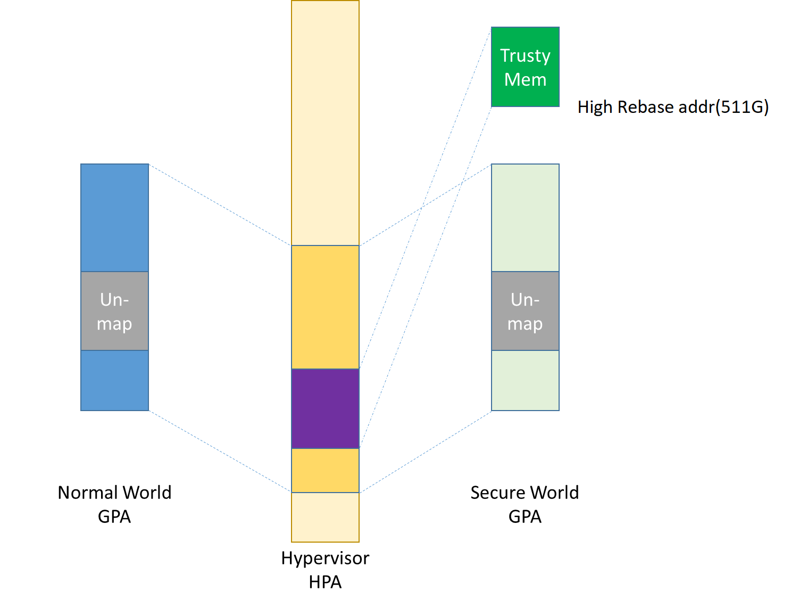

.. _hld-security:

Security high-level design
##########################

.. primary author: Bing Zhu
   contributor: Yadong Qi

Introduction
************

This document describes security high level design in ACRN,
including information about:

-  Secure Boot in ACRN
-  Hypervisor Security Enhancement, including memory management,secure
   hypervisor interfaces etc.
-  Platform Security Features Virtualizaion, such as the virtualizaion
   of TPM(vTPM) and SGX(vSGX)

This document is for developers, validation teams, architects, and
maintainers of ACRN.

The readers should be familiar with the basic concepts of system
virtualization and ACRN hypervisor implementation.

Background
**********

The ACRN hypervisor is a type-1 hypervisor, built for running multiple
guest OS instances, typical of an automotive infotainment system, on a
single Intel Apollo Lake-I SoC platform. See :numref:`security-ACRN`.

.. figure:: images/security-image1.png
   :width: 900px
   :align: center
   :name: security-ACRN

   ACRN hypervisor Overview

This document focuses only on the security part of this automotive
system built on top of ACRN hypervisor. This includes how to build a
secure system as well as how to virtualize the security features that
the system can provide.

Usages
======

As shown in :numref:`security-vehicle`, the ACRN hypervisor can be
used to build a Software Defined Cockpit (SDC) or In-Vehicle Experience
(IVE) Solution that consolidates multiple VMs together on a single Intel
SoC in-vehicle platform.

   SDC and IVE system In-Vehicle

In this system, the ACRN hypervisor is running at the most privileged
level, VMX root mode, in virtualization technology terms. The hypervisor
has full control of platform resources, including the processor, memory,
devices, and in some cases, secrets of the guest OS. The ACRN
hypervisor supports multiple guest VMs running in parallel, in the less
privileged level called VMX non-root mode.

The Service OS (SOS) is a special VM OS. While it runs as a guest VM in
VMX non-root mode, it behaves as a privileged guest VM controlling the
behavior of other guest VMs. The SOS can create a guest VM, suspend and
resume a guest VM, and provides device mediation services (Device
Models) for other guest VMs it creates.

In a SDC system, the SOS also contains safety-critical IC (Instrument
Cluster) applications. ACRN is designed to make sure the IC applications
are well isolated from other applications in the SOS such as Device
Models (Mediators). A crash in other guest VM systems must not impact
the IC applications, and not cause any DoS (Deny of Service) attack.
Functional safety is out of scope of this document.

In :numref:`security-ACRN`, the other guest VMs are referred to as User OS
(UOS). These other VMs provide infotainment services (such as
navigation, music, and FM/AM radio) for the front seat or rear seat.

The UOS systems could be based on Linux (LaaG, Linux as a Guest) or
Android\* (AaaG, Android as a Guest) depending on the customer's needs
and board configuration. It could also be a mix of Linux and Android
systems.

In each UOS, there could be a "side-car" OS system accompanying the
normal OS system. We call these two OS systems "secure world" and
"non-secure world", and they are isolated from each other by the
hypervisor. Secure world has a higher "privilege level" than non-secure
world, for example, the secure world can access the non-secure world's
physical memory but not vice-versa. This document discusses how this
security works and why it is required.

Careful consideration should be made when evaluating using the Service
OS (SOS) as the Trusted Computing Base (TCB). The Service OS may be a
fairly large system running many lines of code, hence treating it as a
TCB doesn't make sense from a security perspective. To achieve the
design purpose of "defense in depth", the system security designer
should always ask themselves, "What if the SOS is compromised?" and
"What's the impact if this happens?". This HLD document discusses how to
security-harden the SOS system and mitigate attacks on the SOS.

ACRN High-Level Security Architecture
*************************************

This chapter provides a high-level architecture design overview of ACRN
security features and their development.

Secure / Verified Boot
======================

The security of the entire system built on top of the ACRN hypervisor
depends on the security from platform boot to UOS launching. Each layer
or module must verify the security of the next layer or module before
transferring control to it. Verification could be checking a
cryptographic signature on the executable of the next step before it is
launched.

Note that measured boot (as described well in this `boot security
technologies document
<https://firmwaresecurity.com/2015/07/29/survey-of-boot-security-technologies/>`_)
is not currently supported for ACRN and its guest VMs.

Boot Flow
---------

.. figure:: images/security-image2.png
   :width: 900px
   :align: center
   :name: security-bootflow

   ACRN Boot Flow

As shown in :numref:`security-bootflow`, the Converged Security Engine
Firmware (CSE FW) behaves as the root of trust in this platform boot
flow. It authenticates and starts the BIOS (SBL), then the SBL is
responsible for authenticating and verifying the ACRN hypervisor image.
Currently the SOS kernel is built together with the ACRN hypervisor as
one image bundle, so this whole image signature is verified by SBL
before launching.

As long as the SOS kernel starts, the SOS kernel will load all its
subsystems subsequently. In order to launch a guest UOS, a DM process is
started to launch the virtual BIOS (vSBL), and eventually, the vSBL is
responsible for verifying and launching the guest UOS kernel (or the
Android OS loader for an Android UOS).

Secure Boot
-----------

In the entire boot flow, the chain of trust must be unbroken and is
achieved by the secure boot mechanism. Each module in the boot flow must
authenticate and verify the next module by using a cryptographic digital
signature algorithm.

The well-known image signing algorithm uses cryptographic hashing and
public key cryptography with PKCS1.5 padding.

The 2018 minimal requirements for cryptographic strength currently are:

#. SHA256 for image cryptographic hashing.
#. RSA2048 for cryptographic digital signature signing and verification.

However, it is strongly recommended that SHA512 and RSA3072+ should be
used for a product shipped in 2018, especially for a product which has a
long production life such as an automotive vehicle.

The CSE FW image is signed with an Intel RSA private key. All other
images should be signed by the responsible OEM. Our customers and
partners are responsible for image signing, ensuring the key strength
meets security requirements, and storing the secret RSA private key
securely.

.. _sos_hardening:

SOS Hardening
-------------

In project ACRN, the reference SOS is based on Clear Linux OS. Customers
may choose to use different open source OSes or their own proprietary OS
systems. To minimize the attack surfaces and achieve the goal of
"defense in depth", there are many common guidelines to ensure the
security of SOS system.

As shown in :numref:`security-bootflow` above, the integrity of the UOS
depends on the integrity of the DM module and vBIOS/vOSloader in the
SOS. Hence SOS integrity is critical to the entire UOS security. If the
SOS system is compromised, all the other guest UOS VMs may be
jeopardized.

In practice, the SOS designer and implementer should obey at least the
following rules:

#. Verify the SOS is a closed system and doesn't allow the user to
   install any unauthorized 3rd-party software or components.
#. Verify external peripherals are constrained.
#. Enable kernel-based hardening techniques, for example dm-verity (to
   make sure integrity of DM and vBIOS/vOSloaders), and kernel module
   signing.
#. Enable system level hardening such as MAC (Mandatory Access Control).

Detailed configurations and policies are out of scope for this document.
For good references for OS system security hardening and enhancement,
see `AGL security
<http://docs.automotivelinux.org/master/docs/architecture/en/dev/reference/security/part-2/0_Abstract.html>`_
and `Android security <https://source.android.com/security/>`_

Hypervisor Security Enhancement
===============================

This section describes the ACRN hypervisor security enhancement for
memory boundary access and interfaces between VMs and the hypervisor,
such as Hypercall APIs, I/O emulations, and EPT violation handling.

The main security goal of the ACRN hypervisor design is to prevent
Privilege Escalation and enforce Isolation, for example:

-  VMM privilege escalation (vmx non-root -> vmx root)
-  Non-secure OS software (running in AaaG) accessing secure world TEE
   assets
-  Unauthorized software from executing in the hypervisor
-  Cross-guest VM attacks
-  Hypervisor secret information leaks

Memory Management Enhancement
-----------------------------

Background
~~~~~~~~~~

The ACRN hypervisor has ultimate control access of all the platform
memory spaces. (See :ref:`memmgt-hld`.) Note that on the APL platform,
`SGX <https://software.intel.com/sgx>`_ and `TME
<https://software.intel.com/en-us/blogs/2017/12/22/intel-releases-new-technology-specification-for-memory-encryption>`_
are not currently supported.

The hypervisor can read and write any physical memory space allocated
to any guest VM, and can even fetch instructions and execute the code in
the memory space from any guest VM. If the hypervisor has MMU
misconfiguration or is compromised by an attacker, it must be
constrained in some manner to prevent the hypervisor from accessing
guest memory space either maliciously or accidentally. As a best
security practice, any memory content from a guest VM memory space must
not be trusted by the hypervisor. In other words, there must be a trust
boundary for memory space between the hypervisor and Guest VMs.

.. figure:: images/security-image14.png
   :width: 900px
   :align: center
   :name: security-hgmem

   Hypervisor and Guest Memory Layout

The hypervisor must appropriately configure the EPT tables (GPA->HPA
mapping) to disallow any guest to access (read/write/execution) the
memory space owned by the hypervisor.

Memory Access Restrictions
~~~~~~~~~~~~~~~~~~~~~~~~~~

The fundamental rules of restricting hypervisor memory access are:

#. By default, prohibit any access to all guest VM memory. This means
   that initially when the hypervisor sets up its own MMU paging tables
   (HVA->HPA mapping), it only grants permissions for hypervisor memory
   space (Excluding guest VM memory)
#. Grant access permission for hypervisor to read/write a specific guest
   VM memory region on demand. The hypervisor must never grant execution
   permission for itself to fetch any code instructions from guest
   memory space because there is no reason to do that.

In addition to these rules, the hypervisor must also implement a generic
best-practice memory configurations for access to its own memory in host
CR3 MMU paging tables, for example splitting hypervisor code and data
(stack/heap) sections, and then apply W |oplus| X policy, which means if memory
is Writable, then the hypervisor must make it non-eXecutable. The
hypervisor must configure its code as read-only and executable, and
configure its data as read-write. Optionally, if there are read-only
data sections, it would be best if the hypervisor configures them as
read-only.

The following sections will focus on the rules mentioned above for
memory access restriction on guest VM memory (not restrictions on the
hypervisor's own memory access).

SMAP/SMEP Enablement in Hypervisor
~~~~~~~~~~~~~~~~~~~~~~~~~~~~~~~~~~

For the hypervisor to isolate access to guest VM memory space, there are
three typical solutions:

#. **Configure the hypervisor/VMM MMU CR3 paging tables by removing
   execution permission (setting NX bit) or removing mapping completely
   (setting not-present) for guest memory space.**

   In practice, this works very well for NX setting to disable
   instruction fetching from any guest memory space. However, it is not
   suitable for read/write access isolation. For example, if the
   hypervisor removes the mapping to a guest memory page in host CR3
   paging tables, when the hypervisor wants to access that specific
   guest memory page, the hypervisor must first add mapping back to its
   CR3 paging tables before accessing that page, and revert the mapping
   after accessing.

   This remapping causes code complexity and a performance penalty and
   may even require the hypervisor to flush the TLB. This solution won't
   be used by the ACRN hypervisor.

#. **Use CR0.WP (write-protection) bit.** 

   This processor feature allows
   pages to be protected from supervisor-mode write accesses.
   If the host/VMM CR0.WP = 0, supervisor-mode write accesses are
   allowed to linear addresses with read-only access rights. If CR0.WP =
   1, they are not allowed.  User-mode write accesses are never allowed
   to linear addresses with read-only access rights, regardless of the
   value of CR0.WP.

   To implement this WP protection, the hypervisor must first configure
   all the guest memory space as "user-mode" accessible memory, and as
   read-only access (in other words, the corresponding paging table
   entry U/S bit and R/W bit must be set in host CR3 paging tables for
   all those guest memory pages).

   .. figure:: images/security-image3.png
      :width: 900px
      :align: center
      :name: security-gmem

      Configure Guest Memory as User-accessible

   This setting seems meaningless since all the code in the ACRN hypervisor
   is running in Ring 0 (supervisor-mode), and no code in the hypervisor
   will be executed in Ring 3 (no user-mode applications in hypervisor /
   vmx-root).

   However, these settings are made in order to make use of the CR0.WP
   protection capability, because if CR0.WP = 1, if the hypervisor code is
   running in Ring 0 and maliciously attempts to write a user-accessible
   read-only memory page (in guest memory space), then this malicious
   behavior can be thwarted with a page fault (#PF) by the processor in the
   hypervisor. Whenever the hypervisor has a valid reason to have a write
   access to user-accessible read-only memory (guest memory), it can
   disable CR0.WP (clear CR0.WP) before writing, and afterwards set CR0.WP
   back to 1.

   This solution is better than the 1st solution above because it doesn't
   need to change the host CR3 paging tables to map or unmap guest memory
   pages and doesn't need to flush the TLB.
   However, it cannot prevent hypervisor (running in Ring 0 mode) from
   reading guest memory space because this CR0.WP bit doesn't control read
   access behaviors. This read access protection is essentially required
   because sometimes there may be secrets in guest memory and if the
   hypervisor can be hacked to read those memory contents, then it may
   cause secret leaking to attackers.

3. **Use processor SMEP and SMAP capabilities.**

   This solution is a best solution because SMAP can prevent the
   hypervisor from both reading and writing guest memory, and SMEP can
   prevent hypervisor from fetching/executing code in guest memory. This
   solution also has minimal performance impact; like the CR0.WP
   protection, it doesn't require TLB flush (incurring a performance
   penalty) and has less code complexity.

The following sections will focus on this SMEP/SMAP protection. SMEP
and SMAP are widely used by all modern Operating System software such as
Windows and Linux, for isolating kernel and user memory, and can
mitigate many vulnerability exploits.

Guest Memory Execution Prevention
+++++++++++++++++++++++++++++++++

SMEP is designed to prevent user memory malicious code (typically
attacker-supplied) from being executed in the kernel (Ring 0) privilege
level.  As long as the CR4.SMEP = 1, software operating in supervisor
mode cannot fetch instructions from linear addresses that are accessible
in user mode.

In the ACRN hypervisor, the attacker-supplied memory could be any guest
memory, because hypervisor doesn't trust all the data/code from guest
memory by design.

In order to activate SMEP protection, ACRN hypervisor must:

#. Configure all the guest memory as user-accessible memory (U/S = 1).
   No matter what settings for NX bit and R/W bit in corresponding host
   CR3 paging tables.
#. Set CR4.SMEP bit. In the entire lifecycle of the hypervisor, this bit
   value always remains one.

As an alternative, NX feature can also be used for this purpose by
setting the corresponding NX (non-execution) bit for all the guest
memory mapping in host CR3 paging tables.

Since hypervisor code never runs in Ring 3 mode, either of these two
solutions works very well. As the NX bit is also used by the hypervisor
to disable execution of its own data (by policies mentioned previously),
the latter solution should be easier to implement.  Since enabling
CR0.SMEP bit is simple and does no harm to the system, it is recommended
that both solutions should be enabled in the ACRN hypervisor.

Guest Memory Access Prevention
++++++++++++++++++++++++++++++

Supervisor Mode Access Prevention (SMAP) is yet another powerful
processor feature which makes it harder for malicious programs to
"trick" the kernel into using instructions or data from a user-space
application program.

This feature is controlled by the CR4.SMAP bit. When that bit is set,
any attempt to access user-accessible memory pages while running in a
privileged or  kernel mode will lead to a page fault.

However, there are times when the kernel legitimately needs to work with
user-accessible memory pages. The Intel processor defines a separate
"AC" flag (in RFLAGS register) that control the SMAP feature. If the AC
flag is clear, SMAP protection is in force when CR4.SMAP=1; otherwise
access to user-accessible memory pages is allowed even if CR4.SMAP=1.
The "AC" flag provides suppression for SMAP enforcement.

To manipulate that flag relatively quickly, STAC (set AC flag) and CLAC
(clear AC flag) instructions are introduced for this purpose. Note that
STAC and CLAC can only be executed in kernel mode (CPL=0).

To activate SMAP protection, ACRN hypervisor must:

#. Configure all the guest memory as user-writable memory (U/S bit = 1,
   and R/W bit = 1) in corresponding host CR3 paging table entries, as
   shown in :numref:`security-smap` below. Note that the R/W bit would also be clear,
   which means that the corresponding user-accessible pages are
   read-only to user mode.  Then if CR0.WP = 1, even the kernel mode (in
   hypervisor ring 0) cannot even write to this user-accessible pages.
#. Set CR4.SMAP bit. In the entire lifecycle of hypervisor, this bit
   value always remains one.
#. When needed, use STAC instruction to suppress SMAP protection, and
   use CLAC instruction to restore SMAP protection.

.. figure:: images/security-image5.png
   :width: 900px
   :align: center
   :name: security-smap

   Setting SMAP and Configuring U/S=1, R/W=1 for All Guest Memory Pages

For example, :numref:`security-smap` shows a module of hypervisor code
(running in Ring 0 mode) attempting to perform a legitimate read (or
write) access to a data area in guest memory page.

.. figure:: images/security-image4.png
   :width: 900px
   :align: center
   :name: security-hagm

   Hypervisor Access to Guest Memory

The hypervisor can do these steps:

#. Execute STAC instruction to suppress SMAP protection;
#. Perform read/write access on guest DATA area.
#. Execute CLAC instruction to restore SMAP protection.

The attack surface can be minimized because there is only a
very small window between step 1 and step 3 in which the guest memory
can be accessed by hypervisor code running in ring 0.

The following section details the memory operation rules and
functions when accessing guest memory pages.

Memory Operation Functions/Rules for Accessing Guest Memory
~~~~~~~~~~~~~~~~~~~~~~~~~~~~~~~~~~~~~~~~~~~~~~~~~~~~~~~~~~~

The Linux kernel uses copy\_[to/from]\_user() / get\_user() /
put\_user() whenever the kernel legitimately attempts to access
user-accessible memory pages (refer to `Linux kernel copy routines
documentation
<https://www.kernel.org/doc/htmldocs/kernel-hacking/routines-copy.html>`_
The ACRN hypervisor, provides similar functions:

``put_vm()``, and ``get_vm()``
   used to put and get single values (such as an int, char, or long) to
   and from vm / guest memory area (user-accessible pages).

``copy\_to\_vm()``, and ``copy\_from\_vm()``
   used to copy an arbitrary amount of data to and from vm / guest
   memory area (user-accessible pages).

Inside these functions, the internal memory read/write operations
are surrounded by STAC and CLAC instructions.

Whenever the hypervisor needs to perform legitimate read/write access to
guest memory pages, one of functions above must be used. Otherwise, the
#PF will be triggered by the processor to prevent malicious or
unintended access from/to the guest memory pages.

These functions must also internally check the address availabilities,
for example, ensuring the input address accessed by hypervisor must have
a valid mapping (GVA->GPA mapping, GPA->HPA EPT mapping and HVA->HPA
host MMU mapping), and must not be in the range of hypervisor memory.
Details of these ordinary checks are out of scope in this document.

Memory Information Leak
-----------------------

Protecting the hypervisor's memory is critical to the security of the
entire platform. The hypervisor must prevent any memory content (e.g.
stack or heap) from leaking to guest VMs. Some of hypervisor memory
content may contain platform secrets such as SEEDs, which are used as
the root key for its guest VMs. `Xen Advisories
<https://xenbits.xen.org/xsa/>`_ have many examples of past hypervisor
memory leaks, ACRN developers can refer to this link to understand how
to avoid this in coding.

Memory content from one guest VM might be leaked to another guest VM. So
in ACRN and Device Model design, when one guest VM is destroyed or
crashes, its memory content should be scrubbed either by the hypervisor
or the SOS device model process, in case its memory content is
re-allocated to another guest VM which could otherwise leave the
previous guest VM secrets in memory.

Secure Hypervisor Interface
---------------------------

Hypercall API Interface Hardening
~~~~~~~~~~~~~~~~~~~~~~~~~~~~~~~~~

The hypercall API is the primary interface between a guest VM and the
hypervisor.

.. figure:: images/security-image7.png
   :width: 900px
   :align: center
   :name: security-hir

   Hypercall Interface Restriction

As shown in :numref:`security-hir`, there are some restrictions for
hypercall invocation in the hypervisor design:

#. Hypercalls from ring 1~3 of any guest VM are not allowed. The
   hypervisor must discard such hypercalls silently. Only ring-0
   hypercalls from the guest VM are handled by the hypervisor.
#. All the hypercalls (except world\_switch hypercall) must be called
   from the ring-0 driver of the SOS VM.
   World\_switch Hypercall is used by the TIPC (Trusty IPC) driver to
   switch guest VM context between secure world and non-secure world.
   Further details will be discussed in the :ref:`secure_trusty` section.

In addition to these two rules, there are other regular checks in the
hypercall implementation to prevent hypercalls from being misused. For
example, all the parameters must be sanitized, unexpected hypervisor
memory overwrite must be avoided, any hypervisor memory content/secrets
must not be leaked to guest, and any memory/code injection must be
eliminated.

I/O Emulation Handler
~~~~~~~~~~~~~~~~~~~~~

I/O port monitoring is also widely used by the ACRN hypervisor to
emulate legacy I/O access behaviors. If the hypervisor cannot handle the
I/O vmexit appropriately, a malicious driver in the guest VM could
manipulate the I/O access to compromise the hypervisor and its guest
VM(s).

Typically, the I/O instructions could be IN, INS/INSB/INSW/INSD, OUT,
OUTS/OUTSB/OUTSW/OUTSD with arbitrary port (although not all the I/O
ports are monitored by hypervisor). As with other interface (e.g.
hypercalls), the hypervisor must perform security checks for all the I/O
access parameters to make sure the emulation behaviors are correct.

EPT Violation Handler
~~~~~~~~~~~~~~~~~~~~~

The Extended Page Table (EPT) is typically used by the hypervisor to
monitor MMIO (or other types of ordinary memory access) operation from
guest VM. The hypervisor then emulates the MMIO instructions with design
behaviors.

As done for I/O emulation, this interface could also be manipulated by
malicious software in guest VM to compromise system security.

Other VMEXIT Handlers
~~~~~~~~~~~~~~~~~~~~~

There are some other VMEXIT handlers in the hypervisor which might take
untrusted parameters and registers from guest VM, for example, MSR write
VMEXIT, APIC VMEXIT.

Again, care must be taken by hypervisor to avoid security issue when
handling those special VMEXIT.

Guest Instruction Emulation
~~~~~~~~~~~~~~~~~~~~~~~~~~~

Instruction emulation implemented by the hypervisor must also be checked
securely. Emulating x86 instruction is complicated, and there are many
known security CVEs reported by attackers in the KVM/XEN/QEMU
community. This is a "hotspot" where the hypervisor may potentially
have vulnerability bugs.

Security validation process and secure code review must ensure all the
instruction emulations behave as defined in the `IA32 SDM
document <https://software.intel.com/en-us/articles/intel-sdm>`_.

Virtual Power Life Cycle Management
-----------------------------------

In a virtualization environment, each UOS (guest VM) can have its
virtual power managed just like native behavior. For example, if a UOS
is required to enter S3 (Suspend to RAM) for power consumption saving,
then the hypervisor and DM processor in SOS must handle it correctly.
Similarly, virtual cold/warm reboot is also supported. How to implement
virtual power life cycle management is out of scope in this document.

This subsection is intended to describe the security issues for those
power cycles.

UOS Power On and Shutdown
~~~~~~~~~~~~~~~~~~~~~~~~~

The memory of the guest VM (UOS) is allocated dynamically by the DM
process in the SOS before the UOS is launched. When the UOS is shutdown
(or crashed), its memory will be freed to SOS memory space. Later on, if
there is a new UOS launch event occurring, DM may potentially allocate
the same memory content (or some overlaps) for this new UOS.

In the virtualization environment, a security goal is to ensure guest VM
(UOS) isolation, not only for runtime memory isolation (e.g. w/ EPT),
but also for data at rest isolation.

Under this situation, if the memory contents of a previous UOS is not
scrubbed by either DM or hypervisor, then the new launched UOS could
access the previous UOS's secrets by scanning the memory regions
allocated for the new UOS.

In a secure hypervisor and DM design, there are two solutions to solve
this issue; the first one is preferred because it results in a smaller
attack window:

#. The memory content must be scrubbed immediately after the UOS is
   shutdown or crashed.
#. The memory content must be scrubbed immediately before allocating a
   memory area to launch a new UOS.

For project ACRN, the memory scrubbing operations could be done by the
hypervisor, DM, or vBIOS (vSBL). This is function design decision, which
is not in the scope of this document.

UOS Reboot
~~~~~~~~~~

The behaviors of **cold** boot of virtual UOS reboot is the same as that of
previous virtual power-on and shutdown events. There is a special case:
virtual **warm** reboot.

When a UOS encounters a panic, its kernel may trigger a warm reboot, so
that in the next power cycle, a special purpose-built OS image is
launched to dump the memory content for debugging analysis. In a warm
reboot, the memory content must be preserved after a virtual power
cycle. However, this violates the security rules above.

This typically is fine in project ACRN, because in the next virtual
power cycle, the same memory content won't be re-allocated to another
UOS.

But there is a new issue when secure world (TEE/Trusty) is considered,
because the memory content of secure world must not be dumped by a
non-secure world UOS. More details will be discussed in
the section on :ref:`platform_root_of_trust`.

Normally, this warm reboot (crashdump) feature is a debug feature, and
must be disabled in a production release. User who wants to use this
feature must possess the private signing key to re-sign the image (e.g.
the virtual SBL image) after enabling the configuration.

.. _uos_suspend_resume:

UOS Suspend/Resume
~~~~~~~~~~~~~~~~~~

There is no special design considerations for normal UOS without secure
world supported, as long as the EPT/VT-d memory protection/isolation is
active during the entire suspended time.

Secure world (Trusty/TEE) is a special case for virtual suspend. Unlike
the non-secure world of UOS, whose memory content can be read/written by
SOS, the memory content of secure world of UOS must not be visible to
SOS. This is designed for security with defense in depth.

During the entire process of UOS sleep/suspend, the memory protection
for secure-world must be preserved too.The physical memory region of
secure world must be removed from EPT paging tables of any guest VM,
even including the SOS VM.

Third-party libraries
---------------------

All the third-party libraries must be examined before use to verify
there are no known vulnerabilities in the library source code.
Typically, the CVE site https://cve.mitre.org/cve/search_cve_list.html
can be used to search for known vulnerabilities.

.. _platform_root_of_trust:

Platform Root of Trust Key/SEED Derivation
==========================================

For security reason, each guest VM requires a root key, which is used to
derive many other individual keys for different purposes, for example,
secure storage encryption, keystore master key, and HMAC keys.

In the APL platform, CSE FW will generate platform SEED (pSEED, 256bit)
unique per device since it is derived from a unique chipset secret
burned into the chip.

Then on each boot, the SBL BIOS is responsible for retrieving the pSEED
from CSE FW, and deriving two other derivatives (dSEED, and uSEED).

.. figure:: images/security-image6.png
   :width: 900px
   :align: center
   :name: security-seed

   Platform SEED (pSEED) Derivation

As shown in :numref:`security-seed` above, the hypervisor then derives
multiple child SEEDs for multiple guest VMs. A guest VM must not be able
to know the SEEDs of any other guest VMs.

The algorithm used in the hypervisor to derive keys is HKDF (HMAC-based
Extract-and-Expand Key Derivation Function, `RFC5869
<https://tools.ietf.org/html/rfc5869>`_.  The crypto library `mbedtls
<https://github.com/ARMmbed/mbedtls>`_ has been chosen for project ACRN.

The parameters of HDKF derivation in the hypervisor are:

#. VMInfo= vm-uuid (from hypervisor configuration file)
#. theHash=SHA-256
#. OutSeedLen = 64 in bytes
#. Guest Dev and User SEED (dvSEED/uvSEED)

   dvSEED = HKDF(theHash, nil, dSEEd, VMInfo\|"devseed", OutSeedLen)

   uvSEED = HKDF(theHash, nil, uSEEd, VMInfo\|"userseed", OutSeedLen

.. _secure_trusty:

Secure Isolated World (Trusty)
==============================

This section explains how to build a secure isolated world in a specific
guest VM such as the Android UOS VM. (See :ref:`trusty_tee` for more
information.)

On the APL platform, the secure world is used to run a
virtualization-based Trusty TEE in an isolated world which serves
Android as a guest (AaaG,) to get Google's Android relevant certificates
by fulfilling Android CDD requirements. Also as a plan, Trusty will be
supported to provide security services for LaaG UOS as well.

Refer to this Google website for `Trusty details
<https://source.android.com/security/trusty/>`_ and for `Android CCD
documents <https://source.android.com/compatibility/cdd>`_.

Secure World Architecture Design
--------------------------------

To support a VT-TEE (Virtualization Technology based TEE) Trusty on
ACRN, the hypervisor creates an isolated secure world in a UOS.

.. figure:: images/security-image10.png
   :width: 900px
   :align: center
   :name: security-secure-world

   Secure World

In :numref:`security-secure-world`, the Trusty OS runs in the UOS secure
world and a Linux- or Android-based UOS runs in the non-secure world.

By design, the secure world is able to read and write to all non-secure
world's memory space. But non-secure world applications cannot have
access to secure world's memory. This is guaranteed by switching
different EPT tables when a world switch (WS) hypercall is invoked. The
WS Hypercall can have parameters to specify the services cmd ID
requested from non-secure world.

To design the "one VM, two worlds" architecture, there is a single
UOS/VM structure per-UOS in the hypervisor, but two vCPU structures that
save non-secure/secure world virtual logical processor states
respectively.

Whenever there is a WS hypercall from non-secure world, the hypervisor
will copy non-secure world CPU contexts from Guest VMCS to non-secure
world-vCPU structure for saving contexts, and then copy secure-world CPU
contexts from secure-world-vCPU structure to Guest VMCS, then do
VMRESUME to secure-world, and vice versa. The EPTP pointer will also be
updated accordingly in VMCS (not shown in
:numref:`security-secure-world`).

Trusty (Secure World) Memory Mapping View
-----------------------------------------

As per the secure world design, Trusty can have read/write access to
non-secure world's memory, but non-secure world cannot access Trusty
secure world's memory. In the hypervisor EPT configuration shown in
:numref:`security-mem-view` below, the secure world EPTP page table
hierarchy must contain non-secure world address space, while Trusty
world's address space must be removed from the non-secure world EPTP
page table hierarchy.

Since there is no need to allow Trusty to execute memory from non-secure
world, for security reason, the execution (X) permission must be removed
for non-secure world address space in secure world EPT table
configuration.

To save page tables and share the mappings for non-secure world address
space, the hypervisor relocates the Secure World's GPA to a very high
position: 511G-512G. Hence, the PML4 for Trusty World are separated from
non-secure World. PDPT/PD/PT for low memory (<511G) are shared in both
Trusty World's EPT and non-secure World's EPT. PDPT/PD/PT for high
memory (>=511G) are valid for Trusty World's EPT only.

   Memory View for UOS non-secure World and Secure World

Trusty/TEE Hypercalls
---------------------

Two hypercalls are introduced to assist in secure world (Trusty/TEE)
execution on top of the hypervisor.

Hypercall - Trusty Initialization
~~~~~~~~~~~~~~~~~~~~~~~~~~~~~~~~~

When a UOS is created by the DM in the SOS, if this UOS supports a
secure isolated world, then this hypercall will be invoked by OSLoader
(it could be Android OS loader in :numref:`security-bootflow` above) to
create / initialize the secure world (Trusty/TEE).

.. figure:: images/security-image9.png
   :width: 900px
   :align: center
   :name: security-start-flow

   Secure World Start Flow

In :numref:`security-start-flow` above, the OSLoader is responsible for
loading TEE/Trusty image to a dedicated and reserved memory region, and
locating its entry point of TEE/Trusty executable, then executes a
hypercall which exits to the hypervisor handler.

In the hypervisor, from a security perspective, it removes GPA->HPA
mapping of secure world from EPT paging tables of both UOS non-secure
world and even SOS VM. This is intended to disallow non-secure world and
SOS to access the memory region of secure world for security reasons as
previously mentioned

After all is set up by the hypervisor, including vCPU context
initialization, the hypervisor eventually does vmresume (step 4 in
:numref:`security-start-flow` above) to the entry point of secure world
TEE/Trusty, then Trusty OS gets started in vmx non-root mode to
initialize itself, and loads its TAs (Trusted Applications) so that the
security services can be ready right before non-secure OS gets started.

After Trusty OS completes its initialization, a world switching (WS, see
subsection below) hypercall is invoked (step 5 in
:numref:`security-start-flow` above), and then the hypervisor takes
control back, and resumes to the OSLoader (step 6 in
:numref:`security-start-flow` above) for continuing execution in guest
VM non-secure world context.

Note that this trusty initialization hypercall can only be called once
in the UOS life cycle.

Hypercall - Trusty Switching
~~~~~~~~~~~~~~~~~~~~~~~~~~~~

There is another special hypercall introduced only for world switching
between non-secure world and secure world in a UOS VM.

.. figure:: images/security-image11.png
   :width: 900px
   :align: center
   :name: security-ws

   World Switching Hypercall

Whenever this hypercall is invoked in UOS, the hypervisor will
unconditionally switch to the other world. For example, if it is called
in non-secure world, hypervisor will then switch context to secure
world. After secure world completes its security tasks (or an external
interrupt occurs), this hypercall will be called again, then hypervisor
will switch context back to non-secure world.

During entire world switching process, SOS is not involved. This
hypervisor is only available to a UOS VM with duo-worlds supported.

Secure Storage Virtualization
-----------------------------

Secure storage is one of the security services provided by secure world
(TEE/Trusty). In the current implementation, secure storage is built up
on the RPMB partition in eMMC (or UFS, and NVMe storage). Details of how
RPMB works are out of scope for this document.

Since currently the eMMC in APL SoC platform only has a single RPMB
partition for tamper-resistant and anti-replay secure storage, the
secure storage (RPMB) should be virtualized in order to support multiple
guest UOS VMs. However, although future generation of flash storage
(e.g. UFS 3.0, and NVMe) supports multiple RPMB partitions, this
document still only focuses on the virtualization solution for
single-RPMB flash storage device in APL SoC platform.

The following :numref:`security-storage` illustrates the virtualization
of secure storage high-level architecture overview.

.. figure:: images/security-image12.png
   :width: 900px
   :align: center
   :name: security-storage

   Secure Storage Virtualization

In :numref:`security-storage`, the rKey is the physical RPMB
authentication key used for data authenticated read/write access between
the SOS kernel and the physical RPMB controller in eMMC device.  The
VrKey is the virtual RPMB authentication key used for authentication
between the SOS DM module and its corresponding UOS secure software.
Each UOS (if secure storage is supported) has its own VrKey, generated
randomly when DM process starts, and is securely distributed to UOS
secure world for each reboot. The rKey is fixed on a specific platform
unless the eMMC is replaced with another one.

The details of physical RPMB key (rKey) provision are out of scope.  In
the current project ACRN on APL platform, the rKey is provisioned by
BIOS (SBL) right after production device ends its manufacturing process.

For each reboot, the BIOS/SBL always retrieves the rKey from CSE FW
(or generated from a special SEED that is retrieved from CSE FW, refer
to :ref:`platform_root_of_trust`). The SBL hands this over to the
ACRN hypervisor, and hypervisor in turn sends it to the SOS kernel.

As an example, secure storage virtualization workflow for data write
access is like this:

#. UOS Secure world (e.g. Trusty) packs the encrypted data and signs it
   with the vRPMB authentication key (VrKey), and sends the data along
   with its signature over the RPMB FE driver in UOS non-secure world.
#. After DM process in SOS receives the data and signature, then the
   vRPMB module in DM verifies them with the shared secret (vRPMB
   authentication key, VrKey),
#. If verification is successful, the vRPMB module does data address remap
   (remembering that the multiple UOS VMs share a single physical RPMB
   partition), and forwards the data to the SOS kernel. The kernel packs
   the data and signs it with the physical RPMB authentication key
   (rKey). Eventually, the data and its signature will be sent to
   physical eMMC device.
#. If the verification is successful in eMMC RPMB controller, then the
   data will be written into storage device.

This work flow of authenticated data read is very similar to this flow
above, but in reverse order.

Note that there are some security considerations in this design:

#. The rKey protection is very critical in this system. If  it is
   leaked, an attacker can overwrite the data on RPMB, which
   violates the "tamper-resistant & anti-replay" capability.
#. Typically, the vRPMB module in DM process of SOS system can filter
   data access, preventing one UOS to perform read/write access to the
   data from another UOS VM. If the vRPMB module in the DM process is
   compromised, one UOS may also change/overwrite the secure data of
   other UOS.

Keeping the SOS system as secure as possible is a very important goal in
the system security design, please follow the recommendations in
:ref:`sos_hardening`.

SEED Derivation
---------------

Refer to the previous section: :ref:`platform_root_of_trust`.

Trusty/TEE S3 (Suspend To RAM)
------------------------------

Secure world S3 design is not yet finalized. However, there is a
temporary solution as explained below to make it work on top of ACRN.

Two new hypercalls are introduced: one saves the secure world processor
contexts/states; the other one restores the secure world processor
contexts/states.

The save state hypercall is called only in secure world (Trusty/TEE OS)
as long as the Trusty receives a signal when the entire system (actually
the non-secure OS issues this power event) is about to enter S3. While
the restore state hypercall is called only by vBIOS when UOS is ready to
resume from suspend state.

For security design consideration of handling secure world S3, please
read the previous section: :ref:`uos_suspend_resume`.

Platform Security Feature Virtualization and Enablement
=======================================================

.. note:: This section is under development

This section talks about how the hypervisor enables host CPU features
(e.g., SGX) and enables platform features (e.g., HECI), to allow guest
VMs the ability to use those features.

TPM 2.0 Virtualization (vTPM)
-----------------------------

On APL platform, Intel |reg| PTT (Platform Trust Technology) implements TPM
functionalities based on TCG TPM 2.0 industry standard specification.
PTT exposes TPM hardware interface as CRB (Command Response Buffer)
defined in the TCG TPM 2.0 spec.

However, in project ACRN, TPM virtualization doesn't assume it is based
on PTT or discrete TPM; both TPMs (2.0) are supported by design.
Customers are free to use either PTT or discrete TPM (but not at the same
time). PTT, however, is a built-in TPM2.0 implementation in Intel APL
platform, and does not require extra BOM cost (unlike discrete TPM).

Note that the underlying CSE FW/HW implements PTT functionalities,
however, this TPM2.0 feature does not rely on :ref:`MEI_HECI_virtualization`
discussed below.

Unlike regular hardware, implementation of virtualizing a TPM must
address both security and Trust.

The goal of virtualization is to provide TPM functionality to each guest
VM, such as:

#. Allows programs to interact with a TPM in a virtual system the same
   way they interact with a TPM on the physical system;
#. Each UOS gets its own unique, emulated, software TPM, for example,
   vPCR and vNVRAM.
#. One to one mapping between running vTPM instances and logical vTPM in
   each VM

SGX Virtualization (vSGX)
-------------------------

Currently the APL platform processor doesn't support SGX
capabilities, so ACRN doesn't provide a SGX virtualization
implementation.

.. _MEI_HECI_virtualization:

MEI/HECI Virtualization (vHECI)
-------------------------------

[TO BE ADDED]

Content Protection
==================

ACRN hypervisor is designed to allow guest VMs (typically UOSs) to
playback premium audio/video content. This section describes how the
hypervisor will support content protection for each guest UOS VM on APL
platform.

[TO BE ADDED]
