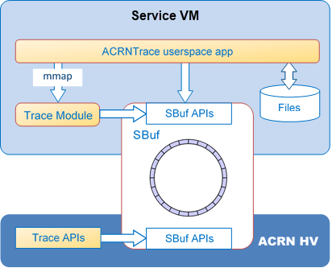
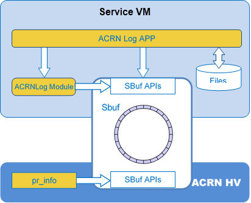

.. _hld-trace-log:

Tracing and Logging High-Level Design
#####################################

Both Trace and Log are built on top of a mechanism named shared
buffer (sbuf).

Shared Buffer
*************

Shared Buffer is a ring buffer divided into predetermined-size slots. There
are two use scenarios of sbuf:

- sbuf can serve as a lockless ring buffer to share data from ACRN HV to
  Service VM in non-overwritten mode. (Writing will fail if an overrun
  happens.)
- sbuf can serve as a conventional ring buffer in hypervisor in
  over-written mode. A lock is required to synchronize access by the
  producer and consumer.

Both ACRNTrace and ACRNLog use sbuf as a lockless ring buffer.  The sbuf
is allocated by Service VM and assigned to HV via a hypercall. To hold pointers
to sbuf passed down via hypercall, an array ``sbuf[ACRN_SBUF_ID_MAX]``
is defined in per_cpu region of HV, with predefined sbuf ID to identify
the usage, such as ACRNTrace, ACRNLog, etc.

For each physical CPU, there is a dedicated sbuf. Only a single producer
is allowed to put data into that sbuf in HV, and a single consumer is
allowed to get data from sbuf in Service VM. Therefore, no lock is required to
synchronize access by the producer and consumer.

sbuf APIs
=========

The sbuf APIs are defined in ``hypervisor/include/debug/sbuf.h``.

ACRN Trace
**********

ACRNTrace is a tool running on the Service VM to capture trace
data. It allows developers to add performance profiling trace points at
key locations to get a picture of what is going on inside the
hypervisor.  Scripts to analyze the collected trace data are also
provided.

As shown in :numref:`acrntrace-arch`, ACRNTrace is built using
Shared Buffers (sbuf), and consists of three parts from bottom layer
up:

- **ACRNTrace userland app**: Userland application collecting trace data to
  files (Per Physical CPU)

- **Service VM Trace Module**: allocates/frees sbufs, creates device for each
  sbuf, sets up sbuf shared between Service VM and HV, and provides a dev node for the
  userland app to retrieve trace data from sbuf

- **Trace APIs**: provide APIs to generate trace event and insert to sbuf.

   Architectural diagram of ACRNTrace

Trace APIs
==========

See ``hypervisor/include/debug/trace.h``
for trace_entry struct and function APIs.

Service VM Trace Module
=======================

The Service VM trace module is responsible for:

- allocating sbuf in Service VM memory range for each physical CPU, and assign
  the GPA of sbuf to ``per_cpu sbuf[ACRN_TRACE]``
- create a misc device for each physical CPU
- provide mmap operation to map entire sbuf to userspace for high
  flexible and efficient access.

On Service VM shutdown, the trace module is responsible to remove misc devices, free
sbufs, and set ``per_cpu sbuf[ACRN_TRACE]`` to null.

ACRNTrace Application
=====================

ACRNTrace application includes a binary to retrieve trace data from
sbuf, and Python scripts to convert trace data from raw format into
readable text, and do analysis.

With a debug build, trace components are initialized at boot
time. After initialization, HV writes trace event date into sbuf
until sbuf is full, which can happen easily if the ACRNTrace app is not
consuming trace data from sbuf on Service VM user space.

Once ACRNTrace is launched, for each physical CPU a consumer thread is
created to periodically read RAW trace data from sbuf and write to a
file.

These are the Python scripts provided:

- **acrntrace_format.py** converts RAW trace data to human-readable
  text offline according to given format;

- **acrnalyze.py** analyzes trace data (as output by acrntrace)
  based on given analyzer filters, such as vm_exit or IRQ, and generates a
  report.

See :ref:`acrntrace` for details and usage.

ACRN Log
********

``acrnlog`` is a tool used to capture ACRN hypervisor log to files on
Service VM filesystem. It can run as a Service VM service at boot, capturing two
kinds of logs:

-  Current runtime logs;
-  Logs remaining in the buffer, from the last crashed run.

Architectural Diagram
=====================

Similar to the design of ACRN Trace, ACRN Log is built on top of
Shared Buffer (sbuf), and consists of three parts from bottom layer
up:

- **ACRN Log app**: Userland application collecting hypervisor log to
  files;
- **Service VM ACRN Log Module**: constructs/frees sbufs at reserved memory
  area, creates dev for current/last logs, sets up sbuf shared between
  Service VM and HV, and provides a dev node for the userland app to
  retrieve logs
- **ACRN log support in HV**: put logs at specified loglevel to sbuf.

   Architectural diagram of ACRN Log

ACRN Log Support in Hypervisor
==============================

To support ``acrnlog``, the following adaption was made to hypervisor log
system:

- log messages with severity level higher than a specified value will
  be put into sbuf when calling ``logmsg`` in hypervisor
- allocate sbuf to accommodate early hypervisor logs before Service VM
  can allocate and set up sbuf

There are 6 different loglevels, as shown below. The specified
severity loglevel is stored in ``mem_loglevel``, initialized
by :option:`hv.DEBUG_OPTIONS.MEM_LOGLEVEL`. The loglevel can
be set to a new value
at runtime via hypervisor shell command ``loglevel``.

.. code-block:: c

   #define LOG_FATAL     1U
   #define LOG_ACRN      2U
   #define LOG_ERROR     3U
   #define LOG_WARNING   4U
   #define LOG_INFO      5U
   #define LOG_DEBUG     6U

The element size of sbuf for logs is fixed at 80 bytes, and the max size
of a single log message is 320 bytes. Log messages with a length between
80 and 320 bytes will be separated into multiple sbuf elements. Log
messages with length larger than 320 will be truncated.

For security, Service VM allocates sbuf in its memory range and assigns it to
the hypervisor.

Service VM ACRN Log Module
==========================

ACRNLog module provides one kernel option ``hvlog=$size@$pbase`` to configure
the size and base address of hypervisor log buffer. This space will be further divided
into two buffers with equal size: last log buffer and current log buffer.

On Service VM boot, Service VM acrnlog module is responsible to:

- examine if there are log messages remaining from last crashed
  run by checking the magic number of each sbuf

- if there are previous crash logs, construct sbuf and create misc devices for
  these last logs

- construct sbuf in the usable buf range for each physical CPU,
  assign the GPA of sbuf to ``per_cpu sbuf[ACRN_LOG]`` and create a misc
  device for each physical CPU

- the misc devices implement read() file operation to allow
  userspace app to read one sbuf element.

When checking the validity of sbuf for last logs examination, it sets the
current sbuf with magic number ``0x5aa57aa71aa13aa3``, and changes the
magic number of last sbuf to ``0x5aa57aa71aa13aa2``, to distinguish which is
the current/last.

On Service VM shutdown, the module is responsible to remove misc devices,
free sbufs, and set ``per_cpu sbuf[ACRN_TRACE]`` to null.

ACRN Log Application
====================

ACRNLog application reads log messages from sbuf for each physical
CPU and combines them into log files with log messages in ascending
order by the global sequence number. If the sequence number is not
continuous, a warning of "incontinuous logs" will be inserted.

To avoid using up storage space, the size of a single log file and
the total number of log files are both limited. By default, log file
size limitation is 1MB and file number limitation is 4.

If there are last log devices, ACRN log will read out the log
messages, combine them, and save them into last log files.

See :ref:`acrnlog` for usage details.
