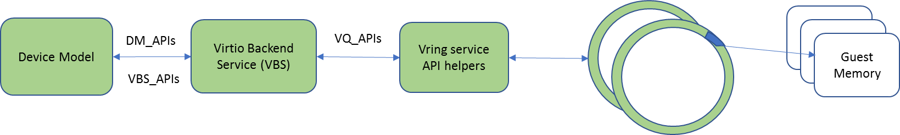
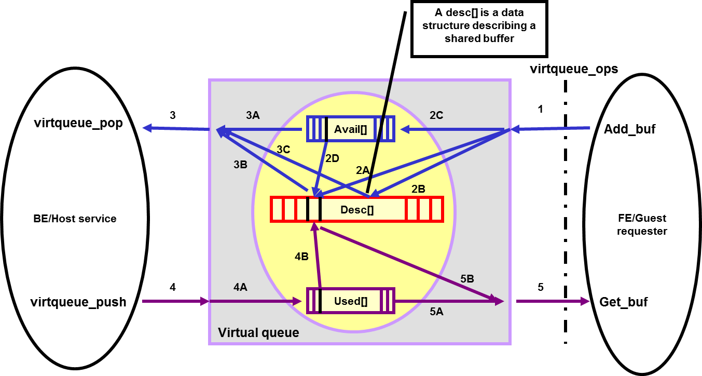
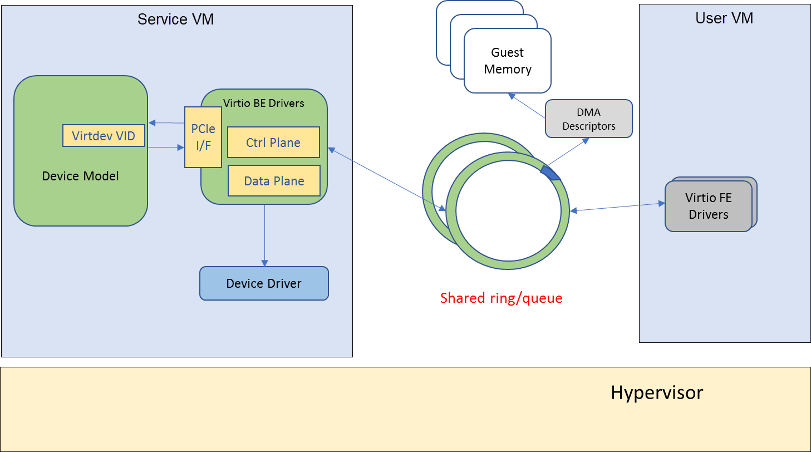
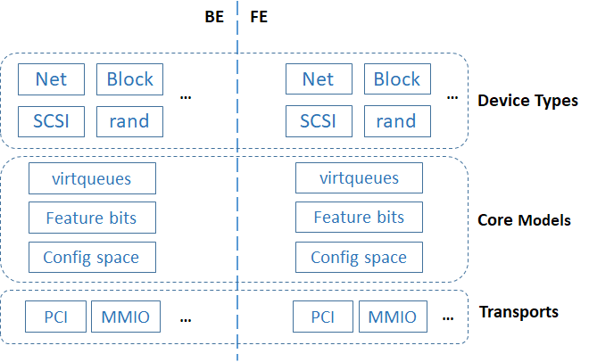
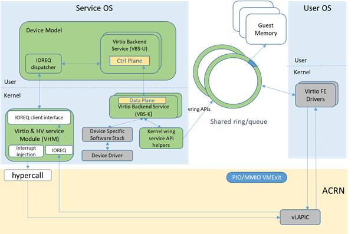
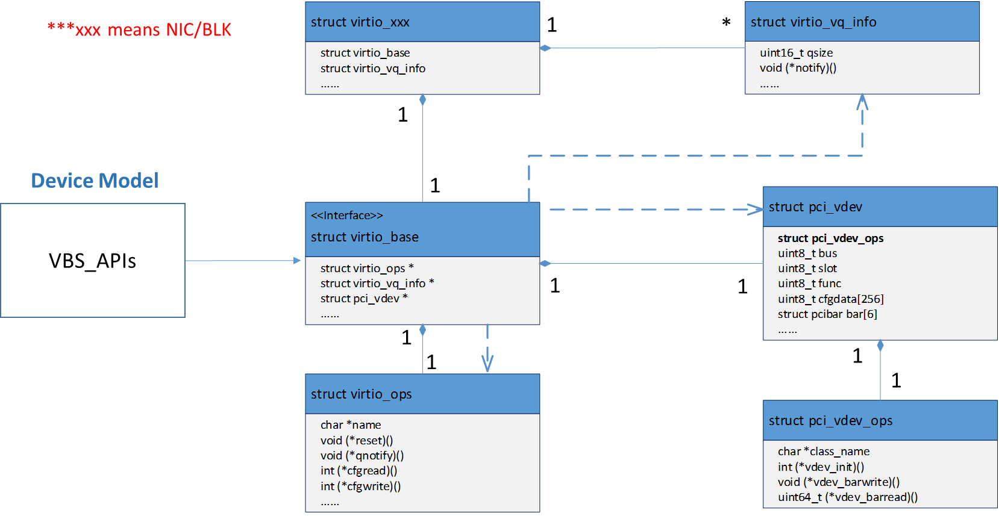
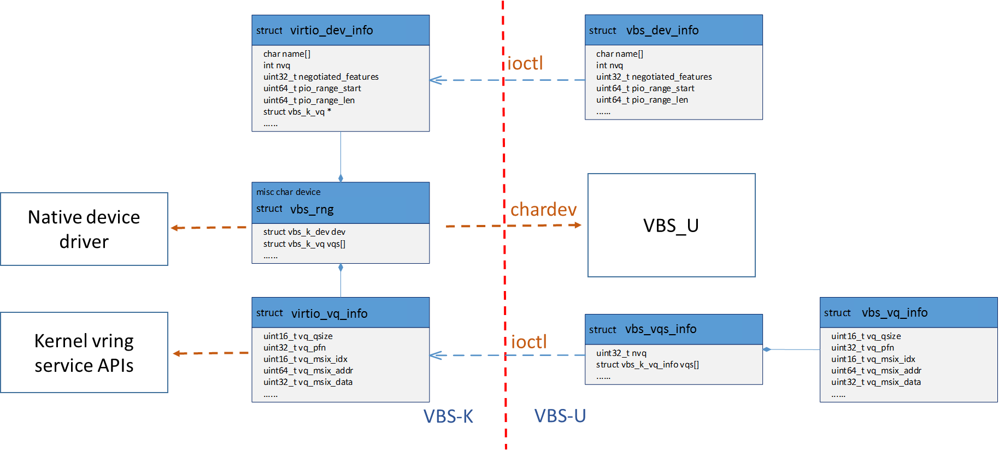

.. _hld-virtio-devices:
.. _virtio-hld:

Virtio devices high-level design
################################

The ACRN Hypervisor follows the `Virtual I/O Device (virtio)
specification
<http://docs.oasis-open.org/virtio/virtio/v1.0/virtio-v1.0.html>`_ to
realize I/O virtualization for many performance-critical devices
supported in the ACRN project. Adopting the virtio specification lets us
reuse many frontend virtio drivers already available in a Linux-based
User OS, drastically reducing potential development effort for frontend
virtio drivers.  To further reduce the development effort of backend
virtio drivers, the hypervisor  provides the virtio backend service
(VBS) APIs, that make  it very straightforward to implement a virtio
device in the hypervisor.

The virtio APIs can be divided into 3 groups: DM APIs, virtio backend
service (VBS) APIs, and virtqueue (VQ) APIs, as shown in
:numref:`be-interface`.

   ACRN Virtio Backend Service Interface

-  **DM APIs** are exported by the DM, and are mainly used during the
   device initialization phase and runtime. The DM APIs also include
   PCIe emulation APIs because each virtio device is a PCIe device in
   the SOS and UOS.
-  **VBS APIs** are mainly exported by the VBS and related modules.
   Generally they are callbacks to be
   registered into the DM.
-  **VQ APIs** are used by a virtio backend device to access and parse
   information from the shared memory between the frontend and backend
   device drivers.

Virtio framework is the para-virtualization specification that ACRN
follows to implement I/O virtualization of performance-critical
devices such as audio, eAVB/TSN, IPU, and CSMU devices. This section gives
an overview about virtio history, motivation, and advantages, and then
highlights virtio key concepts. Second, this section will describe
ACRN's virtio architectures, and elaborates on ACRN virtio APIs. Finally
this section will introduce all the virtio devices currently supported
by ACRN.

Virtio introduction
*******************

Virtio is an abstraction layer over devices in a para-virtualized
hypervisor. Virtio was developed by Rusty Russell when he worked at IBM
research to support his lguest hypervisor in 2007, and it quickly became
the de facto standard for KVM's para-virtualized I/O devices.

Virtio is very popular for virtual I/O devices because is provides a
straightforward, efficient, standard, and extensible mechanism, and
eliminates the need for boutique, per-environment, or per-OS mechanisms.
For example, rather than having a variety of device emulation
mechanisms, virtio provides a common frontend driver framework that
standardizes device interfaces, and increases code reuse across
different virtualization platforms.

Given the advantages of virtio, ACRN also follows the virtio
specification.

Key Concepts
************

To better understand virtio, especially its usage in ACRN, we'll
highlight several key virtio concepts important to ACRN:

Frontend virtio driver (FE)
  Virtio adopts a frontend-backend architecture that enables a simple but
  flexible framework for both frontend and backend virtio drivers. The FE
  driver merely needs to offer services configure the interface, pass messages,
  produce requests, and kick backend virtio driver. As a result, the FE
  driver is easy to implement and the performance overhead of emulating
  a device is eliminated.

Backend virtio driver (BE)
  Similar to FE driver, the BE driver, running either in user-land or
  kernel-land of the host OS, consumes requests from the FE driver and sends them
  to the host native device driver. Once the requests are done by the host
  native device driver, the BE driver notifies the FE driver that the
  request is complete.

  Note: to distinguish BE driver from host native device driver, the host
  native device driver is called "native driver" in this document.

Straightforward: virtio devices as standard devices on existing buses
  Instead of creating new device buses from scratch, virtio devices are
  built on existing buses. This gives a straightforward way for both FE
  and BE drivers to interact with each other. For example, FE driver could
  read/write registers of the device, and the virtual device could
  interrupt FE driver, on behalf of the BE driver, in case something of
  interest is happening.

  Currently virtio supports PCI/PCIe bus and MMIO bus. In ACRN, only
  PCI/PCIe bus is supported, and all the virtio devices share the same
  vendor ID 0x1AF4.

  Note: For MMIO, the "bus" is a little bit an overstatement since
  basically it is a few descriptors describing the devices.

Efficient: batching operation is encouraged
  Batching operation and deferred notification are important to achieve
  high-performance I/O, since notification between FE and BE driver
  usually involves an expensive exit of the guest. Therefore batching
  operating and notification suppression are highly encouraged if
  possible. This will give an efficient implementation for 
  performance-critical devices.

Standard: virtqueue
  All virtio devices share a standard ring buffer and descriptor
  mechanism, called a virtqueue, shown in :numref:`virtqueue`. A virtqueue is a
  queue of scatter-gather buffers. There are three important methods on
  virtqueues:

  - **add_buf** is for adding a request/response buffer in a virtqueue, 
  - **get_buf** is for getting a response/request in a virtqueue, and
  - **kick** is for notifying the other side for a virtqueue to consume buffers.

  The virtqueues are created in guest physical memory by the FE drivers.
  BE drivers only need to parse the virtqueue structures to obtain
  the requests and process them. How a virtqueue is organized is
  specific to the Guest OS. In the Linux implementation of virtio, the
  virtqueue is implemented as a ring buffer structure called vring.

  In ACRN, the virtqueue APIs can be leveraged directly so that users
  don't need to worry about the details of the virtqueue. (Refer to guest
  OS for more details about the virtqueue implementation.)

   Virtqueue

Extensible: feature bits
  A simple extensible feature negotiation mechanism exists for each
  virtual device and its driver. Each virtual device could claim its
  device specific features while the corresponding driver could respond to
  the device with the subset of features the driver understands. The
  feature mechanism enables forward and backward compatibility for the
  virtual device and driver.

Virtio Device Modes
  The virtio specification defines three modes of virtio devices:
  a legacy mode device, a transitional mode device, and a modern mode
  device. A legacy mode device is compliant to virtio specification
  version 0.95, a transitional mode device is compliant to both
  0.95 and 1.0 spec versions, and a modern mode
  device is only compatible to the version 1.0 specification.

  In ACRN, all the virtio devices are transitional devices, meaning that
  they should be compatible with both 0.95 and 1.0 versions of virtio
  specification.

Virtio Device Discovery
  Virtio devices are commonly implemented as PCI/PCIe devices. A
  virtio device using virtio over PCI/PCIe bus must expose an interface to
  the Guest OS that meets the PCI/PCIe specifications.

  Conventionally, any PCI device with Vendor ID 0x1AF4,
  PCI_VENDOR_ID_REDHAT_QUMRANET, and Device ID 0x1000 through 0x107F
  inclusive is a virtio device. Among the Device IDs, the
  legacy/transitional mode virtio devices occupy the first 64 IDs ranging
  from 0x1000 to 0x103F, while the range 0x1040-0x107F belongs to
  virtio modern devices. In addition, the Subsystem Vendor ID should
  reflect the PCI/PCIe vendor ID of the environment, and the Subsystem
  Device ID indicates which virtio device is supported by the device.

Virtio Frameworks
*****************

This section describes the overall architecture of virtio, and then
introduce ACRN specific implementations of the virtio framework.

Architecture
============

Virtio adopts a frontend-backend
architecture, as shown in :numref:`virtio-arch`. Basically the FE and BE driver
communicate with each other through shared memory, via the
virtqueues. The FE driver talks to the BE driver in the same way it
would talk to a real PCIe device. The BE driver handles requests
from the FE driver, and notifies the FE driver if the request has been
processed.

   Virtio Architecture

In addition to virtio's frontend-backend architecture, both FE and BE
drivers follow a layered architecture, as shown in
:numref:`virtio-fe-be`. Each
side has three layers: transports, core models, and device types.
All virtio devices share the same virtio infrastructure, including
virtqueues, feature mechanisms, configuration space, and buses.

   Virtio Frontend/Backend Layered Architecture

Virtio Framework Considerations
===============================

How to realize the virtio framework is specific to a
hypervisor implementation. In ACRN, the virtio framework implementations
can be classified into two types, virtio backend service in user-land
(VBS-U) and virtio backend service in kernel-land (VBS-K), according to
where the virtio backend service (VBS) is located. Although different in BE
drivers, both VBS-U and VBS-K share the same FE drivers. The reason
behind the two virtio implementations is to meet the requirement of
supporting a large amount of diverse I/O devices in ACRN project.

When developing a virtio BE device driver, the device owner should choose
carefully between the VBS-U and VBS-K. Generally VBS-U targets
non-performance-critical devices, but enables easy development and
debugging. VBS-K targets performance critical devices.

The next two sections introduce ACRN's two implementations of the virtio
framework.

User-Land Virtio Framework
==========================

The architecture of ACRN user-land virtio framework (VBS-U) is shown in
:numref:`virtio-userland`.

The FE driver talks to the BE driver as if it were talking with a PCIe
device. This means for "control plane", the FE driver could poke device
registers through PIO or MMIO, and the device will interrupt the FE
driver when something happens. For "data plane", the communication
between the FE and BE driver is through shared memory, in the form of
virtqueues.

On the service OS side where the BE driver is located, there are several
key components in ACRN, including device model (DM), virtio and HV
service module (VHM), VBS-U, and user-level vring service API helpers.

DM bridges the FE driver and BE driver since each VBS-U module emulates
a PCIe virtio device. VHM bridges DM and the hypervisor by providing
remote memory map APIs and notification APIs. VBS-U accesses the
virtqueue through the user-level vring service API helpers.

.. figure:: images/virtio-hld-image3.png
   :width: 900px
   :align: center
   :name: virtio-userland

   ACRN User-Land Virtio Framework

Kernel-Land Virtio Framework
============================

The architecture of ACRN kernel-land virtio framework (VBS-K) is shown
in :numref:`virtio-kernelland`.

VBS-K provides acceleration for performance critical devices emulated by
VBS-U modules by handling the "data plane" of the devices directly in
the kernel. When VBS-K is enabled for certain device, the kernel-land
vring service API helpers are used to access the virtqueues shared by
the FE driver. Compared to VBS-U, this eliminates the overhead of
copying data back-and-forth between user-land and kernel-land within the
service OS, but pays with the extra implementation complexity of the BE
drivers.

Except for the differences mentioned above, VBS-K still relies on VBS-U
for feature negotiations between FE and BE drivers. This means the
"control plane" of the virtio device still remains in VBS-U. When
feature negotiation is done, which is determined by FE driver setting up
an indicative flag, VBS-K module will be initialized by VBS-U, after
which all request handling will be offloaded to the VBS-K in kernel.

The FE driver is not aware of how the BE driver is implemented, either
in the VBS-U or VBS-K model. This saves engineering effort regarding FE
driver development.

   ACRN Kernel-Land Virtio Framework

Virtio APIs
***********

This section provides details on the ACRN virtio APIs. As outlined previously,
the ACRN virtio APIs can be divided into three groups: DM_APIs,
VBS_APIs, and VQ_APIs. The following sections will elaborate on
these APIs.

VBS-U Key Data Structures
=========================

The key data structures for VBS-U are listed as following, and their
relationships are shown in :numref:`VBS-U-data`.

``struct pci_virtio_blk``
  An example virtio device, such as virtio-blk.
``struct virtio_common``
  A common component to any virtio device.
``struct virtio_ops``
  Virtio specific operation functions for this type of virtio device.
``struct pci_vdev``
  Instance of a virtual PCIe device, and any virtio
  device is a virtual PCIe device.
``struct pci_vdev_ops``
  PCIe device's operation functions for this type
  of device.
``struct vqueue_info``
  Instance of a virtqueue.

   VBS-U Key Data Structures

Each virtio device is a PCIe device. In addition, each virtio device
could have none or multiple virtqueues, depending on the device type.
The ``struct virtio_common`` is a key data structure to be manipulated by
DM, and DM finds other key data structures through it. The ``struct
virtio_ops`` abstracts a series of virtio callbacks to be provided by
device owner.

VBS-K Key Data Structures
=========================

The key data structures for VBS-K are listed as follows, and their
relationships are shown in :numref:`VBS-K-data`.

``struct vbs_k_rng``
  In-kernel VBS-K component handling data plane of a
  VBS-U virtio device, for example virtio random_num_generator.
``struct vbs_k_dev``
  In-kernel VBS-K component common to all VBS-K.
``struct vbs_k_vq``
  In-kernel VBS-K component to be working with kernel
  vring service API helpers.
``struct vbs_k_dev_inf``
  Virtio device information to be synchronized
  from VBS-U to VBS-K kernel module.
``struct vbs_k_vq_info``
  A single virtqueue information to be
  synchronized from VBS-U to VBS-K kernel module.
``struct vbs_k_vqs_info``
  Virtqueue(s) information, of a virtio device,
  to be synchronized from VBS-U to VBS-K kernel module.

   VBS-K Key Data Structures

In VBS-K, the struct vbs_k_xxx represents the in-kernel component
handling a virtio device's data plane. It presents a char device for VBS-U
to open and register device status after feature negotiation with the FE
driver.

The device status includes negotiated features, number of virtqueues,
interrupt information, and more. All these status will be synchronized
from VBS-U to VBS-K. In VBS-U, the ``struct vbs_k_dev_info`` and ``struct
vbs_k_vqs_info`` will collect all the information and notify VBS-K through
ioctls. In VBS-K, the ``struct vbs_k_dev`` and ``struct vbs_k_vq``, which are
common to all VBS-K modules, are the counterparts to preserve the
related information. The related information is necessary to kernel-land
vring service API helpers.

VHOST Key Data Structures
=========================

The key data structures for vhost are listed as follows.

.. doxygenstruct:: vhost_dev
   :project: Project ACRN

.. doxygenstruct:: vhost_vq
   :project: Project ACRN

DM APIs
=======

The DM APIs are exported by DM, and they should be used when realizing
BE device drivers on ACRN.

.. doxygenfunction:: paddr_guest2host
   :project: Project ACRN

.. doxygenfunction:: pci_set_cfgdata8
   :project: Project ACRN

.. doxygenfunction:: pci_set_cfgdata16
   :project: Project ACRN

.. doxygenfunction:: pci_set_cfgdata32
   :project: Project ACRN

.. doxygenfunction:: pci_get_cfgdata8
   :project: Project ACRN

.. doxygenfunction:: pci_get_cfgdata16
   :project: Project ACRN

.. doxygenfunction:: pci_get_cfgdata32
   :project: Project ACRN

.. doxygenfunction:: pci_lintr_assert
   :project: Project ACRN

.. doxygenfunction:: pci_lintr_deassert
   :project: Project ACRN

.. doxygenfunction:: pci_generate_msi
   :project: Project ACRN

.. doxygenfunction:: pci_generate_msix
   :project: Project ACRN

VBS APIs
========

The VBS APIs are exported by VBS related modules, including VBS, DM, and
SOS kernel modules. They can be classified into VBS-U and VBS-K APIs
listed as follows.

VBS-U APIs
----------

These APIs provided by VBS-U are callbacks to be registered to DM, and
the virtio framework within DM will invoke them appropriately.

.. doxygenstruct:: virtio_ops
   :project: Project ACRN

.. doxygenfunction:: virtio_pci_read
   :project: Project ACRN

.. doxygenfunction:: virtio_pci_write
   :project: Project ACRN

.. doxygenfunction:: virtio_dev_error
   :project: Project ACRN

.. doxygenfunction:: virtio_interrupt_init
   :project: Project ACRN

.. doxygenfunction:: virtio_linkup
   :project: Project ACRN

.. doxygenfunction:: virtio_reset_dev
   :project: Project ACRN

.. doxygenfunction:: virtio_set_io_bar
   :project: Project ACRN

.. doxygenfunction:: virtio_set_modern_bar
   :project: Project ACRN

.. doxygenfunction:: virtio_pci_modern_cfgread
   :project: Project ACRN

.. doxygenfunction:: virtio_pci_modern_cfgwrite
   :project: Project ACRN

.. doxygenfunction:: virtio_config_changed
   :project: Project ACRN

VBS-K APIs
----------

The VBS-K APIs are exported by VBS-K related modules. Users could use
the following APIs to implement their VBS-K modules.

APIs provided by DM
~~~~~~~~~~~~~~~~~~~

.. doxygenfunction:: vbs_kernel_reset
   :project: Project ACRN

.. doxygenfunction:: vbs_kernel_start
   :project: Project ACRN

.. doxygenfunction:: vbs_kernel_stop
   :project: Project ACRN

APIs provided by VBS-K modules in service OS
~~~~~~~~~~~~~~~~~~~~~~~~~~~~~~~~~~~~~~~~~~~~

.. kernel-doc:: include/linux/vbs/vbs.h
   :functions: virtio_dev_init
               virtio_dev_ioctl
               virtio_vqs_ioctl
               virtio_dev_register
               virtio_dev_deregister
               virtio_vqs_index_get
               virtio_dev_reset

VHOST APIS
==========

APIs provided by DM
-------------------

.. doxygenfunction:: vhost_dev_init
   :project: Project ACRN

.. doxygenfunction:: vhost_dev_deinit
   :project: Project ACRN

.. doxygenfunction:: vhost_dev_start
   :project: Project ACRN

.. doxygenfunction:: vhost_dev_stop
   :project: Project ACRN

Linux vhost IOCTLs
------------------

``#define VHOST_GET_FEATURES      _IOR(VHOST_VIRTIO, 0x00, __u64)``
  This IOCTL is used to get the supported feature flags by vhost kernel driver.
``#define VHOST_SET_FEATURES      _IOW(VHOST_VIRTIO, 0x00, __u64)``
  This IOCTL is used to set the supported feature flags to vhost kernel driver.
``#define VHOST_SET_OWNER _IO(VHOST_VIRTIO, 0x01)``
  This IOCTL is used to set current process as the exclusive owner of the vhost
  char device. It must be called before any other vhost commands.
``#define VHOST_RESET_OWNER _IO(VHOST_VIRTIO, 0x02)``
  This IOCTL is used to give up the ownership of the vhost char device.
``#define VHOST_SET_MEM_TABLE     _IOW(VHOST_VIRTIO, 0x03, struct vhost_memory)``
  This IOCTL is used to convey the guest OS memory layout to vhost kernel driver.
``#define VHOST_SET_VRING_NUM _IOW(VHOST_VIRTIO, 0x10, struct vhost_vring_state)``
  This IOCTL is used to set the number of descriptors in virtio ring. It cannot
  be modified while the virtio ring is running.
``#define VHOST_SET_VRING_ADDR _IOW(VHOST_VIRTIO, 0x11, struct vhost_vring_addr)``
  This IOCTL is used to set the address of the virtio ring.
``#define VHOST_SET_VRING_BASE _IOW(VHOST_VIRTIO, 0x12, struct vhost_vring_state)``
  This IOCTL is used to set the base value where virtqueue looks for available
  descriptors.
``#define VHOST_GET_VRING_BASE _IOWR(VHOST_VIRTIO, 0x12, struct vhost_vring_state)``
  This IOCTL is used to get the base value where virtqueue looks for available
  descriptors.
``#define VHOST_SET_VRING_KICK _IOW(VHOST_VIRTIO, 0x20, struct vhost_vring_file)``
  This IOCTL is used to set the eventfd on which vhost can poll for guest
  virtqueue kicks.
``#define VHOST_SET_VRING_CALL _IOW(VHOST_VIRTIO, 0x21, struct vhost_vring_file)``
  This IOCTL is used to set the eventfd which is used by vhost do inject
  virtual interrupt.

VHM eventfd IOCTLs
------------------

.. doxygenstruct:: acrn_ioeventfd
   :project: Project ACRN

``#define IC_EVENT_IOEVENTFD              _IC_ID(IC_ID, IC_ID_EVENT_BASE + 0x00)``
  This IOCTL is used to register/unregister ioeventfd with appropriate address,
  length and data value.

.. doxygenstruct:: acrn_irqfd
   :project: Project ACRN

``#define IC_EVENT_IRQFD                  _IC_ID(IC_ID, IC_ID_EVENT_BASE + 0x01)``
  This IOCTL is used to register/unregister irqfd with appropriate MSI information.

VQ APIs
=======

The virtqueue APIs, or VQ APIs, are used by a BE device driver to
access the virtqueues shared by the FE driver. The VQ APIs abstract the
details of virtqueues so that users don't need to worry about the data
structures within the virtqueues. In addition, the VQ APIs are designed
to be identical between VBS-U and VBS-K, so that users don't need to
learn different APIs when implementing BE drivers based on VBS-U and
VBS-K.

.. doxygenfunction:: vq_interrupt
   :project: Project ACRN

.. doxygenfunction:: vq_getchain
   :project: Project ACRN

.. doxygenfunction:: vq_retchain
   :project: Project ACRN

.. doxygenfunction:: vq_relchain
   :project: Project ACRN

.. doxygenfunction:: vq_endchains
   :project: Project ACRN

Below is an example showing a typical logic of how a BE driver handles
requests from a FE driver.

.. code-block:: c

   static void BE_callback(struct pci_virtio_xxx *pv, struct vqueue_info *vq ) {
      while (vq_has_descs(vq)) {
         vq_getchain(vq, &idx, &iov, 1, NULL);
                /* handle requests in iov */
                request_handle_proc();
                /* Release this chain and handle more */
                vq_relchain(vq, idx, len);
         }
      /* Generate interrupt if appropriate. 1 means ring empty \*/
      vq_endchains(vq, 1);
   }

Supported Virtio Devices
************************

All the BE virtio drivers are implemented using the
ACRN virtio APIs, and the FE drivers are reusing the standard Linux FE
virtio drivers. For the devices with FE drivers available in the Linux
kernel, they should use standard virtio Vendor ID/Device ID and
Subsystem Vendor ID/Subsystem Device ID. For other devices within ACRN,
their temporary IDs are listed in the following table.

.. table:: Virtio Devices without existing FE drivers in Linux
   :align: center
   :name: virtio-device-table

   +--------------+-------------+-------------+-------------+-------------+
   | virtio       | Vendor ID   | Device ID   | Subvendor   | Subdevice   |
   | device       |             |             | ID          | ID          |
   +--------------+-------------+-------------+-------------+-------------+
   | RPMB         | 0x8086      | 0x8601      | 0x8086      | 0xFFFF      |
   +--------------+-------------+-------------+-------------+-------------+
   | HECI         | 0x8086      | 0x8602      | 0x8086      | 0xFFFE      |
   +--------------+-------------+-------------+-------------+-------------+
   | audio        | 0x8086      | 0x8603      | 0x8086      | 0xFFFD      |
   +--------------+-------------+-------------+-------------+-------------+
   | IPU          | 0x8086      | 0x8604      | 0x8086      | 0xFFFC      |
   +--------------+-------------+-------------+-------------+-------------+
   | TSN/AVB      | 0x8086      | 0x8605      | 0x8086      | 0xFFFB      |
   +--------------+-------------+-------------+-------------+-------------+
   | hyper_dmabuf | 0x8086      | 0x8606      | 0x8086      | 0xFFFA      |
   +--------------+-------------+-------------+-------------+-------------+
   | HDCP         | 0x8086      | 0x8607      | 0x8086      | 0xFFF9      |
   +--------------+-------------+-------------+-------------+-------------+
   | COREU        | 0x8086      | 0x8608      | 0x8086      | 0xFFF8      |
   +--------------+-------------+-------------+-------------+-------------+

The following sections introduce the status of virtio devices currently
supported in ACRN.

.. toctree::
   :maxdepth: 1

   virtio-blk
   virtio-net
   virtio-console
   virtio-rnd
