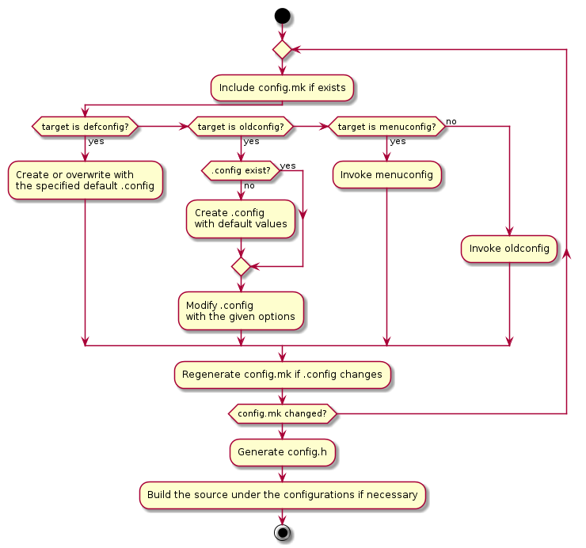

.. _hv-config:

Compile-time Configuration
##########################

The hypervisor provides a kconfig-like way for manipulating compile-time
configurations. Basically the hypervisor defines a set of configuration
symbols and declare their default value. A configuration file is
created, containing the values of each symbol, before building the
sources.

Similar to Linux kconfig, there are three files involved:

-  **.config** This files stores the values of all configuration
   symbols.

-  **config.mk** This file is a conversion of .config in Makefile
   syntax, and can be included in makefiles so that the build
   process can rely on the configurations.

-  **config.h** This file is a conversion of .config in C syntax, and is
   automatically included in every source file so that the values of
   the configuration symbols are available in the sources.

   Hypervisor configuration and build workflow

:numref:`config-build-workflow` shows the workflow of building the
hypervisor:

1. Three targets are introduced for manipulating the configurations.

   a. **defconfig** creates a .config based on a predefined
      configuration file.

   b. **oldconfig** updates an existing .config after creating one if it
      does not exist.

   c. **menuconfig** presents a terminal UI to navigate and modify the
      configurations in an interactive manner.

2. The target oldconfig is also used to create a .config if a .config
   file does not exist when building the source directly.

3. The other two files for makefiles and C sources are regenerated after
   .config changes.

Refer to :ref:`configuration` for a complete list of configuration symbols.
