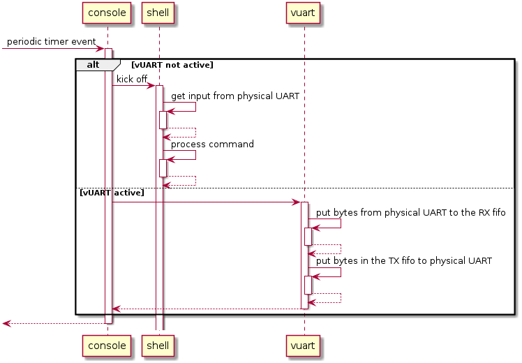
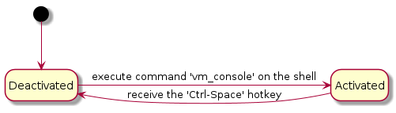

.. _hv-console-shell-uart:

Hypervisor console, hypervisor shell, and virtual UART
######################################################

.. _hv-console:

Hypervisor console
******************

The hypervisor console is a text-based terminal accessible from UART.
:numref:`console-processing` shows the workflow of the console:

   Periodic console processing

A periodic timer is set on initialization to trigger console processing every 40ms.
Processing behavior depends on whether the vUART
is active:

- If it is not active, the hypervisor shell is kicked to handle
  inputs from the physical UART, if there are any.

- If the vUART is active, the bytes from
  the physical UART are redirected to the RX fifo of the vUART, and those
  in the vUART TX fifo to the physical UART.

.. note:: The console is only available in the debug version of the hypervisor,
   configured at compile time. In the release version, the console is
   disabled and the physical UART is not used by the hypervisor or Service VM.

Hypervisor shell
****************

For debugging, the hypervisor shell provides commands to list some
internal states and statistics of the hypervisor. It is accessible on
the physical UART only when the vUART is deactivated. See
:ref:`acrnshell` for the list of available hypervisor shell commands.

Virtual UART
************

Currently UART 16550 is owned by the hypervisor itself and used for
debugging purposes. Properties are configured by hypervisor command
line. Hypervisor emulates a UART device with 0x3F8 address to Service VM that
acts as the console of Service VM with these features:

-  The vUART is exposed via I/O port 0x3f8.
-  Incorporate a 256-byte RX buffer and 65536 TX buffer.
-  Full emulation of input/output bytes and related interrupts.
-  For other read-write registers the value is stored without effects
   and reads get the latest stored value. For read-only registers
   writes are ignored.
-  vUART activation via shell command and deactivate via hotkey.

The following diagram shows the activation state transition of vUART.

   Periodic console processing

Specifically:

-  After initialization vUART is disabled.
-  The vUART is activated after the command "vm_console" is executed on
   the hypervisor shell. Inputs to the physical UART will be
   redirected to the vUART starting from the next timer event.

-  The vUART is deactivated after a :kbd:`Ctrl` + :kbd:`Space` hotkey is received
   from the physical UART. Inputs to the physical UART will be
   handled by the hypervisor shell starting from the next timer
   event.

The workflows are described as follows:

-  RX flow:

   -  Characters are read from UART HW into a sbuf whose size is 2048
      bytes, triggered by console_read

   -  Characters are read from this sbuf and put to rxFIFO,
      triggered by vuart_console_rx_chars

   -  A virtual interrupt is sent to Service VM, triggered by a read from
      Service VM. Characters in rxFIFO are sent to Service VM by emulation of
      read of register UART16550_RBR

-  TX flow:

   -  Characters are put to txFIFO by emulation of write of register
      UART16550_THR

   -  Characters in txFIFO are read out one by one and sent to console
      by printf,  triggered by vuart_console_tx_chars

   -  Implementation of printf is based on console, which finally sends
      characters to UART HW by writing to register UART16550_RBR
