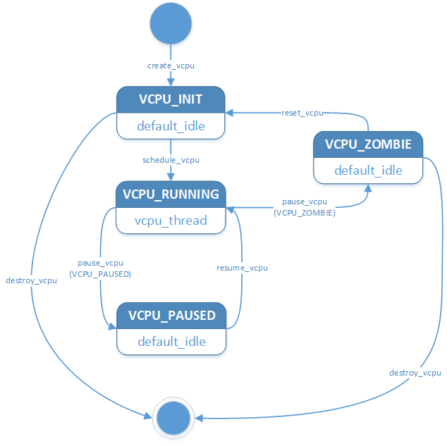
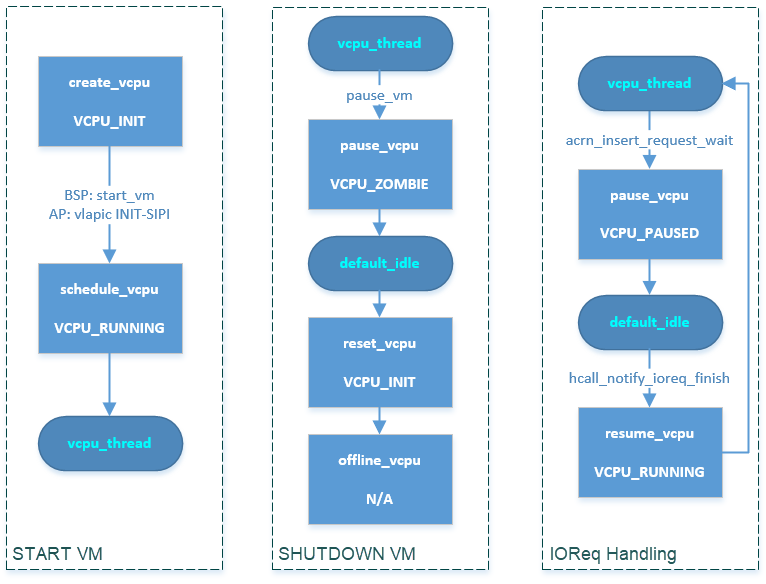
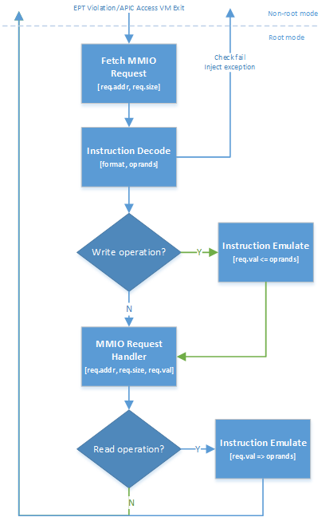

.. _hv-cpu-virt:

CPU Virtualization
##################

.. figure:: images/hld-image47.png
   :align: center
   :name: hv-cpu-virt-components

   ACRN Hypervisor CPU Virtualization Components

The following sections discuss the major modules (indicated above in blue)
in the CPU virtualization overview shown in :numref:`hv-cpu-virt-components`.

Based on Intel VT-x virtualization technology, ACRN emulates a virtual CPU
(vCPU) with the following methods:

-  **core partition**: one vCPU is dedicated and associated with one
   physical CPU (pCPU),
   making much of the hardware register emulation simply
   passthrough. This method provides good isolation for physical interrupts
   and guest execution.  (See `Static CPU Partitioning`_ for more
   information.)

-  **core sharing** (to be added): two or more vCPUs share one
   physical CPU (pCPU). A more complicated context switch is needed
   between different vCPUs' switching. This method provides flexible computing
   resources sharing for low-performance demand vCPU tasks.
   (See `Flexible CPU Sharing`_ for more information.)

-  **simple schedule**: a well-designed scheduler framework that allows ACRN
   to adopt different scheduling policies, such as the **noop** and **round-robin**:

   - **noop scheduler**: only two thread loops are maintained for a CPU: a
     vCPU thread and a default idle thread. A CPU runs most of the time in
     the vCPU thread for emulating a guest CPU, switching between VMX root
     mode and non-root mode. A CPU schedules out to default idle when an
     operation needs it to stay in VMX root mode, such as when waiting for
     an I/O request from the Device Model (DM) or when ready to destroy.

   - **round-robin scheduler** (to be added): allows more vCPU thread loops
     to run on a CPU. A CPU switches among different vCPU threads and default
     idle threads as it runs out corresponding timeslices or necessary
     scheduling outs such as waiting for an I/O request. A vCPU can yield
     itself as well, such as when it executes a "PAUSE" instruction.

Static CPU Partitioning
***********************

CPU partitioning is a policy for mapping a virtual
CPU (vCPU) to a physical CPU. To enable this feature, the ACRN hypervisor can
configure a noop scheduler as the schedule policy for this physical CPU.

ACRN then forces a fixed 1:1 mapping between a vCPU and this physical CPU
when creating a vCPU for the guest operating system. This makes the vCPU
management code much simpler.

ACRN uses the ``cpu_affinity`` parameter in ``vm config`` to decide which
physical CPU to map to a vCPU in a VM, then finalizes the fixed mapping. When
launching a User VM, need to choose pCPUs from the VM's ``cpu_affinity`` that
are not used by any other VMs.

Flexible CPU Sharing
********************

To enable CPU sharing, the ACRN hypervisor can configure the BVT
(Borrowed Virtual Time) scheduler policy.

The ``cpu_affinity`` parameter in ``vm config`` indicates all the physical CPUs
on which this VM is allowed to run. A pCPU can be shared among a Service VM and
any User VM as long as the local APIC passthrough is not enabled in that User
VM.

See :ref:`cpu_sharing` for more information.

.. _hv-cpu-virt-cpu-mgmt-partition:

CPU Management in the Service VM Under Static CPU Partitioning
**************************************************************

With ACRN, all ACPI table entries are passthrough to the Service VM, including
the Multiple Interrupt Controller Table (MADT). The Service VM sees all
physical CPUs by parsing the MADT when the Service VM kernel boots. All
physical CPUs are initially assigned to the Service VM by creating the same
number of virtual CPUs.

After the Service VM boots, it releases the physical CPUs intended
for User VM use.

Here is an example flow of CPU allocation on a multi-core platform.

   CPU Allocation on a Multi-core Platform

CPU Management in the Service VM Under Flexible CPU Sharing
***********************************************************

The Service VM sees all physical CPUs via the MADT, as described in
:ref:`hv-cpu-virt-cpu-mgmt-partition`. However, the Service VM does not release
the physical CPUs intended for User VM use.

CPU Management in the User VM
*****************************

The ``cpu_affinity`` parameter in ``vm config`` defines a set of pCPUs that a
User VM is allowed to run on. The Device Model can launch a User VM on only a
subset of the pCPUs or on all pCPUs listed in ``cpu_affinity``, but it cannot
assign any pCPU that is not included in it.

CPU Assignment Management in the Hypervisor
*******************************************

The physical CPU assignment is predefined by ``cpu_affinity`` in
``vm config``, while post-launched VMs could be launched on pCPUs that are
a subset of it.

The ACRN hypervisor does not support virtual CPU migration to
different physical CPUs. No changes to the mapping of the virtual CPU to
physical CPU can happen without first calling ``offline_vcpu``.

.. _vCPU_lifecycle:

vCPU Lifecycle
**************

A vCPU lifecycle is shown in :numref:`hv-vcpu-transitions` below, where
the major states are:

-  **VCPU_INIT**: vCPU is in an initialized state, and its vCPU thread
   is not ready to run on its associated CPU.

-  **VCPU_RUNNING**: vCPU is running, and its vCPU thread is ready (in
   the queue) or running on its associated CPU.

-  **VCPU_PAUSED**: vCPU is paused, and its vCPU thread is not running
   on its associated CPU.

-  **VPCU_ZOMBIE**: vCPU is transitioning to an offline state, and its vCPU thread is
   not running on its associated CPU.

-  **VPCU_OFFLINE**: vCPU is offline.

   ACRN vCPU State Transitions

The following functions are used to drive the state machine of the vCPU
lifecycle:

.. doxygenfunction:: create_vcpu
   :project: Project ACRN

.. doxygenfunction:: zombie_vcpu
   :project: Project ACRN

.. doxygenfunction:: reset_vcpu
   :project: Project ACRN

.. doxygenfunction:: offline_vcpu
   :project: Project ACRN

vCPU Scheduling Under Static CPU Partitioning
*********************************************

.. figure:: images/hld-image35.png
   :align: center
   :name: hv-vcpu-schedule

   ACRN vCPU Scheduling Flow Under Static CPU Partitioning

For static CPU partitioning, ACRN implements a simple scheduling mechanism
based on two threads: vcpu_thread and default_idle. A vCPU in the
VCPU_RUNNING state always runs in a vcpu_thread loop.
A vCPU in the VCPU_PAUSED or VCPU_ZOMBIE state runs in a default_idle
loop. The behaviors in the vcpu_thread and default_idle threads
are illustrated in :numref:`hv-vcpu-schedule`:

-  The **vcpu_thread** loop will do the loop of handling VM exits,
   and pending requests around the VM entry/exit.
   It will also check the reschedule request then schedule out to
   default_idle if necessary. See `vCPU Thread`_ for more details
   about vcpu_thread.

-  The **default_idle** loop simply does do_cpu_idle while also
   checking for need-offline and reschedule requests.
   If a CPU is marked as need-offline, it will go to cpu_dead.
   If a reschedule request is made for this CPU, it will
   schedule out to vcpu_thread if necessary.

-  The function ``make_reschedule_request`` drives the thread
   switch between vcpu_thread and default_idle.

Some example scenario flows are shown here:

   ACRN vCPU Scheduling Scenarios

-  **During VM startup**: after a vCPU is created, the bootstrap processor (BSP)
   calls *launch_vcpu* through *start_vm*. The application processor (AP) calls
   *launch_vcpu* through vLAPIC INIT-SIPI emulation. Finally, this vCPU runs in
   a *vcpu_thread* loop.

-  **During VM shutdown**: *pause_vm* function forces a vCPU
   running in *vcpu_thread* to schedule out to *default_idle*. The
   following *reset_vcpu*  and *offline_vcpu* de-init and then offline
   this vCPU instance.

-  **During IOReq handling**: after an IOReq is sent to DM for emulation, a
   vCPU running in *vcpu_thread* schedules out to *default_idle*
   through *acrn_insert_request_wait->pause_vcpu*. After the DM
   completes the emulation for this IOReq, it calls
   *hcall_notify_ioreq_finish->resume_vcpu* and changes the vCPU
   schedule back to *vcpu_thread* to continue its guest execution.

vCPU Scheduling Under Flexible CPU Sharing
******************************************

To be added.

vCPU Thread
***********

The vCPU thread flow is a loop as shown and described below:

.. figure:: images/hld-image68.png
   :align: center

   ACRN vCPU Thread

1. Check if *vcpu_thread* needs to schedule out to *default_idle* or
   other *vcpu_thread* by reschedule request. If needed, then schedule
   out to *default_idle* or other *vcpu_thread*.

2. Handle pending request by calling *acrn_handle_pending_request*.
   (See `Pending Request Handlers`_.)

3. VM Enter by calling *start/run_vcpu*, then enter non-root mode to do
   guest execution.

4. VM Exit from *start/run_vcpu* when the guest triggers a VM exit reason in
   non-root mode.

5. Handle VM exit based on specific reason.

6. Loop back to step 1.

vCPU Run Context
================

During a vCPU switch between root and non-root mode, the run context of
the vCPU is saved and restored using this structure:

.. doxygenstruct:: run_context
   :project: Project ACRN

The vCPU handles runtime context saving by three different
categories:

-  Always save/restore during VM exit/entry:

   -  These registers must be saved for each VM exit, and restored
      for each VM entry
   -  Registers include: general purpose registers, CR2, and
      IA32_SPEC_CTRL
   -  Definition in *vcpu->run_context*
   -  Get/Set them through *vcpu_get/set_xxx*

-  On-demand cache/update during VM exit/entry:

   -  These registers are used frequently. They should be cached from
      VMCS on first time access after a VM exit, and updated to VMCS on
      VM entry if marked dirty
   -  Registers include: RSP, RIP, EFER, RFLAGS, CR0, and CR4
   -  Definition in *vcpu->run_context*
   -  Get/Set them through *vcpu_get/set_xxx*

-  Always read/write from/to VMCS:

   -  These registers are rarely used. Access to them is always
      from/to VMCS.
   -  Registers are in VMCS but not list in the two cases above.
   -  No definition in *vcpu->run_context*
   -  Get/Set them through VMCS API

For the first two categories above, ACRN provides these get/set APIs:

.. doxygenfunction:: vcpu_get_gpreg
   :project: Project ACRN

.. doxygenfunction:: vcpu_set_gpreg
   :project: Project ACRN

.. doxygenfunction:: vcpu_get_rip
   :project: Project ACRN

.. doxygenfunction:: vcpu_set_rip
   :project: Project ACRN

.. doxygenfunction:: vcpu_get_rsp
   :project: Project ACRN

.. doxygenfunction:: vcpu_set_rsp
   :project: Project ACRN

.. doxygenfunction:: vcpu_get_efer
   :project: Project ACRN

.. doxygenfunction:: vcpu_set_efer
   :project: Project ACRN

.. doxygenfunction:: vcpu_get_rflags
   :project: Project ACRN

.. doxygenfunction:: vcpu_set_rflags
   :project: Project ACRN

.. doxygenfunction:: vcpu_get_cr0
   :project: Project ACRN

.. doxygenfunction:: vcpu_set_cr0
   :project: Project ACRN

.. doxygenfunction:: vcpu_get_cr2
   :project: Project ACRN

.. doxygenfunction:: vcpu_set_cr2
   :project: Project ACRN

.. doxygenfunction:: vcpu_get_cr4
   :project: Project ACRN

.. doxygenfunction:: vcpu_set_cr4
   :project: Project ACRN

VM Exit Handlers
================

ACRN implements its VM exit handlers with a static table. Except for the
exit reasons listed below, a default *unhandled_vmexit_handler* is used
that will trigger an error message and return without handling:

.. list-table::
   :widths: 33 33 33
   :header-rows: 1

   * - **VM Exit Reason**
     - **Handler**
     - **Description**

   * - VMX_EXIT_REASON_EXCEPTION_OR_NMI
     - exception_vmexit_handler
     - Only trap #MC, print error then inject back to guest

   * - VMX_EXIT_REASON_EXTERNAL_INTERRUPT
     - external_interrupt_vmexit_handler
     - External interrupt handler for physical interrupt happening in non-root mode

   * - VMX_EXIT_REASON_TRIPLE_FAULT
     - triple_fault_vmexit_handler
     - Handle triple fault from vCPU

   * - VMX_EXIT_REASON_INIT_SIGNAL
     - init_signal_vmexit_handler
     - Handle INIT signal from vCPU

   * - VMX_EXIT_REASON_INTERRUPT_WINDOW
     - interrupt_window_vmexit_handler
     - To support interrupt window if VID is disabled

   * - VMX_EXIT_REASON_CPUID
     - cpuid_vmexit_handler
     - Handle CPUID access from guest

   * - VMX_EXIT_REASON_VMCALL
     - vmcall_vmexit_handler
     - Handle hypercall from guest

   * - VMX_EXIT_REASON_CR_ACCESS
     - cr_access_vmexit_handler
     - Handle CR registers access from guest

   * - VMX_EXIT_REASON_IO_INSTRUCTION
     - pio_instr_vmexit_handler
     - Emulate I/O access with range in IO_BITMAP,
       which may have a handler in hypervisor (such as vUART or vPIC),
       or need to create an I/O request to DM

   * - VMX_EXIT_REASON_RDMSR
     - rdmsr_vmexit_handler
     - Read MSR from guest in MSR_BITMAP

   * - VMX_EXIT_REASON_WRMSR
     - wrmsr_vmexit_handler
     - Write MSR from guest in MSR_BITMAP

   * - VMX_EXIT_REASON_APIC_ACCESS
     - apic_access_vmexit_handler
     - APIC access for APICv

   * - VMX_EXIT_REASON_VIRTUALIZED_EOI
     - veoi_vmexit_handler
     - Trap vLAPIC EOI for specific vector with level trigger mode
       in vIOAPIC, required for supporting PTdev

   * - VMX_EXIT_REASON_EPT_VIOLATION
     - ept_violation_vmexit_handler
     - MMIO emulation, which may have handler in hypervisor
       (such as vLAPIC or vIOAPIC), or need to create an I/O
       request to DM

   * - VMX_EXIT_REASON_XSETBV
     - xsetbv_vmexit_handler
     - Set host owned XCR0 for supporting xsave

   * - VMX_EXIT_REASON_APIC_WRITE
     - apic_write_vmexit_handler
     - APIC write for APICv

Details of each VM exit reason handler are described in other sections.

.. _pending-request-handlers:

Pending Request Handlers
========================

ACRN uses the function *acrn_handle_pending_request* to handle
requests before VM entry in *vcpu_thread*.

A bitmap in the vCPU structure lists the different requests:

.. code-block:: c

   #define ACRN_REQUEST_EXCP 0U
   #define ACRN_REQUEST_EVENT 1U
   #define ACRN_REQUEST_EXTINT 2U
   #define ACRN_REQUEST_NMI 3U
   #define ACRN_REQUEST_EOI_EXIT_BITMAP_UPDATE 4U
   #define ACRN_REQUEST_EPT_FLUSH 5U
   #define ACRN_REQUEST_TRP_FAULT 6U
   #define ACRN_REQUEST_VPID_FLUSH 7U /* flush vpid tlb */

ACRN provides the function *vcpu_make_request* to make different
requests, set the bitmap of the corresponding request, and notify the target
vCPU through the IPI if necessary (when the target vCPU is not
running). See :ref:`vcpu-request-interrupt-injection` for details.

.. code-block:: c

   void vcpu_make_request(struct vcpu *vcpu, uint16_t eventid)
   {
      uint16_t pcpu_id = pcpuid_from_vcpu(vcpu);

      bitmap_set_lock(eventid, &vcpu->arch_vcpu.pending_req);
      /*
       * if current hostcpu is not the target vcpu's hostcpu, we need
       * to invoke IPI to wake up target vcpu
       *
       * TODO: Here we just compare with cpuid, since cpuid is
       *  global under pCPU / vCPU 1:1 mapping. If later we enabled vcpu
       *  scheduling, we need change here to determine it target vcpu is
       *  VMX non-root or root mode
       */
      if (get_cpu_id() != pcpu_id) {
              send_single_ipi(pcpu_id, VECTOR_NOTIFY_VCPU);
      }
   }

The function *acrn_handle_pending_request* handles each
request as shown below.

.. list-table::
   :widths: 25 25 25 25
   :header-rows: 1

   * - **Request**
     - **Description**
     - **Request Maker**
     - **Request Handler**

   * - ACRN_REQUEST_EXCP
     - Request for exception injection
     - vcpu_inject_gp, vcpu_inject_pf, vcpu_inject_ud, vcpu_inject_ac,
       or vcpu_inject_ss and then queue corresponding exception by
       vcpu_queue_exception
     - vcpu_inject_hi_exception, vcpu_inject_lo_exception based
       on exception priority

   * - ACRN_REQUEST_EVENT
     - Request for vLAPIC interrupt vector injection
     - vlapic_fire_lvt or vlapic_set_intr, which could be triggered
       by vlapic lvt, vioapic, or vmsi
     - vcpu_do_pending_event

   * - ACRN_REQUEST_EXTINT
     - Request for extint vector injection
     - vcpu_inject_extint, triggered by vPIC
     - vcpu_do_pending_extint

   * - ACRN_REQUEST_NMI
     - Request for nmi injection
     - vcpu_inject_nmi
     - Program VMX_ENTRY_INT_INFO_FIELD directly

   * - ACRN_REQUEST_EOI_EXIT_BITMAP_UPDATE
     - Request for VEOI bitmap update for level triggered vector
     - vlapic_reset_tmr or vlapic_set_tmr change trigger mode in RTC
     - vcpu_set_vmcs_eoi_exit

   * - ACRN_REQUEST_EPT_FLUSH
     - Request for EPT flush
     - ept_add_mr, ept_modify_mr, ept_del_mr, or vmx_write_cr0 disable cache
     - invept

   * - ACRN_REQUEST_TRP_FAULT
     - Request for handling triple fault
     - vcpu_queue_exception meet triple fault
     - fatal error

   * - ACRN_REQUEST_VPID_FLUSH
     - Request for VPID flush
     - None
     - flush_vpid_single

.. note:: Refer to the interrupt management chapter for request
   handling order for exception, nmi, and interrupts. For other requests
   such as tmr update, or EPT flush, there is no mandatory order.

VMX Initialization
******************

ACRN attempts to initialize the vCPU's VMCS before its first
launch. ACRN sets the host state, execution control, guest state,
entry control, and exit control, as shown in the table below.

The table briefly shows how each field is configured.
The guest state field is critical for running a guest CPU
based on different CPU modes.

For a guest vCPU's state initialization:

-  If it's BSP, the guest state configuration is done in software load,
   which can be initialized by different objects:

   -  Service VM BSP: Hypervisor does context initialization in different
      software load based on different boot mode

   -  User VM BSP: DM context initialization through hypercall

-  If it's AP, it always starts from real mode, and the start
   vector always comes from vLAPIC INIT-SIPI emulation.

.. doxygenstruct:: acrn_regs
   :project: Project ACRN

.. list-table::
   :widths: 20 40 10 30
   :header-rows: 1

   * - **VMX Domain**
     - **Fields**
     - **Bits**
     - **Description**

   * - **host state**
     - CS, DS, ES, FS, GS, TR, LDTR, GDTR, IDTR
     - n/a
     - According to host

   * -
     - MSR_IA32_PAT, MSR_IA32_EFER
     - n/a
     - According to host

   * -
     - CR0, CR3, CR4
     - n/a
     - According to host

   * -
     - RIP
     - n/a
     - Set to vm_exit pointer

   * -
     - IA32_SYSENTER_CS/ESP/EIP
     - n/a
     - Set to 0

   * - **execution control**
     - VMX_PIN_VM_EXEC_CONTROLS
     - 0
     - Enable external-interrupt exiting

   * -
     -
     - 7
     - Enable posted interrupts

   * -
     - VMX_PROC_VM_EXEC_CONTROLS
     - 3
     - Use TSC offsetting

   * -
     -
     - 21
     - Use TPR shadow

   * -
     -
     - 25
     - Use I/O bitmaps

   * -
     -
     - 28
     - Use MSR bitmaps

   * -
     -
     - 31
     - Activate secondary controls

   * -
     - VMX_PROC_VM_EXEC_CONTROLS2
     - 0
     - Virtualize APIC accesses

   * -
     -
     - 1
     - Enable EPT

   * -
     -
     - 3
     - Enable RDTSCP

   * -
     -
     - 5
     - Enable VPID

   * -
     -
     - 7
     - Unrestricted guest

   * -
     -
     - 8
     - APIC-register virtualization

   * -
     -
     - 9
     - Virtual-interrupt delivery

   * -
     -
     - 20
     - Enable XSAVES/XRSTORS

   * - **guest state**
     - CS, DS, ES, FS, GS, TR, LDTR, GDTR, IDTR
     - n/a
     - According to vCPU mode and init_ctx

   * -
     - RIP, RSP
     - n/a
     - According to vCPU mode and init_ctx

   * -
     - CR0, CR3, CR4
     - n/a
     - According to vCPU mode and init_ctx

   * -
     - GUEST_IA32_SYSENTER_CS/ESP/EIP
     - n/a
     - Set to 0

   * -
     - GUEST_IA32_PAT
     - n/a
     - Set to PAT_POWER_ON_VALUE

   * - **entry control**
     - VMX_ENTRY_CONTROLS
     - 2
     - Load debug controls

   * -
     -
     - 14
     - Load IA32_PAT

   * -
     -
     - 15
     - Load IA23_EFER

   * - **exit control**
     - VMX_EXIT_CONTROLS
     - 2
     - Save debug controls

   * -
     -
     - 9
     - Host address space size

   * -
     -
     - 15
     - Acknowledge Interrupt on exit

   * -
     -
     - 18
     - Save IA32_PAT

   * -
     -
     - 19
     - Load IA32_PAT

   * -
     -
     - 20
     - Save IA32_EFER

   * -
     -
     - 21
     - Load IA32_EFER

CPUID Virtualization
********************

CPUID access from a guest would cause VM exits unconditionally if executed
as a VMX non-root operation. ACRN must return the emulated processor
identification and feature information in the EAX, EBX, ECX, and EDX
registers.

To simplify, ACRN returns the same values from the physical CPU for most
of the CPUID, and specially handles a few CPUID features that are APIC
ID related such as CPUID.01H.

ACRN emulates some extra CPUID features for the hypervisor as well.

The per-vm *vcpuid_entries* array is initialized during VM creation
and used to cache most of the CPUID entries for each VM.  During guest
CPUID emulation, ACRN reads the cached value from this array, except
some APIC ID-related CPUID data emulated at runtime.

This table describes details for CPUID emulation:

.. list-table::
   :widths: 20 80
   :header-rows: 1

   * - **CPUID**
     - **Emulation Description**

   * - 01H
     - - Get original value from physical CPUID
       - Fill APIC ID from vLAPIC
       - Disable x2APIC
       - Disable PCID
       - Disable VMX
       - Disable XSAVE if host not enabled

   * - 0BH
     - - Fill according to X2APIC feature support (default is disabled)
       - If not supported, fill all registers with 0
       - If supported, get from physical CPUID

   * - 0DH
     - - Fill according to XSAVE feature support
       - If not supported, fill all registers with 0
       - If supported, get from physical CPUID

   * - 07H
     - - Get from per-vm CPUID entries cache
       - For subleaf 0, disabled INVPCID, Intel RDT

   * - 16H
     - - Get from per-vm CPUID entries cache
       - If physical CPU supports CPUID.16H, read from physical CPUID
       - If physical CPU does not support it, emulate with TSC frequency

   * - 40000000H
     - - Get from per-vm CPUID entries cache
       - EAX: the maximum input value for CPUID supported by ACRN (40000010)
       - EBX, ECX, EDX: hypervisor vendor ID signature - "ACRNACRNACRN"

   * - 40000010H
     - - Get from per-vm CPUID entries cache
       - EAX: virtual TSC frequency in kHz
       - EBX, ECX, EDX: reserved to 0

   * - 0AH
     - - PMU disabled

   * - 0FH, 10H
     - - Intel RDT disabled

   * - 12H
     - - Fill according to SGX virtualization

   * - 14H
     - - Intel Processor Trace disabled

   * - Others
     - - Get from per-vm CPUID entries cache

.. note:: ACRN needs to take care of
   some CPUID values that can change at runtime, for example, the XD feature in
   CPUID.80000001H may be cleared by the MISC_ENABLE MSR.

MSR Virtualization
******************

ACRN always enables an MSR bitmap in the *VMX_PROC_VM_EXEC_CONTROLS* VMX
execution control field. This bitmap marks the MSRs to cause a VM
exit upon guest access for both read and write. The VM
exit reason for reading or writing these MSRs is respectively
*VMX_EXIT_REASON_RDMSR* or *VMX_EXIT_REASON_WRMSR* and the VM exit
handler is *rdmsr_vmexit_handler* or *wrmsr_vmexit_handler*.

This table shows the predefined MSRs that ACRN will trap for all the guests. For
the MSRs whose bitmap values are not set in the MSR bitmap, guest access will be
passthrough directly:

.. list-table::
   :widths: 33 33 33
   :header-rows: 1

   * - **MSR**
     - **Description**
     - **Handler**

   * - MSR_IA32_TSC_ADJUST
     - TSC adjustment of local APIC's TSC deadline mode
     - Emulates with vLAPIC

   * - MSR_IA32_TSC_DEADLINE
     - TSC target of local APIC's TSC deadline mode
     - Emulates with vLAPIC

   * - MSR_IA32_BIOS_UPDT_TRIG
     - BIOS update trigger
     - Update microcode from the Service VM, the signature ID read is from
       physical MSR, and a BIOS update trigger from the Service VM will trigger a
       physical microcode update.

   * - MSR_IA32_BIOS_SIGN_ID
     - BIOS update signature ID
     - \"

   * - MSR_IA32_TIME_STAMP_COUNTER
     - Time-stamp counter
     - Work with VMX_TSC_OFFSET_FULL to emulate virtual TSC

   * - MSR_IA32_APIC_BASE
     - APIC base address
     - Emulates with vLAPIC

   * - MSR_IA32_PAT
     - Page-attribute table
     - Save/restore in vCPU, write to VMX_GUEST_IA32_PAT_FULL if cr0.cd is 0

   * - MSR_IA32_PERF_CTL
     - Performance control
     - Trigger real P-state change if P-state is valid when writing,
       fetch physical MSR when reading

   * - MSR_IA32_FEATURE_CONTROL
     - Feature control bits that configure operation of VMX and SMX
     - Disabled, locked

   * - MSR_IA32_MCG_CAP/STATUS
     - Machine-Check global control/status
     - Emulates with vMCE

   * - MSR_IA32_MISC_ENABLE
     - Miscellaneous feature control
     - Read-only, except MONITOR/MWAIT enable bit

   * - MSR_IA32_SGXLEPUBKEYHASH0/1/2/3
     - SHA256 digest of the authorized launch enclaves
     - Emulates with vSGX

   * - MSR_IA32_SGX_SVN_STATUS
     - Status and SVN threshold of SGX support for ACM
     - Read-only, emulates with vSGX

   * - MSR_IA32_MTRR_CAP
     - Memory type range register related
     - Handled by MTRR emulation

   * - MSR_IA32_MTRR_DEF_TYPE
     - \"
     - \"

   * - MSR_IA32_MTRR_PHYSBASE_0~9
     - \"
     - \"

   * - MSR_IA32_MTRR_FIX64K_00000
     - \"
     - \"

   * - MSR_IA32_MTRR_FIX16K_80000/A0000
     - \"
     - \"

   * - MSR_IA32_MTRR_FIX4K_C0000~F8000
     - \"
     - \"

   * - MSR_IA32_X2APIC_*
     - x2APIC related MSRs (offset from 0x800 to 0x900)
     - Emulates with vLAPIC

   * - MSR_IA32_L2_MASK_BASE~n
     - L2 CAT mask for CLOSn
     - Disabled for guest access

   * - MSR_IA32_L3_MASK_BASE~n
     - L3 CAT mask for CLOSn
     - Disabled for guest access

   * - MSR_IA32_MBA_MASK_BASE~n
     - MBA delay mask for CLOSn
     - Disabled for guest access

   * - MSR_IA32_VMX_BASIC~VMX_TRUE_ENTRY_CTLS
     - VMX related MSRs
     - Not supported, access will inject #GP

CR Virtualization
*****************

ACRN emulates ``mov to cr0``, ``mov to cr4``, ``mov to cr8``, and ``mov
from cr8`` through *cr_access_vmexit_handler* based on
*VMX_EXIT_REASON_CR_ACCESS*.

.. note::  ``mov to cr8`` and ``mov from cr8`` are
   not valid as ``CR8-load/store exiting`` bits are set as 0 in
   *VMX_PROC_VM_EXEC_CONTROLS*.

A VM can ``mov from cr0`` and ``mov from
cr4`` without triggering a VM exit. The values read are the read shadows
of the corresponding register in VMCS. The shadows are updated by the
hypervisor on CR writes.

.. list-table::
   :widths: 30 70
   :header-rows: 1

   * - **Operation**
     - **Handler**

   * - mov to cr0
     - Based on vCPU set context API: vcpu_set_cr0 -> vmx_write_cr0

   * - mov to cr4
     - Based on vCPU set context API: vcpu_set_cr4 -> vmx_write_cr4

   * - mov to cr8
     - Based on vLAPIC tpr API: vlapic_set_cr8 -> vlapic_set_tpr

   * - mov from cr8
     - Based on vLAPIC tpr API: vlapic_get_cr8 -> vlapic_get_tpr

For ``mov to cr0`` and ``mov to cr4``, ACRN sets
*cr0_host_mask/cr4_host_mask* into *VMX_CR0_MASK/VMX_CR4_MASK*
for the bitmask causing VM exit.

As ACRN always enables ``unrestricted guest`` in
*VMX_PROC_VM_EXEC_CONTROLS2*, *CR0.PE* and *CR0.PG* can be
controlled by the guest.

.. list-table::
   :widths: 20 40 40
   :header-rows: 1

   * - **CR0 MASK**
     - **Value**
     - **Comments**

   * - cr0_always_on_mask
     - fixed0 & (~(CR0_PE | CR0_PG))
     - fixed0 comes from MSR_IA32_VMX_CR0_FIXED0, these bits
       are fixed to be 1 under VMX operation.

   * - cr0_always_off_mask
     - ~fixed1
     - ~fixed1 comes from MSR_IA32_VMX_CR0_FIXED1, these bits
       are fixed to be 0 under VMX operation.

   * - CR0_TRAP_MASK
     - CR0_PE | CR0_PG | CR0_WP | CR0_CD | CR0_NW
     - ACRN will also trap PE, PG, WP, CD, and  NW bits.

   * - cr0_host_mask
     - ~(fixed0 ^ fixed1) | CR0_TRAP_MASK
     - ACRN will finally trap bits under VMX root mode control plus
       additionally added bits.

For ``mov to cr0`` emulation, ACRN will handle a paging mode change based on
PG bit change, and a cache mode change based on CD and NW bits changes.
ACRN also takes care of  illegal writing from a guest to invalid
CR0 bits (for example, set PG while CR4.PAE = 0 and IA32_EFER.LME = 1),
which will finally inject a #GP to the guest. Finally,
*VMX_CR0_READ_SHADOW* will be updated for guest reading of host
controlled bits, and *VMX_GUEST_CR0* will be updated for real vmx cr0
setting.

.. list-table::
   :widths: 20 40 40
   :header-rows: 1

   * - **CR4 MASK**
     - **Value**
     - **Comments**

   * - cr4_always_on_mask
     - fixed0
     - fixed0 comes from MSR_IA32_VMX_CR4_FIXED0, these bits
       are fixed to be 1 under VMX operation

   * - cr4_always_off_mask
     - ~fixed1
     - ~fixed1 comes from MSR_IA32_VMX_CR4_FIXED1, these bits
       are fixed to be 0 under VMX operation

   * - CR4_TRAP_MASK
     - CR4_PSE | CR4_PAE | CR4_VMXE | CR4_PCIDE | CR4_SMEP | CR4_SMAP | CR4_PKE
     - ACRN will also trap PSE, PAE, VMXE, and PCIDE bits

   * - cr4_host_mask
     - ~(fixed0 ^ fixed1) | CR4_TRAP_MASK
     - ACRN will finally trap bits under VMX root mode control plus
       additionally added bits

The ``mov to cr4`` emulation is similar to cr0 emulation noted above.

.. _io-mmio-emulation:

IO/MMIO Emulation
*****************

ACRN always enables an I/O bitmap in *VMX_PROC_VM_EXEC_CONTROLS* and EPT
in *VMX_PROC_VM_EXEC_CONTROLS2*. Based on them,
*pio_instr_vmexit_handler* and *ept_violation_vmexit_handler* are
used for IO/MMIO emulation for an emulated device. The device can
be emulated by the hypervisor or DM in the Service VM.

For a device emulated by the hypervisor, ACRN provides some basic
APIs to register its IO/MMIO range:

-  For the Service VM, the default I/O bitmap values are all set to 0, which
   means the Service VM will passthrough all I/O port access by default. Adding
   an I/O handler for a hypervisor emulated device needs to first set its
   corresponding I/O bitmap to 1.

-  For the User VM, the default I/O bitmap values are all set to 1, which means
   the User VM will trap all I/O port access by default. Adding an I/O handler
   for a hypervisor emulated device does not need to change its I/O bitmap. If
   the trapped I/O port access does not fall into a hypervisor emulated device,
   it will create an I/O request and pass it to the Service VM DM.

-  For the Service VM, EPT maps the entire range of memory to the Service VM
   except for the ACRN hypervisor area. The Service VM will passthrough all
   MMIO access by default. Adding an MMIO handler for a hypervisor emulated
   device needs to first remove its MMIO range from EPT mapping.

-  For the User VM, EPT only maps its system RAM to the User VM, which means the
   User VM will trap all MMIO access by default. Adding an MMIO handler for a
   hypervisor emulated device does not need to change its EPT mapping. If the
   trapped MMIO access does not fall into a hypervisor emulated device, it will
   create an I/O request and pass it to the Service VM DM.

.. list-table::
   :widths: 30 70
   :header-rows: 1

   * - **API**
     - **Description**

   * - register_pio_emulation_handler
     - Register an I/O emulation handler for a hypervisor emulated device
       by specific I/O range.

   * - register_mmio_emulation_handler
     - Register an MMIO emulation handler for a hypervisor emulated device
       by specific MMIO range.

.. _instruction-emulation:

Instruction Emulation
*********************

ACRN implements a simple instruction emulation infrastructure for
MMIO (EPT) and APIC access emulation. When such a VM exit is triggered, the
hypervisor needs to decode the instruction from RIP then attempt the
corresponding emulation based on its instruction and read/write direction.

ACRN supports emulating instructions for ``mov``, ``movx``,
``movs``, ``stos``, ``test``, ``and``, ``or``, ``cmp``, ``sub``, and
``bittest`` without support for lock prefix.  Real mode emulation is not
supported.

   Instruction Emulation Work Flow

In the handlers for EPT violation or APIC access VM exit, ACRN will:

1. Fetch the MMIO access request's address and size.

2. Do *decode_instruction*  for the instruction in the current RIP
   with the following check:

   a. Is the instruction supported? If not, inject #UD to the guest.
   b. Is the GVA of RIP, dest, and src valid? If not, inject #PF to the guest.
   c. Is the stack valid? If not, inject #SS to the guest.

3. If step 2 succeeds, check the access direction. If it's a write, then
   do *emulate_instruction* to fetch the MMIO request's value from
   instruction operands.

4. Execute the MMIO request handler. For EPT violation, it is *emulate_io*.
   For APIC access, it is *vlapic_write/read* based on access
   direction. It will finally complete this MMIO request emulation
   by:

   a. putting req.val to req.addr for write operation
   b. getting req.val from req.addr for read operation

5. If the access direction is read, then do *emulate_instruction* to
   put the MMIO request's value into instruction operands.

6. Return to the guest.

TSC Emulation
*************

Guest vCPU execution of *RDTSC/RDTSCP* and access to
*MSR_IA32_TSC_AUX* do not cause a VM Exit to the hypervisor.
The hypervisor uses *MSR_IA32_TSC_AUX* to record CPU ID, thus
the CPU ID provided by *MSR_IA32_TSC_AUX* might be changed via the guest.

*RDTSCP* is widely used by the hypervisor to identify the current CPU ID. Due
to no VM Exit for the *MSR_IA32_TSC_AUX* MSR register, the ACRN hypervisor
saves the *MSR_IA32_TSC_AUX* value on every VM Exit and restores it on every VM Enter.
Before the hypervisor restores the host CPU ID, *rdtscp* should not be
called as it could get the vCPU ID instead of the host CPU ID.

The *MSR_IA32_TIME_STAMP_COUNTER* is emulated by the ACRN hypervisor, with a
simple implementation based on *TSC_OFFSET* (enabled
in *VMX_PROC_VM_EXEC_CONTROLS*):

-  For read: ``val = rdtsc() + exec_vmread64(VMX_TSC_OFFSET_FULL)``
-  For write: ``exec_vmwrite64(VMX_TSC_OFFSET_FULL, val - rdtsc())``

ART Virtualization
******************

The invariant TSC is based on the invariant timekeeping hardware (called
Always Running Timer or ART), which runs at the core crystal clock frequency.
The ratio defined by the CPUID leaf 15H expresses the frequency relationship
between the ART hardware and the TSC.

If CPUID.15H.EBX[31:0] != 0 and CPUID.80000007H:EDX[InvariantTSC] = 1, the
following linearity relationship holds between the TSC and the ART hardware:

   ``TSC_Value = (ART_Value * CPUID.15H:EBX[31:0]) / CPUID.15H:EAX[31:0] + K``

Where ``K`` is an offset that can be adjusted by a privileged agent.
When ART hardware is reset, both invariant TSC and K are also reset.

The guideline of ART virtualization (vART) is that software in native can run in
the VM too. The vART solution is:

-  Present the ART capability to the guest through CPUID leaf 15H for ``CPUID.15H:EBX[31:0]``
   and ``CPUID.15H:EAX[31:0]``.
-  Passthrough devices see the physical ART_Value (vART_Value = pART_Value).
-  Relationship between the ART and TSC in the guest is:
   ``vTSC_Value = (vART_Value * CPUID.15H:EBX[31:0]) / CPUID.15H:EAX[31:0] + vK``
   where ``vK = K + VMCS.TSC_OFFSET``.
-  If the guest changes ``vK`` or ``vTSC_Value``, we change the ``VMCS.TSC_OFFSET`` accordingly.
-  ``K`` should never be changed by the hypervisor.

XSAVE Emulation
***************

The XSAVE feature set is composed of eight instructions:

-  *XGETBV* and *XSETBV* allow software to read and write the extended
   control register *XCR0*, which controls the operation of the
   XSAVE feature set.

-  *XSAVE*, *XSAVEOPT*, *XSAVEC*, and *XSAVES* are four instructions
   that save the processor state to memory.

-  *XRSTOR* and *XRSTORS* are corresponding instructions that load the
   processor state from memory.

-  *XGETBV*, *XSAVE*, *XSAVEOPT*, *XSAVEC*, and *XRSTOR* can be executed
   at any privilege level.

-  *XSETBV*, *XSAVES*, and *XRSTORS* can be executed only if CPL = 0.

Enabling the XSAVE feature set is controlled by XCR0 (through XSETBV)
and IA32_XSS MSR. Refer to the `Intel SDM Volume 1`_ chapter 13 for more details.

.. _Intel SDM Volume 1:
   https://www.intel.com/content/www/us/en/architecture-and-technology/64-ia-32-architectures-software-developer-vol-1-manual.html

.. figure:: images/hld-image38.png
   :align: center

   ACRN Hypervisor XSAVE Emulation

By default, ACRN enables XSAVES/XRSTORS in
*VMX_PROC_VM_EXEC_CONTROLS2*, so it allows the guest to use the XSAVE
feature. Because guest execution of *XSETBV* will always trigger XSETBV VM
exit, ACRN actually needs to take care of XCR0 access.

ACRN emulates XSAVE features through the following rules:

1. Enumerate CPUID.01H for native XSAVE feature support.
2. If yes for step 1, enable XSAVE in the hypervisor by CR4.OSXSAVE.
3. Emulate XSAVE related CPUID.01H and CPUID.0DH to the guest.
4. Emulate XCR0 access through *xsetbv_vmexit_handler*.
5. Passthrough the access of IA32_XSS MSR to the guest.
6. ACRN hypervisor does NOT use any feature of XSAVE.
7. When ACRN emulates the vCPU with partition mode: based on above rules 5
   and 6, a guest vCPU will fully control the XSAVE feature in
   non-root mode.
