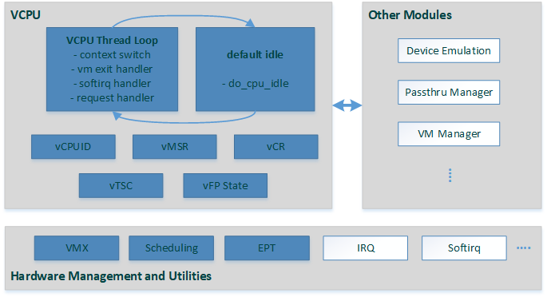
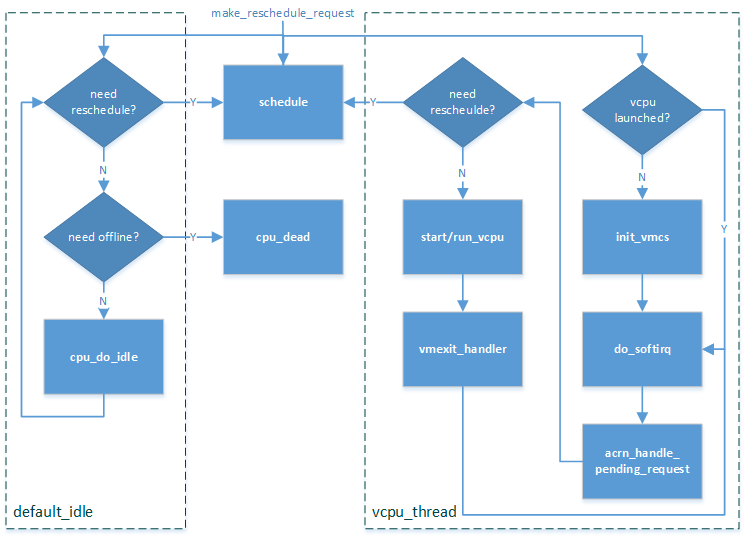
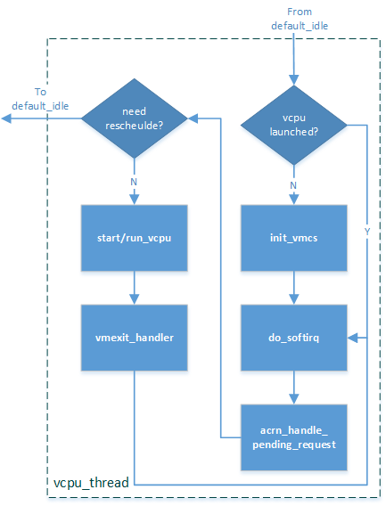

.. _hv-cpu-virt:

CPU Virtualization
##################

   ACRN Hypervisor CPU Virtualization Components

The following sections discuss the major modules (shown in blue) in the
CPU virtualization overview shown in :numref:`hv-cpu-virt-components`.

Based on Intel VT-x virtualization technology, ACRN emulates a virtual CPU
(vCPU) with the following methods:

-  **core partition**: one vCPU is dedicated and associated with one
   physical CPU (pCPU),
   making much of hardware register emulation simply
   pass-through and provides good isolation for physical interrupt
   and guest execution.  (See `Static CPU Partitioning`_ for more
   information.)

-  **simple schedule**: only two thread loops are maintained for a CPU -
   vCPU thread and default idle thread. A CPU runs most of the time in
   the vCPU thread for emulating a guest CPU, switching between VMX root
   mode and non-root mode. A CPU schedules out to default idle when an
   operation needs it to stay in VMX root mode, such as when waiting for
   an I/O request from DM or ready to destroy.

Static CPU Partitioning
***********************

CPU partitioning is a policy for mapping a virtual
CPU (VCPU) to a physical CPU. The current ACRN implementation forces a
static 1:1 mapping between VCPUs and physical CPUs and does
not support multiple VCPUs running on a physical CPU and does not
support VCPU migration from one physical CPU to another.

ACRN forces a fixed 1:1 mapping between a VCPU and a physical CPU when
creating a VCPU for the guest Operating System. This makes the VCPU
management code much simpler.

An array is used to track the physical CPU allocation information. When
a VCPU is created, we query, allocate, and update the array to map the
VCPU to an available physical CPU.

The physical CPU number assignment for each guest is pre-defined. For
example, on a platform with four CPU cores, one physical CPU is assigned
to run the Service Operating System (SOS) and other three physical CPUs
are assigned to run the User Operating System (UOS) instances.

.. note::

   To improvement SOS boot time, all physical CPUs are assigned to the SOS
   during the SOS boot. Afterward, the physical CPUs defined for the UOS
   are allocated by the Device Model (DM) by running the launch_uos.sh
   script.

CPU management in SOS
=====================

With ACRN, all ACPI table entries are pass-thru to the SOS, including
the Multiple Interrupt Controller Table (MADT). The SOS sees all
physical CPUs by parsing the MADT when the SOS  kernel boots. All
physical CPUs are initially assigned to the SOS by creating the same
number of virtual CPUs.

When the SOS boot is finished, it releases the physical CPUs intended
for UOS use.

Here is an example flow of CPU allocation on a multi-core platform.

.. figure:: images/static-core-image2.png
   :width: 600px
   :align: center
   :name: static-core-cpu-allocation

   CPU allocation on a multi-core platform

CPU management in UOS
=====================

From the UOS point of view, CPU management is very simple, using a
hypercall to create the virtual CPUs. Here's an example from from the DM
code:

.. code-block:: c

   int vm_create_vcpu(struct vmctx *ctx, uint16_t vcpu_id)
   {
      struct acrn_create_vcpu cv;
      int error;

      bzero(&cv, sizeof(struct acrn_create_vcpu));
      cv.vcpu_id = vcpu_id;
      error = ioctl(ctx->fd, IC_CREATE_VCPU, &cv);
      return error;
   }

The VHM will respond to the ioctl:

.. code-block:: c

   case IC_CREATE_VCPU: {
      struct acrn_create_vcpu cv;

      if (copy_from_user(&cv, (void *)ioctl_param,
                         sizeof(struct acrn_create_vcpu)))
         return -EFAULT;

      ret = acrn_hypercall2(HC_CREATE_VCPU, vm->vmid,
                            virt_to_phys(&cv));
      if (ret < 0) {
         pr_err("vhm: failed to create vcpu %d!\\n",
                 cv.vcpu_id);
         return -EFAULT;
      }

      atomic_inc(&vm->vcpu_num);
      return ret;
   }

The hypercall ``HC_CREATE_VCPU`` is handled in the hypervisor with
the parameter:

.. doxygenstruct:: acrn_create_vcpu
   :project: Project ACRN

CPU assignment management in HV
===============================

When we create a VCPU in the hypervisor, an available physical CPU is
picked and marked as used. When we destroy the VCPU, we mark the
physical CPU as available again.

.. figure:: images/static-core-image1.png
   :width: 600px
   :align: center
   :name: static-core-cpu-assign

   HV CPU Assignment Management

#. ``allocate_pcpu()`` queries the physical CPU allocation info to get an
   available physical CPU and marks physical CPU as not available
#. Physical CPU info is passed to ``create_vcpu()`` and a mapping is built
   between the physical CPU and virtual CPU
#. When the VCPU is destroyed VCPU, the physical CPU is passed to the
   ``free_pcpu()`` function
#. ``free_pcpu()`` marks the physical CPU available again.

Currently, the ACRN hypervisor does not support virtual CPU migration to
different physical CPUs. This means no changes to the virtual CPU to
physical CPU can happen without first calling destroy_vcpu.

.. _vCPU_lifecycle:

vCPU Lifecycle
**************

A vCPU lifecycle is shown in :numref:`hv-vcpu-transitions` below, where
the major states are:

-  **VCPU_INIT**: vCPU is in an initialized state, and its associated CPU
   is running in default_idle

-  **VCPU_RUNNING**: vCPU is running, and its associated CPU is running in
   vcpu_thread

-  **VCPU_PAUSED**: vCPU is paused, and its associated CPU is running in
   default_idle

-  **VPCU_ZOMBIE**: vCPU is being destroyed, and its associated CPU
   is running in default_idle

.. figure:: images/hld-image17.png
   :align: center
   :name: hv-vcpu-transitions

   ACRN vCPU state transitions

Following functions are used to drive the state machine of the vCPU
lifecycle:

.. doxygenfunction:: create_vcpu
   :project: Project ACRN

.. doxygenfunction:: schedule_vcpu
   :project: Project ACRN

.. doxygenfunction:: pause_vcpu
   :project: Project ACRN

.. doxygenfunction:: resume_vcpu
   :project: Project ACRN

.. doxygenfunction:: reset_vcpu
   :project: Project ACRN

.. doxygenfunction:: run_vcpu
   :project: Project ACRN

vCPU Scheduling
***************

   ACRN vCPU scheduling flow

As describes in the CPU virtualization overview, ACRN implements a simple
scheduling mechanism based on two threads: vcpu_thread and
default_idle. A vCPU with VCPU_RUNNING state always runs in
a vcpu_thread loop, meanwhile a vCPU with VCPU_PAUSED or VCPU_ZOMBIE
state runs in default_idle loop. The detail behaviors in
vcpu_thread and default_idle threads are illustrated in
:numref:`hv-vcpu-schedule`:

-  The **vcpu_thread** loop will try to initialize a vCPU's vmcs during
   its first launch and then do the loop of handling its associated
   softirq, vm exits, and pending requests around the VM entry/exit.
   It will also check the reschedule request then schedule out to
   default_idle if necessary. See `vCPU Thread`_ for more details
   of vcpu_thread.

-  The **default_idle** loop simply does do_cpu_idle while also
   checking for need-offline and reschedule requests.
   If a CPU is marked as need-offline, it will go to cpu_dead.
   If a reschedule request is made for this CPU, it will
   schedule out to vcpu_thread if necessary.

-  The function ``make_reschedule_request`` drives the thread
   switch between vcpu_thread and default_idle.

Some example scenario flows are shown here:

.. figure:: images/hld-image7.png
   :align: center

   ACRN vCPU scheduling scenarios

-  **During starting a VM**: after create a vCPU, BSP calls *schedule_vcpu*
   through *start_vm*, AP calls *schedule_vcpu* through vlapic
   INIT-SIPI emulation, finally this vCPU runs in a
   *vcpu_thread* loop.

-  **During shutting down a VM**: *pause_vm* function call makes a vCPU
   running in *vcpu_thread* to schedule out to *default_idle*. The
   following *reset_vcpu*  and *destroy_vcpu* de-init and then destroy
   this vCPU instance.

-  **During IOReq handling**: after an IOReq is sent to DM for emulation, a
   vCPU running in *vcpu_thread* schedules out to *default_idle*
   through *acrn_insert_request_wait->pause_vcpu*. After DM
   complete the emulation for this IOReq, it calls
   *hcall_notify_ioreq_finish->resume_vcpu* and makes the vCPU
   schedule back to *vcpu_thread* to continue its guest execution.

vCPU Thread
***********

The vCPU thread flow is a loop as shown and described below:

   ACRN vCPU thread

1. Check if this is the vCPU's first launch. If yes, do VMCS
   initialization. (See `VMX Initialization`_.)

2. Handle softirq by calling *do_softirq*.

3. Handle pending request by calling *acrn_handle_pending_request*.
   (See `Pending Request Handlers`_.)

4. Check if *vcpu_thread* needs to schedule out to *default_idle* by
   reschedule request. If needed, then schedule out to
   *default_idle*.

5. VM Enter by calling *start/run_vcpu*, then enter non-root mode to do
   guest execution.

6. VM Exit from *start/run_vcpu* when guest trigger vm exit reason in
   non-root mode.

7. Handle vm exit based on specific reason.

8. Loop back to step 2.

vCPU Run Context
================

During a vCPU switch between root and non-root mode, the run context of
the vCPU is saved and restored using this structure:

.. doxygenstruct:: run_context
   :project: Project ACRN

The vCPU handles runtime context saving by three different
categories:

-  Always save/restore during vm exit/entry:

   -  These registers must be saved every time vm exit, and restored
      every time vm entry
   -  Registers include: general purpose registers, CR2, and
      IA32_SPEC_CTRL
   -  Definition in *vcpu->run_context*
   -  Get/Set them through *vcpu_get/set_xxx*

-  On-demand cache/update during vm exit/entry:

   -  These registers are used frequently. They should be cached from
      VMCS on first time access after a VM exit, and updated to VMCS on
      VM entry if marked dirty
   -  Registers include: RSP, RIP, EFER, RFLAGS, CR0, and CR4
   -  Definition in *vcpu->run_context*
   -  Get/Set them through *vcpu_get/set_xxx*

-  Always read/write from/to VMCS:

   -  These registers are rarely used. Access to them is always
      from/to VMCS.
   -  Registers are in VMCS but not list in the two cases above.
   -  No definition in *vcpu->run_context*
   -  Get/Set them through VMCS API

For the first two categories above, ACRN provides these get/set APIs:

.. doxygenfunction:: vcpu_get_gpreg
   :project: Project ACRN

.. doxygenfunction:: vcpu_set_gpreg
   :project: Project ACRN

.. doxygenfunction:: vcpu_get_rip
   :project: Project ACRN

.. doxygenfunction:: vcpu_set_rip
   :project: Project ACRN

.. doxygenfunction:: vcpu_get_rsp
   :project: Project ACRN

.. doxygenfunction:: vcpu_set_rsp
   :project: Project ACRN

.. doxygenfunction:: vcpu_get_efer
   :project: Project ACRN

.. doxygenfunction:: vcpu_set_efer
   :project: Project ACRN

.. doxygenfunction:: vcpu_get_rflags
   :project: Project ACRN

.. doxygenfunction:: vcpu_set_rflags
   :project: Project ACRN

.. doxygenfunction:: vcpu_get_cr0
   :project: Project ACRN

.. doxygenfunction:: vcpu_set_cr0
   :project: Project ACRN

.. doxygenfunction:: vcpu_get_cr2
   :project: Project ACRN

.. doxygenfunction:: vcpu_set_cr2
   :project: Project ACRN

.. doxygenfunction:: vcpu_get_cr4
   :project: Project ACRN

.. doxygenfunction:: vcpu_set_cr4
   :project: Project ACRN

VM Exit Handlers
================

ACRN implements its VM exit handlers with a static table. Except for the
exit reasons listed below, a default *unhandled_vmexit_handler* is used
that will trigger an error message and return without handling:

.. list-table::
   :widths: 33 33 33
   :header-rows: 1

   * - **VM Exit Reason**
     - **Handler**
     - **Desc**

   * - VMX_EXIT_REASON_EXCEPTION_OR_NMI
     - exception_vmexit_handler
     - Only trap #MC, print error then inject back to guest

   * - VMX_EXIT_REASON_EXTERNAL_INTERRUPT
     - external_interrupt_vmexit_handler
     - External interrupt handler for physical interrupt happening in non-root mode

   * - VMX_EXIT_REASON_INTERRUPT_WINDOW
     - interrupt_window_vmexit_handler
     - To support interrupt window if VID is disabled

   * - VMX_EXIT_REASON_CPUID
     - cpuid_vmexit_handler
     - Handle CPUID access from guest

   * - VMX_EXIT_REASON_VMCALL
     - vmcall_vmexit_handler
     - Handle hypercall from guest

   * - VMX_EXIT_REASON_CR_ACCESS
     - cr_access_vmexit_handler
     - Handle CR registers access from guest

   * - VMX_EXIT_REASON_IO_INSTRUCTION
     - pio_instr_vmexit_handler
     - Emulate I/O access with range in IO_BITMAP,
       which may have a handler in hypervisor (such as vuart or vpic),
       or need to create an I/O request to DM

   * - VMX_EXIT_REASON_RDMSR
     - rdmsr_vmexit_handler
     - Read MSR from guest in MSR_BITMAP

   * - VMX_EXIT_REASON_WRMSR
     - wrmsr_vmexit_handler
     - Write MSR from guest in MSR_BITMAP

   * - VMX_EXIT_REASON_APIC_ACCESS
     - apic_access_vmexit_handler
     - APIC access for APICv

   * - VMX_EXIT_REASON_VIRTUALIZED_EOI
     - veoi_vmexit_handler
     - Trap vLAPIC EOI for specific vector with level trigger mode
       in vIOAPIC, required for supporting PTdev

   * - VMX_EXIT_REASON_EPT_VIOLATION
     - ept_violation_vmexit_handler
     - MMIO emulation, which may have handler in hypervisor
       (such as vLAPIC or vIOAPIC), or need to create an I/O
       request to DM

   * - VMX_EXIT_REASON_XSETBV
     - xsetbv_vmexit_handler
     - Set host owned XCR0 for supporting xsave

   * - VMX_EXIT_REASON_APIC_WRITE
     - apic_write_vmexit_handler
     - APIC write for APICv

Details of each vm exit reason handler are described in other sections.

.. _pending-request-handlers:

Pending Request Handlers
========================

ACRN uses the function *acrn_handle_pending_request* to handle
requests before VM entry in *vcpu_thread*.

A bitmap in the vCPU structure lists the different requests:

.. code-block:: c

   #define ACRN_REQUEST_EXCP 0U
   #define ACRN_REQUEST_EVENT 1U
   #define ACRN_REQUEST_EXTINT 2U
   #define ACRN_REQUEST_NMI 3U
   #define ACRN_REQUEST_TMR_UPDATE 4U
   #define ACRN_REQUEST_EPT_FLUSH 5U
   #define ACRN_REQUEST_TRP_FAULT 6U
   #define ACRN_REQUEST_VPID_FLUSH 7U /* flush vpid tlb */

ACRN provides the function *vcpu_make_request* to make different
requests, set the bitmap of corresponding request, and notify the target vCPU
through IPI if necessary (when the target vCPU is not currently running). See
section 3.5.5 for details.

.. code-block:: c

   void vcpu_make_request(struct vcpu *vcpu, uint16_t eventid)
   {
      bitmap_set_lock(eventid, &vcpu->arch_vcpu.pending_req);
      /*
       * if current hostcpu is not the target vcpu's hostcpu, we need
       * to invoke IPI to wake up target vcpu
       *
       * TODO: Here we just compare with cpuid, since cpuid currently is
       *  global under pCPU / vCPU 1:1 mapping. If later we enabled vcpu
       *  scheduling, we need change here to determine it target vcpu is
       *  VMX non-root or root mode
       */
      if (get_cpu_id() != vcpu->pcpu_id) {
              send_single_ipi(vcpu->pcpu_id, VECTOR_NOTIFY_VCPU);
      }
   }

For each request, function *acrn_handle_pending_request* handles each
request as shown below.

.. list-table::
   :widths: 25 25 25 25
   :header-rows: 1

   * - **Request**
     - **Desc**
     - **Request Maker**
     - **Request Handler**

   * - ACRN_REQUEST_EXCP
     - Request for exception injection
     - vcpu_inject_gp, vcpu_inject_pf, vcpu_inject_ud, vcpu_inject_ac,
       or vcpu_inject_ss and then queue corresponding exception by
       vcpu_queue_exception
     - vcpu_inject_hi_exception, vcpu_inject_lo_exception based
       on exception priority

   * - ACRN_REQUEST_EVENT
     - Request for vlapic interrupt vector injection
     - vlapic_fire_lvt or vlapic_set_intr, which could be triggered
       by vlapic lvt, vioapic, or vmsi
     - vcpu_do_pending_event

   * - ACRN_REQUEST_EXTINT
     - Request for extint vector injection
     - vcpu_inject_extint, triggered by vpic
     - vcpu_do_pending_extint

   * - ACRN_REQUEST_NMI
     - Request for nmi injection
     - vcpu_inject_nmi
     - program VMX_ENTRY_INT_INFO_FIELD directly

   * - ACRN_REQUEST_TMR_UPDATE
     - Request for update vIOAPIC TMR, which also leads to vLAPIC
       VEOI bitmap update for level triggered vector
     - vlapic_reset_tmr or vioapic_indirect_write change trigger mode in RTC
     - vioapic_update_tmr

   * - ACRN_REQUEST_EPT_FLUSH
     - Request for EPT flush
     - ept_mr_add, ept_mr_modify, ept_mr_del, or vmx_write_cr0 disable cache
     - invept

   * - ACRN_REQUEST_TRP_FAULT
     - Request for handling triple fault
     - vcpu_queue_exception meet triple fault
     - fatal error

   * - ACRN_REQUEST_VPID_FLUSH
     - Request for VPID flush
     - None
     - flush_vpid_single

.. note:: Refer to the interrupt management chapter for request
   handling order for exception, nmi, and interrupts. For other requests
   such as tmr update, or EPT flush, there is no mandatory order.

VMX Initialization
******************

ACRN will attempt to initialize the vCPU's VMCS before its first
launch with the host state, execution control, guest state,
entry control and exit control, as shown in the table below.

The table briefly shows how each field got configured.
The guest state field is critical for a guest CPU start to run
based on different CPU modes. One structure *boot_ctx* is used to pass
the necessary initialized guest state to VMX,
used only for the BSP of a guest.

For a guest vCPU's state initialization:

-  If it's BSP, the guest state configuration is based on *boot_ctx*,
   which could be initialized on different objects:

   -  SOS BSP based on SBL: booting up context saved at the entry of
      system boot up

   -  UOS BSP: DM context initialization through hypercall

-  If it's AP, then it will always start from real mode, and the start
       vector will always come from vlapic INIT-SIPI emulation. 

.. doxygenstruct:: acrn_vcpu_regs
   :project: Project ACRN

.. list-table::
   :widths: 20 40 10 30
   :header-rows: 1

   * - **VMX Domain**
     - **Fields**
     - **Bits**
     - **Description**

   * - **host state**
     - CS, DS, ES, FS, GS, TR, LDTR, GDTR, IDTR
     - n/a
     - According to host

   * -
     - MSR_IA32_PAT, MSR_IA32_EFER
     - n/a
     - According to host

   * -
     - CR0, CR3, CR4
     - n/a
     - According to host

   * -
     - RIP
     - n/a
     - Set to vm_exit pointer

   * -
     - IA32_SYSENTER_CS/ESP/EIP
     - n/a
     - Set to 0

   * - **exec control**
     - VMX_PIN_VM_EXEC_CONTROLS
     - 0
     - Enable external-interrupt exiting

   * -
     -
     - 7
     - Enable posted interrupts

   * -
     - VMX_PROC_VM_EXEC_CONTROLS
     - 3
     - Use TSC offsetting

   * -
     -
     - 21
     - Use TPR shadow

   * -
     -
     - 25
     - Use I/O bitmaps

   * -
     -
     - 28
     - Use MSR bitmaps

   * -
     -
     - 31
     - Activate secondary controls

   * -
     - VMX_PROC_VM_EXEC_CONTROLS2
     - 0
     - Virtualize APIC accesses

   * -
     -
     - 1
     - Enable EPT

   * -
     -
     - 3
     - Enable RDTSCP

   * -
     -
     - 5
     - Enable VPID

   * -
     -
     - 7
     - Unrestricted guest

   * -
     -
     - 8
     - APIC-register virtualization

   * -
     -
     - 9
     - Virtual-interrupt delivery

   * -
     -
     - 20
     - Enable XSAVES/XRSTORS

   * - **guest state**
     - CS, DS, ES, FS, GS, TR, LDTR, GDTR, IDTR
     - n/a
     - According to vCPU mode and init_ctx

   * -
     - RIP, RSP
     - n/a
     - According to vCPU mode and init_ctx

   * -
     - CR0, CR3, CR4
     - n/a
     - According to vCPU mode and init_ctx

   * -
     - GUEST_IA32_SYSENTER_CS/ESP/EIP
     - n/a
     - Set to 0

   * -
     - GUEST_IA32_PAT
     - n/a
     - Set to PAT_POWER_ON_VALUE

   * - **entry control**
     - VMX_ENTRY_CONTROLS
     - 2
     - Load debug controls

   * -
     -
     - 14
     - Load IA32_PAT

   * -
     -
     - 15
     - Load IA23_EFER

   * - **exit control**
     - VMX_EXIT_CONTROLS
     - 2
     - Save debug controls

   * -
     -
     - 9
     - Host address space size

   * -
     -
     - 15
     - Acknowledge Interrupt on exit

   * -
     -
     - 18
     - Save IA32_PAT

   * -
     -
     - 19
     - Load IA32_PAT

   * -
     -
     - 20
     - Save IA32_EFER

   * -
     -
     - 21
     - Load IA32_EFER

CPUID Virtualization
********************

CPUID access from guest would cause VM exits unconditionally if executed
as a VMX non-root operation. ACRN must return the emulated processor
identification and feature information in the EAX, EBX, ECX, and EDX
registers.

To simplify, ACRN returns the same values from the physical CPU for most
of the CPUID, and specially handle a few CPUID features which are APIC
ID related such as CPUID.01H.

ACRN emulates some extra CPUID features for the hypervisor as well.

There is a per-vm *vcpuid_entries* array, initialized during VM creation
and used to cache most of the CPUID entries for each VM.  During guest
CPUID emulation, ACRN will read the cached value from this array, except
some APIC ID-related CPUID data emulated at runtime.

This table describes details for CPUID emulation:

.. list-table::
   :widths: 20 80
   :header-rows: 1

   * - **CPUID**
     - **Emulation Description**

   * - 01H
     - - Get original value from physical CPUID
       - Fill APIC ID from vLAPIC
       - Disable x2APIC
       - Disable PCID
       - Disable VMX
       - Disable XSAVE if host not enabled

   * - 0BH
     - - Fill according to X2APIC feature support (default is disabled)
       - If not supported, fill all registers with 0
       - If supported, get from physical CPUID

   * - 0DH
     - - Fill according to XSAVE feature support
       - If not supported, fill all registers with 0
       - If supported, get from physical CPUID

   * - 07H
     - - Get from per-vm CPUID entries cache
       - For subleaf 0, disabled INVPCID, Intel RDT

   * - 16H
     - - Get from per-vm CPUID entries cache
       - If physical CPU support CPUID.16H, read from physical CPUID
       - If physical CPU does not support it, emulate with tsc freq

   * - 40000000H
     - - Get from per-vm CPUID entries cache
       - EAX: the maximum input value for CPUID supported by ACRN (40000010)
       - EBX, ECX, EDX: hypervisor vendor ID signature - "ACRNACRNACRN"

   * - 40000010H
     - - Get from per-vm CPUID entries cache
       - EAX: virtual TSC frequency in KHz
       - EBX, ECX, EDX: reserved to 0

   * - 0AH
     - - PMU Currently disabled

   * - 0FH, 10H
     - - Intel RDT Currently disabled

   * - 12H
     - - Intel SGX Currently disabled

   * - 14H
     - - Intel Processor Trace Currently disabled

   * - Others
     - - Get from per-vm CPUID entries cache

.. note:: ACRN needs to take care of
   some CPUID values that can change at runtime, for example, XD feature in
   CPUID.80000001H may be cleared by MISC_ENABLE MSR.

MSR Virtualization
******************

ACRN always enables MSR bitmap in *VMX_PROC_VM_EXEC_CONTROLS* VMX
execution control field. This bitmap marks the MSRs to cause a VM
exit upon guest access for both read and write. The VM
exit reason for reading or writing these MSRs is respectively
*VMX_EXIT_REASON_RDMSR* or *VMX_EXIT_REASON_WRMSR* and the vm exit
handler is *rdmsr_vmexit_handler* or *wrmsr_vmexit_handler*.

This table shows the predefined MSRs ACRN will trap
for all the guests. For the MSRs whose bitmap are not set in the
MSR bitmap, guest access will be pass-through directly:

.. list-table::
   :widths: 33 33 33
   :header-rows: 1

   * - **MSR**
     - **Description**
     - **Handler**

   * - MSR_IA32_TSC_DEADLINE
     - TSC target of local APIC's TSC deadline mode
     - emulates with vlapic

   * - MSR_IA32_BIOS_UPDT_TRIG
     - BIOS update trigger
     - work for update microcode from SOS, the signature ID read is from
       physical MSR, and a BIOS update trigger from SOS will trigger a
       physical microcode update.

   * - MSR_IA32_BIOS_SIGN_ID
     - BIOS update signature ID
     - "

   * - MSR_IA32_TIME_STAMP_COUNTER
     - TIme-stamp counter
     - work with VMX_TSC_OFFSET_FULL to emulate virtual TSC

   * - MSR_IA32_PAT
     - Page-attribute table
     - save/restore in vCPU, write to VMX_GUEST_IA32_PAT_FULL if cr0.cd is 0

   * - MSR_IA32_PERF_CTL
     - Performance control
     - Trigger real p-state change if p-state is valid when writing,
       fetch physical MSR when reading

   * - MSR_IA32_MTRR_CAP
     - Memory type range register related
     - Handled by MTRR emulation.

   * - MSR_IA32_MTRR_DEF_TYPE
     - "
     - "

   * - MSR_IA32_MTRR_PHYSBASE_0~9
     - "
     - "

   * - MSR_IA32_MTRR_FIX64K_00000
     - "
     - "

   * - MSR_IA32_MTRR_FIX16K_80000/A0000
     - "
     - "

   * - MSR_IA32_MTRR_FIX4K_C0000~F8000
     - "
     - "

   * - MSR_IA32_VMX_BASIC~VMX_TRUE_ENTRY_CTLS
     - VMX related MSRs
     - not support, access will inject #GP

CR Virtualization
*****************

ACRN emulates ``mov to cr0``, ``mov to cr4``, ``mov to cr8``, and ``mov
from cr8`` through *cr_access_vmexit_handler* based on
*VMX_EXIT_REASON_CR_ACCESS*.

.. note::  Currently ``mov to cr8`` and ``mov from cr8`` are actually
   not valid as ``CR8-load/store exiting`` bits are set as 0 in
   *VMX_PROC_VM_EXEC_CONTROLS*.

A VM can ``mov from cr0`` and ``mov from
cr4`` without triggering a VM exit. The value read are the read shadows
of the corresponding register in VMCS. The shadows are updated by the
hypervisor on CR writes.

.. list-table::
   :widths: 30 70
   :header-rows: 1

   * - **Operation**
     - **Handler**

   * - mov to cr0
     - Based on vCPU set context API: vcpu_set_cr0 -> vmx_write_cr0

   * - mov to cr4
     - Based on vCPU set context API: vcpu_set_cr4 ->vmx_write_cr4

   * - mov to cr8
     - Based on vlapic tpr API: vlapic_set_cr8->vlapic_set_tpr

   * - mov from cr8
     - Based on vlapic tpr API: vlapic_get_cr8->vlapic_get_tpr

For ``mov to cr0`` and ``mov to cr4``, ACRN sets
*cr0_host_mask/cr4_host_mask* into *VMX_CR0_MASK/VMX_CR4_MASK*
for the bitmask causing vm exit.

As ACRN always enables ``unrestricted guest`` in
*VMX_PROC_VM_EXEC_CONTROLS2*, *CR0.PE* and *CR0.PG* can be
controlled by guest.

.. list-table::
   :widths: 20 40 40
   :header-rows: 1

   * - **CR0 MASK**
     - **Value**
     - **Comments**

   * - cr0_always_on_mask
     - fixed0 & (~(CR0_PE | CR0_PG))
     - where fixed0 is gotten from MSR_IA32_VMX_CR0_FIXED0, means these bits
       are fixed to be 1 under VMX operation

   * - cr0_always_off_mask
     - ~fixed1
     - where ~fixed1 is gotten from MSR_IA32_VMX_CR0_FIXED1, means these bits
       are fixed to be 0 under VMX operation

   * - CR0_TRAP_MASK
     - CR0_PE | CR0_PG | CR0_WP | CR0_CD | CR0_NW
     - ACRN will also trap PE, PG, WP, CD, and  NW bits

   * - cr0_host_mask
     - ~(fixed0 ^ fixed1) | CR0_TRAP_MASK
     - ACRN will finally trap bits under VMX root mode control plus
       additionally added bits

For ``mov to cr0`` emulation, ACRN will handle a paging mode change based on
PG bit change, and a cache mode change based on CD and NW bits changes.
ACRN also takes care of  illegal writing from guest to invalid
CR0 bits (for example, set PG while CR4.PAE = 0 and IA32_EFER.LME = 1),
which will finally inject a #GP to guest. Finally,
*VMX_CR0_READ_SHADOW* will be updated for guest reading of host
controlled bits, and *VMX_GUEST_CR0* will be updated for real vmx cr0
setting.

.. list-table::
   :widths: 20 40 40
   :header-rows: 1

   * - **CR4 MASK**
     - **Value**
     - **Comments**

   * - cr4_always_on_mask
     - fixed0
     - where fixed0 is gotten from MSR_IA32_VMX_CR4_FIXED0, means these bits
       are fixed to be 1 under VMX operation

   * - cr4_always_off_mask
     - ~fixed1
     - where ~fixed1 is gotten from MSR_IA32_VMX_CR4_FIXED1, means these bits
       are fixed to be 0 under VMX operation

   * - CR4_TRAP_MASK
     - CR4_PSE | CR4_PAE | CR4_VMXE | CR4_PCIDE
     - ACRN will also trap PSE, PAE, VMXE, and PCIDE bits

   * - cr4_host_mask
     - ~(fixed0 ^ fixed1) | CR4_TRAP_MASK
     - ACRN will finally trap bits under VMX root mode control plus
       additionally added bits

The ``mov to cr4`` emulation is similar to cr0 emulation noted above.

.. _io-mmio-emulation:

IO/MMIO Emulation
*****************

ACRN always enables I/O bitmap in *VMX_PROC_VM_EXEC_CONTROLS* and EPT
in *VMX_PROC_VM_EXEC_CONTROLS2*. Based on them,
*pio_instr_vmexit_handler* and *ept_violation_vmexit_handler* are
used for IO/MMIO emulation for a emulated device. The emulated device
could locate in hypervisor or DM in SOS. Please refer to the "I/O
Emulation" section for more details.

For an emulated device done in the hypervisor, ACRN provide some basic
APIs to register its IO/MMIO range:

-  For SOS, the default I/O bitmap are all set to 0, which means SOS will pass
   through all I/O port access by default. Adding an I/O handler
   for a hypervisor emulated device needs to first set its corresponding
   I/O bitmap to 1.

-  For UOS, the default I/O bitmap are all set to 1, which means UOS will trap
   all I/O port access by default. Adding an I/O handler for a
   hypervisor emulated device does not need change its I/O bitmap.
   If the trapped I/O port access does not fall into a hypervisor
   emulated device, it will create an I/O request and pass it to SOS
   DM.

-  For SOS, EPT maps all range of memory to the SOS except for ACRN hypervisor
   area. This means SOS will pass through all MMIO access by
   default. Adding a MMIO handler for a hypervisor emulated
   device needs to first remove its MMIO range from EPT mapping.

-  For UOS, EPT only maps its system RAM to the UOS, which means UOS will
   trap all MMIO access by default. Adding a MMIO handler for a
   hypervisor emulated device does not need to change its EPT mapping.
   If the trapped MMIO access does not fall into a hypervisor
   emulated device, it will create an I/O request and pass it to SOS
   DM.

.. list-table::
   :widths: 30 70
   :header-rows: 1

   * - **API**
     - **Description**

   * - register_io_emulation_handler
     - register an I/O emulation handler for a hypervisor emulated device
       by specific I/O range

   * - free_io_emulation_resource
     - free all I/O emulation resources for a VM

   * - register_mmio_emulation_handler
     - register a MMIO emulation handler for a hypervisor emulated device
       by specific MMIO range

   * - unregister_mmio_emulation_handler
     - unregister a MMIO emulation handler for a hypervisor emulated device
       by specific MMIO range

.. _instruction-emulation:

Instruction Emulation
*********************

ACRN implements a simple instruction emulation infrastructure for
MMIO (EPT) and APIC access emulation. When such a VM exit is triggered, the
hypervisor needs to decode the instruction from RIP then attempt the
corresponding emulation based on its instruction and read/write direction.

ACRN currently supports emulating instructions for ``mov``, ``movx``,
``movs``, ``stos``, ``test``, ``and``, ``or``, ``cmp``, ``sub`` and
``bittest`` without support for lock prefix.  Real mode emulation is not
supported.

.. figure:: images/hld-image82.png
   :align: center

   Instruction Emulation Work Flow

In the handlers for EPT violation or APIC access VM exit, ACRN will:

1. Fetch the MMIO access request's address and size

2. Do *decode_instruction*  for the instruction in current RIP
   with the following check:

   a. Is the instruction supported? If not, inject #UD to guest.
   b. Is GVA of RIP, dest, and src valid? If not, inject #PF to guest.
   c. Is stack valid? If not, inject #SS to guest.

3. If step 2 succeeds, check the access direction. If it's a write, then
   do *emulate_instruction* to fetch MMIO request's value from
   instruction operands.

4. Execute MMIO request handler, for EPT violation is *emulate_io*
   while APIC access is *vlapic_write/read* based on access
   direction. It will finally complete this MMIO request emulation
   by:

   a. putting req.val to req.addr for write operation
   b. getting req.val from req.addr for read operation

5. If the access direction is read, then do *emulate_instruction* to
   put MMIO request's value into instruction operands.

6. Return to guest.

TSC Emulation
*************

Guest vCPU execution of *RDTSC/RDTSCP* and access to
*MSR_IA32_TSC_AUX* does not cause a VM Exit to the hypervisor.
Hypervisor uses *MSR_IA32_TSC_AUX* to record CPU ID, thus
the CPU ID provided by *MSR_IA32_TSC_AUX* might be changed via Guest.

*RDTSCP* is widely used by hypervisor to identify current CPU ID. Due
to no VM Exit for *MSR_IA32_TSC_AUX* MSR register, ACRN hypervisor
saves/restores *MSR_IA32_TSC_AUX* value on every VM Exit/Enter.
Before hypervisor restores host CPU ID, *rdtscp* should not be
called as it could get vCPU ID instead of host CPU ID.

The *MSR_IA32_TIME_STAMP_COUNTER* is emulated by ACRN hypervisor, with a
simple implementation based on *TSC_OFFSET* (enabled
in *VMX_PROC_VM_EXEC_CONTROLS*):

-  For read: ``val = rdtsc() + exec_vmread64(VMX_TSC_OFFSET_FULL)``
-  For write: ``exec_vmwrite64(VMX_TSC_OFFSET_FULL, val - rdtsc())``

XSAVE Emulation
***************

The XSAVE feature set is comprised of eight instructions:

-  *XGETBV* and *XSETBV* allow software to read and write the extended
   control register *XCR0*, which controls the operation of the
   XSAVE feature set.

-  *XSAVE*, *XSAVEOPT*, *XSAVEC*, and *XSAVES* are four instructions
   that save processor state to memory.

-  *XRSTOR* and *XRSTORS* are corresponding instructions that load
   processor state from memory.

-  *XGETBV*, *XSAVE*, *XSAVEOPT*, *XSAVEC*, and *XRSTOR* can be executed
   at any privilege level;

-  *XSETBV*, *XSAVES*, and *XRSTORS* can be executed only if CPL = 0.

Enabling the XSAVE feature set is controlled by XCR0 (through XSETBV)
and IA32_XSS MSR. Refer to the `Intel SDM Volume 1`_ chapter 13 for more details.

.. _Intel SDM Volume 1:
   https://www.intel.com/content/www/us/en/architecture-and-technology/64-ia-32-architectures-software-developer-vol-1-manual.html

   ACRN Hypervisor XSAVE emulation

By default, ACRN enables XSAVES/XRSTORS in
*VMX_PROC_VM_EXEC_CONTROLS2*, so it allows the guest to use the XSAVE
feature. Because guest execution of *XSETBV* will always trigger XSETBV VM
exit, ACRN actually needs to take care of XCR0 access.

ACRN emulates XSAVE features through the following rules:

1. Enumerate CPUID.01H for native XSAVE feature support
2. If yes for step 1, enable XSAVE in hypervisor by CR4.OSXSAVE
3. Emulates XSAVE related CPUID.01H & CPUID.0DH to guest
4. Emulates XCR0 access through *xsetbv_vmexit_handler*
5. ACRN pass-through the access of IA32_XSS MSR to guest
6. ACRN hypervisor does NOT use any feature of XSAVE
7. As ACRN emulate vCPU with partition mode, so based on above rules 5
   and 6, a guest vCPU will fully control the XSAVE feature in
   non-root mode.
