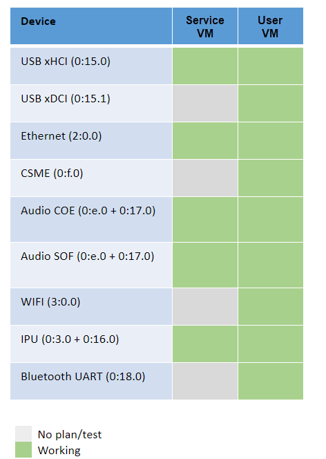
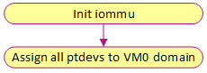
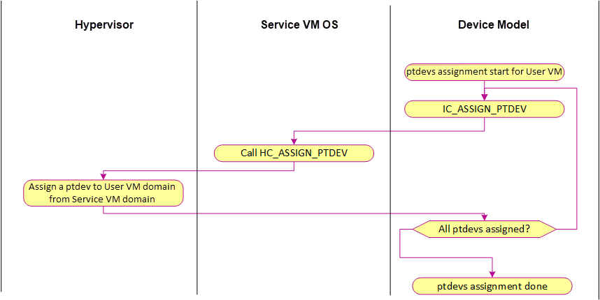
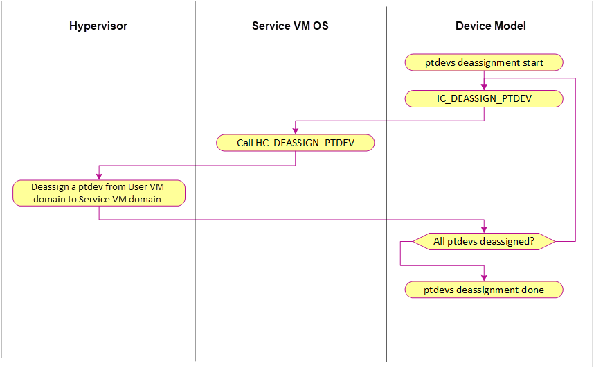
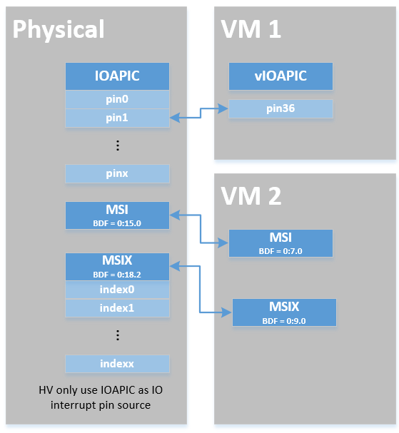
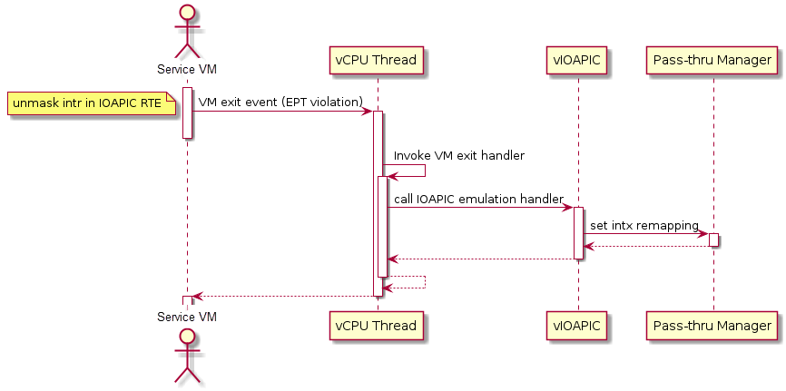
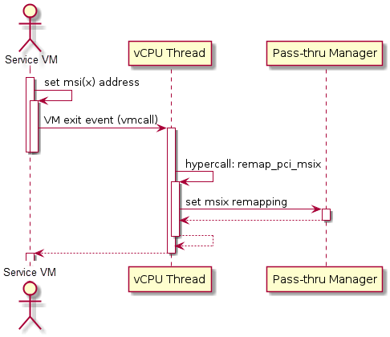

.. _hv-device-passthrough:

Device Passthrough
##################

A critical part of virtualization is virtualizing devices: exposing all
aspects of a device including its I/O, interrupts, DMA, and configuration.
There are three typical device
virtualization methods: emulation, para-virtualization, and passthrough.
Both emulation and passthrough are used in ACRN project.  Device
emulation is discussed in :ref:`hld-io-emulation` and
device passthrough will be discussed here.

In the ACRN project, device emulation means emulating all existing hardware
resource through a software component device model running in the
Service OS (SOS). Device
emulation must maintain the same SW interface as a native device,
providing transparency to the VM software stack. Passthrough implemented in
hypervisor assigns a physical device to a VM so the VM can access
the hardware device directly with minimal (if any) VMM involvement.

The difference between device emulation and passthrough is shown in
:numref:`emu-passthru-diff`. You can notice device emulation has
a longer access path which causes worse performance compared with
passthrough. Passthrough can deliver near-native performance, but
can't support device sharing.

.. figure:: images/passthru-image30.png
   :align: center
   :name: emu-passthru-diff

   Difference between Emulation and passthrough

Passthrough in the hypervisor provides the following functionalities to
allow VM to access PCI devices directly:

-  DMA Remapping by VT-d for PCI device: hypervisor will setup DMA
   remapping during VM initialization phase.
-  MMIO Remapping between virtual and physical BAR
-  Device configuration Emulation
-  Remapping interrupts for PCI device
-  ACPI configuration Virtualization
-  GSI sharing violation check

The following diagram details passthrough initialization control flow in ACRN:

.. figure:: images/passthru-image22.png
   :align: center

   Passthrough devices initialization control flow

Passthrough Device status
*************************

Most common devices on supported platforms are enabled for
passthrough, as detailed here:

   Passthrough Device Status

DMA Remapping
*************

To enable passthrough, for VM DMA access the VM can only
support GPA, while physical DMA requires HPA. One work-around
is building identity mapping so that GPA is equal to HPA, but this
is not recommended as some VM don't support relocation well. To
address this issue, Intel introduces VT-d in chipset to add one
remapping engine to translate GPA to HPA for DMA operations.

Each VT-d engine (DMAR Unit), maintains a remapping structure
similar to a page table with device BDF (Bus/Dev/Func) as input and final
page table for GPA/HPA translation as output. The GPA/HPA translation
page table is similar to a normal multi-level page table.

VM DMA depends on Intel VT-d to do the translation from GPA to HPA, so we
need to enable VT-d IOMMU engine in ACRN before we can passthrough any device. SOS
in ACRN is a VM running in non-root mode which also depends
on VT-d to access a device. In SOS DMA remapping
engine settings, GPA is equal to HPA.

ACRN hypervisor checks DMA-Remapping Hardware unit Definition (DRHD) in
host DMAR ACPI table to get basic info, then sets up each DMAR unit. For
simplicity, ACRN reuses EPT table as the translation table in DMAR
unit for each passthrough device. The control flow is shown in the
following figures:

   DMA Remapping control flow during HV init

   ptdev assignment control flow

   ptdev de-assignment control flow

MMIO Remapping
**************

For PCI MMIO BAR, hypervisor builds EPT mapping between virtual BAR and
physical BAR, then VM can access MMIO directly.

Device configuration emulation
******************************

PCI configuration is based on access of port 0xCF8/CFC. ACRN
implements PCI configuration emulation to handle 0xCF8/CFC to control
PCI device through two paths: implemented in hypervisor or in SOS device
model.

- When configuration emulation is in the hypervisor, the interception of
  0xCF8/CFC port and emulation of PCI configuration space access are
  tricky and unclean. Therefore the final solution is to reuse the
  PCI emulation infrastructure of SOS device model. The hypervisor
  routes the UOS 0xCF8/CFC access to device model, and keeps blind to the
  physical PCI devices. Upon receiving UOS PCI configuration space access
  request, device model needs to emulate some critical space, for instance,
  BAR, MSI capability, and INTLINE/INTPIN.

- For other access, device model
  reads/writes physical configuration space on behalf of UOS. To do
  this, device model is linked with lib pci access to access physical PCI
  device.

Interrupt Remapping
*******************

When the physical interrupt of a passthrough device happens, hypervisor has
to distribute it to the relevant VM according to interrupt remapping
relationships. The structure ``ptirq_remapping_info`` is used to define
the subordination relation between physical interrupt and VM, the
virtual destination, etc. See the following figure for details:

   Remapping of physical interrupts

There are two different types of interrupt source: IOAPIC and MSI.
The hypervisor will record different information for interrupt
distribution: physical and virtual IOAPIC pin for IOAPIC source,
physical and virtual BDF and other info for MSI source.

SOS passthrough is also in the scope of interrupt remapping which is
done on-demand rather than on hypervisor initialization.

   Initialization of remapping of virtual IOAPIC interrupts for SOS

:numref:`init-remapping` above illustrates how remapping of (virtual) IOAPIC
interrupts are remapped for SOS. VM exit occurs whenever SOS tries to
unmask an interrupt in (virtual) IOAPIC by writing to the Redirection
Table Entry (or RTE). The hypervisor then invokes the IOAPIC emulation
handler (refer to :ref:`hld-io-emulation` for details on I/O emulation) which
calls APIs to set up a remapping for the to-be-unmasked interrupt.

Remapping of (virtual) PIC interrupts are set up in a similar sequence:

   Initialization of remapping of virtual MSI for SOS

This figure  illustrates how mappings of MSI or MSIX are set up for
SOS. SOS is responsible for issuing an hypercall to notify the
hypervisor before it configures the PCI configuration space to enable an
MSI. The hypervisor takes this opportunity to set up a remapping for the
given MSI or MSIX before it is actually enabled by SOS.

When the UOS needs to access the physical device by passthrough, it uses
the following steps:

-  UOS gets a virtual interrupt
-  VM exit happens and the trapped vCPU is the target where the interrupt
   will be injected.
-  Hypervisor will handle the interrupt and translate the vector
   according to ptirq_remapping_info.
-  Hypervisor delivers the interrupt to UOS.

When the SOS needs to use the physical device, the passthrough is also
active because the SOS is the first VM. The detail steps are:

-  SOS get all physical interrupts. It assigns different interrupts for
   different VMs during initialization and reassign when a VM is created or
   deleted.
-  When physical interrupt is trapped, an exception will happen after VMCS
   has been set.
-  Hypervisor will handle the vm exit issue according to
   ptirq_remapping_info and translates the vector.
-  The interrupt will be injected the same as a virtual interrupt.

ACPI Virtualization
*******************

ACPI virtualization is designed in ACRN with these assumptions:

-  HV has no knowledge of ACPI,
-  SOS owns all physical ACPI resources,
-  UOS sees virtual ACPI resources emulated by device model.

Some passthrough devices require physical ACPI table entry for
initialization. The device model will create such device entry based on
the physical one according to vendor ID and device ID. Virtualization is
implemented in SOS device model and not in scope of the hypervisor.

GSI Sharing Violation Check
***************************

All the PCI devices that are sharing the same GSI should be assigned to
the same VM to avoid physical GSI sharing between multiple VMs. For
devices that don't support MSI, ACRN DM
shares the same GSI pin to a GSI
sharing group. The devices in the same group should be assigned together to
the current VM, otherwise, none of them should be assigned to the
current VM. A device that violates the rule will be rejected to be
passthrough. The checking logic is implemented in Device Mode and not
in scope of hypervisor.

Data structures and interfaces
******************************

The following APIs are provided to initialize interrupt remapping for
SOS:

.. doxygenfunction:: ptirq_intx_pin_remap
   :project: Project ACRN

.. doxygenfunction:: ptirq_msix_remap
   :project: Project ACRN

The following APIs are provided to manipulate the interrupt remapping
for UOS.

.. doxygenfunction:: ptirq_add_intx_remapping
   :project: Project ACRN

.. doxygenfunction:: ptirq_remove_intx_remapping
   :project: Project ACRN

.. doxygenfunction:: ptirq_add_msix_remapping
   :project: Project ACRN

.. doxygenfunction:: ptirq_remove_msix_remapping
   :project: Project ACRN

The following APIs are provided to acknowledge a virtual interrupt.

.. doxygenfunction:: ptirq_intx_ack
   :project: Project ACRN
