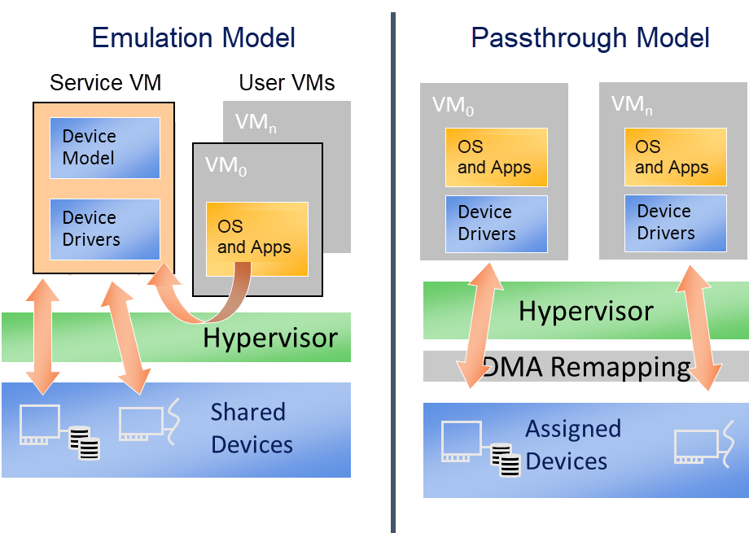
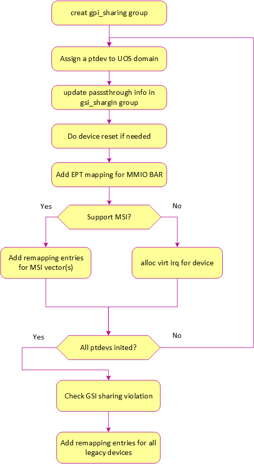

.. _hv-device-passthrough:

Device Passthrough
##################

A critical part of virtualization is virtualizing devices: exposing all
aspects of a device including its I/O, interrupts, DMA, and
configuration.  There are three typical device virtualization methods:
emulation, para-virtualization, and passthrough.  All emulation,
para-virtualization and passthrough are used in ACRN project. Device
emulation is discussed in :ref:`hld-io-emulation`, para-virtualization
is discussed in :ref:`hld-virtio-devices` and device passthrough will be
discussed here.

.. rst-class:: rst-columns2

.. contents::
   :depth: 1
   :local:

--------

In the ACRN project, device emulation means emulating all existing
hardware resources through the Device Model, a software component running in
the Service VM. Device emulation must maintain the same SW
interface as a native device, providing transparency to the VM software
stack. Passthrough implemented in the hypervisor assigns a physical device
to a VM so the VM can access the hardware device directly with minimal
(if any) VMM involvement.

The difference between device emulation and passthrough is shown in
:numref:`emu-passthru-diff`. You can notice device emulation has
a longer access path which causes worse performance compared with
passthrough. Passthrough can deliver near-native performance, but
can't support device sharing.

   Difference Between Emulation and Passthrough

Passthrough in the hypervisor provides the following functionalities to
allow the VM to access PCI devices directly:

-  VT-d DMA remapping for PCI devices: hypervisor will set up DMA
   remapping during VM initialization phase.
-  VT-d interrupt-remapping for PCI devices: hypervisor will enable
   VT-d interrupt-remapping for PCI devices for security considerations.
-  MMIO remapping between virtual and physical BAR
-  Device configuration emulation
-  Remapping interrupts for PCI devices
-  ACPI configuration virtualization
-  GSI sharing violation check

The following diagram details the passthrough initialization control flow in
ACRN for a post-launched VM:

   Passthrough Devices Initialization Control Flow

Passthrough Device Status
*************************

Most common devices on supported platforms are enabled for
passthrough, as detailed here:

   Passthrough Device Status

Owner of Passthrough Devices
****************************

ACRN hypervisor will do PCI enumeration to discover the PCI devices on the
platform. According to the hypervisor/VM configurations, the owner of these PCI
devices can be one of the following 4 cases:

- **Hypervisor**: Hypervisor uses a UART device as the console in debug version
  for debugging purposes, so the UART device is owned by the hypervisor and is
  not visible to any VM. For now, UART is the only PCI device that can be owned
  by the hypervisor.
- **Pre-launched VM**: The passthrough devices that will be used in a
  pre-launched VM are predefined in the VM configuration. These passthrough
  devices are owned by the pre-launched VM after the VM is created. These
  devices will not be removed from the pre-launched VM. There can be
  pre-launched VMs in partitioned mode and hybrid mode.
- **Service VM**: All the passthrough devices except those described above
  (owned by hypervisor or pre-launched VMs) are assigned to the Service VM. And
  some of these devices can be assigned to a post-launched VM according to the
  passthrough device list specified in the parameters of the ACRN Device Model.
- **Post-launched VM**: A list of passthrough devices can be specified in the
  parameters of the ACRN Device Model. When creating a post-launched VM, these
  specified devices will be moved from the Service VM domain to the
  post-launched VM domain. After the post-launched VM is powered-off, these
  devices will be moved back to the Service VM domain.

VT-d DMA Remapping
******************

To enable passthrough, for VM DMA access the VM can only
support GPA, while a physical DMA requires HPA. One work-around
is building identity mapping so that GPA is equal to HPA, but this
is not recommended as some VMs don't support relocation well. To
address this issue, Intel introduces VT-d in the chipset to add one
remapping engine to translate GPA to HPA for DMA operations.

Each VT-d engine (DMAR Unit) maintains a remapping structure
similar to a page table with device BDF (Bus/Dev/Func) as input and final
page table for GPA/HPA translation as output. The GPA/HPA translation
page table is similar to a normal multi-level page table.

VM DMA depends on Intel VT-d to do the translation from GPA to HPA, so we need
to enable VT-d IOMMU engine in ACRN before we can passthrough any device. The
Service VM in ACRN is a VM running in non-root mode which also depends on VT-d
to access a device. In Service VM DMA remapping engine settings, GPA is equal to
HPA.

ACRN hypervisor checks DMA-Remapping Hardware unit Definition (DRHD) in the host
DMAR ACPI table to get basic information, then sets up each DMAR unit. For
simplicity, ACRN reuses the EPT table as the translation table in the DMAR unit
for each passthrough device. The control flow of assigning and deassigning a
passthrough device to/from a post-launched VM is shown in the following figures:

   Ptdev Assignment Control Flow

.. figure:: images/passthru-image42.png
   :align: center

   Ptdev Deassignment Control Flow

.. _vtd-posted-interrupt:

VT-d Interrupt-Remapping
************************

The VT-d interrupt-remapping architecture enables system software to control and
censor external interrupt requests generated by all sources including those from
interrupt controllers (I/OxAPICs), MSI/MSI-X capable devices including
endpoints, root-ports and Root-Complex integrated end-points. ACRN requires
enabling the VT-d interrupt-remapping feature for security reasons. If the VT-d
hardware doesn't support interrupt-remapping, then ACRN will refuse to boot VMs.
VT-d interrupt-remapping is NOT related to the translation from physical
interrupt to virtual interrupt or vice versa. The term VT-d interrupt-remapping
remaps the interrupt index in the VT-d interrupt-remapping table to the physical
interrupt vector after checking the external interrupt request is valid. The
hypervisor still needs to translate the physical vector to the virtual vector,
which is also described in the below section :ref:`interrupt-remapping`.

VT-d posted interrupt (PI) enables direct delivery of external interrupts from
passthrough devices to VMs without having to exit to the hypervisor, thereby
improving interrupt performance. ACRN uses VT-d posted interrupts if the
platform supports them. VT-d distinguishes between remapped and posted interrupt
modes by bit 15 in the low 64-bit of the interrupt-remapping table entry. If
cleared, the entry is remapped. If set, it's posted. The idea is to keep a
Posted Interrupt Descriptor (PID) in memory. The PID is a 64-byte data structure
that contains several fields:

Posted Interrupt Request (PIR):
   a 256-bit field, one bit per request vector;
   this is where the interrupts are posted.

Suppress Notification (SN):
   determines whether to notify (``SN=0``) or not notify (``SN=1``) the CPU for
   non-urgent interrupts. For ACRN, all interrupts are treated as non-urgent.
   ACRN sets SN=0 during initialization and then never changes it at runtime.

Notification Vector (NV):
   the CPU must be notified with an interrupt and this
   field specifies the vector for notification.

Notification Destination (NDST):
   the physical APIC-ID of the destination.
   ACRN does not support vCPU migration. One vCPU always runs on the same pCPU,
   so for ACRN, NDST is never changed after initialization.

Outstanding Notification (ON):
   indicates if a notification event is outstanding

The ACRN scheduler supports vCPU scheduling, where two or more vCPUs can
share the same pCPU using a time sharing technique. One issue emerges
here for the VT-d posted interrupt handling process, where IRQs could happen
when the target vCPU is in a halted state. We need to handle the case
where the running vCPU disrupted by the external interrupt, is not the
target vCPU that should have received the external interrupt.

Consider this scenario:

* vCPU0 runs on pCPU0 and then enters a halted state,
* ACRN scheduler now chooses vCPU1 to run on pCPU0.

If an external interrupt from an assigned device destined to vCPU0
happens at this time, we do not want this interrupt to be incorrectly
consumed by vCPU1 running on pCPU0. This would happen if we
allocate the same Activation Notification Vector (ANV) to all vCPUs.

To circumvent this issue, ACRN allocates unique ANVs for each vCPU that
belongs to the same pCPU. The ANVs need only be unique within each pCPU,
not across all vCPUs. Since vCPU0's ANV is different from vCPU1's ANV,
if vCPU0 is in a halted state, external interrupts from an assigned
device destined to vCPU0 delivered through the PID will not trigger the
posted interrupt processing. Instead, a VMExit to ACRN happens that can
then process the event such as waking up the halted vCPU0 and kick it
to run on pCPU0.

For ACRN, ``CONFIG_MAX_VM_NUM`` vCPUs may be running on top of a pCPU. ACRN
does not support two vCPUs of the same VM running on top of the same
pCPU. This reduces the number of pre-allocated ANVs for posted
interrupts to ``CONFIG_MAX_VM_NUM``, and enables ACRN to avoid switching
between active and wake-up vector values in the posted interrupt
descriptor on vCPU scheduling state changes. ACRN uses the following
formula to assign posted interrupt vectors to vCPUs::

   NV = POSTED_INTR_VECTOR + vcpu->vm->vm_id

where ``POSTED_INTR_VECTOR`` is the starting vector (0xe3) for posted interrupts.

ACRN maintains a per-PCPU vCPU array that stores the pointers to
assigned vCPUs for each pCPU and is indexed by ``vcpu->vm->vm_id``.
When the vCPU is created, ACRN adds the vCPU to the containing pCPU's
vCPU array. When the vCPU is offline, ACRN removes the vCPU from the
related vCPU array.

An example to illustrate our solution:

ACRN sets ``SN=0`` during initialization and then never changes it at
runtime. This means posted interrupt notification is never suppressed.
After posting the interrupt in Posted Interrupt Request (PIR), VT-d will
always notify the CPU using the interrupt vector NV, in both root and
non-root mode. With this scheme, if the target vCPU is running under
VMX non-root mode, it will receive the interrupts coming from the
passthrough device without a VMExit (and therefore without any
intervention of the ACRN hypervisor).

If the target vCPU is in a halted state (under VMX non-root mode), a
scheduling request will be raised to wake it up. This is needed to
achieve real time behavior. If an RT-VM is waiting for an event, when
the event is fired (a PI interrupt fires), we need to wake up the VM
immediately.

MMIO Remapping
**************

For PCI MMIO BAR, the hypervisor builds EPT mapping between the virtual BAR and
physical BAR, then the VM can access MMIO directly. There is one exception: an
MSI-X table is also in an MMIO BAR. The hypervisor needs to trap the accesses to
the MSI-X table. So the pages that have an MSI-X table should not be accessed by
the VM directly. EPT mapping is not built for pages that have an MSI-X table.

Device Configuration Emulation
******************************

The PCI configuration space can be accessed by a PCI-compatible
Configuration Mechanism (IO port 0xCF8/CFC) and the PCI Express Enhanced
Configuration Access Mechanism (PCI MMCONFIG). The ACRN hypervisor traps
this PCI configuration space access and emulates it. Refer to :ref:`split-device-model` for details.

MSI-X Table Emulation
*********************

VM accesses to an MSI-X table should be trapped so that the hypervisor has the
information to map the virtual vector and physical vector. EPT mapping should
be skipped for the 4KB pages that have an MSI-X table.

There are three situations for the emulation of MSI-X tables:

- **Service VM**: Accesses to an MSI-X table are handled by the hypervisor MMIO
  handler (4KB adjusted up and down). The hypervisor remaps the interrupts.
- **Post-launched VM**: Accesses to an MSI-X table are handled by the Device
  Model MMIO handler (4KB adjusted up and down). When the Device Model (Service
  VM) writes to the table, it will be intercepted by the hypervisor MMIO
  handler. The hypervisor remaps the interrupts.
- **Pre-launched VM**: Writes to the MMIO region in an MSI-X table BAR are
  handled by the hypervisor MMIO handler. If the offset falls within the MSI-X
  table (offset, offset+tables_size), the hypervisor remaps the interrupts.

.. _interrupt-remapping:

Interrupt Remapping
*******************

When the physical interrupt of a passthrough device happens, the hypervisor has
to distribute it to the relevant VM according to interrupt remapping
relationships. The structure ``ptirq_remapping_info`` is used to define
the subordination relation between physical interrupt and VM, the
virtual destination, etc. See the following figure for details:

   Remapping of Physical Interrupts

There are two different types of interrupt sources: IOAPIC and MSI.
The hypervisor will record different information for interrupt
distribution: physical and virtual IOAPIC pin for IOAPIC source,
physical and virtual BDF and other information for MSI source.

Service VM passthrough is also in the scope of interrupt remapping which is
done on-demand rather than on hypervisor initialization.

.. figure:: images/passthru-image102.png
   :align: center
   :name: init-remapping

   Initialization of Remapping of Virtual IOAPIC Interrupts for Service VM

:numref:`init-remapping` above illustrates how remapping of (virtual) IOAPIC
interrupts are remapped for the Service VM. VM exit occurs whenever the Service
VM tries to unmask an interrupt in (virtual) IOAPIC by writing to the
Redirection Table Entry (or RTE). The hypervisor then invokes the IOAPIC
emulation handler (refer to :ref:`hld-io-emulation` for details on I/O
emulation) which calls APIs to set up a remapping for the to-be-unmasked
interrupt.

Remapping of (virtual) MSI interrupts are set up in a similar sequence:

.. figure:: images/passthru-image98.png
   :align: center

   Initialization of Remapping of Virtual MSI for Service VM

This figure illustrates how mappings of MSI or MSI-X are set up for the
Service VM. The Service VM is responsible for issuing a hypercall to notify the
hypervisor before it configures the PCI configuration space to enable an
MSI. The hypervisor takes this opportunity to set up a remapping for the
given MSI or MSI-X before it is actually enabled by the Service VM.

When the User VM needs to access the physical device by passthrough, it uses
the following steps:

-  User VM gets a virtual interrupt.
-  VM exit happens and the trapped vCPU is the target where the interrupt
   will be injected.
-  Hypervisor handles the interrupt and translates the vector
   according to ``ptirq_remapping_info``.
-  Hypervisor delivers the interrupt to the User VM.

When the Service VM needs to use the physical device, the passthrough is also
active because the Service VM is the first VM. The detail steps are:

-  Service VM gets all physical interrupts. It assigns different interrupts for
   different VMs during initialization and reassigns when a VM is created or
   deleted.
-  When a physical interrupt is trapped, an exception will happen after VMCS
   has been set.
-  Hypervisor handles the VM exit issue according to
   ``ptirq_remapping_info`` and translates the vector.
-  The interrupt is injected the same as a virtual interrupt.

ACPI Virtualization
*******************

ACPI virtualization is designed in ACRN with these assumptions:

-  Hypervisor has no knowledge of ACPI,
-  Service VM owns all physical ACPI resources,
-  User VM sees virtual ACPI resources emulated by the Device Model.

Some passthrough devices require a physical ACPI table entry for initialization.
The Device Model creates such device entry based on the physical one according
to vendor ID and device ID. Virtualization is implemented in the Service VM
Device Model and not in the scope of the hypervisor. For pre-launched VMs, the
ACRN hypervisor doesn't support ACPI virtualization, so devices relying on ACPI
tables are not supported.

GSI Sharing Violation Check
***************************

All the PCI devices that share the same GSI should be assigned to the same
VM to avoid physical GSI sharing between multiple VMs. In partitioned mode or
hybrid mode, the PCI devices assigned to a pre-launched VM are statically
predefined. Developers should take care not to violate the rule. For a
post-launched VM, the ACRN Device Model puts the devices sharing the same GSI
pin in a GSI sharing group (devices that don't support MSI). The devices in the
same group should be assigned together to the current VM; otherwise, none of
them should be assigned to the current VM. A device that violates the rule will
be rejected to be passed-through. The checking logic is implemented in the
Device Model and not in the scope of the hypervisor. The platform-specific GSI
information shall be filled in ``devicemodel/hw/pci/platform_gsi_info.c`` for
the target platform to activate the checking of GSI sharing violations.

.. _PCIe PTM implementation:

PCIe Precision Time Measurement (PTM)
*************************************

The PCI Express (PCIe) specification defines a Precision Time Measurement (PTM)
mechanism that enables time coordination and synchronization of events across
multiple PCI components with independent local time clocks within the same
system.  Intel supports PTM on several of its systems and devices, such as PTM
root capabilities support on Whiskey Lake and Tiger Lake PCIe root ports, and
PTM device support on an Intel I225-V/I225-LM family Ethernet controller.  For
further details on PTM, refer to the `PCIe specification
<https://pcisig.com/specifications>`_.

ACRN adds PCIe root port emulation in the hypervisor to support the PTM feature
and emulates a simple PTM hierarchy.  ACRN enables PTM in a post-launched VM if
the user sets the ``enable_ptm`` option when passing through a device to the
post-launched VM.  When you enable PTM, the passthrough device is connected to a
virtual root port instead of the host bridge.

By default, the :ref:`vm.PTM` option is disabled in ACRN VMs. Use the
:ref:`acrn_configurator_tool` to enable PTM
in the scenario XML file that configures the VM.

Here is an example launch script that configures a supported Ethernet card for
passthrough and enables PTM on it:

.. code-block:: bash
   :emphasize-lines: 9-11,17

   declare -A passthru_vpid
   declare -A passthru_bdf
   passthru_vpid=(
    ["ethptm"]="8086 15f2"
    )
   passthru_bdf=(
    ["ethptm"]="0000:aa:00.0"
    )
   echo ${passthru_vpid["ethptm"]} > /sys/bus/pci/drivers/pci-stub/new_id
   echo ${passthru_bdf["ethptm"]} > /sys/bus/pci/devices/${passthru_bdf["ethptm"]}/driver/unbind
   echo ${passthru_bdf["ethptm"]} > /sys/bus/pci/drivers/pci-stub/bind

   acrn-dm -m $mem_size -s 0:0,hostbridge \
      -s 3,virtio-blk,user-vm-test.img \
      -s 4,virtio-net,tap=tap0 \
      -s 5,virtio-console,@stdio:stdio_port \
      -s 6,passthru,a9/00/0,enable_ptm \
      --ovmf /usr/share/acrn/bios/OVMF.fd

And here is the bus hierarchy from the User VM (as shown by the ``lspci`` command)::

   lspci -tv
   -[0000:00]-+-00.0  Network Appliance Corporation Device 1275
              +-03.0  Red Hat, Inc. Virtio block device
              +-04.0  Red Hat, Inc. Virtio network device
              +-05.0  Red Hat, Inc. Virtio console
              \-06.0-[01]----00.0  Intel Corporation Device 15f2

PTM Implementation Notes
========================

To simplify PTM support implementation, the virtual root port only supports the
most basic PCIe configuration and operation, in addition to PTM capabilities.

For a post-launched VM, you enable PTM by setting the
``enable_ptm`` option for the passthrough device (as shown above).

   PTM-enabling Workflow in Post-launched VM

As shown in :numref:`ptm-flow`, PTM is enabled in the root port during the
hypervisor startup. The Device Model (DM) then checks whether the passthrough
device supports PTM requestor capabilities and whether the corresponding root
port supports PTM root capabilities, as well as some other sanity checks.  If an
error is detected during these checks, the error will be reported and ACRN will
not enable PTM in the post-launched VM. This doesn't prevent the user from
launching the post-launched VM and passing through the device to the VM.  If no
error is detected, the Device Model uses the ``add_vdev`` hypercall to add a
virtual root port (VRP), acting as the PTM root, to the post-launched VM before
passing through the device to the post-launched VM.

   PTM-enabled PCI Device Passthrough to Post-launched VM

:numref:`ptm-vrp` shows that, after enabling PTM, the passthrough device
connects to the virtual root port instead of the virtual host bridge.

To use PTM in a virtualized environment, you may want to first verify that PTM
is supported by the device and is enabled on the bare metal machine.
If supported, follow these steps to enable PTM in the post-launched VM:

1. Make sure that PTM is enabled in the guest kernel.  In the Linux kernel,
   for example, set ``CONFIG_PCIE_PTM=y``.
2. Not every PCI device supports PTM.  One example that does is the Intel I225-V
   Ethernet controller.  If you passthrough this card to the post-launched VM,
   make sure the post-launched VM uses a version of the IGC driver that supports
   PTM.
3. In the Device Model launch script, add the ``enable_ptm`` option to the
   passthrough device.  For example:

   .. code-block:: bash
      :emphasize-lines: 5

      $ acrn-dm -m $mem_size -s 0:0,hostbridge \
          -s 3,virtio-blk,user-vm-test.img \
          -s 4,virtio-net,tap=tap0 \
          -s 5,virtio-console,@stdio:stdio_port \
          -s 6,passthru,a9/00/0,enable_ptm \
          --ovmf /usr/share/acrn/bios/OVMF.fd \

4. You can check that PTM is correctly enabled on the post-launched VM by
   displaying the PCI bus hierarchy on the post-launched VM using the ``lspci``
   command:

   .. code-block:: bash
      :emphasize-lines: 12,20

      lspci -tv
        -[0000:00]-+-00.0  Network Appliance Corporation Device 1275
         +-03.0  Red Hat, Inc. Virtio block device
         +-04.0  Red Hat, Inc. Virtio network device
         +-05.0  Red Hat, Inc. Virtio console
         \-06.0-[01]----00.0  Intel Corporation Device 15f2

      sudo lspci -vv # (Only relevant output is shown)
        00:00.0 Host bridge: Network Appliance Corporation Device 1275
        00:06.0 PCI bridge: Intel Corporation Sunrise Point-LP PCI Express Root Port #5 (rev 02) (prog-if 00 [Normal decode])
        . . .
                Capabilities: [100 v1] Precision Time Measurement
                        PTMCap: Requester:- Responder:+ Root:+
                        PTMClockGranularity: 4ns
                        PTMControl: Enabled:+ RootSelected:+
                        PTMEffectiveGranularity: 4ns
                Kernel driver in use: pcieport
        01:00.0 Ethernet controller: Intel Corporation Device 15f2 (rev 01)
        . . .
                Capabilities: [1f0 v1] Precision Time Measurement
                        PTMCap: Requester:+ Responder:- Root:-
                        PTMClockGranularity: 4ns
                        PTMControl: Enabled:+ RootSelected:-
                        PTMEffectiveGranularity: 4ns
                Kernel driver in use: igc

API Data Structures and Interfaces
**********************************

The following are common APIs provided to initialize interrupt remapping for
VMs:

.. doxygenfunction:: ptirq_intx_pin_remap
   :project: Project ACRN

.. doxygenfunction:: ptirq_prepare_msix_remap
   :project: Project ACRN

Post-launched VMs need to pre-allocate interrupt entries during VM
initialization. Post-launched VMs need to free interrupt entries during VM
de-initialization. The following APIs are provided to pre-allocate/free
interrupt entries for post-launched VMs:

.. doxygenfunction:: ptirq_add_intx_remapping
   :project: Project ACRN

.. doxygenfunction:: ptirq_remove_intx_remapping
   :project: Project ACRN

.. doxygenfunction:: ptirq_remove_msix_remapping
   :project: Project ACRN

The following APIs are provided to acknowledge a virtual interrupt:

.. doxygenfunction:: ptirq_intx_ack
   :project: Project ACRN

The following APIs are provided to handle a ptdev interrupt:

.. doxygenfunction:: ptdev_init
   :project: Project ACRN

.. doxygenfunction:: ptirq_softirq
   :project: Project ACRN

.. doxygenfunction:: ptirq_alloc_entry
   :project: Project ACRN

.. doxygenfunction:: ptirq_release_entry
   :project: Project ACRN

.. doxygenfunction:: ptdev_release_all_entries
   :project: Project ACRN

.. doxygenfunction:: ptirq_activate_entry
   :project: Project ACRN

.. doxygenfunction:: ptirq_deactivate_entry
   :project: Project ACRN

.. doxygenfunction:: ptirq_dequeue_softirq
   :project: Project ACRN

.. doxygenfunction:: ptirq_get_intr_data
   :project: Project ACRN
