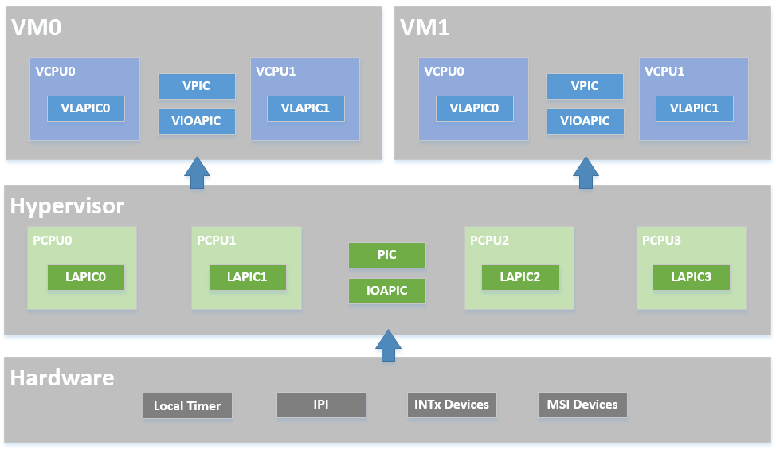
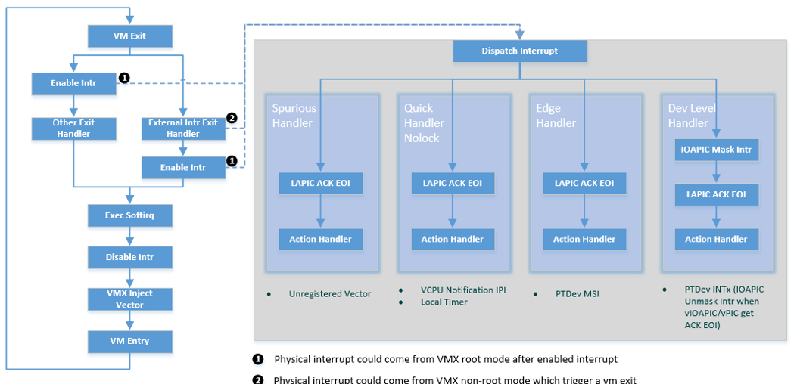

.. _interrupt-hld:

Physical Interrupt High-Level Design
####################################

Overview
********

The ACRN hypervisor implements a simple but fully functional framework
to manage interrupts and exceptions, as shown in
:numref:`interrupt-modules-overview`. In its native layer, it configures
the physical PIC, IOAPIC, and LAPIC to support different interrupt
sources from the local timer/IPI to the external INTx/MSI. In its virtual guest
layer, it emulates virtual PIC, virtual IOAPIC, and virtual LAPIC/passthrough
LAPIC. It provides full APIs, allowing virtual interrupt injection from
emulated or passthrough devices. The contents in this section do not include
the passthrough LAPIC case. For the passthrough LAPIC, refer to
:ref:`lapic_passthru`

   ACRN Interrupt Modules Overview

In the software modules view shown in :numref:`interrupt-sw-modules`,
the ACRN hypervisor sets up the physical interrupt in its basic
interrupt modules (e.g., IOAPIC/LAPIC/IDT). It dispatches the interrupt
in the hypervisor interrupt flow control layer to the corresponding
handlers; this could be predefined IPI notification, timer, or runtime
registered passthrough devices. The ACRN hypervisor then uses its VM
interfaces based on vPIC, vIOAPIC, and vMSI modules, to inject the
necessary virtual interrupt into the specific VM, or directly deliver
interrupt to the specific RT VM with passthrough LAPIC.

   ACRN Interrupt Software Modules Overview

The hypervisor implements the following functionalities for handling
physical interrupts:

-  Configure interrupt-related hardware including IDT, PIC, LAPIC, and
   IOAPIC on startup.

-  Provide APIs to manipulate the registers of LAPIC and IOAPIC.

-  Acknowledge physical interrupts.

-  Set up a callback mechanism for the other components in the
   hypervisor to request for an interrupt vector and register a
   handler for that interrupt.

HV owns all native physical interrupts and manages 256 vectors per CPU.
All physical interrupts are first handled in VMX root-mode.  The
"external-interrupt exiting" bit in VM-Execution controls field is set
to support this. The ACRN hypervisor also initializes all the interrupt
related modules like IDT, PIC, IOAPIC, and LAPIC.

HV does not own any host devices (except UART). All devices are by
default assigned to the Service VM. Any interrupts received by VM
(Service VM or User VM) device drivers are virtual interrupts injected
by HV (via vLAPIC).
HV manages a Host-to-Guest mapping. When a native IRQ/interrupt occurs,
HV decides whether this IRQ/interrupt should be forwarded to a VM and
which VM to forward to (if any). Refer to
:ref:`virt-interrupt-injection` and :ref:`interrupt-remapping` for
more information.

HV does not own any exceptions. Guest VMCS are configured so no VM Exit
happens, with some exceptions such as #INT3 and #MC.  This is to
simplify the design as HV does not support any exception handling
itself. HV supports only static memory mapping, so there should be no
#PF or #GP. If HV receives an exception indicating an error, an assert
function is then executed with an error message printout, and the
system then halts.

Native interrupts can be generated from one of the following
sources:

-  GSI interrupts

   -  PIC or Legacy devices IRQ (0~15)
   -  IOAPIC pin

-  PCI MSI/MSI-X vectors
-  Inter CPU IPI
-  LAPIC timer

.. _physical-interrupt-initialization:

Physical Interrupt Initialization
*********************************

After ACRN hypervisor gets control from the bootloader, it
initializes all physical interrupt-related modules for all the CPUs. ACRN
hypervisor creates a framework to manage the physical interrupt for
hypervisor local devices, passthrough devices, and IPI between CPUs, as
shown in :numref:`hv-interrupt-init`:

   Physical Interrupt Initialization

IDT Initialization
==================

ACRN hypervisor builds its native IDT (interrupt descriptor table)
during interrupt initialization and sets up the following handlers:

-  On an exception, the hypervisor dumps its context and halts the current
   physical processor (because physical exceptions are not expected).

-  For external interrupts, HV may mask the interrupt (depending on the
   trigger mode), followed by interrupt acknowledgement and dispatch
   to the registered handler, if any.

Most interrupts and exceptions are handled without a stack switch,
except for machine-check, double fault, and stack fault exceptions which
have their own stack set in TSS.

PIC/IOAPIC Initialization
=========================

ACRN hypervisor masks all interrupts from the PIC. All legacy interrupts
from PIC (<16) will be linked to IOAPIC, as shown in the connections in
:numref:`hv-pic-config`.

ACRN will pre-allocate vectors and set them for these legacy interrupts
in IOAPIC RTEs. For others (>= 16), ACRN will set them with vector 0 in
RTEs, and valid vectors will be dynamically allocated on demand.

All external IOAPIC pins are categorized as GSI interrupt according to
ACPI definition. HV supports multiple IOAPIC components. IRQ PIN to GSI
mappings are maintained internally to determine GSI source IOAPIC.
Native PIC is not used in the system.

   Hypervisor PIC/IOAPIC/LAPIC Configuration

LAPIC Initialization
====================

Physical LAPICs are in x2APIC mode in ACRN hypervisor. The hypervisor
initializes LAPIC for each physical CPU by masking all interrupts in the
local vector table (LVT), clearing all ISRs, and enabling LAPIC.

APIs are provided to access LAPIC for the other components in the
hypervisor, aiming for further usage of local timer (TSC Deadline)
program, IPI notification program, etc. See :ref:`hv_interrupt-data-api`
for a complete list.

HV Interrupt Vectors and Delivery Mode
======================================

The interrupt vectors are assigned as shown here:

**Vector 0-0x1F**
   are exceptions that are not handled by HV. If
   such an exception does occur, the system then halts.

**Vector: 0x20-0x2F**
   are allocated statically for legacy IRQ0-15.

**Vector: 0x30-0xDF**
   are dynamically allocated vectors for PCI devices
   INTx or MSI/MIS-X usage. According to different interrupt delivery mode
   (FLAT or PER_CPU mode), an interrupt will be assigned to a vector for
   all the CPUs or a particular CPU.

**Vector: 0xE0-0xFE**
   are high priority vectors reserved by HV for
   dedicated purposes. For example, 0xEF is used for timer, 0xF0 is used
   for IPI.

.. list-table::
   :widths: 30 70
   :header-rows: 1

   * - Vectors
     - Usage

   * - 0x0-0x14
     - Exceptions: NMI, INT3, page fault, GP, debug.

   * - 0x15-0x1F
     - Reserved

   * - 0x20-0x2F
     - Statically allocated for external IRQ (IRQ0-IRQ15)

   * - 0x30-0xDF
     - Dynamically allocated for IOAPIC IRQ from PCI INTx/MSI

   * - 0xE0-0xFE
     - Static allocated for HV

   * - 0xEF
     - Timer

   * - 0xF0
     - IPI

   * - 0xF2
     - Posted Interrupt

   * - 0xF3
     - Hypervisor Callback HSM

   * - 0xF4
     - Performance Monitoring Interrupt

   * - 0xFF
     - SPURIOUS_APIC_VECTOR

Interrupts from either IOAPIC or MSI can be delivered to a target CPU.
By default, they are configured as Lowest Priority (FLAT mode), meaning they
are delivered to a CPU core that is idle or executing the lowest
priority ISR. There is no guarantee a device's interrupt will be
delivered to a specific Guest's CPU. Timer interrupts are an exception -
these are always delivered to the CPU which programs the LAPIC timer.

x86-64 supports per CPU IDTs, but ACRN uses a global shared IDT,
with which the interrupt/IRQ to vector mapping is the same on all CPUs. Vector
allocation for CPUs is shown here:

   FLAT Mode Vector Allocation

IRQ Descriptor Table
====================

ACRN hypervisor maintains a global IRQ Descriptor Table shared among the
physical CPUs, so the same vector will link to the same IRQ number for
all CPUs.

The *irq_desc[]* array's index represents IRQ number. A *handle_irq*
will be called from *interrupt_dispatch* to commonly handle edge/level
triggered IRQ and call the registered *action_fn*.

Another reverse mapping from vector to IRQ is used in addition to the
IRQ descriptor table which maintains the mapping from IRQ to vector.

On initialization, the descriptor of the legacy IRQs are initialized with
proper vectors and the corresponding reverse mapping is set up.
The descriptor of other IRQs are filled with an invalid
vector which will be updated on IRQ allocation.

For example, if local timer registers an interrupt with IRQ number 254 and
vector 0xEF, then this date will be set up:

.. code-block:: c

   irq_desc[254].irq = 254
   irq_desc[254].vector = 0xEF
   vector_to_irq[0xEF] = 254

External Interrupt Handling
***************************

CPU runs under VMX non-root mode and inside Guest VMs.
``MSR_IA32_VMX_PINBASED_CTLS.bit[0]`` and
``MSR_IA32_VMX_EXIT_CTLS.bit[15]`` are set to allow vCPU VM Exit to HV
whenever there are interrupts to that physical CPU under
non-root mode. HV ACKs the interrupts in VMX non-root and saves the
interrupt vector to the relevant VM Exit field for HV IRQ processing.

Note that as discussed above, an external interrupt causing vCPU VM Exit
to HV does not mean that the interrupt belongs to that Guest VM. When
CPU executes VM Exit into root-mode, interrupt handling will be enabled
and the interrupt will be delivered and processed as quickly as possible
inside HV. HV may emulate a virtual interrupt and inject to Guest if
necessary.

Interrupt and IRQ processing flow diagrams are shown below:

   Processing of Physical Interrupts

When a physical interrupt is raised and delivered to a physical CPU, the
CPU may be running under either VMX root mode or non-root mode.

- If the CPU is running under VMX root mode, the interrupt is handled
  following the standard native IRQ flow: interrupt gate to
  dispatch_interrupt(), IRQ handler, and finally the registered callback.
- If the CPU is running under VMX non-root mode, an external interrupt
  calls a VM exit for reason "external-interrupt", and then the VM
  exit processing flow will call dispatch_interrupt() to dispatch and
  handle the interrupt.

After an interrupt occurs from either path shown in
:numref:`phy-interrupt-processing`, ACRN hypervisor will jump to
dispatch_interrupt. This function gets the vector of the generated
interrupt from the context, gets IRQ number from vector_to_irq[], and
then gets the corresponding irq_desc.

Though there is only one generic IRQ handler for registered interrupt,
there are three different handling flows according to flags:

-  ``!IRQF_LEVEL``
-  ``IRQF_LEVEL && !IRQF_PT``

   To avoid continuous interrupt triggers, it masks the IOAPIC pin and
   unmask it only after IRQ action callback is executed

-  ``IRQF_LEVEL && IRQF_PT``

   For passthrough devices, to avoid continuous interrupt triggers, it masks
   the IOAPIC pin and leaves it unmasked until corresponding vIOAPIC
   pin gets an explicit EOI ACK from guest.

Since interrupts are not shared for multiple devices, there is only one
IRQ action registered for each interrupt.

The IRQ number inside HV is a software concept to identify GSI and
Vectors. Each GSI will be mapped to one IRQ. The GSI number is usually the same
as the IRQ number. IRQ numbers greater than max GSI (nr_gsi) number are dynamically
assigned. For example, HV allocates an interrupt vector to a PCI device,
an IRQ number is then assigned to that vector. When the vector later
reaches a CPU, the corresponding IRQ action function is located and executed.

See :numref:`request-irq` for request IRQ control flow for different
conditions:

   Request IRQ for Different Conditions

.. _ipi-management:

IPI Management
**************

The only purpose of IPI use in HV is to kick a vCPU out of non-root mode
and enter to HV mode. This requires I/O request and virtual interrupt
injection be distributed to different IPI vectors. The I/O request uses
IPI vector 0xF3 upcall. The virtual interrupt injection uses IPI vector 0xF0.

0xF3 upcall
   A Guest vCPU VM Exit exits due to EPT violation or IO instruction trap.
   It requires Device Module to emulate the MMIO/PortIO instruction.
   However it could be that the Service VM vCPU0 is still in non-root
   mode. So an IPI (0xF3 upcall vector) should be sent to the physical CPU0
   (with non-root mode as vCPU0 inside the Service VM) to force vCPU0 to VM Exit due
   to the external interrupt. The virtual upcall vector is then injected to
   the Service VM, and the vCPU0 inside the Service VM then will pick up the IO request and do
   emulation for other Guest.

0xF0 IPI flow
   If Device Module inside the Service VM needs to inject an interrupt to other Guest
   such as vCPU1, it will issue an IPI first to kick CPU1 (assuming CPU1 is
   running on vCPU1) to root-hv_interrupt-data-apmode. CPU1 will inject the
   interrupt before VM Enter.

.. _hv_interrupt-data-api:

Data Structures and Interfaces
******************************

IOAPIC
======

The following APIs are external interfaces for IOAPIC related
operations.

.. doxygengroup:: ioapic_ext_apis
   :project: Project ACRN
   :content-only:

LAPIC
=====

The following APIs are external interfaces for LAPIC related operations.

.. doxygengroup:: lapic_ext_apis
   :project: Project ACRN
   :content-only:

IPI
===

The following APIs are external interfaces for IPI related operations.

.. doxygengroup:: ipi_ext_apis
   :project: Project ACRN
   :content-only:

Physical Interrupt
==================

The following APIs are external interfaces for physical interrupt
related operations.

.. doxygengroup:: phys_int_ext_apis
   :project: Project ACRN
   :content-only:

