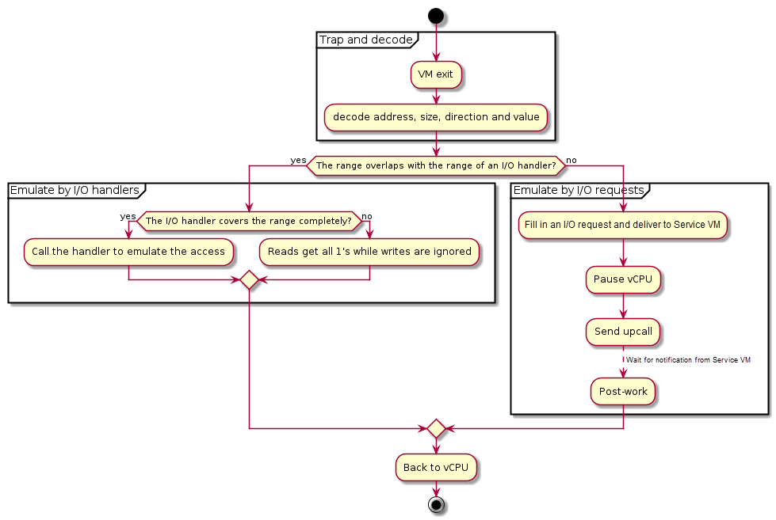
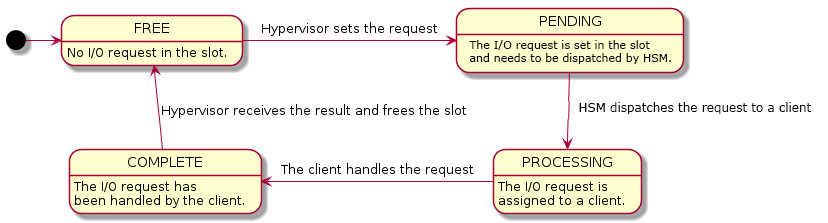
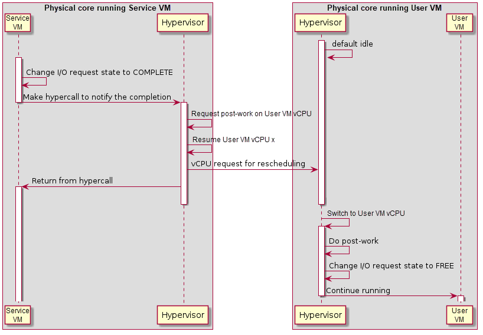
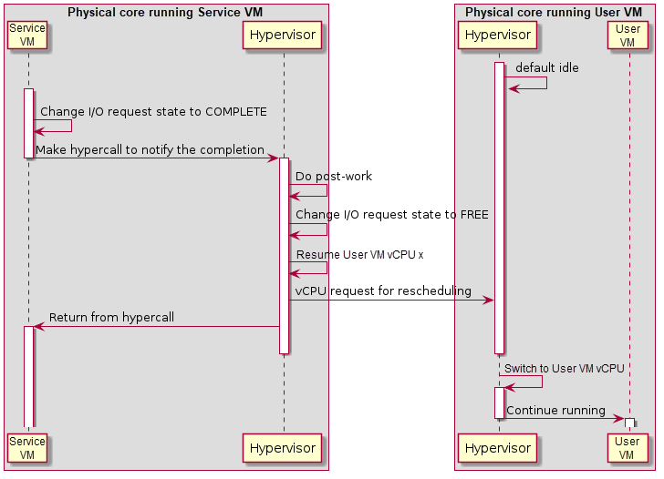

.. _hld-io-emulation:

I/O Emulation high-level design
###############################

As discussed in :ref:`intro-io-emulation`, there are multiple ways and
places to handle I/O emulation, including HV, SOS Kernel VHM, and SOS
user-land device model (acrn-dm).

I/O emulation in the hypervisor provides these functionalities:

-  Maintain lists of port I/O or MMIO handlers in the hypervisor for
   emulating trapped I/O accesses in a certain range.

-  Forward I/O accesses to SOS when they cannot be handled by the
   hypervisor by any registered handlers.

:numref:`io-control-flow` illustrates the main control flow steps of I/O emulation
inside the hypervisor:

1. Trap and decode I/O access by VM exits and decode the access from
   exit qualification or by invoking the instruction decoder.

2. If the range of the I/O access overlaps with any registered handler,
   call that handler if it completely covers the range of the
   access, or ignore the access if the access crosses the boundary.

3. If the range of the I/O access does not overlap the range of any I/O
   handler, deliver an I/O request to SOS.

   Control flow of I/O emulation in the hypervisor

:option:`CONFIG_PARTITION_MODE` is the only configuration option that affects the
functionality of I/O emulation. With :option:`CONFIG_PARTITION_MODE` enabled,
the hypervisor never sends I/O request to any VM. Unhandled I/O reads
get all 1's and writes are silently dropped.

I/O emulation does not rely on any calibration data.

Trap Path
*********

Port I/O accesses are trapped by VM exits with the basic exit reason
"I/O instruction". The port address to be accessed, size, and direction
(read or write) are fetched from the VM exit qualification. For writes
the value to be written to the I/O port is fetched from guest registers
al, ax or eax, depending on the access size.

MMIO accesses are trapped by VM exits with the basic exit reason "EPT
violation". The instruction emulator is invoked to decode the
instruction that triggers the VM exit to get the memory address being
accessed, size, direction (read or write), and the involved register.

The I/O bitmaps and EPT are used to configure the addresses that will
trigger VM exits when accessed by a VM. Refer to
:ref:`io-mmio-emulation` for details.

I/O Emulation in the Hypervisor
*******************************

When a port I/O or MMIO access is trapped, the hypervisor first checks
whether the to-be-accessed address falls in the range of any registered
handler, and calls the handler when such a handler exists.

Handler Management
==================

Each VM has two lists of I/O handlers, one for port I/O and the other
for MMIO. Each element of the list contains a memory range and a pointer
to the handler which emulates the accesses falling in the range.  See
:ref:`io-handler-init` for descriptions of the related data structures.

The I/O handlers are registered on VM creation and never changed until
the destruction of that VM, when the handlers are unregistered. If
multiple handlers are registered for the same address, the one
registered later wins. See :ref:`io-handler-init` for the interfaces
used to register and unregister I/O handlers.

I/O Dispatching
===============

When a port I/O or MMIO access is trapped, the hypervisor first walks
through the corresponding I/O handler list in the reverse order of
registration, looking for a proper handler to emulate the access. The
following cases exist:

-  If a handler whose range overlaps the range of the I/O access is
   found,

   -  If the range of the I/O access falls completely in the range the
      handler can emulate, that handler is called.

   -  Otherwise it is implied that the access crosses the boundary of
      multiple devices which the hypervisor does not emulate. Thus
      no handler is called and no I/O request will be delivered to
      SOS. I/O reads get all 1's and I/O writes are dropped.

-  If the range of the I/O access does not overlap with any range of the
   handlers, the I/O access is delivered to SOS as an I/O request
   for further processing.

I/O Requests
************

An I/O request is delivered to SOS vCPU 0 if the hypervisor does not
find any handler that overlaps the range of a trapped I/O access. This
section describes the initialization of the I/O request mechanism and
how an I/O access is emulated via I/O requests in the hypervisor.

Initialization
==============

For each UOS the hypervisor shares a page with SOS to exchange I/O
requests. The 4-KByte page consists of 16 256-Byte slots, indexed by
vCPU ID. It is required for the DM to allocate and set up the request
buffer on VM creation, otherwise I/O accesses from UOS cannot be
emulated by SOS, and all I/O accesses not handled by the I/O handlers in
the hypervisor will be dropped (reads get all 1's).

Refer to Section 4.4.1 for the details of I/O requests and the
initialization of the I/O request buffer.

Types of I/O Requests
=====================

There are four types of I/O requests:

.. list-table::
   :widths: 50 50
   :header-rows: 1

   * - I/O Request Type
     - Description

   * - PIO
     - A port I/O access.

   * - MMIO
     - A MMIO access to a GPA with no mapping in EPT.

   * - PCI
     - A PCI configuration space access.

   * - WP
     - A MMIO access to a GPA with a read-only mapping in EPT.

For port I/O accesses, the hypervisor will always deliver an I/O request
of type PIO to SOS. For MMIO accesses, the hypervisor will deliver an
I/O request of either MMIO or WP, depending on the mapping of the
accessed address (in GPA) in the EPT of the vCPU. The hypervisor will
never deliver any I/O request of type PCI, but will handle such I/O
requests in the same ways as port I/O accesses on their completion.

Refer to :ref:`io-structs-interfaces` for a detailed description of the
data held by each type of I/O request.

I/O Request State Transitions
=============================

Each slot in the I/O request buffer is managed by a finite state machine
with four states. The following figure illustrates the state transitions
and the events that trigger them.

   State Transition of I/O Requests

The four states are:

FREE
   The I/O request slot is not used and new I/O requests can be
   delivered. This is the initial state on UOS creation.

PENDING
   The I/O request slot is occupied with an I/O request pending
   to be processed by SOS.

PROCESSING
   The I/O request has been dispatched to a client but the
   client has not finished handling it yet.

COMPLETE
   The client has completed the I/O request but the hypervisor
   has not consumed the results yet.

The contents of an I/O request slot are owned by the hypervisor when the
state of an I/O request slot is FREE or COMPLETE. In such cases SOS can
only access the state of that slot. Similarly the contents are owned by
SOS when the state is PENDING or PROCESSING, when the hypervisor can
only access the state of that slot.

The states are transferred as follow:

1. To deliver an I/O request, the hypervisor takes the slot
   corresponding to the vCPU triggering the I/O access, fills the
   contents, changes the state to PENDING and notifies SOS via
   upcall.

2. On upcalls, SOS dispatches each I/O request in the PENDING state to
   clients and changes the state to PROCESSING.

3. The client assigned an I/O request changes the state to COMPLETE
   after it completes the emulation of the I/O request. A hypercall
   is made to notify the hypervisor on I/O request completion after
   the state change.

4. The hypervisor finishes the post-work of a I/O request after it is
   notified on its completion and change the state back to FREE.

States are accessed using atomic operations to avoid getting unexpected
states on one core when it is written on another.

Note that there is no state to represent a 'failed' I/O request. SOS
should return all 1's for reads and ignore writes whenever it cannot
handle the I/O request, and change the state of the request to COMPLETE.

Post-work
=========

After an I/O request is completed, some more work needs to be done for
I/O reads to update guest registers accordingly. Currently the
hypervisor re-enters the vCPU thread every time a vCPU is scheduled back
in, rather than switching to where the vCPU is scheduled out. As a result,
post-work is introduced for this purpose.

The hypervisor pauses a vCPU before an I/O request is delivered to SOS.
Once the I/O request emulation is completed, a client notifies the
hypervisor by a hypercall. The hypervisor will pick up that request, do
the post-work, and resume the guest vCPU. The post-work takes care of
updating the vCPU guest state to reflect the effect of the I/O reads.

   Workflow of MMIO I/O request completion

The figure above illustrates the workflow to complete an I/O
request for MMIO. Once the I/O request is completed, SOS makes a
hypercall to notify the hypervisor which resumes the UOS vCPU triggering
the access after requesting post-work on that vCPU. After the UOS vCPU
resumes, it does the post-work first to update the guest registers if
the access reads an address, changes the state of the corresponding I/O
request slot to FREE, and continues execution of the vCPU.

   Workflow of port I/O request completion

Completion of a port I/O request (shown in :numref:`port-io-completion`
above) is
similar to the MMIO case, except the post-work is done before resuming
the vCPU. This is because the post-work for port I/O reads need to update
the general register eax of the vCPU, while the post-work for MMIO reads
need further emulation of the trapped instruction.  This is much more
complex and may impact the performance of SOS.

.. _io-structs-interfaces:

Data Structures and Interfaces
******************************

External Interfaces
===================

The following structures represent an I/O request. *struct vhm_request*
is the main structure and the others are detailed representations of I/O
requests of different kinds. Refer to Section 4.4.4 for the usage of
*struct pci_request*.

.. doxygenstruct:: mmio_request
   :project: Project ACRN

.. doxygenstruct:: pio_request
   :project: Project ACRN

.. doxygenstruct:: pci_request
   :project: Project ACRN

.. doxygenunion:: vhm_io_request
   :project: Project ACRN

.. doxygenstruct:: vhm_request
   :project: Project ACRN

For hypercalls related to I/O emulation, refer to Section 3.11.4.

.. _io-handler-init:

Initialization and Deinitialization
===================================

The following structure represents a port I/O handler:

.. doxygenstruct:: vm_io_handler_desc
   :project: Project ACRN

The following structure represents a MMIO handler.

.. doxygenstruct:: mem_io_node
   :project: Project ACRN

The following APIs are provided to initialize, deinitialize or configure
I/O bitmaps and register or unregister I/O handlers:

.. doxygenfunction:: setup_io_bitmap
   :project: Project ACRN

.. doxygenfunction:: allow_guest_pio_access
   :project: Project ACRN

.. doxygenfunction:: register_io_emulation_handler
   :project: Project ACRN

.. doxygenfunction:: register_mmio_emulation_handler
   :project: Project ACRN

.. doxygenfunction:: unregister_mmio_emulation_handler
   :project: Project ACRN

I/O Emulation
=============

The following APIs are provided for I/O emulation at runtime:

.. doxygenfunction:: emulate_io
   :project: Project ACRN

.. doxygenfunction:: acrn_insert_request_wait
   :project: Project ACRN

.. doxygenfunction:: emulate_io_post
   :project: Project ACRN

.. doxygenfunction:: emulate_mmio_post
   :project: Project ACRN

.. doxygenfunction:: dm_emulate_mmio_post
   :project: Project ACRN

.. doxygenfunction:: pio_instr_vmexit_handler
   :project: Project ACRN
