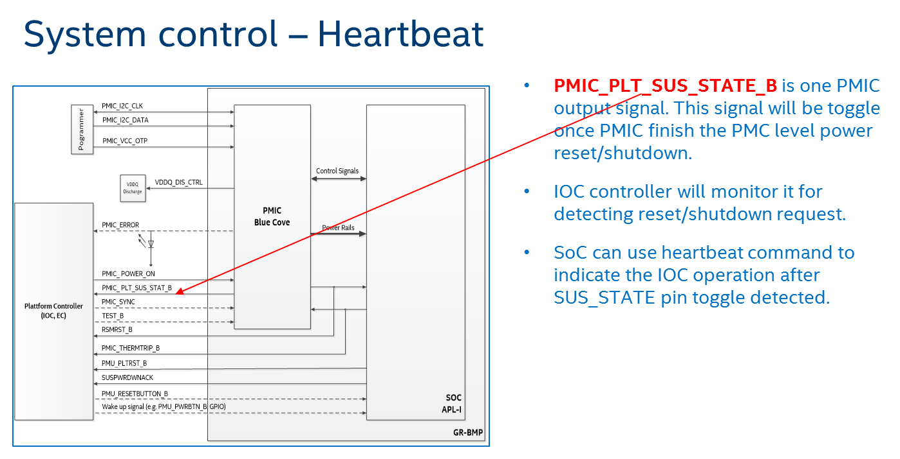

.. _IOC_virtualization_hld:

IOC Virtualization high-level design
####################################

.. author: Yuan Liu

The I/O Controller (IOC) is an SoC bridge we can use to communicate
with a Vehicle Bus in automotive applications, routing Vehicle Bus
signals, such as those extracted from CAN messages, from the IOC to the
SoC and back, as well as signals the SoC uses to control onboard
peripherals.

.. note::
   NUC and UP2 platforms do not support IOC hardware, and as such, IOC
   virtualization is not supported on these platforms.

The main purpose of IOC virtualization is to transfer data between
native Carrier Board Communication (CBC) char devices and a virtual
UART. IOC virtualization is implemented as full virtualization so the
user OS can directly reuse native CBC driver.

The IOC Mediator has several virtualization requirements, such as S3/S5
wakeup reason emulation, CBC link frame packing/unpacking, signal
whitelist, and RTC configuration.

IOC Mediator Design
*******************

Architecture Diagrams
=====================

IOC introduction
----------------

.. figure:: images/ioc-image12.png
   :width: 600px
   :align: center
   :name: ioc-mediator-arch

   IOC Mediator Architecture

-  Vehicle Bus communication involves a wide range of individual signals
   to be used, varying from single GPIO signals on the IOC up to
   complete automotive networks that connect many external ECUs.
-  IOC (I/O controller) is an SoC bridge to communicate with a Vehicle
   Bus. It routes Vehicle Bus signals (extracted from CAN
   messages for example) back and forth between the IOC and SoC. It also
   controls the onboard peripherals from the SoC.
-  IOC is always turned on. The power supply of the SoC and its memory are
   controlled by the IOC. IOC monitors some wakeup reason to control SoC
   lifecycle-related features.
-  Some hardware signals are connected to the IOC, allowing the SoC to control
   them.
-  Besides, there is one NVM (Non-Volatile Memory) that is connected to
   IOC for storing persistent data. The IOC is in charge of accessing NVM
   following the SoC's requirements.

CBC protocol introduction
-------------------------

The Carrier Board Communication (CBC) protocol multiplexes and
prioritizes communication from the available interface between the SoC
and the IOC.

The CBC protocol offers a layered approach, which allows it to run on
different serial connections, such as SPI or UART.

   IOC Native - CBC frame definition

The CBC protocol is based on a four-layer system:

-  The **Physical layer** is a serial interface with full
   duplex capabilities. A hardware handshake is required. The required
   bit rate depends on the peripherals connected, e.g. UART, and SPI.
-  The **Link layer** handles the length and payload verification.
-  The **Address Layer** is used to distinguish between the general data
   transferred. It is placed in front of the underlying Service Layer
   and contains Multiplexer (MUX) and Priority fields.
-  The **Service Layer** contains the payload data.

Native architecture
-------------------

In the native architecture, the IOC controller connects to UART
hardware, and communicates with the CAN bus to access peripheral
devices.  ``cbc_attach`` is an application to enable the CBC ldisc
function, which creates several CBC char devices. All userspace
subsystems or services communicate with IOC firmware via the CBC char
devices.

.. figure:: images/ioc-image13.png
   :width: 900px
   :align: center
   :name: ioc-software-arch

   IOC Native - Software architecture

Virtualization architecture
---------------------------

In the virtualization architecture, the IOC Device Model (DM) is
responsible for communication between the UOS and IOC firmware. The IOC
DM communicates with several native CBC char devices and a PTY device.
The native CBC char devices only include ``/dev/cbc-lifecycle``,
``/dev/cbc-signals``, and ``/dev/cbc-raw0`` - ``/dev/cbc-raw11``. Others
are not used by the IOC DM.  IOC DM opens the ``/dev/ptmx`` device to
create a pair of devices (master and slave), The IOC DM uses these
devices to communicate with UART DM since UART DM needs a TTY capable
device as its backend.

.. figure:: images/ioc-image15.png
   :width: 900px
   :align: center
   :name: ioc-virt-software-arch

   IOC Virtualization - Software architecture

High-Level Design
=================

There are five parts in this high-level design:

* Software data flow introduces data transfer in the IOC mediator
* State transfer introduces IOC mediator work states
* CBC protocol illustrates the CBC data packing/unpacking
* Power management involves boot/resume/suspend/shutdown flows
* Emulated CBC commands introduces some commands work flow

IOC mediator has three threads to transfer data between UOS and SOS. The
core thread is responsible for data reception, and Tx and Rx threads are
used for data transmission. Each of the transmission threads has one
data queue as a buffer, so that the IOC mediator can read data from CBC
char devices and UART DM immediately.

.. figure:: images/ioc-image16.png
   :width: 900px
   :align: center
   :name: ioc-med-sw-data-flow

   IOC Mediator - Software data flow

-  For Tx direction, the data comes from IOC firmware. IOC mediator
   receives service data from native CBC char devices such as
   ``/dev/cbc-lifecycle``. If service data is CBC wakeup reason, some wakeup
   reason bits will be masked. If service data is CBC signal, the data
   will be dropped and will not be defined in the whitelist. If service
   data comes from a raw channel, the data will be passed forward. Before
   transmitting to the virtual UART interface, all data needs to be
   packed with an address header and link header.
-  For Rx direction, the data comes from the UOS. The IOC mediator receives link
   data from the virtual UART interface. The data will be unpacked by Core
   thread, and then forwarded to Rx queue, similar to how the Tx direction flow
   is done except that the heartbeat and RTC are only used by the IOC
   mediator and will not be transferred to IOC
   firmware.
-  Currently, IOC mediator only cares about lifecycle, signal, and raw data.
   Others, e.g. diagnosis, are not used by the IOC mediator.

State transfer
--------------

IOC mediator has four states and five events for state transfer.

.. figure:: images/ioc-image18.png
   :width: 600px
   :align: center
   :name: ioc-state-transfer

   IOC Mediator - State Transfer

-  **INIT state**: This state is the initialized state of the IOC mediator.
   All CBC protocol packets are handled normally. In this state, the UOS
   has not yet sent an active heartbeat.
-  **ACTIVE state**: Enter this state if an HB ACTIVE event is triggered,
   indicating that the UOS state has been active and need to set the bit
   23 (SoC bit) in the wakeup reason.
-  **SUSPENDING state**: Enter this state if a RAM REFRESH event or HB
   INACTIVE event is triggered. The related event handler needs to mask
   all wakeup reason bits except SoC bit and drop the queued CBC
   protocol frames.
-  **SUSPENDED state**: Enter this state if a SHUTDOWN event is triggered to
   close all native CBC char devices. The IOC mediator will be put to
   sleep until a RESUME event is triggered to re-open the closed native
   CBC char devices and transition to the INIT state.

CBC protocol
------------

IOC mediator needs to pack/unpack the CBC link frame for IOC
virtualization, as shown in the detailed flow below:

.. figure:: images/ioc-image17.png
   :width: 900px
   :align: center
   :name: ioc-cbc-frame-usage

   IOC Native - CBC frame usage

In the native architecture, the CBC link frame is unpacked by CBC
driver. The usage services only get the service data from the CBC char
devices. For data packing, CBC driver will compute the checksum and set
priority for the frame, then send data to the UART driver.

.. figure:: images/ioc-image20.png
   :width: 900px
   :align: center
   :name: ioc-cbc-prot

   IOC Virtualizaton - CBC protocol virtualization

The difference between the native and virtualization architectures is
that the IOC mediator needs to re-compute the checksum and reset
priority. Currently, priority is not supported by IOC firmware; the
priority setting by the IOC mediator is based on the priority setting of
the CBC driver. The SOS and UOS use the same CBC driver.

Power management virtualization
-------------------------------

In acrn-dm, the IOC power management architecture involves PM DM, IOC
DM, and UART DM modules. PM DM is responsible for UOS power management,
and IOC DM is responsible for heartbeat and wakeup reason flows for IOC
firmware. The heartbeat flow is used to control IOC firmware power state
and wakeup reason flow is used to indicate IOC power state to the OS.
UART DM transfers all IOC data between the SOS and UOS. These modules
complete boot/suspend/resume/shutdown functions.

Boot flow
+++++++++

.. figure:: images/ioc-image19.png
   :width: 900px
   :align: center
   :name: ioc-virt-boot

   IOC Virtualizaton - Boot flow

#. Press ignition button for booting.
#. SOS lifecycle service gets a "booting" wakeup reason.
#. SOS lifecycle service notifies wakeup reason to VM Manager, and VM
   Manager starts VM.
#. VM Manager sets the VM state to "start".
#. IOC DM forwards the wakeup reason to UOS.
#. PM DM starts UOS.
#. UOS lifecycle gets a "booting" wakeup reason.

Suspend & Shutdown flow
+++++++++++++++++++++++

.. figure:: images/ioc-image21.png
   :width: 900px
   :align: center
   :name: ioc-suspend

   IOC Virtualizaton - Suspend and Shutdown by Ignition

#. Press ignition button to suspend or shutdown.
#. SOS lifecycle service gets a 0x800000 wakeup reason, then keeps
   sending a shutdown delay heartbeat to IOC firmware, and notifies a
   "stop" event to VM Manager.
#. IOC DM forwards the wakeup reason to UOS lifecycle service.
#. SOS lifecycle service sends a "stop" event to VM Manager, and waits for
   the stop response before timeout.
#. UOS lifecycle service gets a 0x800000 wakeup reason and sends inactive
   heartbeat with suspend or shutdown SUS_STAT to IOC DM.
#. UOS lifecycle service gets a 0x000000 wakeup reason, then enters
   suspend or shutdown kernel PM flow based on SUS_STAT.
#. PM DM executes UOS suspend/shutdown request based on ACPI.
#. VM Manager queries each VM state from PM DM. Suspend request maps
   to a paused state and shutdown request maps to a stop state.
#. VM Manager collects all VMs state, and reports it to SOS lifecycle
   service.
#. SOS lifecycle sends inactive heartbeat to IOC firmware with
   suspend/shutdown SUS_STAT, based on the SOS' own lifecycle service
   policy.

Resume flow
+++++++++++

.. figure:: images/ioc-image22.png
   :width: 900px
   :align: center
   :name: ioc-resume

   IOC Virtualizaton - Resume flow

The resume reason contains both the ignition button and RTC, and have
the same flow blocks.

For ignition resume flow:

#. Press ignition button to resume.
#. SOS lifecycle service gets an initial wakeup reason from the IOC
   firmware. The wakeup reason is 0x000020, from which the ignition button
   bit is set. It then sends active or initial heartbeat to IOC firmware.
#. SOS lifecycle forwards the wakeup reason and sends start event to VM
   Manager. The VM Manager starts to resume VMs.
#. IOC DM gets the wakeup reason from the VM Manager and forwards it to UOS
   lifecycle service.
#. VM Manager sets the VM state to starting for PM DM.
#. PM DM resumes UOS.
#. UOS lifecycle service gets wakeup reason 0x000020, and then sends an initial
   or active heartbeat. The UOS gets wakeup reason 0x800020 after
   resuming.

For RTC resume flow

#. RTC timer expires.
#. SOS lifecycle service gets initial wakeup reason from the IOC
   firmware. The wakeup reason is 0x000200, from which RTC bit is set.
   It then sends active or initial heartbeat to IOC firmware.
#. SOS lifecycle forwards the wakeup reason and sends start event to VM
   Manager. VM Manager begins resuming VMs.
#. IOC DM gets the wakeup reason from the VM Manager, and forwards it to
   the UOS lifecycle service.
#. VM Manager sets the VM state to starting for PM DM.
#. PM DM resumes UOS.
#. UOS lifecycle service gets the wakeup reason 0x000200, and sends
   initial or active heartbeat. The UOS gets wakeup reason 0x800200
   after resuming..

System control data
-------------------

IOC mediator has several emulated CBC commands, including wakeup reason,
heartbeat, and RTC.

The wakeup reason, heartbeat, and RTC commands belong to the system
control frames, which are used for startup or shutdown control. System
control includes Wakeup Reasons, Heartbeat, Boot Selector, Suppress
Heartbeat Check, and Set Wakeup Timer functions. Details are in this
table:

.. list-table:: System control SVC values
   :header-rows: 1

   * - System Control
     - Value Name
     - Description
     - Data Direction

   * - 1
     - Wakeup Reasons
     - Wakeup Reasons
     - IOC to SoC

   * - 2
     - Heartbeat
     - Heartbeat
     - Soc to IOC

   * - 3
     - Boot Selector
     - Boot Selector
     - Soc to IOC

   * - 4
     - Suppress Heartbeat Check
     - Suppress Heartbeat Check
     - Soc to IOC

   * - 5
     - Set Wakeup Timer
     - Set Wakeup Timer in AIOC firmware
     - Soc to IOC

-  IOC mediator only supports wakeup reasons Heartbeat and Set Wakeup
   Timer.
-  The Boot Selector command is used to configure which partition the
   IOC has to use for normal and emergency boots. Additionally, the IOC
   has to report to the SoC after the CBC communication has been
   established successfully with which boot partition has been started
   and for what reason.
-  The Suppress Heartbeat Check command is sent by the SoC in
   preparation for maintenance tasks which requires the CBC Server to be
   shut down for a certain period of time. It instructs the IOC not to
   expect CBC heartbeat messages during the specified time. The IOC must
   disable any watchdog on the CBC heartbeat messages during this period
   of time.

Wakeup reason
+++++++++++++

The wakeup reasons command contains a bit mask of all reasons, which is
currently keeping the SoC/IOC active. The SoC itself also has a wakeup
reason, which allows the SoC to keep the IOC active. The wakeup reasons
should be sent every 1000 ms by the IOC.

Wakeup reason frame definition is as below:

   Wakeup Reason Frame Definition

Currently the wakeup reason bits are supported by sources shown here:

.. list-table:: Wakeup Reason Bits
   :header-rows: 1

   * - Wakeup Reason
     - Bit
     - Source

   * - wakeup_button
     - 5
     - Get from IOC FW, forward to UOS

   * - RTC wakeup
     - 9
     - Get from IOC FW, forward to UOS

   * - car door wakeup
     - 11
     - Get from IOC FW, forward to UOS

   * - SoC wakeup
     - 23
     - Emulation (Depends on UOS's heartbeat message

-  CBC_WK_RSN_BTN (bit 5): ignition button.
-  CBC_WK_RSN_RTC (bit 9): RTC timer.
-  CBC_WK_RSN_DOR (bit 11): Car door.
-  CBC_WK_RSN_SOC (bit 23): SoC active/inactive.

.. figure:: images/ioc-image4.png
   :width: 600px
   :align: center
   :name: ioc-wakeup-flow

   IOC Mediator - Wakeup reason flow

Bit 23 is for the SoC wakeup indicator and should not be forwarded
directly because every VM has a different heartbeat status.

Heartbeat
+++++++++

The Heartbeat is used for SOC watchdog, indicating the SOC power
reset behavior. Heartbeat needs to be sent every 1000 ms by
the SoC.

   System control - Heartbeat

Heartbeat frame definition is shown here:

.. figure:: images/ioc-image6.png
   :width: 900px
   :align: center
   :name: ioc-heartbeat-frame

   Heartbeat Frame Definition

-  Heartbeat active is repeatedly sent from SoC to IOC to signal that
   the SoC is active and intends to stay active. The On SUS_STAT action
   must be set to invalid.
-  Heartbeat inactive is sent once from SoC to IOC to signal that the
   SoC is ready for power shutdown. The On SUS_STAT action must be set
   to a required value.
-  Heartbeat delay is repeatedly sent from SoC to IOC to signal that the
   SoC has received the shutdown request, but isn't ready for
   shutdown yet (for example, a phone call or other time consuming
   action is active). The On SUS_STAT action must be set to invalid.

   Heartbeat Commands

-  SUS_STAT invalid action needs to be set with a heartbeat active
   message.
-  For the heartbeat inactive message, the SoC needs to be set from
   command 1 to 7 following the related scenarios. For example: S3 case
   needs to be set at 7 to prevent from power gating the memory.
-  The difference between halt and reboot is related if the power rail
   that supplies to customer peripherals (such as Fan, HDMI-in, BT/WIFI,
   M.2, and Ethernet) is reset.

.. figure:: images/ioc-image8.png
   :width: 900px
   :align: center
   :name: ioc-heartbeat-flow

   IOC Mediator - Heartbeat Flow

-  IOC DM will not maintain a watchdog timer for a heartbeat message. This
   is because it already has other watchdog features, so the main use of
   Heartbeat active command is to maintain the virtual wakeup reason
   bitmap variable.
-  For Heartbeat, IOC mediator supports Heartbeat shutdown prepared,
   Heartbeat active, Heartbeat shutdown delay, Heartbeat initial, and
   Heartbeat Standby.
-  For SUS_STAT, IOC mediator supports invalid action and RAM refresh
   action.
-  For Suppress heartbeat check will also be dropped directly.

RTC
+++

RTC timer is used to wakeup SoC when the timer is expired. (A use
case is for an automatic software upgrade with a specific time.) RTC frame
definition is as below.

.. figure:: images/ioc-image9.png
   :width: 600px
   :align: center

-  The RTC command contains a relative time but not an absolute time.
-  SOS lifecycle service will re-compute the time offset before it is
   sent to the IOC firmware.

   IOC Mediator - RTC flow

Signal data
-----------

Signal channel is an API between the SOC and IOC for
miscellaneous requirements. The process data includes all vehicle bus and
carrier board data (GPIO, sensors, and so on). It supports
transportation of single signals and group signals. Each signal consists
of a signal ID (reference), its value, and its length. IOC and SOC need
agreement on the definition of signal IDs that can be treated as API
interface definitions.

IOC signal type definitions are as below.

   Process Data SVC values

   IOC Mediator - Signal flow

-  The IOC backend needs to emulate the channel open/reset/close message which
   shouldn't be forward to the native cbc signal channel. The SOS signal
   related services should do a real open/reset/close signal channel.
-  Every backend should maintain a whitelist for different VMs. The
   whitelist can be stored in the SOS file system (Read only) in the
   future, but currently it is hard coded.

IOC mediator has two whitelist tables, one is used for rx
signals(SOC->IOC), and the other one is used for tx signals. The IOC
mediator drops the single signals and group signals if the signals are
not defined in the whitelist. For multi signal, IOC mediator generates a
new multi signal, which contains the signals in the whitelist.

   IOC Mediator - Multi-Signal whitelist

Raw data
--------

OEM raw channel only assigns to a specific UOS following that OEM
configuration. The IOC Mediator will directly forward all read/write
message from IOC firmware to UOS without any modification.

Dependencies and Constraints
****************************

HW External Dependencies
========================

+--------------------------------------+--------------------------------------+
| Dependency                           | Runtime Mechanism to Detect          |
|                                      | Violations                           |
+======================================+======================================+
| VMX should be supported              | Boot-time checks to CPUID. See       |
|                                      | section A.1 in SDM for details.      |
+--------------------------------------+--------------------------------------+
| EPT should be supported              | Boot-time checks to primary and      |
|                                      | secondary processor-based            |
|                                      | VM-execution controls. See section   |
|                                      | A.3.2 and A.3.3 in SDM for details.  |
+--------------------------------------+--------------------------------------+

SW External Dependencies
========================

+--------------------------------------+--------------------------------------+
| Dependency                           | Runtime Mechanism to Detect          |
|                                      | Violations                           |
+======================================+======================================+
| When invoking the hypervisor, the    | Check the magic value in EAX. See    |
| bootloader should have established a | section 3.2 & 3.3 in Multiboot       |
| multiboot-compliant state            | Specification for details.           |
+--------------------------------------+--------------------------------------+

Constraints
===========

+--------------------------+--------------------------+--------------------------+
| Description              | Rationale                | How such constraint is   |
|                          |                          | enforced                 |
+==========================+==========================+==========================+
| Physical cores are       | To avoid interference    | A bitmap indicating free |
| exclusively assigned to  | between vcpus on the     | pcpus; on vcpu creation  |
| vcpus.                   | same core.               | a free pcpu is picked.   |
+--------------------------+--------------------------+--------------------------+
| Only PCI devices         | Without HW reset it is   |                          |
| supporting HW reset can  | challenging to manage    |                          |
| be passed through to a   | devices on UOS crashes   |                          |
| UOS.                     |                          |                          |
+--------------------------+--------------------------+--------------------------+

Interface Specification
***********************

Doxygen-style comments in the code are used for interface specification.
This section provides some examples on how functions and structure
should be commented.

Function Header Template
========================

.. code-block:: c

   /**
    * @brief Initialize environment for Trusty-OS on a VCPU.
    *
    * More info here.
    *
    * @param[in]    vcpu Pointer to VCPU data structure
    * @param[inout] param guest physical address. This gpa points to
    *                     struct trusty_boot_param
    *
    * @return 0 - on success.
    * @return -EIO - (description when this error can happen)
    * @return -EINVAL - (description )
    *
    * @pre vcpu must not be NULL.
    * @pre param must ...
    *
    * @post the return value is non-zero if param is ....
    * @post 
    *
    * @remark The api must be invoked with interrupt disabled.
    * @remark (Other usage constraints here)
    */

Structure
=========

.. code-block:: c

   /**
    * @brief An mmio request.
    *
    * More info here.
    */
   struct mmio_request {
           uint32_t direction;  /**< Direction of this request. */
           uint32_t reserved;   /**< Reserved. */
           int64_t address;     /**< gpa of the register to be accessed. */
           int64_t size;        /**< Width of the register to be accessed. */
           int64_t value;       /**< Value read from or to be written to the
   register. */
   } __aligned(8);

IOC Mediator Configuration
**************************

TBD

IOC Mediator Usage
******************

The device model configuration command syntax for IOC mediator is as
follows::

   -i,[ioc_channel_path],[wakeup_reason]
   -l,[lpc_port],[ioc_channel_path]

The "ioc_channel_path" is an absolute path for communication between
IOC mediator and UART DM.

The "lpc_port" is "com1" or "com2", IOC mediator needs one unassigned
lpc port for data transfer between UOS and SOS.

The "wakeup_reason" is IOC mediator boot up reason, each bit represents
one wakeup reason.

For example, the following commands are used to enable IOC feature, the
initial wakeup reason is the ignition button and cbc_attach uses ttyS1
for TTY line discipline in UOS::

   -i /run/acrn/ioc_$vm_name,0x20
   -l com2,/run/acrn/ioc_$vm_name

Porting and adaptation to different platforms
*********************************************

TBD
