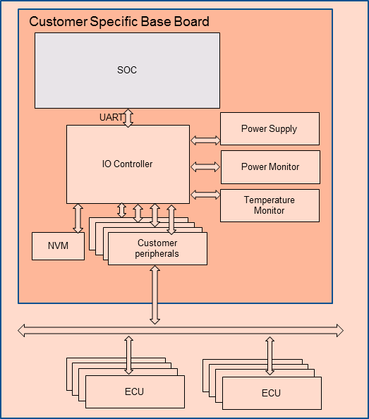

.. _IOC_virtualization_hld:

IOC Virtualization High-Level Design
####################################

.. author: Yuan Liu

The I/O Controller (IOC) is an SoC bridge we can use to communicate
with a Vehicle Bus in automotive applications, routing Vehicle Bus
signals, such as those extracted from CAN messages, from the IOC to the
SoC and back, as well as signals the SoC uses to control onboard
peripherals.

.. note::
   Intel NUC and UP2 platforms do not support IOC hardware, and as such, IOC
   virtualization is not supported on these platforms.

The main purpose of IOC virtualization is to transfer data between
native Carrier Board Communication (CBC) char devices and a virtual
UART. IOC virtualization is implemented as full virtualization so the
User VM can directly reuse the native CBC driver.

The IOC Mediator has several virtualization requirements, such as S3/S5
wakeup reason emulation, CBC link frame packing/unpacking, signal
passlist, and RTC configuration.

IOC Mediator Design
*******************

Architecture Diagrams
=====================

IOC Introduction
----------------

   IOC Mediator Architecture

-  Vehicle Bus communication involves a wide range of individual signals
   to be used, varying from single GPIO signals on the IOC up to
   complete automotive networks that connect many external ECUs.
-  IOC (I/O controller) is an SoC bridge to communicate with a Vehicle
   Bus. It routes Vehicle Bus signals (extracted from CAN
   messages for example) back and forth between the IOC and SoC. It also
   controls the onboard peripherals from the SoC.
-  IOC is always turned on. The power supply of the SoC and its memory are
   controlled by the IOC. IOC monitors some wakeup reason to control SoC
   lifecycle-related features.
-  Some hardware signals are connected to the IOC, allowing the SoC to control
   them.
-  Besides, there is one NVM (Non-Volatile Memory) that is connected to
   IOC for storing persistent data. The IOC is in charge of accessing NVM
   following the SoC's requirements.

CBC Protocol Introduction
-------------------------

The Carrier Board Communication (CBC) protocol multiplexes and
prioritizes communication from the available interface between the SoC
and the IOC.

The CBC protocol offers a layered approach, which allows it to run on
different serial connections, such as SPI or UART.

.. figure:: images/ioc-image14.png
   :width: 900px
   :align: center
   :name: ioc-cbc-frame-def

   IOC Native - CBC Frame Definition

The CBC protocol is based on a four-layer system:

-  The **Physical Layer** is a serial interface with full
   duplex capabilities. A hardware handshake is required. The required
   bit rate depends on the peripherals connected, e.g., UART and SPI.
-  The **Link Layer** handles the length and payload verification.
-  The **Address Layer** is used to distinguish between the general data
   transferred. It is placed in front of the underlying Service Layer
   and contains Multiplexer (MUX) and Priority fields.
-  The **Service Layer** contains the payload data.

Native Architecture
-------------------

In the native architecture, the IOC controller connects to UART
hardware, and communicates with the CAN bus to access peripheral
devices.  ``cbc_attach`` is an application to enable the CBC ldisc
function, which creates several CBC char devices. All userspace
subsystems or services communicate with IOC firmware via the CBC char
devices.

   IOC Native - Software Architecture

Virtualization Architecture
---------------------------

In the virtualization architecture, the IOC Device Model (DM) is
responsible for communication between the User VM and IOC firmware. The IOC
DM communicates with several native CBC char devices and a PTY device.
The native CBC char devices only include ``/dev/cbc-lifecycle``,
``/dev/cbc-signals``, and ``/dev/cbc-raw0`` - ``/dev/cbc-raw11``. Others
are not used by the IOC DM.  IOC DM opens the ``/dev/ptmx`` device to
create a pair of devices (primary and secondary), The IOC DM uses these
devices to communicate with UART DM since UART DM needs a TTY capable
device as its backend.

   IOC Virtualization - Software Architecture

High-Level Design
=================

There are five parts in this high-level design:

* Software data flow introduces data transfer in the IOC mediator
* State transfer introduces IOC mediator work states
* CBC protocol illustrates the CBC data packing/unpacking
* Power management involves boot/resume/suspend/shutdown flows
* Emulated CBC commands introduce some commands workflow

IOC mediator has three threads to transfer data between User VM and Service VM. The
core thread is responsible for data reception, and Tx and Rx threads are
used for data transmission. Each of the transmission threads has one
data queue as a buffer, so that the IOC mediator can read data from CBC
char devices and UART DM immediately.

   IOC Mediator - Software Data Flow

-  For Tx direction, the data comes from IOC firmware. IOC mediator
   receives service data from native CBC char devices such as
   ``/dev/cbc-lifecycle``. If service data is CBC wakeup reason, some wakeup
   reason bits will be masked. If service data is CBC signal, the data
   will be dropped and will not be defined in the passlist. If service
   data comes from a raw channel, the data will be passed forward. Before
   transmitting to the virtual UART interface, all data needs to be
   packed with an address header and link header.
-  For Rx direction, the data comes from the User VM. The IOC mediator receives link
   data from the virtual UART interface. The data will be unpacked by Core
   thread, and then forwarded to Rx queue, similar to how the Tx direction flow
   is done except that the heartbeat and RTC are only used by the IOC
   mediator and will not be transferred to IOC
   firmware.
-  IOC mediator only cares about lifecycle, signal, and raw data.
   Others, such as diagnosis, are not used by the IOC mediator.

State Transfer
--------------

IOC mediator has four states and five events for state transfer.

   IOC Mediator - State Transfer

-  **INIT state**: This state is the initialized state of the IOC mediator.
   All CBC protocol packets are handled normally. In this state, the User VM
   has not yet sent an active heartbeat.
-  **ACTIVE state**: Enter this state if an HB ACTIVE event is triggered,
   indicating that the User VM state has been active and need to set the bit
   23 (SoC bit) in the wakeup reason.
-  **SUSPENDING state**: Enter this state if a RAM REFRESH event or HB
   INACTIVE event is triggered. The related event handler needs to mask
   all wakeup reason bits except SoC bit and drop the queued CBC
   protocol frames.
-  **SUSPENDED state**: Enter this state if a SHUTDOWN event is triggered to
   close all native CBC char devices. The IOC mediator will be put to
   sleep until a RESUME event is triggered to re-open the closed native
   CBC char devices and transition to the INIT state.

CBC Protocol
------------

IOC mediator needs to pack/unpack the CBC link frame for IOC
virtualization, as shown in the detailed flow below:

.. figure:: images/ioc-image17.png
   :width: 900px
   :align: center
   :name: ioc-cbc-frame-usage

   IOC Native - CBC Frame Usage

In the native architecture, the CBC link frame is unpacked by CBC
driver. The usage services only get the service data from the CBC char
devices. For data packing, CBC driver will compute the checksum and set
priority for the frame, then send data to the UART driver.

   IOC Virtualizaton - CBC Protocol Virtualization

The difference between the native and virtualization architectures is
that the IOC mediator needs to re-compute the checksum and reset
priority. Priority is not supported by IOC firmware; the
priority setting by the IOC mediator is based on the priority setting of
the CBC driver. The Service VM and User VM use the same CBC driver.

Power Management Virtualization
-------------------------------

In acrn-dm, the IOC power management architecture involves PM DM, IOC
DM, and UART DM modules. PM DM is responsible for User VM power management,
and IOC DM is responsible for heartbeat and wakeup reason flows for IOC
firmware. The heartbeat flow is used to control IOC firmware power state
and wakeup reason flow is used to indicate IOC power state to the OS.
UART DM transfers all IOC data between the Service VM and User VM. These modules
complete boot/suspend/resume/shutdown functions.

Boot Flow
+++++++++

   IOC Virtualizaton - Boot Flow

#. Press ignition button for booting.
#. Service VM lifecycle service gets a "booting" wakeup reason.
#. Service VM lifecycle service notifies wakeup reason to VM Manager, and VM
   Manager starts VM.
#. VM Manager sets the VM state to "start".
#. IOC DM forwards the wakeup reason to User VM.
#. PM DM starts User VM.
#. User VM lifecycle gets a "booting" wakeup reason.

Suspend & Shutdown Flow
+++++++++++++++++++++++

   IOC Virtualizaton - Suspend and Shutdown by Ignition

#. Press ignition button to suspend or shutdown.
#. Service VM lifecycle service gets a 0x800000 wakeup reason, then keeps
   sending a shutdown delay heartbeat to IOC firmware, and notifies a
   "stop" event to VM Manager.
#. IOC DM forwards the wakeup reason to User VM lifecycle service.
#. Service VM lifecycle service sends a "stop" event to VM Manager, and waits for
   the stop response before timeout.
#. User VM lifecycle service gets a 0x800000 wakeup reason and sends inactive
   heartbeat with suspend or shutdown SUS_STAT to IOC DM.
#. User VM lifecycle service gets a 0x000000 wakeup reason, then enters
   suspend or shutdown kernel PM flow based on SUS_STAT.
#. PM DM executes User VM suspend/shutdown request based on ACPI.
#. VM Manager queries each VM state from PM DM. Suspend request maps
   to a paused state and shutdown request maps to a stop state.
#. VM Manager collects all VMs' state, and reports it to Service VM lifecycle
   service.
#. Service VM lifecycle sends inactive heartbeat to IOC firmware with
   suspend/shutdown SUS_STAT, based on the Service VM's own lifecycle service
   policy.

Resume Flow
+++++++++++

   IOC Virtualizaton - Resume Flow

The resume reason contains both the ignition button and RTC, and has
the same flow blocks.

For ignition resume flow:

#. Press ignition button to resume.
#. Service VM lifecycle service gets an initial wakeup reason from the IOC
   firmware. The wakeup reason is 0x000020, from which the ignition button
   bit is set. It then sends active or initial heartbeat to IOC firmware.
#. Service VM lifecycle forwards the wakeup reason and sends start event to VM
   Manager. The VM Manager starts to resume VMs.
#. IOC DM gets the wakeup reason from the VM Manager and forwards it to User VM
   lifecycle service.
#. VM Manager sets the VM state to starting for PM DM.
#. PM DM resumes User VM.
#. User VM lifecycle service gets wakeup reason 0x000020, and then sends an initial
   or active heartbeat. The User VM gets wakeup reason 0x800020 after
   resuming.

For RTC resume flow

#. RTC timer expires.
#. Service VM lifecycle service gets initial wakeup reason from the IOC
   firmware. The wakeup reason is 0x000200, from which RTC bit is set.
   It then sends active or initial heartbeat to IOC firmware.
#. Service VM lifecycle forwards the wakeup reason and sends start event to VM
   Manager. VM Manager begins resuming VMs.
#. IOC DM gets the wakeup reason from the VM Manager, and forwards it to
   the User VM lifecycle service.
#. VM Manager sets the VM state to starting for PM DM.
#. PM DM resumes User VM.
#. User VM lifecycle service gets the wakeup reason 0x000200, and sends
   initial or active heartbeat. The User VM gets wakeup reason 0x800200
   after resuming.

System Control Data
-------------------

IOC mediator has several emulated CBC commands, including wakeup reason,
heartbeat, and RTC.

The wakeup reason, heartbeat, and RTC commands belong to the system
control frames, which are used for startup or shutdown control. System
control includes Wakeup Reasons, Heartbeat, Boot Selector, Suppress
Heartbeat Check, and Set Wakeup Timer functions. Details are in this
table:

.. list-table:: System Control SVC Values
   :header-rows: 1

   * - System Control
     - Value Name
     - Description
     - Data Direction

   * - 1
     - Wakeup Reasons
     - Wakeup Reasons
     - IOC to SoC

   * - 2
     - Heartbeat
     - Heartbeat
     - SoC to IOC

   * - 3
     - Boot Selector
     - Boot Selector
     - SoC to IOC

   * - 4
     - Suppress Heartbeat Check
     - Suppress Heartbeat Check
     - SoC to IOC

   * - 5
     - Set Wakeup Timer
     - Set Wakeup Timer in AIOC firmware
     - SoC to IOC

-  IOC mediator only supports wakeup reasons Heartbeat and Set Wakeup
   Timer.
-  The Boot Selector command is used to configure which partition the
   IOC has to use for normal and emergency boots. Additionally, the IOC
   has to report to the SoC after the CBC communication has been
   established successfully with which boot partition has been started
   and for what reason.
-  The Suppress Heartbeat Check command is sent by the SoC in
   preparation for maintenance tasks which requires the CBC Server to be
   shut down for a certain period of time. It instructs the IOC not to
   expect CBC heartbeat messages during the specified time. The IOC must
   disable any watchdog on the CBC heartbeat messages during this period
   of time.

Wakeup Reason
+++++++++++++

The wakeup reasons command contains a bitmask of all reasons that are
keeping the SoC/IOC active. The SoC itself also has a wakeup
reason, which allows the SoC to keep the IOC active. The wakeup reasons
should be sent every 1000 ms by the IOC.

Wakeup reason frame definition is as below:

.. figure:: images/ioc-image24.png
   :width: 900px
   :align: center
   :name: ioc-wakeup-reason

   Wakeup Reason Frame Definition

The wakeup reason bits are supported by sources shown here:

.. list-table:: Wakeup Reason Bits
   :header-rows: 1

   * - Wakeup Reason
     - Bit
     - Source

   * - wakeup_button
     - 5
     - Get from IOC firmware, forward to User VM

   * - RTC wakeup
     - 9
     - Get from IOC firmware, forward to User VM

   * - Car door wakeup
     - 11
     - Get from IOC firmware, forward to User VM

   * - SoC wakeup
     - 23
     - Emulation (Depends on User VM's heartbeat message

-  CBC_WK_RSN_BTN (bit 5): Ignition button.
-  CBC_WK_RSN_RTC (bit 9): RTC timer.
-  CBC_WK_RSN_DOR (bit 11): Car door.
-  CBC_WK_RSN_SOC (bit 23): SoC active/inactive.

   IOC Mediator - Wakeup Reason Flow

Bit 23 is for the SoC wakeup indicator and should not be forwarded
directly because every VM has a different heartbeat status.

Heartbeat
+++++++++

The Heartbeat is used for SoC watchdog, indicating the SoC power
reset behavior. Heartbeat needs to be sent every 1000 ms by
the SoC.

.. figure:: images/ioc-image5.png
   :width: 900px
   :align: center
   :name: ioc-heartbeat

   System Control - Heartbeat

Heartbeat frame definition is shown here:

.. figure:: images/ioc-image6.png
   :width: 900px
   :align: center
   :name: ioc-heartbeat-frame

   Heartbeat Frame Definition

-  Heartbeat active is repeatedly sent from SoC to IOC to signal that
   the SoC is active and intends to stay active. The On SUS_STAT action
   must be set to invalid.
-  Heartbeat inactive is sent once from SoC to IOC to signal that the
   SoC is ready for power shutdown. The On SUS_STAT action must be set
   to a required value.
-  Heartbeat delay is repeatedly sent from SoC to IOC to signal that the
   SoC has received the shutdown request, but isn't ready for
   shutdown yet (for example, a phone call or other time consuming
   action is active). The On SUS_STAT action must be set to invalid.

.. figure:: images/ioc-image7.png
   :width: 600px
   :align: center
   :name: ioc-heartbeat-commands

   Heartbeat Commands

-  SUS_STAT invalid action needs to be set with a heartbeat active
   message.
-  For the heartbeat inactive message, the SoC needs to be set from
   command 1 to 7 following the related scenarios. For example: S3 case
   needs to be set at 7 to prevent from power gating the memory.
-  The difference between halt and reboot is related if the power rail
   that supplies to customer peripherals (such as Fan, HDMI-in, BT/Wi-Fi,
   M.2, and Ethernet) is reset.

   IOC Mediator - Heartbeat Flow

-  IOC DM will not maintain a watchdog timer for a heartbeat message. This
   is because it already has other watchdog features, so the main use of
   Heartbeat active command is to maintain the virtual wakeup reason
   bitmap variable.
-  For Heartbeat, IOC mediator supports Heartbeat shutdown prepared,
   Heartbeat active, Heartbeat shutdown delay, Heartbeat initial, and
   Heartbeat Standby.
-  For SUS_STAT, IOC mediator supports invalid action and RAM refresh
   action.
-  For Suppress heartbeat check will also be dropped directly.

RTC
+++

RTC timer is used to wake up the SoC when the timer is expired. (A use
case is for an automatic software upgrade with a specific time.) RTC frame
definition is as below.

-  The RTC command contains a relative time but not an absolute time.
-  Service VM lifecycle service will re-compute the time offset before it is
   sent to the IOC firmware.

.. figure:: images/ioc-image10.png
   :width: 900px
   :align: center
   :name: ioc-rtc-flow

   IOC Mediator - RTC Flow

Signal Data
-----------

Signal channel is an API between the SoC and IOC for
miscellaneous requirements. The process data includes all vehicle bus and
carrier board data (GPIO, sensors, and so on). It supports
transportation of single signals and group signals. Each signal consists
of a signal ID (reference), its value, and its length. IOC and SoC need
agreement on the definition of signal IDs that can be treated as API
interface definitions.

IOC signal type definitions are as below.

.. figure:: images/ioc-image1.png
   :width: 600px
   :align: center
   :name: ioc-process-data-svc-val

   Process Data SVC Values

.. figure:: images/ioc-image2.png
   :width: 900px
   :align: center
   :name: ioc-med-signal-flow

   IOC Mediator - Signal Flow

-  The IOC backend needs to emulate the channel open/reset/close message which
   shouldn't be forwarded to the native cbc signal channel. The Service VM
   signal related services should do a real open/reset/close signal channel.
-  Every backend should maintain a passlist for different VMs. The
   passlist is hard coded.

IOC mediator has two passlist tables, one is used for rx
signals (SoC->IOC), and the other one is used for tx signals. The IOC
mediator drops the single signals and group signals if the signals are
not defined in the passlist. For multi signal, IOC mediator generates a
new multi signal, which contains the signals in the passlist.

.. figure:: images/ioc-image3.png
   :width: 600px
   :align: center
   :name: ioc-med-multi-signal

   IOC Mediator - Multi-Signal Passlist

Raw Data
--------

OEM raw channel only assigns to a specific User VM following that OEM
configuration. The IOC Mediator will directly forward all read/write
messages from IOC firmware to the User VM without any modification.

IOC Mediator Usage
******************

The Device Model configuration command syntax for IOC mediator is as
follows::

   -i,[ioc_channel_path],[wakeup_reason]
   -l,[lpc_port],[ioc_channel_path]

The ``ioc_channel_path`` is an absolute path for communication between
IOC mediator and UART DM.

The ``lpc_port`` is ``com1`` or ``com2``. IOC mediator needs one unassigned
lpc port for data transfer between User VM and Service VM.

The ``wakeup_reason`` is the IOC mediator boot reason. Each bit represents
one wakeup reason.

For example, the following commands are used to enable the IOC feature. The
initial wakeup reason is the ignition button and cbc_attach uses ttyS1
for TTY line discipline in the User VM::

   -i /run/acrn/ioc_$vm_name,0x20
   -l com2,/run/acrn/ioc_$vm_name

