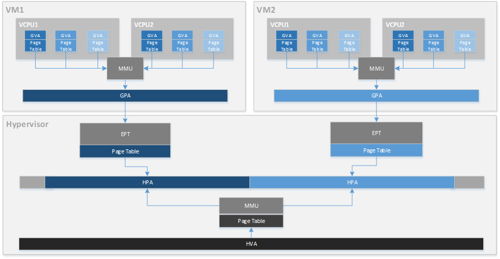

.. _memmgt-hld:

Memory Management High-Level Design
###################################

This document describes memory management for the ACRN hypervisor.

Overview
********

The hypervisor (HV) virtualizes real physical memory so an unmodified OS
(such as Linux or Android) that is running in a virtual machine can
manage its own contiguous physical memory. The HV uses virtual-processor
identifiers (VPIDs) and the extended page-table mechanism (EPT) to
translate a guest-physical address into a host-physical address. The HV enables
EPT and VPID hardware virtualization features, establishes EPT page
tables for Service and User VMs, and provides EPT page tables operation interfaces to others.

In the ACRN hypervisor system, there are a few different memory spaces to
consider. From the hypervisor's point of view:

-  **Host Physical Address (HPA)**: the native physical address space.
-  **Host Virtual Address (HVA)**: the native virtual address space based on
   an MMU. A page table is used to translate from HVA to HPA spaces.

From the Guest OS running on a hypervisor:

-  **Guest Physical Address (GPA)**: the guest physical address space from a
   virtual machine. GPA to HPA transition is usually based on an
   MMU-like hardware module (EPT in X86), and is associated with a page
   table.
-  **Guest Virtual Address (GVA)**: the guest virtual address space from a
   virtual machine based on a vMMU.

   ACRN Memory Mapping Overview

:numref:`mem-overview` provides an overview of the ACRN system memory
mapping, showing:

-  GVA to GPA mapping based on vMMU on a vCPU in a VM
-  GPA to HPA mapping based on EPT for a VM in the hypervisor
-  HVA to HPA mapping based on MMU in the hypervisor

This document illustrates the memory management infrastructure for the
ACRN hypervisor and how it handles the different memory space views
inside the hypervisor and from a VM:

-  How ACRN hypervisor manages host memory (HPA/HVA)
-  How ACRN hypervisor manages the Service VM guest memory (HPA/GPA)
-  How ACRN hypervisor and the Service VM Device Model (DM) manage the User VM
   guest memory (HPA/GPA)

Hypervisor Physical Memory Management
*************************************

In ACRN, the HV initializes MMU page tables to manage all physical
memory and then switches to the new MMU page tables. After MMU page
tables are initialized at the platform initialization stage, no updates
are made for MMU page tables except when ``set_paging_supervisor/nx/x`` is
called.
However, the memory region updated by ``set_paging_supervisor/nx/x``
must not be accessed by the ACRN hypervisor in advance because access could
make mapping in the TLB and there is no TLB flush mechanism for the ACRN HV memory.

Hypervisor Physical Memory Layout - E820
========================================

The ACRN hypervisor is the primary owner for managing system memory.
Typically, the boot firmware (e.g., EFI) passes the platform physical
memory layout - E820 table to the hypervisor. The ACRN hypervisor does
its memory management based on this table using 4-level paging.

The BIOS/bootloader firmware (e.g., EFI) passes the E820 table through a
multiboot protocol. This table contains the original memory layout for
the platform.

.. figure:: images/mem-image1.png
   :align: center
   :width: 900px
   :name: mem-layout

   Physical Memory Layout Example

:numref:`mem-layout` is an example of the physical memory layout based on a simple platform E820 table.

Hypervisor Memory Initialization
================================

The ACRN hypervisor runs in paging mode. After the bootstrap
processor (BSP) gets the platform E820 table, the BSP creates its MMU page
table based on it. This is done by the function ``init_paging()``.
After the application processor (AP) receives the IPI CPU startup
interrupt, it uses the MMU page tables created by the BSP. In order to bring
the memory access rights into effect, some other APIs are provided:
``enable_paging`` will enable IA32_EFER.NXE and CR0.WP, ``enable_smep`` will
enable CR4.SMEP, and ``enable_smap`` will enable CR4.SMAP.
:numref:`hv-mem-init`  describes the hypervisor memory initialization for the BSP
and APs.

.. figure:: images/mem-image8.png
   :align: center
   :name: hv-mem-init

   Hypervisor Memory Initialization

The following memory mapping policy used is:

- Identical mapping (ACRN hypervisor memory could be relocatable in
  the future)
- Map all address spaces with UNCACHED type, read/write, user
  and execute-disable access right
- Remap [0, low32_max_ram) regions to WRITE-BACK type
- Remap [4G, high64_max_ram) regions to WRITE-BACK type
- Set the paging-structure entries' U/S flag to
  supervisor-mode for hypervisor-owned memory
  (exclude the memory reserved for trusty)
- Remove 'NX' bit for pages that contain the hv code section

.. figure:: images/mem-image69.png
   :align: center
   :name: hv-mem-vm-init

   Hypervisor Virtual Memory Layout

:numref:`hv-mem-vm-init` above shows:

- Hypervisor has a view of and can access all system memory
- Hypervisor has UNCACHED MMIO/PCI hole reserved for devices such as
  LAPIC/IOAPIC accessing
- Hypervisor has its own memory with WRITE-BACK cache type for its
  code/data (< 1M part is for secondary CPU reset code)

The hypervisor should use minimum memory pages to map from virtual
address space into the physical address space. So ACRN only supports
map linear addresses to 2-MByte pages, or 1-GByte pages; it doesn't
support map linear addresses to 4-KByte pages.

- If 1GB hugepage can be used
  for virtual address space mapping, the corresponding PDPT entry shall be
  set for this 1GB hugepage.
- If 1GB hugepage can't be used for virtual
  address space mapping and 2MB hugepage can be used, the corresponding
  PDT entry shall be set for this 2MB hugepage.

If the memory type or access rights of a page are updated, or some virtual
address space is deleted, it will lead to splitting of the corresponding
page. The hypervisor will still keep using minimum memory pages to map from
the virtual address space into the physical address space.

Memory Pages Pool Functions
===========================

Memory pages pool functions provide static management of one
4KB page-size memory block for each page level for each VM or HV; it is
used by the hypervisor to do memory mapping.

Data Flow Design
================

The physical memory management unit provides MMU 4-level page tables
creation and services updates, MMU page tables switching service, SMEP
enable service, and HPA/HVA retrieving service to other units.
:numref:`mem-data-flow-physical` shows the data flow diagram
of physical memory management.

.. figure:: images/mem-image45.png
   :align: center
   :name: mem-data-flow-physical

   Data Flow of Hypervisor Physical Memory Management

Interfaces Design
=================

MMU Initialization
------------------

.. doxygenfunction:: enable_smep
   :project: Project ACRN

.. doxygenfunction:: enable_smap
   :project: Project ACRN

.. doxygenfunction:: enable_paging
   :project: Project ACRN

.. doxygenfunction:: init_paging
   :project: Project ACRN

Address Space Translation
-------------------------

.. doxygenfunction:: hpa2hva_early
   :project: Project ACRN

.. doxygenfunction:: hva2hpa_early
   :project: Project ACRN

.. doxygenfunction:: hpa2hva
   :project: Project ACRN

.. doxygenfunction:: hva2hpa
   :project: Project ACRN

Hypervisor Memory Virtualization
********************************

The hypervisor provides a contiguous region of physical memory for the Service VM
and each User VM. It also guarantees that the Service and User VMs can not access the
code and internal data in the hypervisor, and each User VM can not access
the code and internal data of the Service VM and other User VMs.

The hypervisor:

- enables EPT and VPID hardware virtualization features
- establishes EPT page tables for the Service and User VMs
- provides EPT page tables operations services
- virtualizes MTRR for Service and User VMs
- provides VPID operations services
- provides services for address spaces translation between the GPA and HPA
- provides services for data transfer between the hypervisor and the virtual machine

Memory Virtualization Capability Checking
=========================================

In the hypervisor, memory virtualization provides an EPT/VPID capability
checking service and an EPT hugepage supporting checking service. Before the HV
enables memory virtualization and uses the EPT hugepage, these services need
to be invoked by other units.

Data Transfer Between Different Address Spaces
==============================================

In ACRN, different memory space management is used in the hypervisor,
Service VM, and User VM to achieve spatial isolation. Between memory
spaces, there are different kinds of data transfer, such as when a Service/User VM
may hypercall to request hypervisor services which includes data
transferring, or when the hypervisor does instruction emulation: the HV
needs to access the guest instruction pointer register to fetch guest
instruction data.

Access GPA From Hypervisor
--------------------------

When the hypervisor needs to access the GPA for data transfer, the caller from
a guest
must make sure this memory range's GPA is continuous. But for HPA in the
hypervisor, it could be discontinuous (especially for a User VM under hugetlb
allocation mechanism). For example, a 4M GPA range may map to 2
different 2M huge host-physical pages. The ACRN hypervisor must take
care of this kind of data transfer by doing EPT page walking based on
its HPA.

Access GVA From Hypervisor
--------------------------

When the hypervisor needs to access GVA for data transfer, it's likely both
GPA and HPA could be address discontinuous. The ACRN hypervisor must
watch for this kind of data transfer and handle it by doing page
walking based on both its GPA and HPA.

EPT Page Tables Operations
==========================

The hypervisor should use a minimum of memory pages to map from
guest-physical address (GPA) space into host-physical address (HPA)
space.

- If 1GB hugepage can be used for GPA space mapping, the
  corresponding EPT PDPT entry shall be set for this 1GB hugepage.
- If 1GB hugepage can't be used for GPA space mapping and 2MB hugepage can be
  used, the corresponding EPT PDT entry shall be set for this 2MB
  hugepage.
- If both 1GB hugepage and 2MB hugepage can't be used for GPA
  space mapping, the corresponding EPT PT entry shall be set.

If memory type or access rights of a page are updated or some GPA space
is deleted, it will lead to the corresponding EPT page being split. The
hypervisor should still keep to using minimum EPT pages to map from GPA
space into HPA space.

The hypervisor provides an EPT guest-physical mappings adding service, EPT
guest-physical mappings modifying/deleting service, and EPT guest-physical
mappings invalidation service.

Virtual MTRR
************

In ACRN, the hypervisor only virtualizes MTRRs fixed range (0~1MB).
The HV sets MTRRs of the fixed range as Write-Back for a User VM, and
the Service VM reads
native MTRRs of the fixed range set by BIOS.

If the guest physical address is not in the fixed range (0~1MB), the
hypervisor uses the default memory type in the MTRR (Write-Back).

When the guest disables MTRRs, the HV sets the guest address memory type
as UC.

If the guest physical address is in the fixed range (0~1MB), the HV sets
the memory type according to the fixed virtual MTRRs.

When the guest enables MTRRs, MTRRs have no effect on the memory type
used for access to GPA. The HV first intercepts MTRR MSR registers
access through MSR access VM exit and updates the EPT memory type field in EPT
PTE according to the memory type selected by MTRRs.  This combines with the
PAT entry in the PAT MSR (which is determined by the PAT, PCD, and PWT bits
from the guest paging structures) to determine the effective memory
type.

VPID Operations
===============

Virtual-processor identifier (VPID) is a hardware feature to optimize
TLB management. When VPID is enabled, hardware will add a tag for the TLB of
a logical processor and cache information for multiple linear-address
spaces. VMX transitions may retain cached information and the logical
processor switches to a different address space, avoiding unnecessary
TLB flushes.

In ACRN, an unique VPID must be allocated for each virtual CPU
when a virtual CPU is created. The logical processor invalidates linear
mappings and combined mapping associated with all VPIDs (except VPID
0000H), and with all PCIDs when the logical processor launches the virtual
CPU. The logical processor invalidates all linear mapping and combined
mappings associated with the specified VPID when the interrupt pending
request handling needs to invalidate cached mapping of the specified
VPID.

Data Flow Design
================

The memory virtualization unit includes address space translation
functions, data transferring functions, VM EPT operations functions,
VPID operations functions, VM exit hanging about EPT violation and EPT
misconfiguration, and MTRR virtualization functions. This unit handles
guest-physical mapping updates by creating or updating related EPT page
tables. It virtualizes MTRR for guest OS by updating related EPT page
tables. It handles address translation from GPA to HPA by walking EPT
page tables. It copies data from VM into the HV or from the HV to VM by
walking guest MMU page tables and EPT page tables. It provides services
to allocate VPID for each virtual CPU and TLB invalidation related VPID.
It handles VM exit about EPT violation and EPT misconfiguration. The
following :numref:`mem-flow-mem-virt` describes the data flow diagram of
the memory virtualization unit.

.. figure:: images/mem-image84.png
   :align: center
   :name: mem-flow-mem-virt

   Data Flow of Hypervisor Memory Virtualization

Data Structure Design
=====================

EPT Memory Type Definition:

.. doxygengroup:: ept_mem_type
   :project: Project ACRN
   :content-only:

EPT Memory Access Right Definition:

.. doxygengroup:: ept_mem_access_right
   :project: Project ACRN
   :content-only:

Interfaces Design
=================

The memory virtualization unit interacts with external units through VM
exit and APIs.

VM Exit About EPT
=================

There are two VM exit handlers for EPT violation and EPT
misconfiguration in the hypervisor. EPT page tables are
always configured correctly for the Service and User VMs. If an EPT misconfiguration is
detected, a fatal error is reported by the HV. The hypervisor
uses EPT violation to intercept MMIO access to do device emulation. EPT
violation handling data flow is described in the
:ref:`instruction-emulation`.

Memory Virtualization APIs
==========================

Here is a list of major memory related APIs in the HV:

EPT/VPID Capability Checking
----------------------------

Data Transferring Between Hypervisor and VM
-------------------------------------------

.. doxygenfunction:: copy_from_gpa
   :project: Project ACRN

.. doxygenfunction:: copy_to_gpa
   :project: Project ACRN

.. doxygenfunction:: copy_from_gva
   :project: Project ACRN

Address Space Translation
-------------------------

.. doxygenfunction:: gpa2hpa
   :project: Project ACRN

.. doxygenfunction:: service_vm_hpa2gpa
   :project: Project ACRN

EPT
---

.. doxygenfunction:: ept_add_mr
   :project: Project ACRN

.. doxygenfunction:: ept_del_mr
   :project: Project ACRN

.. doxygenfunction:: ept_modify_mr
   :project: Project ACRN

.. doxygenfunction:: destroy_ept
   :project: Project ACRN

.. doxygenfunction:: invept
   :project: Project ACRN

.. doxygenfunction:: ept_misconfig_vmexit_handler
   :project: Project ACRN

.. doxygenfunction:: ept_flush_leaf_page
   :project: Project ACRN

.. doxygenfunction:: get_eptp
   :project: Project ACRN

.. doxygenfunction:: walk_ept_table
   :project: Project ACRN

Virtual MTRR
------------

.. doxygenfunction:: init_vmtrr
   :project: Project ACRN

.. doxygenfunction:: write_vmtrr
   :project: Project ACRN

.. doxygenfunction:: read_vmtrr
   :project: Project ACRN

VPID
----
.. doxygenfunction:: flush_vpid_single
   :project: Project ACRN

.. doxygenfunction:: flush_vpid_global
   :project: Project ACRN

Service VM Memory Management
****************************

After the ACRN hypervisor starts, it creates the Service VM as its first
VM. The Service VM runs all the native device drivers, manages the
hardware devices, and provides I/O mediation to post-launched User VMs. The
Service VM is in charge of the memory allocation for post-launched User VMs as
well.

The ACRN hypervisor passes the whole system memory access (except its own
part) to the Service VM. The Service VM must be able to access all of
the system memory except the hypervisor part.

Guest Physical Memory Layout - E820
===================================

The ACRN hypervisor passes the original E820 table to the Service VM
after filtering out its own part. From the Service VM's view, it sees
almost all the system memory as shown here:

.. figure:: images/mem-image3.png
   :align: center
   :width: 900px
   :name: service-vm-mem-layout

   Service VM Physical Memory Layout

Host to Guest Mapping
=====================

The ACRN hypervisor creates the Service VM's guest (GPA) to host (HPA) mapping
(EPT mapping) through the function ``prepare_service_vm_memmap()``
when it creates the Service VM. It follows these rules:

-  Identical mapping
-  Map all memory ranges with UNCACHED type
-  Remap RAM entries in E820 (revised) with WRITE-BACK type
-  Unmap ACRN hypervisor memory range
-  Unmap all platform EPC resources
-  Unmap ACRN hypervisor emulated vLAPIC/vIOAPIC MMIO range

The guest to host mapping is static for the Service VM; it will not
change after the Service VM begins running except the PCI device BAR
address mapping could be re-programmed by the Service VM. EPT violation
is serving for vLAPIC/vIOAPIC's emulation or PCI MSI-X table BAR's emulation
in the hypervisor for Service VM.

Trusty
******

For an Android User VM, there is a secure world named trusty world,
whose memory must be secured by the ACRN hypervisor and
must not be accessible by the Service VM and User VM normal world.

.. figure:: images/mem-image18.png
   :align: center

   User VM Physical Memory Layout with Trusty
