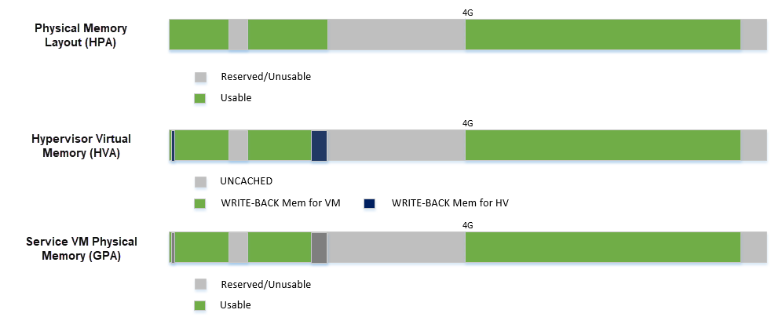

.. _memmgt-hld:

Memory Management high-level design
###################################

This document describes memory management for the ACRN hypervisor.

Overview
********

The hypervisor (HV) virtualizes real physical memory so an unmodified OS
(such as Linux or Android) running in a virtual machine, has the view of
managing its own contiguous physical memory.  HV uses virtual-processor
identifiers (VPIDs) and the extended page-table mechanism (EPT) to
translate guest-physical address into host-physical address. HV enables
EPT and VPID hardware virtualization features, establishes EPT page
tables for SOS/UOS, and provides EPT page tables operation interfaces to
others.

In the ACRN hypervisor system, there are few different memory spaces to
consider.  From the hypervisor's point of view there are:

-  **Host Physical Address (HPA)**: the native physical address space, and
-  **Host Virtual Address (HVA)**: the native virtual address space based on
   a MMU. A page table is used to translate between HPA and HVA
   spaces.

From the Guest OS running on a hypervisor there are:

-  **Guest Physical Address (GPA)**: the guest physical address space from a
   virtual machine.  GPA to HPA transition is usually based on a
   MMU-like hardware module (EPT in X86), and associated with a page
   table
-  **Guest Virtual Address (GVA)**: the guest virtual address space from a
   virtual machine based on a vMMU

   ACRN Memory Mapping Overview

:numref:`mem-overview` provides an overview of the ACRN system memory
mapping, showing:

-  GVA to GPA mapping based on vMMU on a VCPU in a VM
-  GPA to HPA mapping based on EPT for a VM in the hypervisor
-  HVA to HPA mapping based on MMU in the hypervisor

This document illustrates the memory management infrastructure for the
ACRN hypervisor and how it handles the different memory space views
inside the hypervisor and from a VM:

-  How ACRN hypervisor manages host memory (HPA/HVA)
-  How ACRN hypervisor manages SOS guest memory (HPA/GPA)
-  How ACRN hypervisor & SOS DM manage UOS guest memory (HPA/GPA)

Hypervisor Physical Memory Management
*************************************

In the ACRN, the HV initializes MMU page tables to manage all physical
memory and then switches to the new MMU page tables. After MMU page
tables are initialized at the platform initialization stage, no updates
are made for MMU page tables.

Hypervisor Physical Memory Layout - E820
========================================

The ACRN hypervisor is the primary owner to manage system memory.
Typically the boot firmware (e.g., EFI) passes the platform physical
memory layout - E820 table to the hypervisor. The ACRN hypervisor does
its memory management based on this table using 4-level paging.

The BIOS/bootloader firmware (e.g., EFI) passes the E820 table through a
multiboot protocol.  This table contains the original memory layout for
the platform.

   Physical Memory Layout Example

:numref:`mem-layout` is an example of the physical memory layout based on a simple
platform E820 table.

Hypervisor Memory Initialization
================================

The ACRN hypervisor runs under paging mode. After the bootstrap
processor (BSP) gets the platform E820 table, BSP creates its MMU page
table based on it. This is done by the function *init_paging()* and
*smep()*. After the application processor (AP) receives IPI CPU startup
interrupt, it uses the MMU page tables created by BSP and enable SMEP.
:numref:`hv-mem-init`  describes the hypervisor memory initialization for BSP
and APs.

   Hypervisor Memory Initialization

The memory mapping policy used is:

- Identical mapping (ACRN hypervisor memory could be relocatable in
  the future)
- Map all memory regions with UNCACHED type
- Remap RAM regions to WRITE-BACK type

.. figure:: images/mem-image69.png
   :align: center
   :name: hv-mem-vm-init

   Hypervisor Virtual Memory Layout

:numref:`hv-mem-vm-init` above shows:

- Hypervisor has a view of and can access all system memory
- Hypervisor has UNCACHED MMIO/PCI hole reserved for devices such as
  LAPIC/IOAPIC accessing
- Hypervisor has its own memory with WRITE-BACK cache type for its
  code/data (< 1M part is for secondary CPU reset code)

The hypervisor should use minimum memory pages to map from virtual
address space into physical address space.

- If 1GB hugepage can be used
  for virtual address space mapping, the corresponding PDPT entry shall be
  set for this 1GB hugepage.
- If 1GB hugepage can't be used for virtual
  address space mapping and 2MB hugepage can be used, the corresponding
  PDT entry shall be set for this 2MB hugepage.
- If both of 1GB hugepage
  and 2MB hugepage can't be used for virtual address space mapping, the
  corresponding PT entry shall be set.

If memory type or access rights of a page is updated, or some virtual
address space is deleted, it will lead to splitting of the corresponding
page. The hypervisor will still keep using minimum memory pages to map from
virtual address space into physical address space.

Memory Pages Pool Functions
===========================

Memory pages pool functions provide dynamic management of multiple
4KB page-size memory blocks, used by the hypervisor to store internal
data.  Through these functions, the hypervisor can allocate and
deallocate pages.

Data Flow Design
================

The physical memory management unit provides MMU 4-level page tables
creating and updating services, MMU page tables switching service, SMEP
enable service, and HPA/HVA retrieving service to other units.
:numref:`mem-data-flow-physical` shows the data flow diagram
of physical memory management.

.. figure:: images/mem-image45.png
   :align: center
   :name: mem-data-flow-physical

   Data Flow of Hypervisor Physical Memory Management

Data Structure Design
=====================

The page tables operation type:

.. code-block:: c

   enum _page_table_type {

      PTT_HOST = 0,           /* Operations for MMU page tables */
      PTT_EPT  = 1,           /* Operations for EPT page tables */
      PAGETABLE_TYPE_UNKNOWN, /* Page tables operation type is unknown */
   };

Interfaces Design
=================

MMU Initialization
------------------

.. doxygenfunction:: enable_smep
   :project: Project ACRN

.. doxygenfunction:: enable_paging
   :project: Project ACRN

.. doxygenfunction:: init_paging
   :project: Project ACRN

Address Space Translation
-------------------------

.. doxygenfunction:: hpa2hva
   :project: Project ACRN

.. doxygenfunction:: hva2hpa
   :project: Project ACRN

Hypervisor Memory Virtualization
********************************

The hypervisor provides a contiguous region of physical memory for SOS
and each UOS. It also guarantees that the SOS and UOS can not access
code and internal data in the hypervisor, and each UOS can not access
code and internal data of the SOS and other UOSs.

The hypervisor:

- enables EPT and VPID hardware virtualization features,
- establishes EPT page tables for SOS/UOS,
- provides EPT page tables operations services,
- virtualizes MTRR for SOS/UOS,
- provides VPID operations services,
- provides services for address spaces translation between GPA and HPA, and
- provides services for data transfer between hypervisor and virtual machine.

Memory Virtualization Capability Checking
=========================================

In the hypervisor, memory virtualization provides EPT/VPID capability
checking service and EPT hugepage supporting checking service. Before HV
enables memory virtualization and uses EPT hugepage, these service need
to be invoked by other units.

Data Transfer between Different Address Spaces
==============================================

In ACRN, different memory space management is used in the hypervisor,
Service OS, and User OS to achieve spatial isolation. Between memory
spaces, there are different kinds of data transfer, such as a SOS/UOS
may hypercall to request hypervisor services which includes data
transferring, or when the hypervisor does instruction emulation: the HV
needs to access the guest instruction pointer register to fetch guest
instruction data.

Access GPA from Hypervisor
--------------------------

When hypervisor need access GPA for data transfer, the caller from guest
must make sure this memory range's GPA is continuous. But for HPA in
hypervisor, it could be dis-continuous (especially for UOS under hugetlb
allocation mechanism).  For example, a 4M GPA range may map to 2
different 2M huge host-physical pages. The ACRN hypervisor must take
care of this kind of data transfer by doing EPT page walking based on
its HPA.

Access GVA from Hypervisor
--------------------------

When hypervisor needs to access GVA for data transfer, it's likely both
GPA and HPA could be address dis-continuous. The ACRN hypervisor must
watch for this kind of data transfer, and handle it by doing page
walking based on both its GPA and HPA.

EPT Page Tables Operations
==========================

The hypervisor should use a minimum of memory pages to map from
guest-physical address (GPA) space into host-physical address (HPA)
space.

- If 1GB hugepage can be used for GPA space mapping, the
  corresponding EPT PDPT entry shall be set for this 1GB hugepage.
- If 1GB hugepage can't be used for GPA space mapping and 2MB hugepage can be
  used, the corresponding EPT PDT entry shall be set for this 2MB
  hugepage.
- If both 1GB hugepage and 2MB hugepage can't be used for GPA
  space mapping, the corresponding EPT PT entry shall be set.

If memory type or access rights of a page is updated or some GPA space
is deleted, it will lead to the corresponding EPT page being split. The
hypervisor should still keep to using minimum EPT pages to map from GPA
space into HPA space.

The hypervisor provides EPT guest-physical mappings adding service, EPT
guest-physical mappings modifying/deleting service, EPT page tables
deallocation, and EPT guest-physical mappings invalidation service.

Virtual MTRR
************

In ACRN, the hypervisor only virtualizes MTRRs fixed range (0~1MB).
The HV sets MTRRs of the fixed range as Write-Back for UOS, and the SOS reads
native MTRRs of the fixed range set by BIOS.

If the guest physical address is not in the fixed range (0~1MB), the
hypervisor uses the default memory type in the MTRR (Write-Back).

When the guest disables MTRRs, the HV sets the guest address memory type
as UC.

If the guest physical address is in fixed range (0~1MB), the HV sets
memory type according to the fixed virtual MTRRs.

When the guest enable MTRRs, MTRRs have no effect on the memory type
used for access to GPA. The HV first intercepts MTRR MSR registers
access through MSR access VM exit and updates EPT memory type field in EPT
PTE according to the memory type selected by MTRRs.  This combines with
PAT entry in the PAT MSR (which is determined by PAT, PCD, and PWT bits
from the guest paging structures) to determine the effective memory
type.

VPID operations
===============

Virtual-processor identifier (VPID) is a hardware feature to optimize
TLB management. When VPID is enable, hardware will add a tag for TLB of
a logical processor and cache information for multiple linear-address
spaces. VMX transitions may retain cached information and the logical
processor switches to a different address space, avoiding unnecessary
TLB flushes.

In ACRN, an unique VPID must be allocated for each virtual CPU
when a virtual CPU is created. The logical processor invalidates linear
mappings and combined mapping associated with all VPIDs (except VPID
0000H), and with all PCIDs when the logical processor launches the virtual
CPU. The logical processor invalidates all linear mapping and combined
mappings associated with the specified VPID when the interrupt pending
request handling needs to invalidate cached mapping of the specified
VPID.

Data Flow Design
================

The memory virtualization unit includes address space translation
functions, data transferring functions, VM EPT operations functions,
VPID operations functions, VM exit hanging about EPT violation and EPT
misconfiguration, and MTRR virtualization functions. This unit handles
guest-physical mapping updates by creating or updating related EPT page
tables. It virtualizes MTRR for guest OS by updating related EPT page
tables. It handles address translation from GPA to HPA by walking EPT
page tables. It copies data from VM into the HV or from the HV to VM by
walking guest MMU page tables and EPT page tables. It provides services
to allocate VPID for each virtual CPU and TLB invalidation related VPID.
It handles VM exit about EPT violation and EPT misconfiguration. The
following :numref:`mem-flow-mem-virt` describes the data flow diagram of
the memory virtualization unit.

   Data Flow of Hypervisor Memory Virtualization

Data Structure Design
=====================

EPT Memory Type Data Definition:

.. code-block:: c

   /* EPT memory type is specified in bits 5:3 of the last EPT
    * paging-structure entry */
   #define EPT_MT_SHIFT 3U

   /* EPT memory type is uncacheable  */
   #define EPT_UNCACHED (0UL << EPT_MT_SHIFT)

   /* EPT memory type is write combining  */
   #define EPT_WC (1UL << EPT_MT_SHIFT)

   /* EPT memory type is write through */
   #define EPT_WT (4UL << EPT_MT_SHIFT)

   /* EPT memory type is write protected  */
   #define EPT_WP (5UL << EPT_MT_SHIFT)

   /* EPT memory type is write back */
   #define EPT_WB (6UL << EPT_MT_SHIFT)

EPT Memory Access Right Definition:

.. code-block:: c

   /* EPT memory access right is read-only */
   #define EPT_RD (1UL << 0U)

   /* EPT memory access right is read/write */
   #define EPT_WR (1UL << 1U)

   /* EPT memory access right is executable */
   #define EPT_EXE (1UL << 2U)

   /* EPT memory access right is read/write and executable */
   define EPT_RWX (EPT_RD | EPT_WR | EPT_EXE)

Interfaces Design
=================

The memory virtualization unit interacts with external units through VM
exit and APIs.

VM Exit about EPT
=================

There are two VM exit handlers for EPT violation and EPT
misconfiguration in the hypervisor. EPT page tables are
always configured correctly for SOS and UOS. If EPT misconfiguration is
detected, a fatal error is reported by HV. The hypervisor
uses EPT violation to intercept MMIO access to do device emulation. EPT
violation handling data flow is described in the
:ref:`instruction-emulation`.

Memory Virtualization APIs
==========================

Here is a list of major memory related APIs in HV:

EPT/VPID Capability Checking
----------------------------

Data Transferring between hypervisor and VM
-------------------------------------------

.. doxygenfunction:: copy_from_gpa
   :project: Project ACRN

.. doxygenfunction:: copy_to_gpa
   :project: Project ACRN

.. doxygenfunction:: copy_from_gva
   :project: Project ACRN

.. doxygenfunction:: copy_to_gva
   :project: Project ACRN

Address Space Translation
-------------------------

.. doxygenfunction:: gpa2hpa
   :project: Project ACRN

.. doxygenfunction:: vm0_hpa2gpa
   :project: Project ACRN

EPT
---

.. doxygenfunction:: ept_mr_add
   :project: Project ACRN

.. doxygenfunction:: ept_mr_del
   :project: Project ACRN

.. doxygenfunction:: ept_mr_modify
   :project: Project ACRN

.. doxygenfunction:: destroy_ept
   :project: Project ACRN

.. doxygenfunction:: invept
   :project: Project ACRN

.. doxygenfunction:: ept_violation_vmexit_handler
   :project: Project ACRN

.. doxygenfunction:: ept_misconfig_vmexit_handler
   :project: Project ACRN

Virtual MTRR
------------

.. doxygenfunction:: init_vmtrr
   :project: Project ACRN

.. doxygenfunction:: write_vmtrr
   :project: Project ACRN

.. doxygenfunction:: read_vmtrr
   :project: Project ACRN

VPID
----
.. doxygenfunction:: allocate_vpid
   :project: Project ACRN

.. doxygenfunction:: flush_vpid_single
   :project: Project ACRN

.. doxygenfunction:: flush_vpid_global
   :project: Project ACRN

Service OS Memory Management
****************************

After the ACRN hypervisor starts, it creates the Service OS as its first
VM. The Service OS runs all the native device drivers, manage the
hardware devices, and provides I/O mediation to guest VMs. The Service
OS is in charge of the memory allocation for Guest VMs as well.

ACRN hypervisor passes the whole system memory access (except its own
part) to the Service OS. The Service OS must be able to access all of
the system memory except the hypervisor part.

Guest Physical Memory Layout - E820
===================================

The ACRN hypervisor passes the original E820 table to the Service OS
after filtering out its own part. So from Service OS's view, it sees
almost all the system memory as shown here:

   SOS Physical Memory Layout

Host to Guest Mapping
=====================

ACRN hypervisor creates Service OS's host (HPA) to guest (GPA) mapping
(EPT mapping) through the function ``prepare_vm0_memmap_and_e820()``
when it creates the SOS VM. It follows these rules:

-  Identical mapping
-  Map all memory range with UNCACHED type
-  Remap RAM entries in E820 (revised) with WRITE-BACK type
-  Unmap ACRN hypervisor memory range
-  Unmap ACRN hypervisor emulated vLAPIC/vIOAPIC MMIO range

The host to guest mapping is static for the Service OS; it will not
change after the Service OS begins running. Each native device driver
can access its MMIO through this static mapping. EPT violation is only
serving for vLAPIC/vIOAPIC's emulation in the hypervisor for Service OS
VM.

Trusty
******

For an Android User OS, there is a secure world named trusty world
support, whose memory must be secured by the ACRN hypervisor and
must not be accessible by SOS and UOS normal world.

   UOS Physical Memory Layout with Trusty
