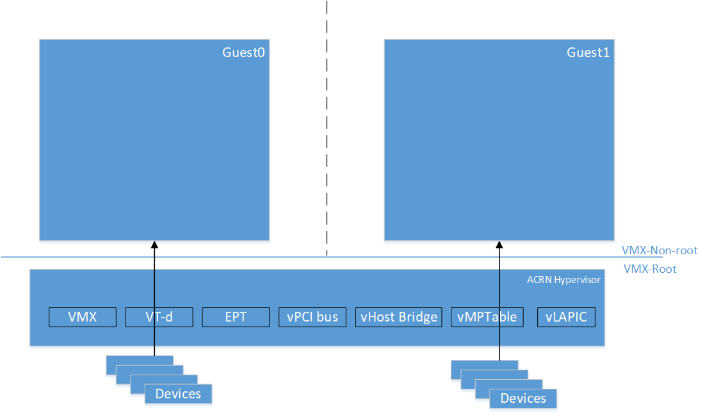
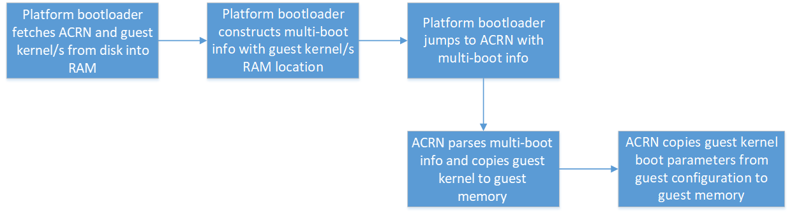
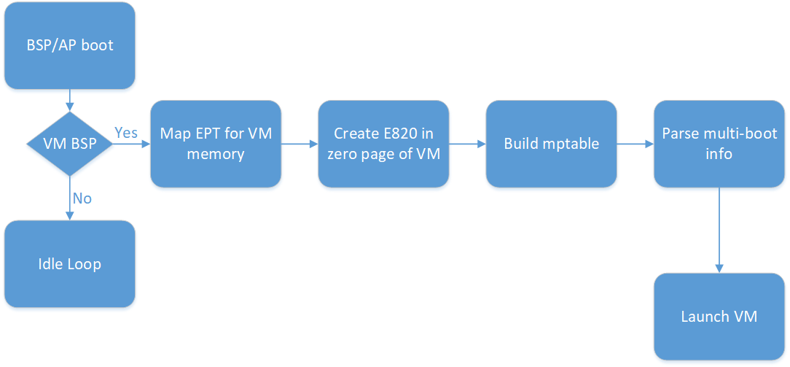
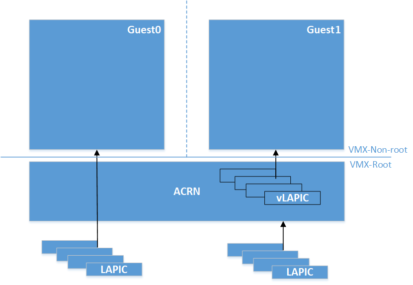
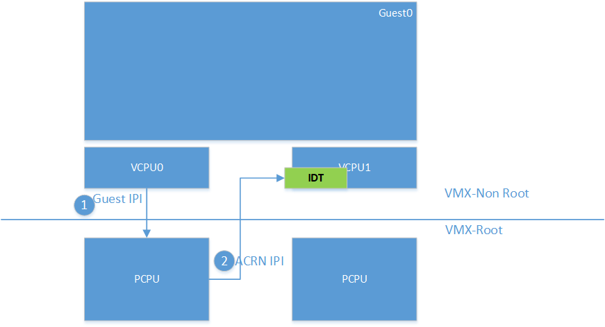
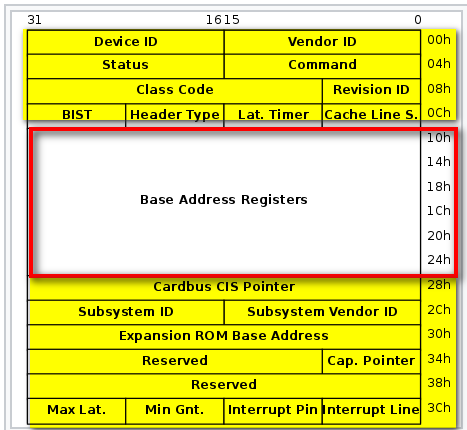
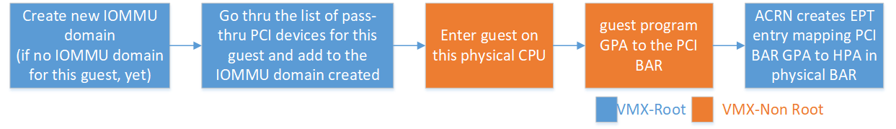
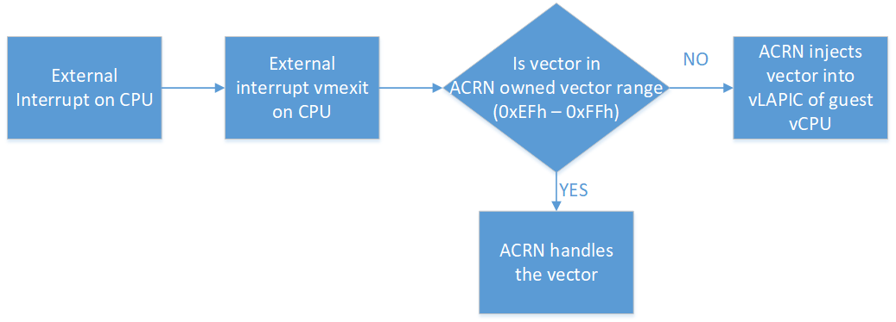

.. _partition-mode-hld:

Partition mode
##############

ACRN is type-1 hypervisor that supports running multiple guest operating
systems (OS). Typically, the platform BIOS/boot-loader boots ACRN, and
ACRN loads single or multiple guest OSes. Refer to :ref:`hv-startup` for
details on the start-up flow of the ACRN hypervisor.

ACRN supports two modes of operation: Sharing mode and Partition mode.
This document describes ACRN's high-level design for Partition mode
support.

.. contents::
   :depth: 2
   :local:

Introduction
************

In partition mode, ACRN provides guests with exclusive access to cores,
memory, cache, and peripheral devices. Partition mode enables developers
to dedicate resources exclusively among the guests. However there is no
support today in x86 hardware or in ACRN to partition resources such as
peripheral buses (e.g. PCI) or memory bandwidth. Cache partitioning
technology, such as Cache Allocation Technology (CAT) in x86, can be
used by developers to partition Last Level Cache (LLC) among the guests.
(Note: ACRN support for x86 CAT is on the roadmap, but not currently
supported).

ACRN expects static partitioning of resources either by code
modification for guest configuration or through compile-time config
options. All the devices exposed to the guests are either physical
resources or emulated in the hypervisor. So, there is no need for
device-model and Service OS. :numref:`pmode2vms` shows a partition mode
example of two VMs with exclusive access to physical resources.

   Partition Mode example with two VMs

Guest info
**********

ACRN uses multi-boot info passed from the platform boot-loader to know
the location of each guest kernel in memory. ACRN creates a copy of each
guest kernel into each of the guests' memory. Current implementation of
ACRN requires developers to specify kernel parameters for the guests as
part of guest configuration. ACRN picks up kernel parameters from guest
configuration and copies them to the corresponding guest memory.

ACRN set-up for guests
**********************

Cores
=====

ACRN requires the developer to specify the number of guests and the
cores dedicated for each guest. Also the developer needs to specify
the physical core used as the Boot Strap Processor (BSP) for each guest. As
the processors are brought to life in the hypervisor, it checks if they are
configured as BSP for any of the guests. If a processor is BSP of any of
the guests, ACRN proceeds to build the memory mapping for the guest,
mptable, E820 entries, and zero page for the guest. As described in
`Guest info`_, ACRN creates copies of guest kernel and kernel
parameters into guest memory. :numref:`partBSPsetup` explains these
events in chronological order.

Memory
======

For each guest in partition mode, the ACRN developer specifies the size of
memory for the guest and the starting address in the host physical
address in the guest configuration. There is no support for HIGHMEM for
partition mode guests. The developer needs to take care of two aspects
for assigning host memory to the guests:

1) Sum of guest PCI hole and guest "System RAM" is less than 4GB.

2) Pick the starting address in the host physical address and the
   size, so that it does not overlap with any reserved regions in
   host E820.

ACRN creates EPT mapping for the guest between GPA (0, memory size) and
HPA (starting address in guest configuration, memory size).

E820 and zero page info
=======================

A default E820 is used for all the guests in partition mode. This table
shows the reference E820 layout. Zero page is created with this
e820 info for all the guests.

+------------------------+
| RAM                    |
|                        |
| 0 - 0xEFFFFH           |
+------------------------+
| RESERVED (MPTABLE)     |
|                        |
| 0xF0000H - 0x100000H   |
+------------------------+
| RAM                    |
|                        |
| 0x100000H - LOWMEM     |
+------------------------+
| RESERVED               |
+------------------------+
| PCI HOLE               |
+------------------------+
| RESERVED               |
+------------------------+

Platform info - mptable
=======================

ACRN, in partition mode, uses mptable to convey platform info to each
guest.  Using this platform information, number of cores used for each
guest, and whether the guest needs devices with INTX, ACRN builds
mptable and copies it to the guest memory. In partition mode, ACRN uses
physical APIC IDs to pass to the guests.

I/O - Virtual devices
=====================

Port I/O is supported for PCI device config space 0xcfc and 0xcf8, vUART
0x3f8, vRTC 0x70 and 0x71, and vPIC ranges 0x20/21, 0xa0/a1, and
0x4d0/4d1.  MMIO is supported for vIOAPIC. ACRN exposes a virtual
host-bridge at BDF (Bus Device Function) 0.0:0 to each guest. Access to
256 bytes of config space for virtual host bridge is emulated.

I/O - Pass-thru devices
=======================

ACRN, in partition mode, supports passing thru PCI devices on the
platform. All the pass-thru devices are exposed as child devices under
the virtual host bridge. ACRN does not support either passing thru
bridges or emulating virtual bridges. Pass-thru devices should be
statically allocated to each guest using the guest configuration. ACRN
expects the developer to provide the virtual BDF to BDF of the
physical device mapping for all the pass-thru devices as
part of each guest configuration.

Run-time ACRN support for guests
********************************

ACRN, in partition mode, supports an option to pass-thru LAPIC of the
physical CPUs to the guest. ACRN expects developers to specify if the
guest needs LAPIC pass-thru using guest configuration. When guest
configures vLAPIC as x2APIC, and if the guest configuration has LAPIC
pass-thru enabled, ACRN passes the LAPIC to the guest. Guest can access
the LAPIC hardware directly without hypervisor interception. During
runtime of the guest, this option differentiates how ACRN supports
inter-processor interrupt handling and device interrupt handling. This
will be discussed in detail in the corresponding sections.

Guest SMP boot flow
===================

The core APIC IDs are reported to the guest using mptable info. SMP boot
flow is similar to sharing mode. Refer to :ref:`vm-startup`
for guest SMP boot flow in ACRN. Partition mode guests startup is same as
the SOS startup in sharing mode.

Inter-processor Interrupt (IPI) Handling
========================================

Guests w/o LAPIC pass-thru
--------------------------

For guests without LAPIC pass-thru, IPIs between guest CPUs are handled in
the same way as sharing mode of ACRN. Refer to :ref:`virtual-interrupt-hld`
for more details.

Guests w/ LAPIC pass-thru
-------------------------

ACRN supports pass-thru if and only if the guest is using x2APIC mode
for the vLAPIC. In LAPIC pass-thru mode, writes to Interrupt Command
Register (ICR) x2APIC MSR is intercepted. Guest writes the IPI info
including vector, destination APIC IDs to the ICR. Upon an IPI request
from the guest, ACRN does sanity check on the destination processors
programmed into ICR. If the destination is a valid target for the guest,
ACRN sends IPI with the same vector from ICR to the physical CPUs
corresponding to the destination processor info in ICR.

Pass-thru device support
========================

Configuration space access
--------------------------

ACRN emulates Configuration Space Address (0xcf8) I/O port and
Configuration Space Data (0xcfc) I/O port for guests to access PCI
devices configuration space. Within the config space of a device, Base
Address registers (BAR), offsets starting from 0x10H to 0x24H, provide
the information about the resources (I/O and MMIO) used by the PCI
device. ACRN virtualizes the BAR registers and for the rest of the
config space, forwards reads and writes to the physical config space of
pass-thru devices.  Refer to `I/O`_ section below for more details.

DMA
---

ACRN developers need to statically define the pass-thru devices for each
guest using the guest configuration. For devices to DMA to/from guest
memory directly, ACRN parses the list of pass-thru devices for each
guest and creates context entries in the VT-d remapping hardware. EPT
page tables created for the guest are used for VT-d page tables.

I/O
---

ACRN supports I/O for pass-thru devices with two restrictions.

1) Supports only MMIO. So requires developers to expose I/O BARs as
   not present in the guest configuration.

2) Supports only 32-bit MMIO BAR type.

As guest PCI sub-system scans the PCI bus and assigns Guest Physical
Address (GPA) to the MMIO BAR, ACRN maps GPA to the address in the
physical BAR of the pass-thru device using EPT. Following timeline chart
explains how PCI devices are assigned to guest and BARs are mapped upon
guest initialization.

Interrupt Configuration
-----------------------

ACRN supports both legacy (INTx) and MSI interrupts for pass-thru
devices.

INTx support
~~~~~~~~~~~~

ACRN expects developers to identify the interrupt line info (0x3CH) from
the physical BAR of the pass-thru device and build an interrupt entry in
the mptable for the corresponding guest. As guest configures the vIOAPIC
for the interrupt RTE, ACRN writes the info from the guest RTE into the
physical IOAPIC RTE. Upon guest kernel request to mask the interrupt,
ACRN writes to the physical RTE to mask the interrupt at the physical
IOAPIC. When guest masks the RTE in vIOAPIC, ACRN masks the interrupt
RTE in the physical IOAPIC. Level triggered interrupts are not
supported.

MSI support
~~~~~~~~~~~

Guest reads/writes to PCI configuration space for configuring MSI
interrupts using address. Data and control registers are pass-thru to
the physical BAR of pass-thru device. Refer to `Configuration
space access`_ for details on how PCI configuration space is emulated.

Virtual device support
======================

ACRN provides read-only vRTC support for partition mode guests. Writes
to the data port are discarded.

For port I/O to ports other than vPIC, vRTC, or vUART, reads return 0xFF and
writes are discarded.

Interrupt delivery
==================

Guests w/o LAPIC pass-thru
--------------------------

In partition mode of ACRN, interrupts stay disabled after a vmexit.  The
processor does not take interrupts when it is executing in VMX root
mode. ACRN configures the processor to take vmexit upon external
interrupt if the processor is executing in VMX non-root mode. Upon an
external interrupt, after sending EOI to the physical LAPIC, ACRN
injects the vector into the vLAPIC of vCPU currently running on the
processor. Guests using Linux as kernel, uses vectors less than 0xECh
for device interrupts.

Guests w/ LAPIC pass-thru
-------------------------

For guests with LAPIC pass-thru, ACRN does not configure vmexit upon
external interrupts. There is no vmexit upon device interrupts and they are
handled by the guest IDT.

Hypervisor IPI service
======================

ACRN needs IPIs for events such as flushing TLBs across CPUs, sending virtual
device interrupts (e.g. vUART to vCPUs), and others.

Guests w/o LAPIC pass-thru
--------------------------

Hypervisor IPIs work the same way as in sharing mode.

Guests w/ LAPIC pass-thru
-------------------------

Since external interrupts are pass-thru to guest IDT, IPIs do not
trigger vmexit. ACRN uses NMI delivery mode and the NMI exiting is
chosen for vCPUs. At the time of NMI interrupt on the target processor,
if the processor is in non-root mode, vmexit happens on the processor
and the event mask is checked for servicing the events.

Debug Console
=============

For details on how hypervisor console works, refer to
:ref:`hv-console`.

For a guest console in partition mode, ACRN provides an option to pass
``vmid`` as an argument to ``sos_console``. vmid is same as the one
developer uses in the guest configuration.

Guests w/o LAPIC pass-thru
--------------------------

Works the same way as sharing mode.

Hypervisor Console
==================

ACRN uses TSC deadline timer to provide timer service. Hypervisor
console uses a timer on CPU0 to poll characters on the serial device. To
support LAPIC pass-thru, TSC deadline MSR is pass-thru and the local
timer interrupt also delivered to the guest IDT. Instead of TSC deadline
timer, ACRN uses VMX preemption timer to poll the serial device.

Guest Console
=============

ACRN exposes vUART to partition mode guests. vUART uses vPIC to inject
interrupt to the guest BSP. In cases of guest having more than one core,
during runtime, vUART might need to inject interrupt to guest BSP from
another core (other than BSP). As mentioned in section <Hypervisor IPI
service>, ACRN uses NMI delivery mode for notifying the CPU running BSP
of the guest.
