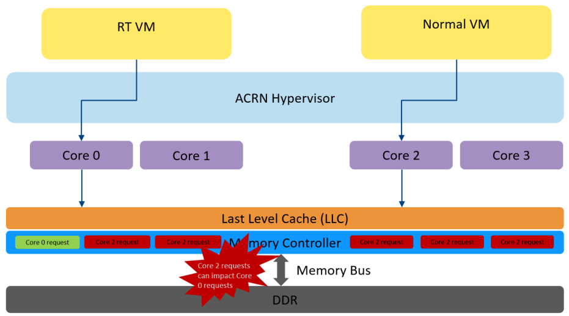
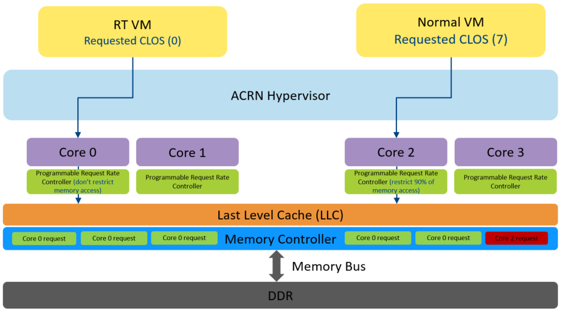

.. _hv_rdt:

RDT Allocation Feature Supported by Hypervisor
##############################################

The ACRN hypervisor uses RDT (Resource Director Technology) allocation features
such as CAT (Cache Allocation Technology) and MBA (Memory Bandwidth
Allocation) to control VMs which may be over-utilizing cache resources or
memory bandwidth relative to their priorities. By setting limits to critical
resources, ACRN can optimize RTVM performance over regular VMs. In ACRN, the
CAT and MBA are configured via the "VM-Configuration". The resources
allocated for VMs are determined in the VM configuration (:ref:`rdt_vm_configuration`).

For further details on the Intel RDT, refer to `Intel 64 and IA-32 Architectures Software Developer's Manual, (Section 17.19 Intel Resource Director Technology Allocation Features) <https://software.intel.com/en-us/download/intel-64-and-ia-32-architectures-sdm-combined-volumes-3a-3b-3c-and-3d-system-programming-guide>`_.

Objective of CAT
****************
The CAT feature in the hypervisor can isolate the cache for a VM from other
VMs. It can also isolate cache usage between VMX root and non-root
modes. Generally, certain cache resources are allocated for the
RT VMs in order to reduce performance interference through the shared
cache access from the neighbor VMs.

The figure below shows that with CAT, the cache ways can be isolated vs
the default where high priority VMs can be impacted by a noisy neighbor.

   .. figure:: images/cat-objective.png
      :align: center

CAT Support in ACRN
===================
On x86 platforms that support CAT, the ACRN hypervisor automatically enables
support and by default shares the cache ways equally between all VMs.
This is done by setting the max cache mask in the MSR_IA32_type_MASK_n (where
type: L2 or L3) MSR that corresponds to each CLOS and then setting the
IA32_PQR_ASSOC MSR to CLOS 0. (Note that CLOS, or Class of Service, is a
resource allocator.) The user can check the cache capabilities such as cache
mask and max supported CLOS as described in :ref:`rdt_detection_capabilities`
and then program the IA32_type_MASK_n and IA32_PQR_ASSOC MSR with a
CLOS ID, to select a cache mask to take effect. These configurations can be 
done in scenario xml file under ``FEATURES`` section as shown in the below example.
ACRN uses VMCS MSR loads on every VM Entry/VM Exit for non-root and root modes
to enforce the settings.

   .. code-block:: none
      :emphasize-lines: 2,4

      <RDT desc="Intel RDT (Resource Director Technology).">
            <RDT_ENABLED desc="Enable RDT">y</RDT_ENABLED>
            <CDP_ENABLED desc="CDP (Code and Data Prioritization). CDP is an extension of CAT.">n</CDP_ENABLED>
            <CLOS_MASK desc="Cache Capacity Bitmask">0xF</CLOS_MASK>

Once the cache mask is set of each individual CPU, the respective CLOS ID
needs to be set in the scenario xml file under ``VM`` section. If user desires
to use CDP feature, CDP_ENABLED should be set to ``y``.

   .. code-block:: none
      :emphasize-lines: 2

      <clos desc="Class of Service for Cache Allocation Technology. Please refer SDM 17.19.2 for details and use with caution.">
            <vcpu_clos>0</vcpu_clos>

.. note::
   ACRN takes the lowest common CLOS max value between the supported
   resources as maximum supported CLOS ID. For example, if max CLOS
   supported by L3 is 16 and MBA is 8, ACRN programs MAX_PLATFORM_CLOS_NUM
   to 8. ACRN recommends to have consistent capabilities across all RDT
   resources by using a common subset CLOS. This is done in order to minimize
   misconfiguration errors.

Objective of MBA
****************
The Memory Bandwidth Allocation (MBA) feature provides indirect and
approximate control over memory bandwidth that's available per core. It
provides a method to control VMs which may be over-utilizing bandwidth
relative to their priorities and thus improves the performance of high
priority VMs. MBA introduces a programmable request rate controller (PRRC)
between cores and high-speed interconnect. Throttling values can be
programmed via MSRs to the PRRC to limit bandwidth availability.

The following figure shows memory bandwidth impact without MBA which causes
bottlenecks for high priority VMs vs with MBA support:

   Without MBA Support

   With MBA Support

MBA Support in ACRN
===================
On x86 platforms that support MBA, the ACRN hypervisor automatically enables
support and by default sets no limits to the memory bandwidth access by VMs.
This is done by setting a 0 mba delay value in the MSR_IA32_MBA_MASK_n MSR
that corresponds to each CLOS and then setting IA32_PQR_ASSOC MSR with CLOS
0. To select a delay to take effect for restricting memory bandwidth,
users can check the MBA capabilities such as mba delay values and
max supported CLOS as described in :ref:`rdt_detection_capabilities` and
then program the IA32_MBA_MASK_n and IA32_PQR_ASSOC MSR with the CLOS ID.
These configurations can be done in scenario xml file under ``FEATURES`` section
as shown in the below example. ACRN uses VMCS MSR loads on every VM Entry/VM Exit
for non-root and root modes to enforce the settings.

   .. code-block:: none
      :emphasize-lines: 2,5

      <RDT desc="Intel RDT (Resource Director Technology).">
            <RDT_ENABLED desc="Enable RDT">y</RDT_ENABLED>
            <CDP_ENABLED desc="CDP (Code and Data Prioritization). CDP is an extension of CAT.">n</CDP_ENABLED>
            <CLOS_MASK desc="Cache Capacity Bitmask"></CLOS_MASK>
            <MBA_DELAY desc="Memory Bandwidth Allocation delay value">0</MBA_DELAY>

Once the cache mask is set of each individual CPU, the respective CLOS ID
needs to be set in the scenario xml file under ``VM`` section.

   .. code-block:: none
      :emphasize-lines: 2

      <clos desc="Class of Service for Cache Allocation Technology. Please refer SDM 17.19.2 for details and use with caution.">
            <vcpu_clos>0</vcpu_clos>

.. note::
   ACRN takes the lowest common CLOS max value between the supported
   resources as maximum supported CLOS ID. For example, if max CLOS
   supported by L3 is 16 and MBA is 8, ACRN programs MAX_PLATFORM_CLOS_NUM
   to 8. ACRN recommends to have consistent capabilities across all RDT
   resources by using a common subset CLOS. This is done in order to minimize
   misconfiguration errors.

CAT and MBA high-level design in ACRN
*************************************

Data structures
===============
The below figure shows the RDT data structure to store enumerated resources.

   .. figure:: images/mba_data_structures.png
      :align: center

Enabling CAT, MBA software flow
===============================

The hypervisor enumerates RDT capabilities and sets up mask arrays; it also
sets up CLOS for VMs and the hypervisor itself per the "vm configuration"(:ref:`rdt_vm_configuration`).

- The RDT capabilities are enumerated on the bootstrap processor (BSP) during
  the pCPU pre-initialize stage. The global data structure ``res_cap_info``
  stores the capabilities of the supported resources.

- If CAT or/and MBA is supported, then setup masks array on all APs at the
  pCPU post-initialize stage. The mask values are written to
  IA32_type_MASK_n. Refer to :ref:`rdt_detection_capabilities` for details
  on identifying values to program the mask/delay MRSs and the max CLOS.

- If CAT or/and MBA is supported, the CLOS of a **VM** will be stored into
  its vCPU ``msr_store_area`` data structure guest part. It will be loaded
  to MSR IA32_PQR_ASSOC at each VM entry.

- If CAT or/and MBA is supported, the CLOS of **hypervisor** is stored for
  all VMs, in their vCPU ``msr_store_area`` data structure host part. It will
  be loaded to MSR IA32_PQR_ASSOC at each VM exit.

The figure below shows the high level overview of RDT resource flow in the
ACRN hypervisor.

   .. figure:: images/cat_mba_software_flow.png
      :align: center
