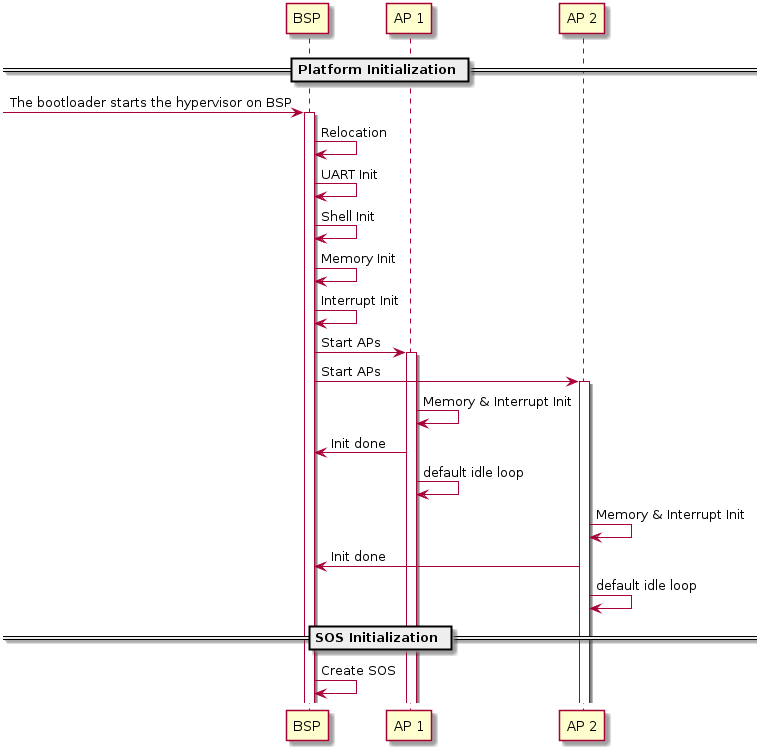
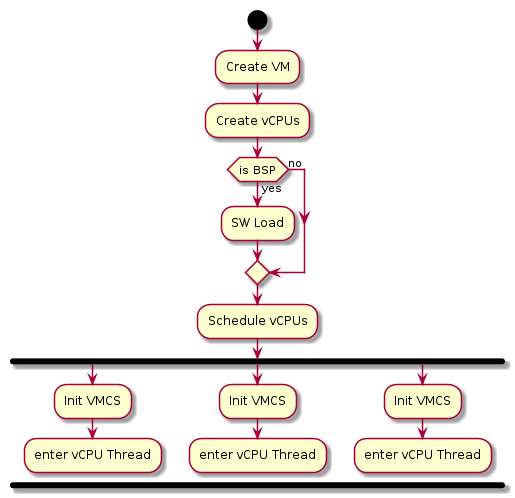

.. _hv-startup:

Hypervisor Startup
##################

This section is an overview of the ACRN hypervisor startup.
The ACRN hypervisor
compiles to a 32-bit multiboot-compliant ELF file.
The bootloader (ABL or SBL) loads the hypervisor according to the
addresses specified in the ELF header. The BSP starts the hypervisor
with an initial state compliant to multiboot 1 specification, after the
bootloader prepares full configurations including ACPI, E820, etc.

The HV startup has two parts: the native startup followed by
VM startup.

Native Startup
**************

   Hypervisor Native Startup Flow

Native startup sets up a baseline environment for HV, including basic
memory and interrupt initialization as shown in
:numref:`hvstart-nativeflow`. Here is a short
description for the flow:

-  **BSP Startup:** The starting point for bootstrap processor.

-  **Relocation**: relocate the hypervisor image if the hypervisor image
   is not placed at the assumed base address.

-  **UART Init:** Initialize a pre-configured UART device used
   as the base physical console for HV and Service OS.

-  **Shell Init:** Start a command shell for HV accessible via the UART.

-  **Memory Init:** Initialize memory type and cache policy, and creates
   MMU page table mapping for HV.

-  **Interrupt Init:** Initialize interrupt and exception for native HV
   including IDT and ``do_IRQ`` infrastructure; a timer interrupt
   framework is then built. The native/physical interrupts will go
   through this ``do_IRQ`` infrastructure then distribute to special
   targets (HV or VMs).

-  **Start AP:** BSP kicks ``INIT-SIPI-SIPI`` IPI sequence to start other
   native APs (application processor). Each AP will initialize its
   own memory and interrupts, notifies the BSP on completion and
   enter the default idle loop.

Symbols in the hypervisor are placed with an assumed base address, but
the bootloader may not place the hypervisor at that specified base. In
such case the hypervisor will relocate itself to where the bootloader
loads it.

Here is a summary of CPU and memory initial states that are set up after
native startup.

CPU
   ACRN hypervisor brings all physical processors to 64-bit IA32e
   mode, with the assumption that the BSP starts in protection mode where
   segmentation and paging sets an identical mapping of the first 4G
   addresses without permission restrictions. The control registers and
   some MSRs are set as follows:

   -  cr0: The following features are enabled: paging, write protection,
      protection mode, numeric error and co-processor monitoring.

   -  cr3: refer to the initial state of memory.

   -  cr4: The following features are enabled: physical address extension,
      machine-check, FXSAVE/FXRSTOR, SMEP, VMX operation and unmask
      SIMD FP exception. The other features are disabled.

   -  MSR_IA32_EFER: only IA32e mode is enabled.

   -  MSR_IA32_FS_BASE: the address of stack canary, used for detecting
      stack smashing.

   -  MSR_IA32_TSC_AUX: a unique logical ID is set for each physical
      processor.

   -  stack: each physical processor has a separate stack.

Memory
   All physical processors are in 64-bit IA32e mode after
   startup. The GDT holds four entries, one unused, one for code and
   another for data, both of which have a base of all 0's and a limit of
   all 1's, and the other for 64-bit TSS. The TSS only holds three stack
   pointers (for machine-check, double fault and stack fault) in the
   interrupt stack table (IST) which are different across physical
   processors. LDT is disabled.

Refer to section 3.5.2 for a detailed description of interrupt-related
initial states, including IDT and physical PICs.

After BSP detects that all APs are up, BSP will start creating the first
VM, i.e. SOS, as explained in the next section.

.. _vm-startup:

VM Startup
**********

SOS is created and launched on the physical BSP after the hypervisor
initializes itself.  Meanwhile, the APs enter the default idle loop
(refer to :ref:`VCPU_lifecycle` for details), waiting for any vCPU to be
scheduled to them.

:numref:`hvstart-vmflow` illustrates a high-level execution flow of
creating and launching a VM, applicable to both SOS and UOS. One major
difference in the creation of SOS and UOS is that SOS is created by the
hypervisor, while the creation of UOSes is triggered by the DM in SOS.
The main steps include:

-  **Create VM**: A VM structure is allocated and initialized. A unique
   VM ID is picked, EPT is created, I/O bitmap is set up, I/O
   emulation handlers initialized and registered and virtual CPUID
   entries filled. For SOS an addition e820 table is prepared.

-  **Create vCPUs:** Create the vCPUs, assign the physical processor it
   is pinned to, a unique-per-VM vCPU ID and a globally unique VPID,
   and initializes its virtual lapic and MTRR. For SOS one vCPU is
   created for each physical CPU on the platform. For UOS the DM
   determines the number of vCPUs to be created.

-  **SW Load:** The BSP of a VM also prepares for each VM's SW
   configuration including kernel entry address, ramdisk address,
   bootargs, zero page etc. This is done by the hypervisor for SOS
   while by DM for UOS.

-  **Schedule vCPUs:** The vCPUs are scheduled to the corresponding
   physical processors for execution.

-  **Init VMCS:** Initialize vCPU's VMCS for its host state, guest
   state, execution control, entry control and exit control. It's
   the last configuration before vCPU runs.

-  **vCPU thread:** vCPU kicks out to run. For "Primary CPU" it will
   start running into kernel image which SW Load is configured; for
   "Non-Primary CPU" it will wait for INIT-SIPI-SIPI IPI sequence
   trigger from its "Primary CPU".

   Hypervisor VM Startup Flow

SW configuration for Service OS (VM0):

-  **ACPI**: HV passes the entire ACPI table from bootloader to Service
   OS directly. Legacy mode is currently supported as the ACPI table
   is loaded at F-Segment.

-  **E820**: HV passes e820 table from bootloader through multi-boot
   information after the HV reserved memory (32M for example) is
   filtered out.

-  **Zero Page**: HV prepares the zero page at the high end of Service
   OS memory which is determined by VM0 guest FIT binary build. The
   zero page includes configuration for ramdisk, bootargs and e820
   entries. The zero page address will be set to "Primary CPU" RSI
   register before VCPU gets run.

-  **Entry address**: HV will copy Service OS kernel image to 0x1000000
   as entry address for VM0's "Primary CPU". This entry address will
   be set to "Primary CPU" RIP register before VCPU gets run.

SW configuration for User OS (VMx):

-  **ACPI**: the virtual ACPI table is built by DM and put at VMx's
   F-Segment. Refer to :ref:`hld-io-emulation` for details.

-  **E820**: the virtual E820 table is built by the DM then passed to
   the zero page. Refer to :ref:`hld-io-emulation` for details.

-  **Zero Page**: the DM prepares the zero page at location of
   "lowmem_top - 4K" in VMx. This location is set into VMx's
   "Primary CPU" RSI register in **SW Load**.

-  **Entry address**: the DM will copy User OS kernel image to 0x1000000
   as entry address for VMx's "Primary CPU". This entry address will
   be set to "Primary CPU" RIP register before VCPU gets run.

Here is initial mode of vCPUs:

+------------------------------+-------------------------------+
|  VM and Processor Type       |    Initial Mode               |
+=============+================+===============================+
|  SOS        |        BSP     |   Same as physical BSP        |
|             +----------------+-------------------------------+
|             |        AP      |   Real Mode                   |
+-------------+----------------+-------------------------------+
|  UOS        |        BSP     |   Real Mode                   |
|             +----------------+-------------------------------+
|             |        AP      |   Real Mode                   |
+-------------+----------------+-------------------------------+

Note that SOS is started with the same number of vCPUs as the physical
CPUs to boost the boot-up. SOS will offline the APs right before it
starts any UOS.
