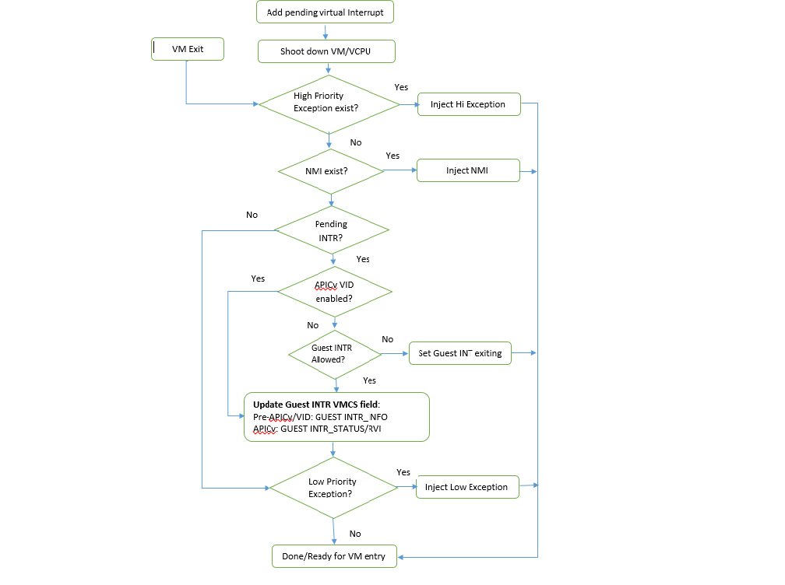

.. _virtual-interrupt-hld:

Virtual Interrupt
#################

This section introduces the ACRN guest virtual interrupt
management, which includes:

- vCPU request for virtual interrupt kickoff
- vPIC, vIOAPIC, and vLAPIC for virtual interrupt injection interfaces
- physical-to-virtual interrupt mapping for a passthrough device
- the process of VMX interrupt and exception injection

A standard VM never owns any physical interrupts. All interrupts received by the
guest OS come from a virtual interrupt injected by vLAPIC, vIOAPIC, or
vPIC. Such virtual interrupts are triggered either from a passthrough
device or from I/O mediators in the Service VM via hypercalls. The
:ref:`interrupt-remapping` section describes how the hypervisor manages
the mapping between physical and virtual interrupts for passthrough
devices. However, a hard RTVM with LAPIC passthrough does own the physical
maskable external interrupts. On its physical CPUs, interrupts are disabled
in VMX root mode. While in VMX non-root mode, physical interrupts are
delivered to the RTVM directly.

Devices are emulated inside the Service VM Device Model, i.e.,
``acrn-dm``. However, for performance consideration, vLAPIC, vIOAPIC, and vPIC
are emulated inside the hypervisor directly.

From the guest OS point of view, vPIC is Virtual Wire Mode via vIOAPIC. The
symmetric I/O Mode is shown in :numref:`pending-virt-interrupt` later in
this section.

The following command-line options to a Linux guest affect whether it uses PIC
or IOAPIC:

-  **Kernel boot parameter with vPIC**: Add ``maxcpu=0``. The guest OS will use
   PIC.
-  **Kernel boot parameter with vIOAPIC**: Add ``maxcpu=1`` (as long as not
   "0"). The guest OS will use IOAPIC and keep IOAPIC pin 2 as the source of
   PIC.

.. _vcpu-request-interrupt-injection:

vCPU Request for Interrupt Injection
************************************

The vCPU request mechanism (described in :ref:`pending-request-handlers`) is
used to inject interrupts to a certain vCPU. As mentioned in
:ref:`ipi-management`, physical vector 0xF0 is used to kick the vCPU out of its
VMX non-root mode. Physical vector 0xF0 is also used to make a request for
virtual interrupt injection or other requests such as flush EPT.

.. note:: The IPI-based vCPU request mechanism doesn't work for the hard RTVM.

The eventid supported for virtual interrupt injection includes:

.. doxygengroup:: virt_int_injection
   :project: Project ACRN
   :content-only:

The *vcpu_make_request* is necessary for a virtual interrupt
injection. If the target vCPU is running under VMX non-root mode, it
sends an IPI to kick it out, which leads to an external-interrupt
VM-Exit. In some cases, there is no need to send an IPI when making a request,
because the CPU making the request itself is the target vCPU. For
example, the #GP exception request always happens on the current CPU when it
finds an invalid emulation has happened. An external interrupt for a passthrough
device always happens on the vCPUs of the VM that the device belongs to.
After it triggers an external-interrupt VM-Exit, the current CPU is the
target vCPU.

Virtual LAPIC
*************

LAPIC is virtualized for all guest types: Service VM and User VMs. Given support
by the physical processor, APICv virtual interrupt delivery (VID) is enabled
and supports the Posted-Interrupt feature. Otherwise, it falls back to
the legacy virtual interrupt injection mode.

vLAPIC provides the same features as the native LAPIC:

-  Vector mask/unmask
-  Virtual vector injections (Level or Edge trigger mode) to vCPU
-  vIOAPIC notification of EOI processing
-  TSC Timer service
-  vLAPIC support CR8 to update TPR
-  INIT/STARTUP handling

vLAPIC APIs
===========

APIs are invoked when an interrupt source from vLAPIC needs to inject
an interrupt, for example:

- from LVT like LAPIC timer
- from vIOAPIC for a passthrough device interrupt
- from an emulated device for an MSI

These APIs finish by making a vCPU request.

.. doxygenfunction:: vlapic_inject_intr
  :project: Project ACRN

.. doxygenfunction:: vlapic_set_intr
  :project: Project ACRN

.. doxygenfunction:: vlapic_set_local_intr
  :project: Project ACRN

.. doxygenfunction:: vlapic_inject_msi
  :project: Project ACRN

.. doxygenfunction:: vlapic_receive_intr
  :project: Project ACRN

EOI Processing
==============

If APICv virtual interrupt delivery is supported, EOI virtualization is enabled.
Except for level triggered interrupts, the VM will not exit in case of EOI.

If APICv virtual interrupt delivery is not supported, vLAPIC requires
EOI from the guest OS whenever a vector is acknowledged and processed by the
guest. vLAPIC behavior is the same as hardware LAPIC. Once an EOI is received,
it clears the highest priority vector in ISR, and updates PPR
status. vLAPIC sends an EOI message to vIOAPIC if the TMR bit is set to
indicate that is a level triggered interrupt.

.. _lapic_passthru:

LAPIC Passthrough Based on vLAPIC
=================================

LAPIC passthrough is supported based on vLAPIC. The guest OS first boots with
vLAPIC in xAPIC mode and then switches to x2APIC mode to enable the LAPIC
passthrough.

If LAPIC passthrough is based on vLAPIC, the system has the
following characteristics:

* IRQs received by the LAPIC can be handled by the guest VM without ``vmexit``.
* Guest VM always sees virtual LAPIC IDs for security consideration.
* Most MSRs are directly accessible from the guest VM except for ``XAPICID``,
  ``LDR``, and ``ICR``. Write operations to ``ICR`` are trapped to avoid
  malicious IPIs. Read operations to ``XAPIC`` and ``LDR`` are trapped,
  so that the guest VM always sees the virtual LAPIC IDs instead of the
  physical ones.

Virtual IOAPIC
**************

The hypervisor emulates vIOAPIC when the guest accesses the MMIO GPA range:
0xFEC00000-0xFEC01000. vIOAPIC for the Service VM should match the native
hardware IOAPIC pin numbers. vIOAPIC for a guest VM provides 48 pins. As the
vIOAPIC is always associated with vLAPIC, the virtual interrupt injection from
vIOAPIC triggers a request for a vLAPIC event by calling vLAPIC APIs.

**Supported APIs:**

.. doxygenfunction:: vioapic_set_irqline_lock
  :project: Project ACRN

.. doxygenfunction:: vioapic_set_irqline_nolock
  :project: Project ACRN

Virtual PIC
***********

vPIC is required for TSC calculation. Normally the guest OS boots with
vIOAPIC and vPIC as the source of external interrupts. On every
VM Exit, the hypervisor checks for pending external PIC interrupts.
Usage of vPIC APIs is similar to that of vIOAPIC.

ACRN hypervisor emulates a vPIC for each VM based on I/O range 0x20~0x21,
0xa0~0xa1, and 0x4d0~0x4d1.

If an interrupt source from vPIC needs to inject an interrupt, the
following APIs need be called, which will finally make a request for
``ACRN_REQUEST_EXTINT`` or ``ACRN_REQUEST_EVENT``:

.. doxygenfunction:: vpic_set_irqline
  :project: Project ACRN

The following APIs are used to query the vector that needs to be injected and
ACK the service (move the interrupt from request service - IRR to in
service - ISR):

.. doxygenfunction:: vpic_pending_intr
  :project: Project ACRN

.. doxygenfunction:: vpic_intr_accepted
  :project: Project ACRN

Virtual Exception
*****************

When doing emulation, an exception may need to be triggered in the
hypervisor for these reasons:

- The guest accesses an invalid vMSR register.
- The hypervisor needs to inject a #GP.
- The hypervisor needs to inject a #PF when an instruction accesses a
  non-existent page from ``rip_gva`` during instruction emulation.

ACRN hypervisor implements virtual exception injection using these APIs:

.. doxygenfunction:: vcpu_queue_exception
  :project: Project ACRN

.. doxygenfunction:: vcpu_inject_gp
  :project: Project ACRN

.. doxygenfunction:: vcpu_inject_pf
  :project: Project ACRN

.. doxygenfunction:: vcpu_inject_ud
  :project: Project ACRN

.. doxygenfunction:: vcpu_inject_ss
  :project: Project ACRN

ACRN hypervisor uses the ``vcpu_inject_gp`` and ``vcpu_inject_pf`` functions to
queue an exception request. The hypervisor follows `Intel® 64 and IA-32 Architectures Software Developer's Manual <https://www.intel.com/content/www/us/en/developer/articles/technical/intel-sdm.html>`__, Volume 3, Section 6.15, Table 6-5, to
generate a double fault if the condition is met.

ACRN hypervisor can inject ``extint`` and ``nmi`` using similar vCPU APIs:

.. doxygenfunction:: vcpu_inject_extint
  :project: Project ACRN

.. doxygenfunction:: vcpu_inject_nmi
  :project: Project ACRN

.. _virt-interrupt-injection:

Virtual Interrupt Injection
***************************

Virtual interrupts come from the DM or assigned
devices.

-  **For Service VM assigned devices**: Whenever a physical interrupt
   is from an assigned
   device, the corresponding virtual interrupt is injected to the Service
   VM via vLAPIC/vIOAPIC. See :ref:`device-assignment`.

-  **For User VM assigned devices**: Only PCI devices can be assigned to
   User VMs. For the standard VM and soft RTVM, the virtual interrupt
   injection process is the same way as for the Service VM. A virtual interrupt
   injection
   operation is triggered when a device's physical interrupt occurs. For the
   hard RTVM, the physical interrupts are delivered to the VM directly without
   causing VM-exit.

-  **For User VM emulated devices**: DM manages the interrupt lifecycle of
   emulated devices. DM knows when
   an emulated device needs to assert a virtual IOAPIC/PIC pin or
   needs to send a virtual MSI vector to the guest. The logic is
   entirely handled by DM. Hard RTVMs should not have
   emulated devices.

   Handle pending virtual interrupt

Before APICv virtual interrupt delivery, a virtual interrupt can be
injected only if the guest interrupt is allowed. In many cases,
the guest ``RFLAGS.IF`` gets cleared and does not accept any further
interrupts. The hypervisor checks for the available guest IRQ windows before
injection.

NMI is an unmaskable interrupt and its injection is always allowed
regardless of the guest IRQ window status. If the current IRQ
window is not present, the hypervisor enables
``MSR_IA32_VMX_PROCBASED_CTLS_IRQ_WIN (PROCBASED_CTRL.bit[2])`` and
VM Enter directly. The injection will be done on the next VM Exit once the guest
issues ``STI (GuestRFLAG.IF=1)``.

Data Structures and Interfaces
******************************

No data structure is exported to the other components in the
hypervisor for virtual interrupts. The APIs listed in the previous
sections are meant to be called whenever a virtual interrupt should be
injected or acknowledged.
