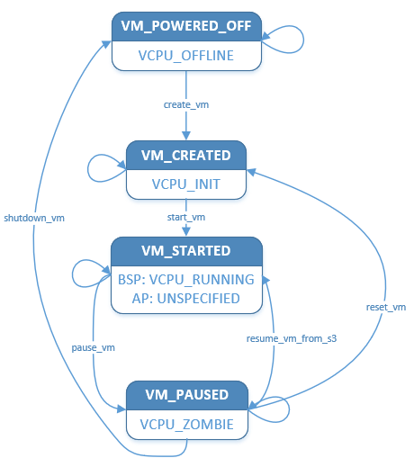

.. _hv-vm-management:

VM Management
#############

The ACRN hypervisor maintained a dedicated VM structure instance for each
running VM, and a series VM APIs like create_vm, start_vm, reset_vm, shutdown_vm
etc are used to switch a VM to the right state, according to the requirements of
applications or system power operations.

VM Structure
************

The ``acrn_vm`` structure is defined to manage a VM instance, this structure
maintained a VM's HW resources such as vCPU, vPIC, vIOAPIC, vUART, and vPCI.
At
the same time ``acrn_vm`` structure also records SW information
related with corresponding VM, such as info for VM identifier, info for SW
loader, info for memory e820 entries, info for IO/MMIO handlers, and info for
platform level cpuid entries.

The ``acrn_vm`` structure instance will be created by ``create_vm`` API, and then
work as the first parameter for other VM APIs.

VM State
********

Generally, a VM is not running at the beginning: it is in a 'powered off'
state. After it is created successfully, the VM enters a 'created' state.
Then the VM could be kicked to run, and enter a 'started' state. When the
VM powers off, the VM returns to a 'powered off' state again.
A VM can be paused to wait for some operation when it is running, so there is
also a 'paused' state.

:numref:`hvvm-state` illustrates the state-machine of a VM state transition.
Refer to :ref:`hv-cpu-virt` for related vCPU state.

   Hypervisor VM State Transition

VM State Management
*******************

Pre-Launched and Service VM
===========================

The hypervisor is the owner to control pre-launched and Service VM's state
by calling VM APIs directly, following the design of system power
management. Refer to ACRN power management design for more details.

Post-Launched User VMs
======================

DM takes control of post-launched User VMs' state transition after the Service VM
boots, by calling VM APIs through hypercalls.

Service VM user level service such as Life-Cycle-Service and tools such
as ``acrnd`` may work together with DM to launch or stop a User VM.
Refer to :ref:`acrnctl` documentation for more details.
