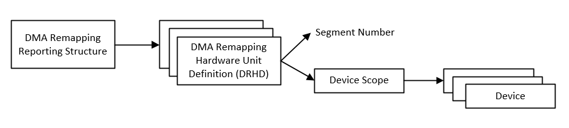
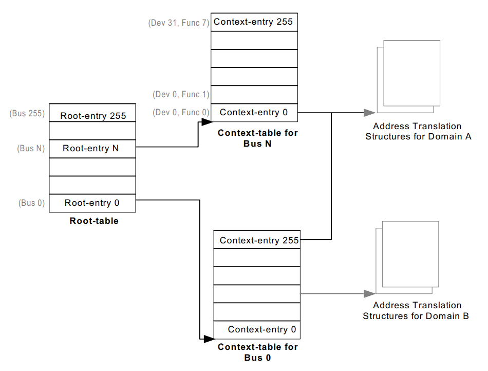
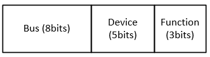
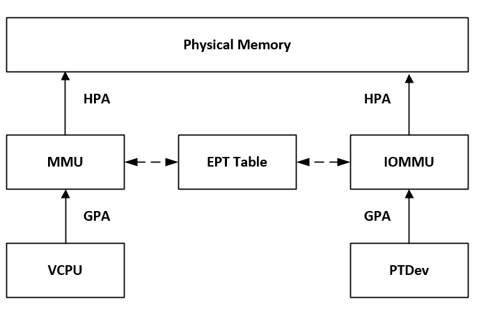

.. _vt-d-hld:

VT-d
####

Intel Virtual Technology for Directed I/O, or VT-d, provides
hardware support for I/O device virtualization. It extends the
protection and isolation properties of VMs for I/O operations.

VT-d provides the following main functions:

-  **DMA remapping**: for supporting address translations for DMA from
   devices.

-  **Interrupt remapping**: for supporting isolation and routing of
   interrupts from devices and external interrupt controllers to the
   appropriate VMs.

-  **Interrupt posting**: for supporting direct delivery of virtual
   interrupts from devices and external controllers to virtual
   processors.

The ACRN hypervisor supports DMA remapping that provides address translation
capability for PCI passthrough devices, and second-level translation,
which applies to requests-without-PASID. ACRN does not support
First-level/nested translation.

DMAR Engines Discovery
**********************

DMA Remapping Report ACPI Table
===============================

For generic platforms, the ACRN hypervisor retrieves DMAR information from
the ACPI table and then parses the DMAR reporting structure to discover the
number of DMA-remapping hardware units present in the platform as well as
the devices under the scope of a remapping hardware unit, as shown in
:numref:`dma-remap-report`:

   DMA Remapping Reporting Structure

Pre-Parsed DMAR Information
===========================

For specific platforms, the ACRN hypervisor uses pre-parsed DMA remapping
reporting information directly to save hypervisor bootup time.

DMA Remapping
*************

DMA remapping hardware is used to isolate device access to memory,
enabling each device in the system to be assigned to a specific domain
through a distinct set of paging structures.

Domains
=======

A domain is abstractly defined as an isolated environment in the
platform, to which a subset of the host physical memory is allocated.
The memory resource of a domain is specified by the address translation
tables.

Device to Domain Mapping Structure
==================================

VT-d hardware uses root-table and context-tables to build the mapping
between devices and domains as shown in :numref:`vt-d-mapping`.

   Device to Domain Mapping structures

The root-table is 4-KByte in size and contains 256 root-entries to cover
the PCI bus number space (0-255). Each root-entry contains a
context-table pointer to reference the context-table for devices on the
bus identified by the root-entry, if the present flag of the root-entry
is set.

Each context-table contains 256 entries, with each entry corresponding
to a PCI device function on the bus. For a PCI device, the device and
function numbers (8-bits) are used to index into the context-table. Each
context-entry contains a Second-level Page-table Pointer, which provides
the host physical address of the address translation structure in system
memory to be used for remapping requests-without-PASID processed through
the context-entry.

For a given Bus, Device, and Function combination as shown in
:numref:`bdf-passthru`, a passthrough device can be associated with the
address translation structures for a domain.

   BDF Format of Passthrough Device

Refer to the `VT-d spec`_ for more details on device-to-domain
mapping structures.

.. _VT-d spec:
   https://software.intel.com/sites/default/files/managed/c5/15/vt-directed-io-spec.pdf

Address Translation Structures
==============================

For ACRN, the EPT table of a domain is used as the address translation
structures for the devices assigned to the domain, as shown in
:numref:`vt-d-DMA`.

   DMA Remapping Diagram

When the device attempts to access system memory, the DMA remapping hardware
intercepts the access and utilizes the EPT table of the domain to determine
whether the access is allowed. It then translates the DMA address according
to the EPT table from the guest physical address (GPA) to the host physical
address (HPA).

Domains and Memory Isolation
============================

DMA operations do not exist inside the hypervisor, so ACRN doesn't
create a domain for the hypervisor. No DMA operations from passthrough
devices can access the hypervisor memory.

ACRN treats each virtual machine (VM) as a separate domain. For a VM,
an EPT table exists for Normal world; an EPT table for Secure world might
also exist. Secure world can access Normal world's memory, but Normal
world cannot access Secure world's memory.

SOS_VM domain
   The SOS_VM domain is created when the hypervisor creates the VM for the
   Service OS.

   IOMMU uses the EPT table of Normal world of SOS_VM as the address
   translation structures for the devices in the SOS_VM domain. The Normal
   world's EPT table of SOS_VM doesn't include the memory resource of the
   hypervisor and Secure worlds (if any exists). So the devices in SOS_VM
   domain can't access the memory belonging to the hypervisor or secure
   worlds.

Other domains
   Other VM domains will be created when the hypervisor creates the User OS.
   One domain for each User OS.

   IOMMU uses the EPT table of the Normal world of a VM as the address
   translation structures for the devices in the domain. The Normal world's
   EPT table of the VM only allows devices to access the memory
   allocated for the Normal world of the VM.

Page-Walk Coherency
===================

For the VT-d hardware, which doesn't support page-walk coherency, the
hypervisor needs to make sure the updates of VT-d tables are synced in
memory:

-  Device to Domain Mapping Structures, including Root-entries and
   Context-entries.

-  The EPT table of a VM.

ACRN flushes the related cache line after these structures are updated
if the VT-d hardware doesn't support page-walk coherency.

Super-Page Support
==================

The ACRN VT-d reuses the EPT table as the address translation table. VT-d
capability or super-page support should be identical with the usage of the
EPT table.

Snoop Control
=============

If VT-d hardware supports snoop control, iVT-d can control the
ability to ignore the "no-snoop attribute" in PCI-E transactions.

The following table shows the snoop behavior of a DMA operation controlled by
the following:

-  Snoop Control capability of VT-d DMAR unit
-  The setting of SNP filed in leaf PTE
-  No-snoop attribute in PCI-e request

.. list-table::
   :widths: 25 25 25 25
   :header-rows: 1

   * - SC cap of VT-d
     - SNP filed in leaf PTE
     - No-snoop attribute in request
     - Snoop behavior

   * - 0
     - 0 (must be 0)
     - no snoop
     - No snoop

   * - 0
     - 0 (must be 0)
     - snoop
     - Snoop

   * - 1
     - 1
     - snoop / no snoop
     - Snoop

   * - 1
     - 0
     - no snoop
     - No snoop

   * - 1
     - 0
     - snoop
     - Snoop

If VT-d DMAR units do not support Snoop Control, then the SNP Bit (bit 11)
of leaf PETs of the EPT is not set since the field is treated as reserved (0)
by the VT-d hardware implementations of not supporting Snoop Control.

The VT-d DMAR unit of the Intel integrated graphics device doesn't support
Snoop Control. The ACRN hypervisor uses the same copy of EPT as the
secondary address translation table for a VM. When the DMAR unit for the
Intel integrated graphics device is enabled, the SNP Bit cannot be set in
the lead PTEs of the EPT.

No matter if ACRN enables or disables Snoop Control, the DMA operations of
passthrough devices behave correctly from the guest's point of view. ACRN
disables Snoop Control in VT-d DMAR engines that simplify the implementation.
Also, since the snoop behavior of PCIE transactions can be controlled by
guest drivers, some devices may take advantage of the NO_SNOOP_ATTRIBUTE
of PCIE transactions for better performance when snoop is not needed.

The driver is responsible for configuring correct attribute in PCIE
transactions. Otherwise, the corresponding device may not work properly.

Initialization
**************

During hypervisor initialization, it registers DMAR units on the
platform according to the reparsed information or DMAR table. There may
be multiple DMAR units on the platform, ACRN allows some of the DMAR
units to be ignored. If some DMAR unit(s) are marked as ignored, they
would not be enabled.

Hypervisor creates SOS_VM domain using the Normal World's EPT table of SOS_VM
as address translation table when creating SOS_VM as Service OS. And all
PCI devices on the platform are added to SOS_VM domain. Then enable DMAR
translation for DMAR unit(s) if they are not marked as ignored.

.. _device-assignment:

Device Assignment
*****************

All devices are initially added to the SOS_VM domain. To assign a device
means to assign the device to a User VM. The device is removed from the
SOS_VM domain and is added to the VM domain related to the User VM, which
changes the address translation table from the EPT of SOS_VM to the EPT
of the User OS for the device.

To unassign a device means to unassign the device from a User OS. The
device is removed from the VM domain related to the User OS and then added
back to the SOS_VM domain; this changes the address translation table from
the EPT of the User OS to the EPT of the SOS_VM for the device.

Power Management Support for S3
*******************************

During platform S3 suspend and resume, the VT-d register values are
lost. ACRN VT-d provides APIs that are called during S3 suspend and resume.

During S3 suspend, some register values are saved in the memory, and
DMAR translation is disabled. During S3 resume, the register values
saved are restored. The Root table address register is set. The DMAR
translation is enabled.

All operations for S3 suspend and resume are performed on all DMAR
units on the platform, except for the DMAR units marked ignored.

Error Handling
**************

ACRN VT-d supports DMA remapping error reporting. ACRN VT-d requests a
IRQ / vector for DMAR error reporting. A DMAR fault handler is
registered for the IRQ. DMAR unit supports report fault event via MSI.
When a fault event occurs, a MSI is generated, so that the DMAR fault
handler will be called to report the error event.

Data Structures and Interfaces
******************************

Initialization and Deinitialization
===================================

The following APIs are provided during initialization and
deinitialization:

.. doxygenfunction:: init_iommu
   :project: Project ACRN

Runtime
=======

The following API are provided during runtime:

.. doxygenfunction:: create_iommu_domain
   :project: Project ACRN

.. doxygenfunction:: destroy_iommu_domain
   :project: Project ACRN

.. doxygenfunction:: suspend_iommu
   :project: Project ACRN

.. doxygenfunction:: resume_iommu
   :project: Project ACRN

.. doxygenfunction:: move_pt_device
   :project: Project ACRN
