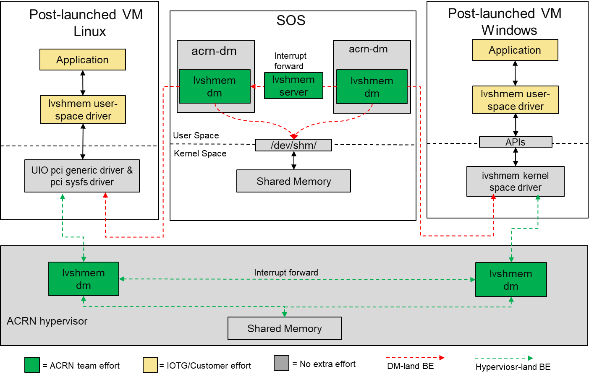

.. _ivshmem-hld:

ACRN Shared Memory Based Inter-VM Communication
###############################################

To support inter virtual machines communication based on shared memory
mechanism, ACRN device model/hypervisor emulate a virtual PCI device
(Called ``ivshmem`` device) to expose the base address and size of shared
memory.

Inter-VM Communication Overview
*******************************

   ACRN shared memory based inter-vm communication architecture

Two solutions of ivshmem device: dm-land and hypervisor-land. For dm-land,
the ivshmem device emulated in acrn device model and its shared memory region
is allocated from the Service VM's memory space. For hypervisor-land, it is
emulated in hypervisor and the shared memory regions are reserved in hypervisor's
memory space. The former solution only supports interactive between post-launched
VMs and the latter one can work for both pre-launched and post-launched VMs. The
hypervisor-land solution is WIP, plan to support in the near future.

-  Ivshmem dm – The ivshmem device model implements register virtualization
   and shared memory mapping. Will support notification/interrupt mechanism
   in future.

-  Ivshmem server – A daemon for inter-VM notification capability,
   currently, it has not been implemented, so the inter-VM communication
   doesn’t support notification mechanism.

Ivshmem Device Introduction
***************************

The ivshmem device is a virtual standard PCI device, it consists of two
BARs(BAR0 and BAR2), one is used for emulate interrupt related registers,
another one is used for exposing shared memory region. The ivshmem device
doesn't support any extra capabilities.

Configuration Space Definition

+---------------+----------+----------+
| Register      | Offset   | Value    |
+===============+==========+==========+
| Vendor ID     | 0x00     | 0x1AF4   |
+---------------+----------+----------+
| Device ID     | 0x02     | 0x1110   |
+---------------+----------+----------+
| Revision ID   | 0x08     | 0x1      |
+---------------+----------+----------+
| Class Code    | 0x09     | 0x5      |
+---------------+----------+----------+

MMIO Registers Definition

+---------------------------+----------+-------+-----------------------------------------------------------------------------------------------------------------------+
| Register                  | Offset   | RW    | Description                                                                                                           |
+===========================+==========+=======+=======================================================================================================================+
| IVSHMEM\_IRQ\_MASK\_REG   | 0x0      | R/W   | Interrupt Status register is used for legacy interrupt.                                                               |
|                           |          |       |                                                                                                                       |
|                           |          |       | Currently, the ivshmem doesn’t support interrupt, so this is reserved.                                                |
+---------------------------+----------+-------+-----------------------------------------------------------------------------------------------------------------------+
| IVSHMEM\_IRQ\_STA\_REG    | 0x4      | R/W   | Interrupt Mask register is used for legacy interrupt.                                                                 |
|                           |          |       |                                                                                                                       |
|                           |          |       | Currently, the ivshmem doesn’t support interrupt, so this is reserved.                                                |
+---------------------------+----------+-------+-----------------------------------------------------------------------------------------------------------------------+
| IVSHMEM\_IV\_POS\_REG     | 0x8      | RO    | Inter VM Position register is used to identify VM ID, currently its value is zero.                                    |
+---------------------------+----------+-------+-----------------------------------------------------------------------------------------------------------------------+
| IVSHMEM\_DOORBELL\_REG    | 0xc      | WO    | Doorbell register is used to trigger an interrupt to the peer VM. Currently, the ivshmem doesn’t support interrupt.   |
+---------------------------+----------+-------+-----------------------------------------------------------------------------------------------------------------------+

Usage
*****

To support two post-launched VMs communication via ivshmem device, user
needs to add below line as acrn-dm boot parameter.

***-s slot, ivshmem, shm\_name,shm\_size***

-  -s slot – Specify the virtual PCI slot number

-  ivshmem – Virtual PCI device name

-  shm\_name – Specify a shared memory name, post-launched VMs with the
   same *shm\_name* share a shared memory region.

-  shm\_size – Specify a shared memory size, two communicating VMs need
   to define the same size.
