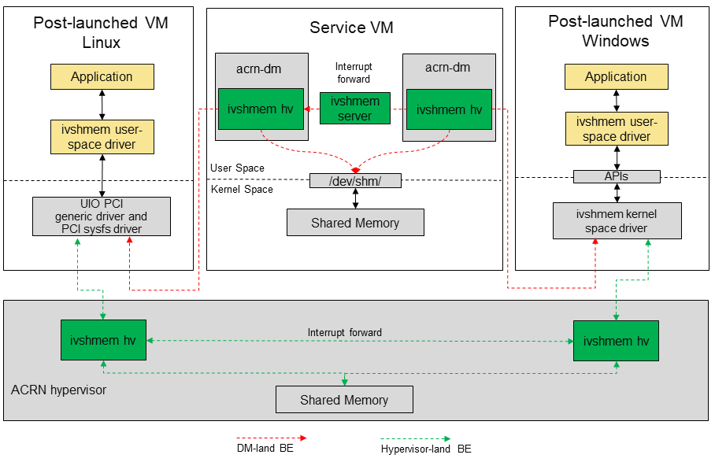

.. _ivshmem-hld:

ACRN Shared Memory Based Inter-VM Communication
###############################################

ACRN supports inter-virtual machine communication based on a shared
memory mechanism, The ACRN device model and hypervisor emulate a virtual
PCI device (called an ``ivshmem`` device) to expose the base address and
size of this shared memory.

Inter-VM Communication Overview
*******************************

   ACRN shared memory based inter-vm communication architecture

The ``ivshmem`` device is emulated in the ACRN device model (dm-land)
and its shared memory region is allocated from the Service VM's memory
space.  This solution only supports communication between post-launched
VMs.

.. note:: In a future implementation, the ``ivshmem`` device could
   instead be emulated in the hypervisor (hypervisor-land) and the shared
   memory regions reserved in the hypervisor's memory space.  This solution
   would work for both pre-launched and post-launched VMs.

ivshmem hv:
   The ivshmem device model implements register virtualization
   and shared memory mapping in the hypervisor (not the acrn-dm).
   Will support notification/interrupt mechanism in the future.

ivshmem server:
   A daemon for inter-VM notification capability,
   This is currently **not implemented**, so the inter-VM communication
   doesn't support a notification mechanism.

Ivshmem Device Introduction
***************************

The ``ivshmem`` device is a virtual standard PCI device consisting of
two Base Address Registers (BARs): BAR0 is used for emulating interrupt related registers,
and BAR2 is used for exposing shared memory region. The ``ivshmem`` device
doesn't support any extra capabilities.

Configuration Space Definition

+---------------+----------+----------+
| Register      | Offset   | Value    |
+===============+==========+==========+
| Vendor ID     | 0x00     | 0x1AF4   |
+---------------+----------+----------+
| Device ID     | 0x02     | 0x1110   |
+---------------+----------+----------+
| Revision ID   | 0x08     | 0x1      |
+---------------+----------+----------+
| Class Code    | 0x09     | 0x5      |
+---------------+----------+----------+

MMIO Registers Definition

.. list-table::
   :widths: auto
   :header-rows: 1

   * - Register
     - Offset
     - Read/Write
     - Description
   * - IVSHMEM\_IRQ\_MASK\_REG
     - 0x0
     - R/W
     - Interrupt Status register is used for legacy interrupt.
       ivshmem doesn't support interrupts, so this is reserved.
   * - IVSHMEM\_IRQ\_STA\_REG
     - 0x4
     - R/W
     - Interrupt Mask register is used for legacy interrupt.
       ivshmem doesn't support interrupts, so this is reserved.
   * - IVSHMEM\_IV\_POS\_REG
     - 0x8
     - RO
     - Inter-VM Position register is used to identify the VM ID.
       Currently its value is zero.
   * - IVSHMEM\_DOORBELL\_REG
     - 0xC
     - WO
     - Doorbell register is used to trigger an interrupt to the peer VM.
       ivshmem doesn't support interrupts.

Usage
*****

To support two post-launched VMs communicating via an ``ivshmem`` device,
add this line as an acrn-dm boot parameter::

  -s slot,ivshmem,shm_name,shm_size

where

-  ``-s slot`` - Specify the virtual PCI slot number

-  ``ivshmem`` - Virtual PCI device name

-  ``shm_name`` - Specify a shared memory name. Post-launched VMs with the
   same ``shm_name`` share a shared memory region.

-  ``shm_size`` - Specify a shared memory size. The two communicating
   VMs must define the same size.

Inter-VM Communication Example
******************************

Using inter-vm communication between two linux-based post-launched VMs (VM1 and
VM2) as an example.

Firstly, we need to add a new virtual PCI device for both of VMs, the device type
is ``ivshmem``, shared memory name is test and shared memory size is 4096 bytes.

.. note:: both VMs should have same shared memory name and size

- VM1 Launch Script Sample::

	acrn-dm -A -m $mem_size -s 0:0,hostbridge
	-s 2,pci-gvt -G "$2"
	-s 5,virtio-console,@stdio:stdio_port
	-s 6,virtio-hyper_dmabuf
	-s 3,virtio-blk,/home/clear/uos/uos1.img
	-s 4,virtio-net,tap0
	``-s 6,ivshmem,test,4096``
	-s 7,virtio-rnd
	--ovmf /usr/share/acrn/bios/OVMF.fd
	$vm_name

- VM2 Launch Script Sample::

	acrn-dm -A -m $mem_size -s 0:0,hostbridge
	-s 2,pci-gvt -G "$2"
	-s 3,virtio-blk,/home/clear/uos/uos2.img
	-s 4,virtio-net,tap0
	``-s 5,ivshmem,test,4096``
	--ovmf /usr/share/acrn/bios/OVMF.fd
	$vm_name

Secondly, boot two VMs and use ``lspci`` to check the virtual device is ready for each VM.

-  For VM1, it is ``00:06.0 RAM memory: Red Hat, Inc. Inter-VM shared memory (rev 01)``
-  For VM2, it is ``00:05.0 RAM memory: Red Hat, Inc. Inter-VM shared memory (rev 01)``

Thirdly, using below commands to probe the device::

  sudo modprobe uio
  sudo modprobe uio_pci_generic
  sudo echo "1af4 1110" > /sys/bus/pci/drivers/uio_pci_generic/new_id

Finally, user application can get shared memory base address from ``ivshmem`` device
BAR resource (``/sys/class/uio/uioX/device/resource2``) and shared memory size from
``ivshmem`` device config resource (``/sys/class/uio/uioX/device/config``).

.. note:: the X in uioX is a number that can be retrieved using the ``ls`` command.
	VM1 can use ``ls -lh /sys/bus/pci/devices/0000\:00\:06.0/uio`` and VM2 can use
	``ls -lh /sys/bus/pci/devices/0000\:00\:05.0/uio``.
