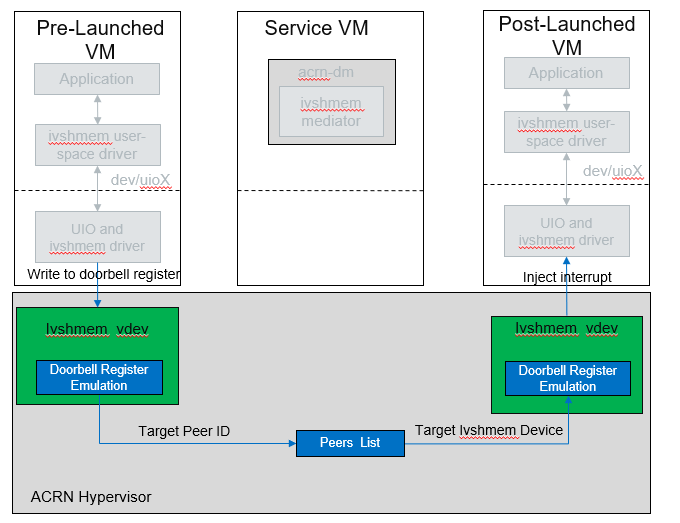

.. _ivshmem-hld:

ACRN Shared Memory Based Inter-VM Communication
###############################################

ACRN supports inter-virtual machine communication based on a shared
memory mechanism. The ACRN Device Model or hypervisor emulates a virtual
PCI device (called an ``ivshmem`` device) to expose the base address and
size of this shared memory.

Inter-VM Communication Overview
*******************************

.. figure:: images/ivshmem-architecture.png
   :align: center
   :name: ivshmem-architecture-overview

   ACRN Shared Memory Based Inter-VM Communication Architecture

ACRN can emulate the ``ivshmem`` device in two ways:

``ivshmem`` dm-land
   The ``ivshmem`` device is emulated in the ACRN Device Model,
   and the shared memory regions are reserved in the Service VM's
   memory space.  This solution only supports communication between
   post-launched User VMs.

``ivshmem`` hv-land
   The ``ivshmem`` device is emulated in the hypervisor, and the
   shared memory regions are reserved in the hypervisor's
   memory space.  This solution works for both pre-launched and
   post-launched User VMs.

While both solutions can be used at the same time, inter-VM communication
may only be done between VMs using the same solution.

ivshmem hv:
   The **ivshmem hv** implements register virtualization
   and shared memory mapping in the ACRN hypervisor.
   A notification/interrupt mechanism is supported.

ivshmem dm:
   The **ivshmem dm** implements register virtualization
   and shared memory mapping in the ACRN Device Model (``acrn-dm``).
   It will support a notification/interrupt mechanism in the future.

ivshmem server:
   With **ivshmem server** support, VMs with ivshmem devices enabled can send
   notifications (interrupts) to each other by writing the target peer ID (VM
   ID) and vector index to the doorbell register of the ivshmem device. The
   **ivshmem server** forwards this notification event to the target VM.

   Two types of **ivshmem server** are defined in ACRN:

   * User land **ivshmem server** is a daemon in user space to forward
     notifications for **dm-land** ivshmem devices only, by co-working with
     **ivshmem dm**. User land **ivshmem server** is not implemented.

   * HV-land **ivshmem server** plays a role similar to the user land **ivshmem
     server**, but it is a hypervisor module and forwards notifications (virtual
     interrupts) to the target VM with  **hv-land** ivshmem devices enabled.

   ACRN Ivshmem HV-Land Doorbell Overview

Ivshmem Device Introduction
***************************

The ``ivshmem`` device is a virtual standard PCI device consisting of
three Base Address Registers (BARs):

* BAR0 is used for emulating interrupt-related registers.
* BAR1 is used for emulating MSIX entry table.
* BAR2 is used for exposing a shared memory region.

The ``ivshmem`` device supports no extra capabilities.

Configuration Space Definition

+---------------+----------+----------+
| Register      | Offset   | Value    |
+===============+==========+==========+
| Vendor ID     | 0x00     | 0x1AF4   |
+---------------+----------+----------+
| Device ID     | 0x02     | 0x1110   |
+---------------+----------+----------+
| Revision ID   | 0x08     | 0x1      |
+---------------+----------+----------+
| Class Code    | 0x09     | 0x5      |
+---------------+----------+----------+

MMIO Registers Definition

.. list-table::
   :widths: auto
   :header-rows: 1

   * - Register
     - Offset
     - Read/Write
     - Description
   * - IVSHMEM\_IRQ\_MASK\_REG
     - 0x0
     - R/W
     - Interrupt Mask register is used for legacy interrupt.
       ivshmem doesn't support interrupts, so this register is reserved.
   * - IVSHMEM\_IRQ\_STA\_REG
     - 0x4
     - R/W
     - Interrupt Status register is used for legacy interrupt.
       ivshmem doesn't support interrupts, so this register is reserved.
   * - IVSHMEM\_IV\_POS\_REG
     - 0x8
     - RO
     - Inter-VM Position register is used to identify the VM ID.
       Its value is zero.
   * - IVSHMEM\_DOORBELL\_REG
     - 0xC
     - WO
     - Doorbell register is used to trigger an interrupt to the peer VM.
       ivshmem doesn't support interrupts.

Usage
*****

For usage information, see :ref:`enable_ivshmem`.

Inter-VM Communication Security Hardening (BKMs)
************************************************

Inter-VM communication enables you to create shared
memory regions between post-launched User VMs.
This mechanism is based on ivshmem v1.0 and exposes virtual PCI devices for the
shared regions (in the Service VM's memory). This feature adopts a
community-approved design for shared memory between VMs, following the same
specification for KVM/QEMU (`Link <https://git.qemu.org/?p=qemu.git;a=blob_plain;f=docs/specs/ivshmem-spec.txt;hb=HEAD>`_).

Following the ACRN threat model, the policy definition for allocation and
assignment of these regions is controlled by the Service VM, which is part of
ACRN's Trusted Computing Base (TCB). However, to secure inter-VM communication
between any user space applications that harness this channel, applications will
face more requirements for the confidentiality, integrity, and authenticity of
shared or transferred data. The application development team is
responsibility for defining a threat model and security architecture for the
application and utilizing custom or public libraries accordingly. This document
provides an overview about potential hardening techniques from a user space
application's perspective. Consider these techniques when defining the security
architecture and threat model for your application.

.. note:: This document is not a definitive guide on all security technologies
   or how to implement security. We provide general pointers not bounded to a
   specific OS or use case.

1. **Secure Feature Configurability**

   - ACRN ensures a minimal control plane for the configuration of the memory
     region's boundaries and name handles. This capability is managed only by
     the Service VM during the creation of the guest VM through the Device Model
     (DM).
   - Create different permissions or groups for the ``admin`` role to isolate it
     from other entities that might have access to the Service VM. For example,
     only admin permissions allow R/W/X on the DM binary.

2. **Apply Access Control**

   - Add restrictions based on behavior or subject and object rules around
     information flow and accesses.
   - In the Service VM, consider the ``/dev/shm`` device node as a critical
     interface with special access requirements. Those requirements can be
     fulfilled using any of the existing open source MAC technologies or even
     ACLs depending on the OS compatibility (Ubuntu, Windows, etc.) and
     integration complexity.
   - In the User VM, the shared memory region can be accessed using the
     ``mmap()`` of the UIO device node. Other complementary information can be
     found under:

     - ``/sys/class/uio/uioX/device/resource2`` --> shared memory base address
     - ``/sys/class/uio/uioX/device/config`` --> shared memory size

   - For Linux-based User VMs, we recommend using the standard ``UIO`` and
     ``UIO_PCI_GENERIC`` drivers through the device node (for example,
     ``/dev/uioX``).
   - Reference: `AppArmor <https://wiki.ubuntuusers.de/AppArmor/>`_, `SELinux
     <https://selinuxproject.org/page/Main_Page>`_, `UIO driver-API
     <https://www.kernel.org/doc/html/v4.12/driver-api/uio-howto.html>`_

3. **Crypto Support and Secure Applied Crypto**

   - According to the application's threat model and the defined assets that
     need to be shared securely, define the requirements for crypto algorithms.
     Those algorithms should enable operations such as authenticated encryption
     and decryption, secure key exchange, true random number generation, and
     seed extraction. In addition, consider the landscape of your attack surface
     and define the need for a security engine (for example, CSME services).
   - Don't implement your own crypto functions. Use available compliant crypto
     libraries as applicable, such as `Intel IPP
     <https://github.com/intel/ipp-crypto>`_ or `TinyCrypt
     <https://01.org/tinycrypt>`_.
   - Utilize the platform/kernel infrastructure and services (for example,
     :ref:`hld-security`, `Kernel Crypto backend/APIs
     <https://www.kernel.org/doc/html/v5.4/crypto/index.html>`_, and `keyring
     subsystem <https://www.man7.org/linux/man-pages/man7/keyrings.7.html>`_).
   - Implement necessary flows for key lifecycle management, including wrapping,
     revocation, and migration, depending on the crypto key type and
     requirements for key persistence across system and power management events.
   - Follow open source secure crypto coding guidelines for secure wrappers and
     marshaling data structures: `Secure Applied Crypto <https://github.com
     veorq/cryptocoding>`_
   - References: `NIST Crypto Standards and Guidelines
     <https://csrc.nist.gov/projects/cryptographic-standards-and-guidelines>`_,
     `OpenSSL <https://www.openssl.org/>`_

4. **Applications Passlisting**

   - For use cases implemented in static environments (for example, Industrial
     and Automotive usages), follow application approval techniques and disable
     any third-party or native app stores.
   - This mechanism can be chained with the access control policies to protect
     access to passlisting rules and configuration files (refer to open source
     or implement your custom solution).
   - References: `NIST SP800-167
     <https://nvlpubs.nist.gov/nistpubs/SpecialPublications/NIST.SP.800-167.pdf>`_,
     `fapolicyd <https://github.com/linux-application-whitelisting/fapolicyd>`_

5. **Secure Boot and File System Integrity Verification**

   - The previously highlighted technologies rely on the kernel, as a secure
     component, to enforce such policies. We strongly recommend enabling secure
     boot for the Service VM, and extend the secure boot chain to any
     post-launched VM kernels.
   - To ensure that no malware is introduced or persists, utilize the file
     system (FS) verification methods on every boot to extend the secure boot
     chain for post-launch VMs (kernel/FS).
   - Reference: :ref:`how-to-enable-secure-boot-for-windows`
   - Reference Stack:  `dm-verity
     <https://www.kernel.org/doc/html/latest/admin-guide/device-mapper/verity.html>`_

.. note:: All the mentioned hardening techniques might require minor extra
   development efforts.
