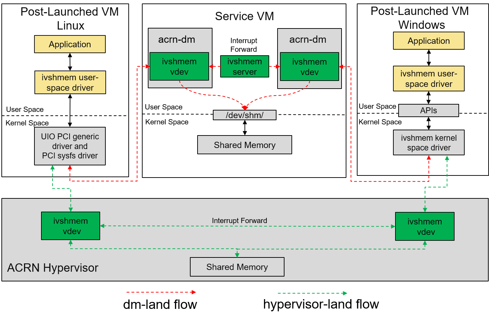

.. _ivshmem-hld:

ACRN Shared Memory Based Inter-VM Communication
###############################################

ACRN supports inter-virtual machine communication based on a shared
memory mechanism. The ACRN device model or hypervisor emulates a virtual
PCI device (called an ``ivshmem`` device) to expose the base address and
size of this shared memory.

Inter-VM Communication Overview
*******************************

   ACRN shared memory based inter-vm communication architecture

The ``ivshmem`` device is emulated in the ACRN device model (dm-land)
and its shared memory region is allocated from the Service VM's memory
space. This solution only supports communication between post-launched
VMs.

.. note:: In a future implementation, the ``ivshmem`` device could
   instead be emulated in the hypervisor (hypervisor-land) and the shared
   memory regions reserved in the hypervisor's memory space. This solution
   would work for both pre-launched and post-launched VMs.

ivshmem hv:
   The **ivshmem hv** implements register virtualization
   and shared memory mapping in the ACRN hypervisor.
   It will support notification/interrupt mechanism in the future.

ivshmem dm:
   The **ivshmem dm** implements register virtualization
   and shared memory mapping in the ACRN Device Model (``acrn-dm``).
   It will support notification/interrupt mechanism in the future.

ivshmem server:
   A daemon for inter-VM notification capability that will work with **ivshmem
   dm**. This is currently **not implemented**, so the inter-VM communication
   doesn't support a notification mechanism.

Ivshmem Device Introduction
***************************

The ``ivshmem`` device is a virtual standard PCI device consisting of
two Base Address Registers (BARs): BAR0 is used for emulating interrupt
related registers, and BAR2 is used for exposing shared memory region. The ``ivshmem`` device doesn't support any extra capabilities.

Configuration Space Definition

+---------------+----------+----------+
| Register      | Offset   | Value    |
+===============+==========+==========+
| Vendor ID     | 0x00     | 0x1AF4   |
+---------------+----------+----------+
| Device ID     | 0x02     | 0x1110   |
+---------------+----------+----------+
| Revision ID   | 0x08     | 0x1      |
+---------------+----------+----------+
| Class Code    | 0x09     | 0x5      |
+---------------+----------+----------+

MMIO Registers Definition

.. list-table::
   :widths: auto
   :header-rows: 1

   * - Register
     - Offset
     - Read/Write
     - Description
   * - IVSHMEM\_IRQ\_MASK\_REG
     - 0x0
     - R/W
     - Interrupt Status register is used for legacy interrupt.
       ivshmem doesn't support interrupts, so this is reserved.
   * - IVSHMEM\_IRQ\_STA\_REG
     - 0x4
     - R/W
     - Interrupt Mask register is used for legacy interrupt.
       ivshmem doesn't support interrupts, so this is reserved.
   * - IVSHMEM\_IV\_POS\_REG
     - 0x8
     - RO
     - Inter-VM Position register is used to identify the VM ID.
       Currently its value is zero.
   * - IVSHMEM\_DOORBELL\_REG
     - 0xC
     - WO
     - Doorbell register is used to trigger an interrupt to the peer VM.
       ivshmem doesn't support interrupts.

Usage
*****

To support two post-launched VMs communicating via an ``ivshmem`` device,
add this line as an ``acrn-dm`` boot parameter::

  -s slot,ivshmem,shm_name,shm_size

where

-  ``-s slot`` - Specify the virtual PCI slot number

-  ``ivshmem`` - Virtual PCI device name

-  ``shm_name`` - Specify a shared memory name. Post-launched VMs with the
   same ``shm_name`` share a shared memory region.

-  ``shm_size`` - Specify a shared memory size. The two communicating
   VMs must define the same size.

.. note:: This device can be used with Real-Time VM (RTVM) as well.

Inter-VM Communication Example
******************************

The following example uses inter-vm communication between two Linux-based
post-launched VMs (VM1 and VM2).

.. note:: An ``ivshmem`` Windows driver exists and can be found `here <https://github.com/virtio-win/kvm-guest-drivers-windows/tree/master/ivshmem>`_

1. Add a new virtual PCI device for both VMs: the device type is
   ``ivshmem``, shared memory name is ``test``, and shared memory size is
   4096 bytes. Both VMs must have the same shared memory name and size:

   - VM1 Launch Script Sample

     .. code-block:: none
        :emphasize-lines: 7

        acrn-dm -A -m $mem_size -s 0:0,hostbridge \
         -s 2,pci-gvt -G "$2" \
         -s 5,virtio-console,@stdio:stdio_port \
         -s 6,virtio-hyper_dmabuf \
         -s 3,virtio-blk,/home/clear/uos/uos1.img \
         -s 4,virtio-net,tap0 \
         -s 6,ivshmem,test,4096 \
         -s 7,virtio-rnd \
         --ovmf /usr/share/acrn/bios/OVMF.fd \
         $vm_name

   - VM2 Launch Script Sample

     .. code-block:: none
        :emphasize-lines: 5

        acrn-dm -A -m $mem_size -s 0:0,hostbridge \
         -s 2,pci-gvt -G "$2" \
         -s 3,virtio-blk,/home/clear/uos/uos2.img \
         -s 4,virtio-net,tap0 \
         -s 5,ivshmem,test,4096 \
         --ovmf /usr/share/acrn/bios/OVMF.fd \
         $vm_name

2. Boot two VMs and use ``lspci | grep "shared memory"`` to verify that the virtual device is ready for each VM.

   -  For VM1, it shows ``00:06.0 RAM memory: Red Hat, Inc. Inter-VM shared memory (rev 01)``
   -  For VM2, it shows ``00:05.0 RAM memory: Red Hat, Inc. Inter-VM shared memory (rev 01)``

3. Use these commands to probe the device::

     $ sudo modprobe uio
     $ sudo modprobe uio_pci_generic
     $ sudo echo "1af4 1110" > /sys/bus/pci/drivers/uio_pci_generic/new_id

4. Finally, a user application can get the shared memory base address from
   the ``ivshmem`` device BAR resource
   (``/sys/class/uio/uioX/device/resource2``) and the shared memory size from
   the ``ivshmem`` device config resource
   (``/sys/class/uio/uioX/device/config``).

   The ``X`` in ``uioX`` above, is a number that can be retrieved using the
   ``ls`` command:

   - For VM1 use ``ls -lh /sys/bus/pci/devices/0000:00:06.0/uio``
   - For VM2 use ``ls -lh /sys/bus/pci/devices/0000:00:05.0/uio``

Inter-VM Communication Security hardening (BKMs)
************************************************

As previously highlighted, ACRN 2.0 provides the capability to create shared
memory regions between Post-Launch user VMs known as "Inter-VM Communication".
This mechanism is based on ivshmem v1.0 exposing virtual PCI devices for the
shared regions (in Service VM's memory for this release). This feature adopts a
community-approved design for shared memory between VMs, following same
specification for KVM/QEMU (`Link <https://git.qemu.org/?p=qemu.git;a=blob_plain;f=docs/specs/ivshmem-spec.txt;hb=HEAD>`_).

Following the ACRN threat model, the policy definition for allocation and
assignment of these regions is controlled by the Service VM, which is part of
ACRN's Trusted Computing Base (TCB). However, to secure inter-VM communication
between any userspace applications that harness this channel, applications will
face more requirements for the confidentiality, integrity, and authenticity of
shared or transferred data. It is the application development team's
responsibility to define a threat model and security architecture for the
application and utilize custom or public libraries accordingly. In this document
we provide an overview about potential hardening techniques from a userspace
application's perspective. Consider these techniques when defining the security
architecture and threat model for your application.

.. note:: This is not a definitive guide on all security technologies or how to implement security. We provide general pointers not bounded to a specific OS or use-case.

1. **Secure Feature Configurability**

   - ACRN ensure a minimal control plane for the configuration of the memory region's boundaries and name handles. This is managed only by the Service VM during the creation of the guest VM through the Device Model (DM).
   - Service VM Admin should refer to the :ref:`usage guide <ivshmem-hld>` for secure configuration flow.
   - Create different permissions or groups for the ``admin`` role to isolate it from other entities that might have access to the Service VM. For example only admin permissions allow R/W/X on DM binary.
   - Reference: :ref:`ivshmem-hld`

2. **Apply Access Control**

   - Add restrictions based on behavior or subject and object rules around information flow and accesses.
   - In Service VM, consider the ``/dev/shm`` device node as a critical interface with special access requirement. Those requirements can be fulfilled using any of the existing opensource MAC technologies or even ACLs depending on the OS compatibility (Ubuntu, Windows, etc..) and integration complexity.
   - In the User VM, the shared memory region can be accessed using ``mmap()`` of UIO device node. Other complementary info can be found under:

      - ``/sys/class/uio/uioX/device/resource2`` --> shared memory base address
      - ``/sys/class/uio/uioX/device/config`` --> shared memory Size.

   - For Linux-based User VMs, we recommend using the standard ``UIO`` and ``UIO_PCI_GENERIC`` drivers through the device node (for example, ``/dev/uioX``).
   - Reference: `AppArmor <https://wiki.ubuntuusers.de/AppArmor/>`_, `SELinux <https://selinuxproject.org/page/Main_Page>`_, `UIO driver-API <https://www.kernel.org/doc/html/v4.12/driver-api/uio-howto.html>`_

3. **Crypto Support and Secure Applied Crypto**

   - According to the application's threat model and the defined assets that need to be shared securely, define the requirements for crypto algorithms.Those algorithms should enable operations such as authenticated encryption and decryption, secure key exchange, true random number generation, and seed extraction. In addition, consider the landscape of your attack surface and define the need for security engine (for example CSME services.
   - Don't implement your own crypto functions. Use available compliant crypto libraries as applicable, such as. (`Intel IPP <https://github.com/intel/ipp-crypto>`_ or `TinyCrypt <https://01.org/tinycrypt>`_)
   - Utilize the platform/kernel infrastructure and services (e.g., :ref:`hld-security` , `Kernel Crypto backend/APIs <https://www.kernel.org/doc/html/v5.4/crypto/index.html>`_ , `keyring subsystem <https://www.man7.org/linux/man-pages/man7/keyrings.7.html>`_, etc..).
   - Implement necessary flows for key lifecycle management including wrapping,revocation and migration, depending on the crypto key type used and if there are requirements for key persistence across system and power management events.
   - Follow open source secure crypto coding guidelines for secure wrappers and marshalling data structures: `Secure Applied Crypto <https://github.com veorq/cryptocoding>`_
   - References: `NIST Crypto Standards and Guidelines <https://csrc.nist.gov/projects/cryptographic-standards-and-guidelines>`_, `OpenSSL <https://www.openssl.org/>`_

4. **Applications Whitelisting**

   - For use cases implemented in static environments (for example, Industrial and Automotive usages), follow application whitelist techniques and disable any third-party or native app stores.
   - This mechanism can be chained with the access control policies to protect access to whitelisting rules and configuration files (refer to opensource or implement your custom solution).
   - References: `NIST SP800-167 <https://nvlpubs.nist.gov/nistpubs/SpecialPublications/NIST.SP.800-167.pdf>`_, `fapolicyd <https://github.com/linux-application-whitelisting/fapolicyd>`_

5. **Secure boot and File System Integrity Verification**

   - The previously highlighted technologies rely on the kernel, as a secure component, to enforce such policies. Because of this, we strongly recommend enabling secure boot for the Service VM, and extend the secureboot chain to any post-launched VM kernels.
   - To ensure no malicious software is introduced or persists, utilize the filesystem (FS) verification methods on every boot to extend the secure boot chain for post-launch VMs (kernel/FS).
   - Reference: ACRN secure boot extension guide (`ClearLinux <https://projectacrn.github.io/latest/tutorials/enable_laag_secure_boot.html?highlight=secure%20boot>`_, `Windows <https://projectacrn.github.io/latest/tutorials/waag-secure-boot.html>`_)
   - Reference Stack:  `dm-verity <https://www.kernel.org/doc/html/latest/admin-guide/device-mapper/verity.html>`_

.. note:: All the mentioned hardening techniques might require minor extra development efforts.
