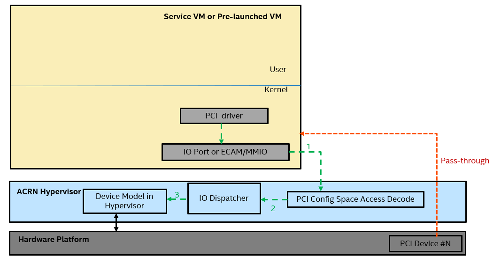
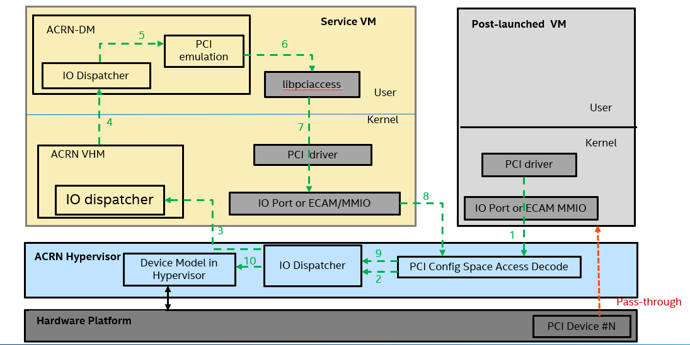
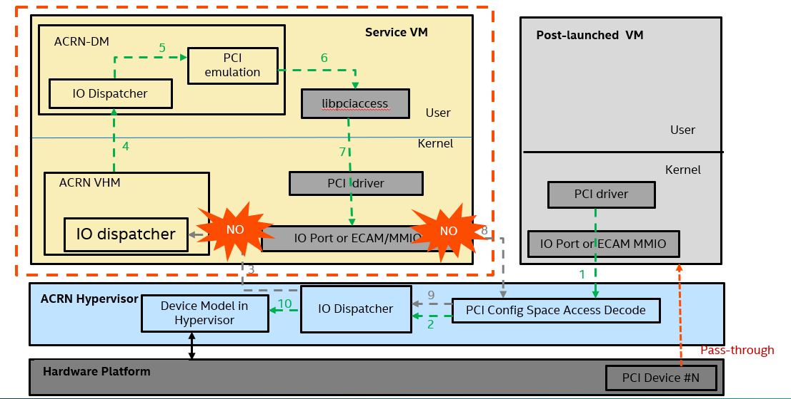
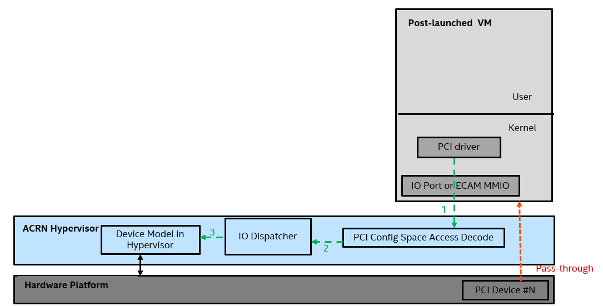

.. _split-device-model:

Split Device Model
==================

We usually emulate devices in the Device Model. However, in some cases, we
need to emulate devices in the ACRN Hypervisor. For example, the
post-launched RTVM needs to emulate passthrough PCI(e) devices in the ACRN
Hypervisor so that it can continue to run even if the Device Model is
no longer working. Nevertheless, the Device Model still owns the overall
resource management such as memory/MMIO space and interrupt pins.

One communication method provided by the ACRN Hypervisor aligns the resource information for the Device Model with the ACRN Hypervisor emulated device.

Let's take the passthrough PCI(e) device as an example. Before we split
passthrough PCI(e) devices from the Device Model to the ACRN Hypervisor, the
whole picture looks like this:

   PCI Config space access in the Service VM or Pre-launched VM

   PCI Config space access in the Post-launched VM

After we split passthrough PCI(e) devices from the Device Model to the
ACRN Hypervisor, the whole picture looks like this:

   PCI Config space access in the Post-launched VM

Interfaces Design
=================

In order to achieve this, we have added a new pair of hypercalls to align
the PCI(e) BAR and INTx information.

.. doxygenfunction:: hcall_assign_pcidev
   :project: Project ACRN

.. doxygenfunction:: hcall_deassign_pcidev
   :project: Project ACRN

