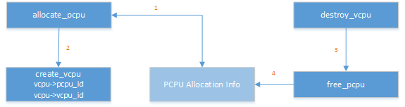

.. cpu-partitioning-hld:

Static CPU Partitioning
#######################

CPU partitioning is a policy for mapping a virtual
CPU (VCPU) to a physical CPU. The current ACRN implementation forces a
static 1:1 mapping between VCPUs and physical CPUs and does
not support multiple VCPUs running on a physical CPU and does not
support VCPU migration from one physical CPU to another.

This section describes the static CPU partitioning implementation in
ACRN.

Overview
********

ACRN forces a fixed 1:1 mapping between a VCPU and a physical CPU when
creating a VCPU for the guest Operating System. This makes the VCPU
management code much simpler.

An array is used to track the physical CPU allocation information. When
a VCPU is created, we query, allocate, and update the array to map the
VCPU to an available physical CPU.

The physical CPU number assignment for each guest is pre-defined. For
example, on a platform with four CPU cores, one physical CPU is assigned
to run the Service Operating System (SOS) and other three physical CPUs
are assigned to run the User Operating System (UOS) instances.

.. note::

   To improvement SOS boot time, all physical CPUs are assigned to the SOS
   during the SOS boot. Afterward, the physical CPUs defined for the UOS
   are allocated by the Device Model (DM) by running the launch_uos.sh
   script.

CPU management in SOS
*********************

With ACRN, all ACPI table entries are pass-thru to the SOS, including
the Multiple Interrupt Controller Table (MADT). The SOS sees all
physical CPUs by parsing the MADT when the SOS  kernel boots. All
physical CPUs are initially assigned to the SOS by creating the same
number of virtual CPUs.

When the SOS boot is finished, it releases the physical CPUs intended
for UOS use.

Here is an example flow of CPU allocation on a multi-core platform.

.. figure:: images/static-core-image2.png
   :width: 600px
   :align: center
   :name: static-core-cpu-allocation

   CPU allocation on a multi-core platform

CPU management in UOS
*********************

From the UOS point of view, CPU management is very simple, using a
hypercall to create the virtual CPUs. Here's an example from from the DM
code:

.. code-block:: c

   int vm_create_vcpu(struct vmctx *ctx, uint16_t vcpu_id)
   {
      struct acrn_create_vcpu cv;
      int error;

      bzero(&cv, sizeof(struct acrn_create_vcpu));
      cv.vcpu_id = vcpu_id;
      error = ioctl(ctx->fd, IC_CREATE_VCPU, &cv);
      return error;
   }

The VHM will respond to the ioctl:

.. code-block:: c

   case IC_CREATE_VCPU: {
      struct acrn_create_vcpu cv;

      if (copy_from_user(&cv, (void *)ioctl_param,
                         sizeof(struct acrn_create_vcpu)))
         return -EFAULT;

      ret = acrn_hypercall2(HC_CREATE_VCPU, vm->vmid,
                            virt_to_phys(&cv));
      if (ret < 0) {
         pr_err("vhm: failed to create vcpu %d!\\n",
                 cv.vcpu_id);
         return -EFAULT;
      }

      atomic_inc(&vm->vcpu_num);
      return ret;
   }

The hypercall ``HC_CREATE_VCPU`` is handled in the hypervisor with
the parameter:

.. code-block:: c

   struct acrn_create_vcpu {
      /** the virtual CPU ID for the VCPU created */
      uint16_t vcpu_id;
      /** the physical CPU ID for the VCPU created */
      uint16_t pcpu_id;
   } __attribute__((aligned(8)));

CPU assignment management in HV
*******************************

When we create a VCPU in the hypervisor, an available physical CPU is
picked and marked as used. When we destroy the VCPU, we mark the
physical CPU as available again.

   HV CPU Assignment Management

#. ``allocate_pcpu()`` queries the physical CPU allocation info to get an
   available physical CPU and marks physical CPU as not available
#. Physical CPU info is passed to ``create_vcpu()`` and a mapping is built
   between the physical CPU and virtual CPU
#. When the VCPU is destroyed VCPU, the physical CPU is passed to the
   ``free_pcpu()`` function
#. ``free_pcpu()`` marks the physical CPU available again.

Currently, the ACRN hypervisor does not support virtual CPU migration to
different physical CPUs. This means no changes to the virtual CPU to
physical CPU can happen without first calling destroy_vcpu.
