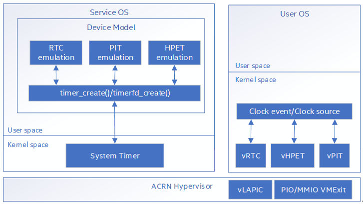

.. _system-timer-hld:

System Timer Virtualization
###########################

ACRN supports RTC (Real-time clock), HPET (High Precision Event Timer),
and PIT (Programmable interval timer) devices for the VM system timer.
Different timer devices support different resolutions. The HPET device can
support higher resolutions than RTC and PIT.

System timer virtualization architecture

|image0|

-  In the User VM, vRTC, vHPET, and vPIT are used by the clock event module and the clock
   source module in the kernel space.

-  In the Service VM, the Device Model creates all vRTC, vHPET, and vPIT devices
   in the initialization phase. The Device Model uses timer\_create and
   timerfd\_create interfaces to set up native timers for the trigger timeout
   mechanism.

System Timer Initialization
===========================

The Device Model initializes vRTC, vHEPT, and vPIT devices automatically when
it starts the booting initialization. The initialization
flow goes from vrtc\_init to vpit\_init and ends with vhept\_init. See
the code snippets below.::

	static int
	vm_init_vdevs(struct vmctx ctx)*
	{
		int ret;
		...

		ret = vrtc_init(ctx);
		if (ret < 0)
			goto vrtc_fail;

		ret = vpit_init(ctx);
		if (ret < 0)
			goto vpit_fail;

		ret = vhpet_init(ctx);
		if (ret < 0)
			goto vhpet_fail;
		...
	}

PIT Emulation
=============

The ACRN emulated Intel 8253 Programmable Interval Timer includes a chip
that has three
independent 16-bit down counters that can be read on the fly. There are
three mode registers and three countdown registers. The countdown
registers are addressed directly, via the first three I/O ports.The
three mode registers are accessed via the fourth I/O port, with two bits
in the mode byte indicating the register.

I/O ports definition::

	#define IO_TIMER1_PORT 0x40 /* 8253 Timer #1 */
	#define NMISC_PORT 0x61
	#define TIMER_REG_CNTR0 0 /* timer 0 counter port */
	#define TIMER_REG_CNTR1 1 /* timer 1 counter port */
	#define TIMER_REG_CNTR2 2 /* timer 2 counter port */
	#define TIMER_REG_MODE 3 /* timer mode port */

	/*
	 * The outputs of the three timers are connected as follows:
	 *
	 * timer 0 -> irq 0
	 * timer 1 -> dma chan 0 (for dram refresh)
	 * timer 2 -> speaker (via keyboard controller)
	 *
	 * Timer 0 is used to call hard clock.
	 * Timer 2 is used to generate console beeps.
	 */
	#define TIMER_CNTR0 (IO_TIMER1_PORT + TIMER_REG_CNTR0)
	#define TIMER_CNTR1 (IO_TIMER1_PORT + TIMER_REG_CNTR1)
	#define TIMER_CNTR2 (IO_TIMER1_PORT + TIMER_REG_CNTR2)
	#define TIMER_MODE (IO_TIMER1_PORT + TIMER_REG_MODE)

RTC Emulation
=============

ACRN supports RTC (real-time clock) that can only be accessed through
I/O ports (0x70 and 0x71).

0x70 is used to access CMOS address register and 0x71 is used to access
CMOS data register; the user needs to set the CMOS address register and then
the read/write CMOS data register for CMOS accessing.

The RTC ACPI description as below::

	#define IO_RTC 0x070 /* RTC */

	static void
	rtc_dsdt(void)
	{
		dsdt_line("");
		dsdt_line("Device (RTC)");
		dsdt_line("{");
		dsdt_line(" Name (\_HID, EisaId (\\"PNP0B00\\"))");
		dsdt_line(" Name (\_CRS, ResourceTemplate ()");
		dsdt_line(" {");
		dsdt_indent(2);
		dsdt_fixed_ioport(IO_RTC, 2);
		dsdt_fixed_irq(8);
		dsdt_unindent(2);
		dsdt_line(" })");
		dsdt_line("}");
	}

HPET Emulation
==============

ACRN supports HPET (High Precision Event Timer) which is a higher resolution
timer than RTC and PIT. Its frequency is 16.7Mhz and uses MMIO to
access HPET device; the base address is 0xfed00000 and size is 1024
bytes. Access to the HPET should be 4 or 8 bytes wide.::

	#define HPET_FREQ (16777216) /* 16.7 (2^24) Mhz */
	#define VHPET_BASE (0xfed00000)
	#define VHPET_SIZE (1024)

HPET registers definition::

	/* General registers */
	#define HPET_CAPABILITIES 0x0 /* General capabilities and ID register */
	#define HPET_CAP_VENDOR_ID 0xffff0000
	#define HPET_CAP_LEG_RT 0x00008000
	#define HPET_CAP_COUNT_SIZE 0x00002000 /* 1 = 64-bit, 0 = 32-bit */
	#define HPET_CAP_NUM_TIM 0x00001f00
	#define HPET_CAP_REV_ID 0x000000ff
	#define HPET_PERIOD 0x4 /* Period (1/hz) of timer */
	#define HPET_CONFIG 0x10 /* General configuration register */
	#define HPET_CNF_LEG_RT 0x00000002
	#define HPET_CNF_ENABLE 0x00000001
	#define HPET_ISR 0x20 /* General interrupt status register */
	#define HPET_MAIN_COUNTER 0xf0 /* Main counter register */

	/* Timer registers */
	#define HPET_TIMER_CAP_CNF(x) ((x) * 0x20 + 0x100)
	#define HPET_TCAP_INT_ROUTE 0xffffffff00000000
	#define HPET_TCAP_FSB_INT_DEL 0x00008000
	#define HPET_TCNF_FSB_EN 0x00004000
	#define HPET_TCNF_INT_ROUTE 0x00003e00
	#define HPET_TCNF_32MODE 0x00000100
	#define HPET_TCNF_VAL_SET 0x00000040
	#define HPET_TCAP_SIZE 0x00000020 /* 1 = 64-bit, 0 = 32-bit */
	#define HPET_TCAP_PER_INT 0x00000010 /* Supports periodic interrupts */
	#define HPET_TCNF_TYPE 0x00000008 /* 1 = periodic, 0 = one-shot */
	#define HPET_TCNF_INT_ENB 0x00000004
	#define HPET_TCNF_INT_TYPE 0x00000002 /* 1 = level triggered, 0 = edge */
	#define HPET_TIMER_COMPARATOR(x) ((x) * 0x20 + 0x108)
	#define HPET_TIMER_FSB_VAL(x) ((x) * 0x20 + 0x110)
	#define HPET_TIMER_FSB_ADDR(x) ((x) * 0x20 + 0x114)

ACPI device description::

	static int
	basl\_fwrite\_hpet(FILE \*fp, struct vmctx \*ctx)
	{
		EFPRINTF(fp, "/\*\\n");
		EFPRINTF(fp, " \* dm HPET template\\n");
		EFPRINTF(fp, " \*/\\n");
		EFPRINTF(fp, "[0004]\\t\\tSignature : \\"HPET\\"\\n");
		EFPRINTF(fp, "[0004]\\t\\tTable Length : 00000000\\n");
		EFPRINTF(fp, "[0001]\\t\\tRevision : 01\\n");
		EFPRINTF(fp, "[0001]\\t\\tChecksum : 00\\n");
		EFPRINTF(fp, "[0006]\\t\\tOem ID : \\"DM \\"\\n");
		EFPRINTF(fp, "[0008]\\t\\tOem Table ID : \\"DMHPET \\"\\n");
		EFPRINTF(fp, "[0004]\\t\\tOem Revision : 00000001\\n");

		/* iasl will fill in the compiler ID/revision fields */
		EFPRINTF(fp, "[0004]\\t\\tAsl Compiler ID : \\"xxxx\\"\\n");
		EFPRINTF(fp, "[0004]\\t\\tAsl Compiler Revision : 00000000\\n");
		EFPRINTF(fp, "\\n");
		EFPRINTF(fp, "[0004]\\t\\tTimer Block ID : %08X\\n", (uint32\_t)vhpet_capabilities());*
		EFPRINTF(fp, "[0012]\\t\\tTimer Block Register : [Generic Address Structure]\\n");
		EFPRINTF(fp, "[0001]\\t\\tSpace ID : 00 [SystemMemory]\\n");*
		EFPRINTF(fp, "[0001]\\t\\tBit Width : 00\\n");*
		EFPRINTF(fp, "[0001]\\t\\tBit Offset : 00\\n");*
		EFPRINTF(fp, "[0001]\\t\\tEncoded Access Width : 00 [Undefined/Legacy]\\n");
		EFPRINTF(fp, "[0008]\\t\\tAddress : %016X\\n", VHPET_BASE);
		EFPRINTF(fp, "\\n");
		EFPRINTF(fp, "[0001]\\t\\tHPET Number : 00\\n");
		EFPRINTF(fp, "[0002]\\t\\tMinimum Clock Ticks : 0000\\n");
		EFPRINTF(fp, "[0004]\\t\\tFlags (decoded below) : 00000001\\n");
		EFPRINTF(fp, "\\t\\t\\t4K Page Protect : 1\\n");
		EFPRINTF(fp, "\\t\\t\\t64K Page Protect : 0\\n");
		EFPRINTF(fp, "\\n");
		EFFLUSH(fp);
		return 0;
	}

