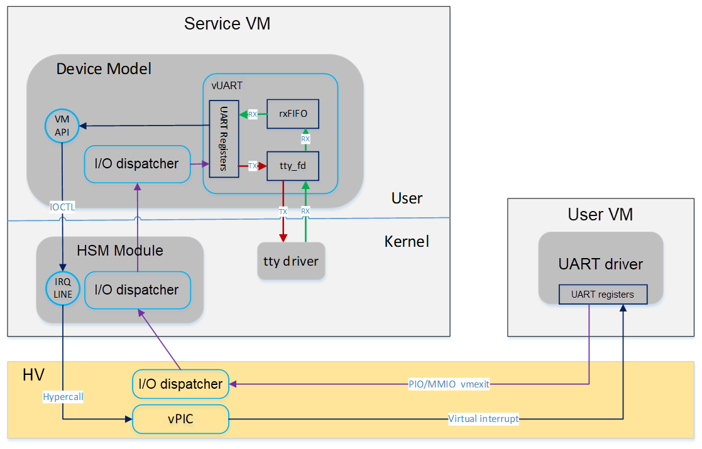

.. _uart_virtualization:

UART Virtualization
###################

In ACRN, UART virtualization is implemented as a fully-emulated device.
In the Service OS (SOS), UART virtualization is implemented in the
hypervisor itself.  In the User OS (UOS), UART virtualization is
implemented in the Device Model (DM), and is the primary topic of this
document.  We'll summarize differences between the hypervisor and DM
implementations at the end of this document.

UART emulation is a typical full-emulation implementation and is a
good example to learn about I/O emulation in a virtualized environment.
There is a detailed explanation about the I/O emulation flow in
ACRN in :ref:`ACRN-io-mediator`.

Architecture
************

The ACRN DM architecture for UART virtualization is shown here:

   Device Model's UART virtualization architecture

There are three objects used to emulate one UART device in DM:
UART registers, rxFIFO, and backend tty devices.

**UART registers** are emulated by member variables in struct
``uart_vdev``, one variable for each register. These variables are used
to track the register status programed by the frontend driver. The
handler of each register depends on the register's functionality.

A **FIFO** is implemented to emulate RX. Normally characters are read
from the backend tty device when available, then put into the rxFIFO.
When the Guest application tries to read from the UART, the access to
register ``com_data`` causes a ``vmexit``. Device model catches the
``vmexit`` and emulates the UART by returning one character from rxFIFO.

.. note:: When ``com_fcr`` is available, the Guest application can write
   ``0`` to this register to disable rxFIFO. In this case the rxFIFO in
   device model degenerates to a buffer containing only one character.

When the Guest application tries to send a character to the UART, it
writes to the ``com_data`` register, which will cause a ``vmexit`` as
well.  Device model catches the ``vmexit`` and emulates the UART by
redirecting the character to the **backend tty device**.

The UART device emulated by the ACRN device model is connected to the system by
the LPC bus. In the current implementation, two channel LPC UARTs are I/O mapped to
the traditional COM port addresses of 0x3F8 and 0x2F8. These are defined in
global variable ``uart_lres``.

There are two options needed for configuring the UART in the ``acrn-dm``
command line. First, the LPC is defined as a PCI device::

   -s 1:0,lpc

The other option defines a UART port::

   -l com1,stdio

The first parameter here is the name of the UART (must be "com1" or
"com2"). The second parameter is species the backend
tty device: ``stdio`` or a path to the dedicated tty device
node, for example ``/dev/pts/0``.

If you are using a specified tty device, find the name of the terminal
connected to standard input using the ``tty`` command (e.g.,
``/dev/pts/1``).  Use this name to define the UART port on the acrn-dm
command line, for example::

   -l com1,/dev/pts/1

When acrn-dm starts, ``pci_lpc_init`` is called as the callback of the
``vdev_init`` of the PCI device given on the acrn-dm command line.
Later, ``lpc_init`` is called in ``pci_lpc_init``. ``lpc_init`` iterates
on the available UART instances defined on the command line and
initializes them one by one.  ``register_inout`` is called on the port
region of each UART instance, enabling access to the UART ports to be
routed to the registered handler.

In the case of UART emulation, the registered handlers are ``uart_read``
and ``uart_write``.

A similar virtual UART device is implemented in the hypervisor.
Currently UART16550 is owned by the hypervisor itself and is used for
debugging purposes.  (The UART properties are configured by parameters
to the hypervisor command line.) The hypervisor emulates a UART device
with 0x3F8 address to the SOS and acts as the SOS console. The general
emulation is the same as used in the device model, with the following
differences:

-  PIO region is directly registered to the vmexit handler dispatcher via
   ``vuart_register_io_handler``

-  Two FIFOs are implemented, one for RX, the other of TX

-  RX flow:

   -  Characters are read from the UART HW into a 2048-byte sbuf,
      triggered by ``console_read``

   -  Characters are read from the sbuf and put to rxFIFO,
      triggered by ``vuart_console_rx_chars``

   -  A virtual interrupt is sent to the SOS that triggered the read,
      and characters from rxFIFO are sent to the SOS by emulating a read
      of register ``UART16550_RBR``

-  TX flow:

   -  Characters are put into txFIFO by emulating a write of register
      ``UART16550_THR``

   -  Characters in txFIFO are read out one by one, and sent to the console
      by printf, triggered by ``vuart_console_tx_chars``

   -  Implementation of printf is based on the console, which finally sends
      characters to the UART HW by writing to register ``UART16550_RBR``
