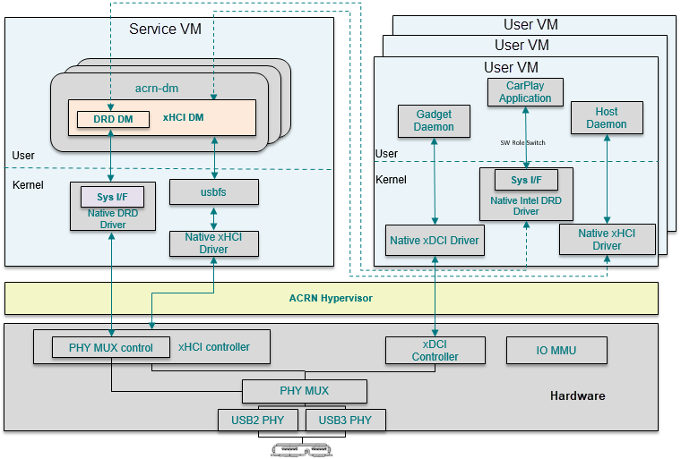
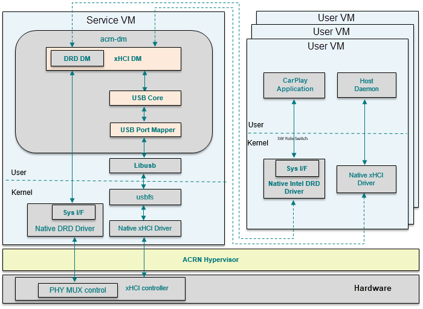
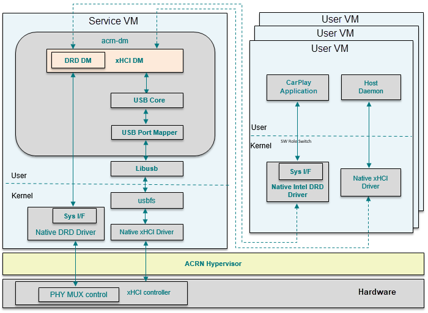

.. _usb_virtualization:

USB Virtualization
##################

Universal Serial Bus (USB) is an industry standard that
establishes specifications for cables, connectors, and protocols for
connection, communication, and power supply between personal computers
and their peripheral devices.

   USB architecture overview

The ACRN USB virtualization includes
emulation of three components, described here and shown in
:numref:`usb-virt-arch`:

- **xHCI DM** (Host Controller Interface) provides multiple
  instances of virtual xHCI controllers to share among multiple User
  OSes, each USB port can be assigned and dedicated to a VM by user
  settings.

- **xDCI controller** (Device Controller Interface)
  can be passed through to the
  specific User OS with I/O MMU assistance.

- **DRD DM** (Dual Role Device) emulates the PHY MUX control
  logic. The sysfs interface in UOS is used to trap the switch operation
  into DM, and the the sysfs interface in SOS is used to operate on the physical
  registers to switch between DCI and HCI role.

  On Intel Apollo Lake platform, the sysfs interface path is
  ``/sys/class/usb_role/intel_xhci_usb_sw/role``. If user echos string
  ``device`` to role node, the usb phy will be connected with xDCI controller as
  device mode. Similarly, by echoing ``host``, the usb phy will be
  connected with xHCI controller as host mode.

An xHCI register access from UOS will induce EPT trap from UOS to
DM, and the xHCI DM or DRD DM will emulate hardware behaviors to make
the subsystem run.

USB devices supported by USB mediator
*************************************

The following USB devices are supported for the WaaG and LaaG operating systems.

+--------------+---------+---------+
| Device       | WaaG OS | LaaG OS |
+==============+=========+=========+
| USB Storage  |   Y     |   Y     |
+--------------+---------+---------+
| USB Mouse    |   Y     |   Y     |
+--------------+---------+---------+
| USB Keyboard |   Y     |   Y     |
+--------------+---------+---------+
| USB Camera   |   Y     |   Y     |
+--------------+---------+---------+
| USB Headset  |   Y     |   Y     |
+--------------+---------+---------+
| USB Hub      |   Y     |   Y     |
| (20 ports max|         |         |
| per VM)      |         |         |
+--------------+---------+---------+

.. note::
   The above information is current as of ACRN 1.4.

USB host virtualization
***********************

USB host virtualization is implemented as shown in
:numref:`xhci-dm-arch`:

   xHCI DM software architecture

The yellow-colored components make up the ACRN USB stack supporting xHCI
DM:

- **xHCI DM** emulates the xHCI controller logic following the xHCI spec;

- **USB core** is a middle abstract layer to isolate the USB controller
  emulators and USB device emulators.

- **USB Port Mapper** maps the specific native physical USB
       ports to virtual USB ports. It communicate with
       native USB ports though libusb.

All the USB data buffers from UOS (User OS) are in the form of TRB
(Transfer Request Blocks), according to xHCI spec. xHCI DM will fetch
these data buffers when the related xHCI doorbell registers are set.
These data will convert to *struct usb_data_xfer* and, through USB core,
forward to the USB port mapper module which will communicate with native USB
stack over libusb.

The device model configuration command syntax for xHCI is as follows::

   -s <slot>,xhci,[bus1-port1,bus2-port2]

- *slot*: virtual PCI slot number in DM
- *bus-port*: specify which physical USB ports need to map to UOS.

A simple example::

   -s 7,xhci,1-2,2-2

This configuration means the virtual xHCI will appear in PCI slot 7
in UOS, and any physical USB device attached on 1-2 or 2-2 will be
detected by UOS and used as expected.

USB DRD virtualization
**********************

USB DRD (Dual Role Device) emulation works as shown in this figure:

   xHCI DRD DM software architecture

ACRN emulates the DRD hardware logic of an Intel Apollo Lake platform to
support the dual role requirement. The DRD feature is implemented as xHCI
vendor extended capability.  ACRN emulates
the same way, so the native driver can be reused in UOS. When UOS DRD
driver reads or writes the related xHCI extended registers, these access will
be captured by xHCI DM. xHCI DM uses the native DRD related
sysfs interface to do the Host/Device mode switch operations.

The device model configuration command syntax for xHCI DRD is as
follows::

   -s <slot>,xhci,[bus1-port1,bus2-port2],cap=platform

- *cap*: cap means virtual xHCI capability. This parameter
       indicates virtual xHCI should emulate the named platform's xHCI
       capabilities.

A simple example::

   -s 7,xhci,1-2,2-2,cap=apl

This configuration means the virtual xHCI should emulate xHCI
capabilities for the Intel Apollo Lake platform, which supports DRD
feature.

Interface Specification
***********************

.. note:: reference doxygen-generated API content
