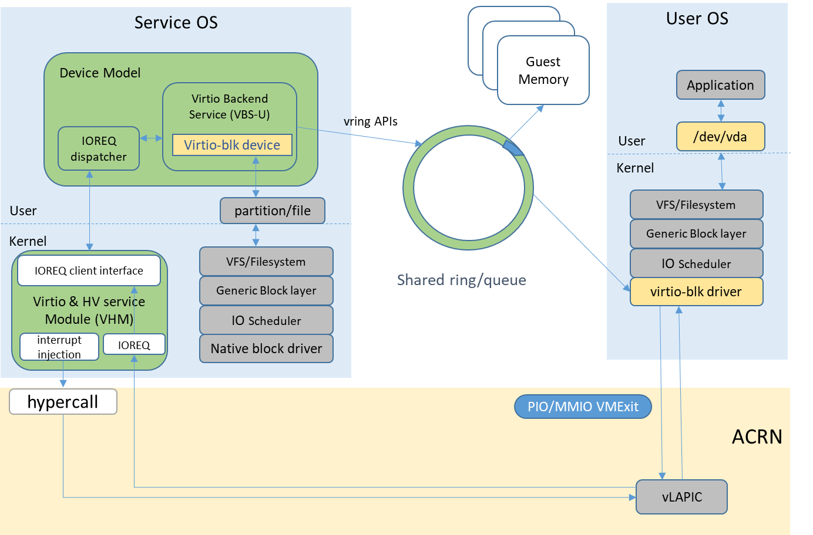

.. _virtio-blk:

Virtio-blk
##########

The virtio-blk device is a simple virtual block device. The FE driver
(in the UOS space) places read, write, and other requests onto the
virtqueue, so that the BE driver (in the SOS space) can process them
accordingly.  Communication between the FE and BE is based on the virtio
kick and notify mechanism.

The virtio device ID of the virtio-blk is ``2``, and it supports one
virtqueue, the size of which is 64, configurable in the source code.

   Virtio-blk architecture

The feature bits supported by the BE device are shown as follows:

``VIRTIO_BLK_F_SEG_MAX``
  Maximum number of segments in a request is in seg_max.
``VIRTIO_BLK_F_BLK_SIZE``
  Block size of disk is in blk_size.
``VIRTIO_BLK_F_TOPOLOGY``
  Device exports information on optimal I/O alignment.
``VIRTIO_RING_F_INDIRECT_DESC``
  Support for indirect descriptors
``VIRTIO_BLK_F_FLUSH``
  Cache flush command support.
``VIRTIO_BLK_F_CONFIG_WCE``
  Device can toggle its cache between writeback and writethrough modes.

Virtio-blk-BE design
********************

The virtio-blk BE device is implemented as a legacy virtio device. Its
backend media could be a file or a partition. The virtio-blk device
supports writeback and writethrough cache mode. In writeback mode,
virtio-blk has good write and read performance. To be safer,
writethrough is set as the default mode, as it can make sure every write
operation queued to the virtio-blk FE driver layer is submitted to
hardware storage.

During initialization, virtio-blk will allocate 64 ioreq buffers in a
shared ring used to store the I/O requests.  The freeq, busyq, and pendq
shown in :numref:`virtio-blk-be` are used to manage requests. Each
virtio-blk device starts 8 worker threads to process request
asynchronously.

Usage:
******

The device model configuration command syntax for virtio-blk is::

   -s <slot>,virtio-blk,[,b,]<filepath>[,options]

- ``b``: when using ``vsbl`` as the virtual bootloader, use this
  immediately after ``virtio-blk`` to specify it as a bootable
  device and the bootable image location.
- ``filepath`` is the path of a file or disk partition
- ``options`` include:

  - ``writethru``: write operation is reported completed only when the
    data has been written to physical storage.
  - ``writeback``: write operation is reported completed when data is
    placed in the page cache. Needs to be flushed to the physical storage.
  - ``ro``: open file with readonly mode.
  - ``sectorsize``: configured as either
    ``sectorsize=<sector size>/<physical sector size>`` or
    ``sectorsize=<sector size>``.
    The default values for sector size and physical sector size are 512
  - ``range``: configured as ``range=<start lba in file>/``
    meaning the virtio-blk will only access part of the file, from the
    ``<start lba in file>`` to ``<start lba in file> + ``.

A simple example for virtio-blk:

1. Prepare a file in SOS folder::

      dd if=/dev/zero of=test.img bs=1M count=1024
      mkfs.ext4 test.img

#. Add virtio-blk in the DM cmdline, slot number should not duplicate
   another device::

      -s 9,virtio-blk,/root/test.img

#. Launch UOS, you can find ``/dev/vdx`` in UOS.

   The ``x`` in ``/dev/vdx`` is related to the slot number used.  If
   If you start DM with two virtio-blks, and the slot numbers are 9 and 10,
   then, the device with slot 9 will be recognized as ``/dev/vda``, and
   the device with slot 10 will be ``/dev/vdb``

#. Mount ``/dev/vdx`` to a folder in the UOS, and then you can access it.

Successful booting of the User OS verifies the correctness of the
device.
