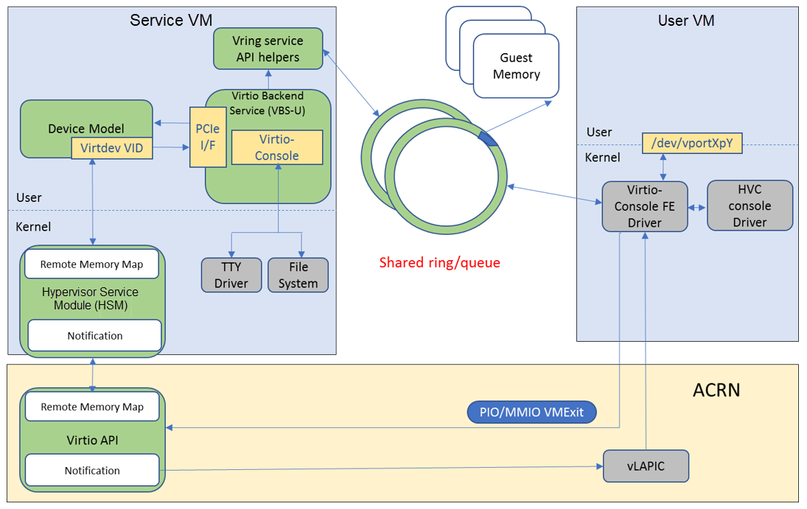

.. _virtio-console:

Virtio-console
##############

The Virtio-console is a simple device for data input and output.  The
console's virtio device ID is ``3`` and can have from 1 to 16 ports.
Each port has a pair of input and output virtqueues used to communicate
information between the Front End (FE) and Back end (BE) drivers.
Currently the size of each virtqueue is 64 (configurable in the source
code).  The FE driver will place empty buffers for incoming data onto
the receiving virtqueue, and enqueue outgoing characters onto the
transmitting virtqueue.

A Virtio-console device has a pair of control IO virtqueues as well. The
control virtqueues are used to communicate information between the
device and the driver, including: ports being opened and closed on
either side of the connection, indication from the host about whether a
particular port is a console port, adding new ports, port
hot-plug/unplug, indication from the guest about whether a port or a
device was successfully added, or a port opened or closed.

The virtio-console architecture diagram in ACRN is shown below.

   Virtio-console architecture diagram

Virtio-console is implemented as a virtio legacy device in the ACRN
device model (DM), and is registered as a PCI virtio device to the guest
OS. No changes are required in the frontend Linux virtio-console except
that the guest (UOS) kernel should be built with
``CONFIG_VIRTIO_CONSOLE=y``.

The virtio console FE driver registers a HVC console to the kernel if
the port is configured as console. Otherwise it registers a char device
named ``/dev/vportXpY`` to the kernel, and can be read and written from
the user space. There are two virtqueues for a port, one is for
transmitting and the other is for receiving. The FE driver places empty
buffers onto the receiving virtqueue for incoming data, and enqueues
outgoing characters onto the transmitting virtqueue.

The virtio console BE driver copies data from the FE's transmitting
virtqueue when it receives a kick on the virtqueue (implemented as a
vmexit).  The BE driver then writes the data to the backend,  and can be
implemented as PTY, TTY, STDIO, and a regular file. BE driver uses
mevent to poll the available data from the backend file descriptor. When
new data is available, the BE driver reads it to the receiving virtqueue
of the FE, followed by an interrupt injection.

The feature bits currently supported by the BE device are:

.. list-table:: Feature bits supported by BE drivers
   :widths: 30 50
   :header-rows: 0

   * - VTCON_F_SIZE(bit 0)
     - configuration columns and rows are valid.
   * - VTCON_F_MULTIPORT(bit 1)
     - device supports multiple ports, and control virtqueues will be used.
   * - VTCON_F_EMERG_WRITE(bit 2)
     - device supports emergency write.

Virtio-console supports redirecting guest output to various backend
devices. Currently the following backend devices are supported in ACRN
device model: STDIO, TTY, PTY and regular file.

The device model configuration command syntax for virtio-console is::

   virtio-console,[@]stdio|tty|pty|file:portname[=portpath]\
      [,[@]stdio|tty|pty|file:portname[=portpath]]

-  Preceding with ``@`` marks the port as a console port, otherwise it is a
   normal virtio serial port

-  The ``portpath`` can be omitted when backend is stdio or pty

-  The ``stdio/tty/pty`` is tty capable, which means :kbd:`TAB` and
   :kbd:`BACKSPACE` are supported, as on a regular terminal

-  When tty is used, please make sure the redirected tty is sleeping,
   (e.g., by ``sleep 2d`` command), and will not read input from stdin before it
   is used by virtio-console to redirect guest output.

-  Claiming multiple virtio serial ports as consoles is supported,
   however the guest Linux OS will only use one of them, through the
   ``console=hvcN`` kernel parameter. For example, the following command
   defines two backend ports, which are both console ports, but the frontend
   driver will only use the second port named ``pty_port`` as its hvc
   console (specified by ``console=hvc1`` in the kernel command
   line)::

      -s n,virtio-console,@tty:tty_port=/dev/pts/0,@pty:pty_port \
      -B "root=/dev/vda2 rw rootwait maxcpus=$2 nohpet console=hvc1 console=ttyS0 ..."

Console Backend Use Cases
*************************

The following sections elaborate on each backend.

STDIO
=====

1. Add a pci slot to the device model (``acrn-dm``) command line::

      -s n,virtio-console,@stdio:stdio_port

#. Add the ``console`` parameter to the guest OS kernel command line::

     console=hvc0

PTY
===

1. Add a pci slot to the device model (``acrn-dm``) command line::

     -s n,virtio-console,@pty:pty_port

#. Add the ``console`` parameter to the guest os kernel command line::

     console=hvc0

   One line of information, such as shown below, will be printed in the terminal
   after ``acrn-dm`` is launched (``/dev/pts/0`` may be different,
   depending on your use case):

   .. code-block: console

      virt-console backend redirected to /dev/pts/0

#. Use a terminal emulator, such as minicom or screen, to connect to the
   tty node::

     minicom -D /dev/pts/0

   or ::

     screen /dev/pts/0

TTY
===

1. Identify your tty that will be used as the UOS console:

   - If you're connected to your device over the network via ssh, use
     the linux ``tty`` command, and it will report the node (may be
     different in your use case)::

        /dev/pts/0
        sleep 2d

   - If you do not have network access to your device, use screen
     to create a new tty::

        screen
        tty

     you will see (depending on your use case)::

        /dev/pts/0

     Prevent the tty from responding by sleeping::

        sleep 2d

     and detach the tty by pressing :kbd:`CTRL-A` :kbd:`d`.

#. Add a pci slot to the device model (``acrn-dm``)  command line
   (changing the ``dev/pts/X`` to match your use case)::

      -s n,virtio-console,@tty:tty_port=/dev/pts/X

#. Add the console parameter to the guest OS kernel command line::

      console=hvc0

#. Go back to the previous tty.  For example, if you're using
   ``screen``, use::

      screen -ls
      screen -r <pid_of_your_tty>

FILE
====

The File backend only supports console output to a file (no input).

1. Add a pci slot to the device model (``acrn-dm``) command line,
   adjusting the ``</path/to/file>`` to your use case::

      -s n,virtio-console,@file:file_port=</path/to/file>

#. Add the console parameter to the guest OS kernel command line::

      console=hvc0
