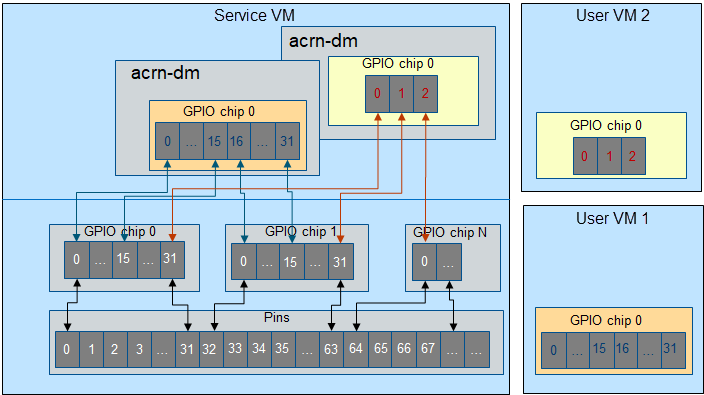

 .. _virtio-gpio:

Virtio-GPIO
###########

Virtio-gpio provides a virtual general-purpose input/output (GPIO) controller
that can map native GPIOs to a User VM. The User VM can perform GPIO operations
through it, including set value, get value, set direction, get direction, and
set configuration. Only Open Source and Open Drain types are currently
supported. GPIOs are often used as IRQs, typically for wakeup events.
Virtio-gpio supports level and edge interrupt trigger modes.

The virtio-gpio architecture is shown below:

   Virtio-gpio Architecture

Virtio-gpio is implemented as a virtio legacy device in the ACRN Device
Model (DM), and is registered as a PCI virtio device to the guest OS. No
changes are required in the frontend Linux virtio-gpio except that the
guest (User VM) kernel should be built with ``CONFIG_VIRTIO_GPIO=y``.

Three virtqueues are used between FE and BE, one for GPIO
operations, one for IRQ requests, and one for IRQ event notification.

The virtio-gpio FE driver registers a gpiochip and irqchip when it is
probed. BE generates the base and number of GPIOs. Each
gpiochip or irqchip operation (for example, get_direction of gpiochip or
irq_set_type of irqchip) triggers a virtqueue_kick on its own
virtqueue. If a GPIO has been set to interrupt mode, the interrupt
events are handled within the IRQ virtqueue callback.

GPIO Mapping
************

   GPIO mapping

-  Each User VM has only one GPIO chip instance. The number of GPIOs is
   based on the acrn-dm command line. The GPIO base always starts from 0.

-  Each GPIO is exclusive. A User VM can't map the same native GPIO.

-  For each acrn-dm, the maximum number of GPIOs is 64.

Usage
*****

Add the following parameters into the command line::

        -s <slot>,virtio-gpio,<@controller_name{offset|name[=mapping_name]:offset|name[=mapping_name]:...}@controller_name{...}...]>

-  **controller_name**: Input ``ls /sys/bus/gpio/devices`` to check native
   GPIO controller information. Usually, the devices represent the
   controller_name, and you can use it as controller_name directly. You can
   also input ``cat /sys/bus/gpio/device/XXX/dev`` to get a device ID that can
   be used to match ``/dev/XXX``, then use XXX as the controller_name. On MRB
   and Intel NUC platforms, the controller_name values are gpiochip0, gpiochip1,
   gpiochip2.gpiochip3.

-  **offset|name**: You can use the GPIO offset or its name to locate one
   native GPIO within the GPIO controller.

-  **mapping_name**: This parameter is optional. If you want to use a customized
   name for a FE GPIO, you can set a new name for a FE virtual GPIO.

Example
*******

-  Map three native GPIOs to the User VM. They are native gpiochip0 with
   offset of 1 and 6, and with the name ``reset``. In the User VM, the three
   GPIOs have no name, and base starts from 0::

        -s 10,virtio-gpio,@gpiochip0{1:6:reset}

-  Map four native GPIOs to the User VM. The native gpiochip0's GPIO with offset
   1 and offset 6 map to FE virtual GPIO with offset 0 and offset 1 without
   names. The native gpiochip0's GPIO with name ``reset`` maps to FE virtual
   GPIO with offset 2 and its name is ``shutdown``. The native gpiochip1's GPIO
   with offset 0 maps to FE virtual GPIO with offset 3 and its name is
   ``reset``::

        -s 10,virtio-gpio,@gpiochip0{1:6:reset=shutdown}@gpiochip1{0=reset}
