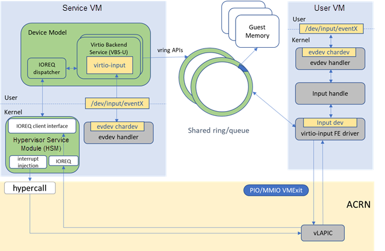

.. _virtio-input:

Virtio-input
############

The virtio input device can be used to create virtual human interface
devices such as keyboards, mice, and tablets. It basically sends Linux
input layer events over virtio.

The ACRN Virtio-input architecture is shown below.

   Virtio-input Architecture on ACRN

Virtio-input is implemented as a virtio modern device in ACRN device
model. It is registered as a PCI virtio device to guest OS. No changes
are required in frontend Linux virtio-input except that guest kernel
must be built with ``CONFIG_VIRTIO_INPUT=y``.

Two virtqueues are used to transfer input_event between FE and BE. One
is for the input_events from BE to FE, as generated by input hardware
devices in SOS. The other is for status changes from FE to BE, as
finally sent to input hardware device in SOS.

At the probe stage of FE virtio-input driver, a buffer (used to
accommodate 64 input events) is allocated together with the driver data.
Sixty-four descriptors are added to the event virtqueue. One descriptor
points to one entry in the buffer. Then a kick on the event virtqueue is
performed.

Virtio-input BE driver in device model uses mevent to poll the
availability of the input events from an input device thru evdev char
device. When an input event is available, BE driver reads it out from the
char device and caches it into an internal buffer until an EV_SYN input
event with SYN_REPORT is received. BE driver then copies all the cached
input events to the event virtqueue, one by one. These events are added by
the FE driver following a notification to FE driver, implemented
as an interrupt injection to UOS.

For input events regarding status change, FE driver allocates a
buffer for an input event and adds it to the status virtqueue followed
by a kick. BE driver reads the input event from the status virtqueue and
writes it to the evdev char device.

The data transferred between FE and BE is organized as struct
input_event:

.. code-block:: c

   struct input_event {
      struct timeval time;
      __u16 type;
      __u16 code;
      __s32 value;
   };

A structure virtio_input_config is defined and used as the
device-specific configuration registers. To query a specific piece of
configuration information FE driver sets "select" and "subsel"
accordingly. Information size is returned in "size" and information data
is returned in union "u":

.. code-block:: c

   struct virtio_input_config {
      uint8_t select;
      uint8_t subsel;
      uint8_t size;
      uint8_t reserved[5];
      union {
         char string[128];
         uint8_t bitmap[128];
         struct virtio_input_absinfo abs;
         struct virtio_input_devids ids;
       } u;
   };

Read/Write to these registers results in a vmexit and cfgread/cfgwrite
callbacks in struct virtio_ops are called finally in device model.
Virtio-input BE in device model issues ioctl to evdev char device
according to the "select" and "subselect" registers to get the
corresponding device capabilities information from kernel and return
these information to guest OS.

All the device-specific configurations are obtained by FE driver at
probe stage. Based on these information virtio-input FE driver registers
an input device to the input subsystem.

The general command syntax is::

   -s n,virtio-input,/dev/input/eventX[,serial]

-  /dev/input/eventX is used to specify the evdev char device node in
   SOS.

-  "serial" is an optional string. When it is specified it will be used
   as the Uniq of guest virtio input device.
