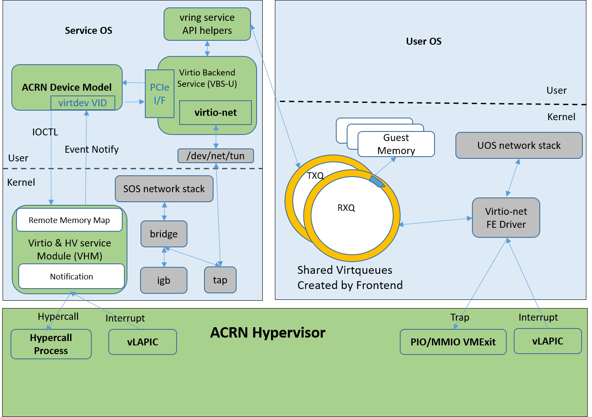

.. _virtio-net:

Virtio-net
##########

Virtio-net is the para-virtualization solution used in ACRN for
networking. The ACRN device model emulates virtual NICs for User VM and the
frontend virtio network driver, simulating the virtual NIC and following
the virtio specification. (Refer to :ref:`introduction` and
:ref:`virtio-hld` background introductions to ACRN and Virtio.)

Here are some notes about Virtio-net support in ACRN:

- Legacy devices are supported, modern devices are not supported
- Two virtqueues are used in virtio-net: RX queue and TX queue
- Indirect descriptor is supported
- TAP backend is supported
- Control queue is not supported
- NIC multiple queues are not supported

Network Virtualization Architecture
***********************************

ACRN's network virtualization architecture is shown below in
:numref:`net-virt-arch`, and illustrates the many necessary network
virtualization components that must cooperate for the User VM to send and
receive data from the outside world.

   Network Virtualization Architecture

(The green components are parts of the ACRN solution, while the gray
components are parts of the Linux kernel.)

Let's explore these components further.

Service VM/User VM Network Stack:
   This is the standard Linux TCP/IP stack, currently the most
   feature-rich TCP/IP implementation.

virtio-net Frontend Driver:
   This is the standard driver in the Linux Kernel for virtual Ethernet
   devices. This driver matches devices with PCI vendor ID 0x1AF4 and PCI
   Device ID 0x1000 (for legacy devices in our case) or 0x1041 (for modern
   devices). The virtual NIC supports two virtqueues, one for transmitting
   packets and the other for receiving packets. The frontend driver places
   empty buffers into one virtqueue for receiving packets, and enqueues
   outgoing packets into another virtqueue for transmission. The size of
   each virtqueue is 1024, configurable in the virtio-net backend driver.

ACRN Hypervisor:
   The ACRN hypervisor is a type 1 hypervisor, running directly on the
   bare-metal hardware, and suitable for a variety of IoT and embedded
   device solutions. It fetches and analyzes the guest instructions, puts
   the decoded information into the shared page as an IOREQ, and notifies
   or interrupts the VHM module in the Service VM for processing.

VHM Module:
   The Virtio and Hypervisor Service Module (VHM) is a kernel module in the
   Service VM acting as a middle layer to support the device model
   and hypervisor. The VHM forwards a IOREQ to the virtio-net backend
   driver for processing.

ACRN Device Model and virtio-net Backend Driver:
   The ACRN Device Model (DM) gets an IOREQ from a shared page and calls
   the virtio-net backend driver to process the request. The backend driver
   receives the data in a shared virtqueue and sends it to the TAP device.

Bridge and TAP Device:
   Bridge and TAP are standard virtual network infrastructures. They play
   an important role in communication among the Service VM, the User VM, and the
   outside world.

IGB Driver:
   IGB is the physical Network Interface Card (NIC) Linux kernel driver
   responsible for sending data to and receiving data from the physical
   NIC.

The virtual network card (NIC) is implemented as a virtio legacy device
in the ACRN device model (DM). It is registered as a PCI virtio device
to the guest OS (User VM) and uses the standard virtio-net in the Linux kernel as
its driver (the guest kernel should be built with
``CONFIG_VIRTIO_NET=y``).

The virtio-net backend in DM forwards the data received from the
frontend to the TAP device, then from the TAP device to the bridge, and
finally from the bridge to the physical NIC driver, and vice versa for
returning data from the NIC to the frontend.

ACRN Virtio-Network Calling Stack
*********************************

Various components of ACRN network virtualization are shown in the
architecture diagram shows in :numref:`net-virt-arch`.  In this section,
we will use User VM data transmission (TX) and reception (RX) examples to
explain step-by-step how these components work together to implement
ACRN network virtualization.

Initialization in Device Model
==============================

**virtio_net_init**

- Present frontend for a virtual PCI based NIC
- Setup control plan callbacks
- Setup data plan callbacks, including TX, RX
- Setup TAP backend

Initialization in virtio-net Frontend Driver
============================================

**virtio_pci_probe**

- Construct virtio device using virtual pci device and register it to
  virtio bus

**virtio_dev_probe --> virtnet_probe --> init_vqs**

- Register network driver
- Setup shared virtqueues

ACRN User VM TX FLOW
====================

The following shows the ACRN User VM network TX flow, using TCP as an
example, showing the flow through each layer:

**User VM TCP Layer**

.. code-block:: c

   tcp_sendmsg -->
       tcp_sendmsg_locked -->
           tcp_push_one -->
               tcp_write_xmit -->
                   tcp_transmit_skb -->

**User VM IP Layer**

.. code-block:: c

   ip_queue_xmit -->
       ip_local_out -->
           __ip_local_out -->
               dst_output -->
                   ip_output -->
                       ip_finish_output -->
                           ip_finish_output2 -->
                               neigh_output -->
                                   neigh_resolve_output -->

**User VM MAC Layer**

.. code-block:: c

   dev_queue_xmit -->
       __dev_queue_xmit -->
           dev_hard_start_xmit -->
               xmit_one -->
                   netdev_start_xmit -->
                       __netdev_start_xmit -->

**User VM MAC Layer virtio-net Frontend Driver**

.. code-block:: c

   start_xmit -->                   // virtual NIC driver xmit in virtio_net
       xmit_skb -->
           virtqueue_add_outbuf --> // add out buffer to shared virtqueue
               virtqueue_add -->

       virtqueue_kick -->           // notify the backend
           virtqueue_notify -->
               vp_notify -->
                   iowrite16 -->    // trap here, HV will first get notified

**ACRN Hypervisor**

.. code-block:: c

   vmexit_handler -->                      // vmexit because VMX_EXIT_REASON_IO_INSTRUCTION
       pio_instr_vmexit_handler -->
           emulate_io -->                  // ioreq cant be processed in HV, forward it to VHM
               acrn_insert_request_wait -->
                   fire_vhm_interrupt -->  // interrupt Service VM, VHM will get notified

**VHM Module**

.. code-block:: c

   vhm_intr_handler -->                          // VHM interrupt handler
       tasklet_schedule -->
           io_req_tasklet -->
               acrn_ioreq_distribute_request --> // ioreq can't be processed in VHM, forward it to device DM
                   acrn_ioreq_notify_client -->
                       wake_up_interruptible --> // wake up DM to handle ioreq

**ACRN Device Model / virtio-net Backend Driver**

.. code-block:: c

   handle_vmexit -->
       vmexit_inout -->
           emulate_inout -->
               pci_emul_io_handler -->
                   virtio_pci_write -->
                       virtio_pci_legacy_write -->
                           virtio_net_ping_txq -->       // start TX thread to process, notify thread return
                               virtio_net_tx_thread -->  // this is TX thread
                                   virtio_net_proctx --> // call corresponding backend (tap) to process
                                       virtio_net_tap_tx -->
                                           writev -->    // write data to tap device

**Service VM TAP Device Forwarding**

.. code-block:: c

   do_writev -->
       vfs_writev -->
           do_iter_write -->
               do_iter_readv_writev -->
                   call_write_iter -->
                       tun_chr_write_iter -->
                           tun_get_user -->
                               netif_receive_skb -->
                                   netif_receive_skb_internal -->
                                       __netif_receive_skb -->
                                           __netif_receive_skb_core -->

**Service VM Bridge Forwarding**

.. code-block:: c

   br_handle_frame -->
       br_handle_frame_finish -->
           br_forward -->
               __br_forward -->
                   br_forward_finish -->
                       br_dev_queue_push_xmit -->

**Service VM MAC Layer**

.. code-block:: c

   dev_queue_xmit -->
       __dev_queue_xmit -->
           dev_hard_start_xmit -->
               xmit_one -->
                   netdev_start_xmit -->
                       __netdev_start_xmit -->

**Service VM MAC Layer IGB Driver**

.. code-block:: c

   igb_xmit_frame --> // IGB physical NIC driver xmit function

ACRN User VM RX FLOW
====================

The following shows the ACRN User VM network RX flow, using TCP as an example.
Let's start by receiving a device interrupt. (Note that the hypervisor
will first get notified when receiving an interrupt even in passthrough
cases.)

**Hypervisor Interrupt Dispatch**

.. code-block:: c

   vmexit_handler -->                          // vmexit because VMX_EXIT_REASON_EXTERNAL_INTERRUPT
       external_interrupt_vmexit_handler -->
           dispatch_interrupt -->
               common_handler_edge -->
                  ptdev_interrupt_handler -->
                     ptdev_enqueue_softirq --> // Interrupt will be delivered in bottom-half softirq

**Hypervisor Interrupt Injection**

.. code-block:: c

   do_softirq -->
       ptdev_softirq -->
           vlapic_intr_msi -->     // insert the interrupt into Service VM

   start_vcpu -->                  // VM Entry here, will process the pending interrupts

**Service VM MAC Layer IGB Driver**

.. code-block:: c

   do_IRQ -->
       ...
       igb_msix_ring -->
           igbpoll -->
               napi_gro_receive -->
                   napi_skb_finish -->
                       netif_receive_skb_internal -->
                           __netif_receive_skb -->
                               __netif_receive_skb_core --

**Service VM Bridge Forwarding**

.. code-block:: c

   br_handle_frame -->
       br_handle_frame_finish -->
           br_forward -->
               __br_forward -->
                   br_forward_finish -->
                       br_dev_queue_push_xmit -->

**Service VM MAC Layer**

.. code-block:: c

   dev_queue_xmit -->
       __dev_queue_xmit -->
           dev_hard_start_xmit -->
               xmit_one -->
                   netdev_start_xmit -->
                       __netdev_start_xmit -->

**Service VM MAC Layer TAP Driver**

.. code-block:: c

   tun_net_xmit --> // Notify and wake up reader process

**ACRN Device Model / virtio-net Backend Driver**

.. code-block:: c

   virtio_net_rx_callback -->       // the tap fd get notified and this function invoked
       virtio_net_tap_rx -->        // read data from tap, prepare virtqueue, insert interrupt into the User VM
           vq_endchains -->
               vq_interrupt -->
                   pci_generate_msi -->

**VHM Module**

.. code-block:: c

   vhm_dev_ioctl -->                // process the IOCTL and call hypercall to inject interrupt
       hcall_inject_msi -->

**ACRN Hypervisor**

.. code-block:: c

   vmexit_handler -->               // vmexit because VMX_EXIT_REASON_VMCALL
       vmcall_vmexit_handler -->
           hcall_inject_msi -->     // insert interrupt into User VM
               vlapic_intr_msi -->

**User VM MAC Layer virtio_net Frontend Driver**

.. code-block:: c

   vring_interrupt -->              // virtio-net frontend driver interrupt handler
       skb_recv_done -->            // registered by virtnet_probe-->init_vqs-->virtnet_find_vqs
           virtqueue_napi_schedule -->
               __napi_schedule -->
                   virtnet_poll -->
                       virtnet_receive -->
                           receive_buf -->

**User VM MAC Layer**

.. code-block:: c

   napi_gro_receive -->
       napi_skb_finish -->
           netif_receive_skb_internal -->
               __netif_receive_skb -->
                   __netif_receive_skb_core -->

**User VM IP Layer**

.. code-block:: c

   ip_rcv -->
       ip_rcv_finish -->
           dst_input -->
               ip_local_deliver -->
                   ip_local_deliver_finish -->

**User VM TCP Layer**

.. code-block:: c

   tcp_v4_rcv -->
       tcp_v4_do_rcv -->
           tcp_rcv_established -->
               tcp_data_queue -->
                   tcp_queue_rcv -->
                       __skb_queue_tail -->

                   sk->sk_data_ready --> // application will get notified

How to Use TAP Interface
========================

The network infrastructure shown in :numref:`net-virt-infra` needs to be
prepared in the Service VM before we start. We need to create a bridge and at
least one TAP device (two TAP devices are needed to create a dual
virtual NIC) and attach a physical NIC and TAP device to the bridge.

   Network Infrastructure in Service VM

You can use Linux commands (e.g. ip, brctl) to create this network. In
our case, we use systemd to automatically create the network by default.
You can check the files with prefix 50- in the Service VM
``/usr/lib/systemd/network/``:

- `50-acrn.netdev <https://raw.githubusercontent.com/projectacrn/acrn-hypervisor/master/misc/acrnbridge/acrn.netdev>`__
- `50-acrn.network <https://raw.githubusercontent.com/projectacrn/acrn-hypervisor/master/misc/acrnbridge/acrn.network>`__
- `50-tap0.netdev <https://raw.githubusercontent.com/projectacrn/acrn-hypervisor/master/misc/acrnbridge/tap0.netdev>`__
- `50-eth.network <https://raw.githubusercontent.com/projectacrn/acrn-hypervisor/master/misc/acrnbridge/eth.network>`__

When the Service VM is started, run ``ifconfig`` to show the devices created by
this systemd configuration:

.. code-block:: none

   acrn-br0 Link encap:Ethernet HWaddr B2:50:41:FE:F7:A3
      inet addr:10.239.154.43 Bcast:10.239.154.255 Mask:255.255.255.0
      inet6 addr: fe80::b050:41ff:fefe:f7a3/64 Scope:Link
      UP BROADCAST RUNNING MULTICAST MTU:1500 Metric:1
      RX packets:226932 errors:0 dropped:21383 overruns:0 frame:0
      TX packets:14816 errors:0 dropped:0 overruns:0 carrier:0
      collisions:0 txqueuelen:1000
      RX bytes:100457754 (95.8 Mb) TX bytes:83481244 (79.6 Mb)

   tap0 Link encap:Ethernet HWaddr F6:A7:7E:52:50:C6
      UP BROADCAST MULTICAST MTU:1500 Metric:1
      RX packets:0 errors:0 dropped:0 overruns:0 frame:0
      TX packets:0 errors:0 dropped:0 overruns:0 carrier:0
      collisions:0 txqueuelen:1000
      RX bytes:0 (0.0 b) TX bytes:0 (0.0 b)

   enp3s0 Link encap:Ethernet HWaddr 98:4F:EE:14:5B:74
      inet6 addr: fe80::9a4f:eeff:fe14:5b74/64 Scope:Link
      UP BROADCAST RUNNING MULTICAST MTU:1500 Metric:1
      RX packets:279174 errors:0 dropped:0 overruns:0 frame:0
      TX packets:69923 errors:0 dropped:0 overruns:0 carrier:0
      collisions:0 txqueuelen:1000
      RX bytes:107312294 (102.3 Mb) TX bytes:87117507 (83.0 Mb)
      Memory:82200000-8227ffff

   lo Link encap:Local Loopback
      inet addr:127.0.0.1 Mask:255.0.0.0
      inet6 addr: ::1/128 Scope:Host
      UP LOOPBACK RUNNING MTU:65536 Metric:1
      RX packets:16 errors:0 dropped:0 overruns:0 frame:0
      TX packets:16 errors:0 dropped:0 overruns:0 carrier:0
      collisions:0 txqueuelen:1000
      RX bytes:1216 (1.1 Kb) TX bytes:1216 (1.1 Kb)

Run ``brctl show`` to see the bridge ``acrn-br0`` and attached devices:

.. code-block:: none

   bridge name   bridge id STP       enabled   interfaces

   acrn-br0      8000.b25041fef7a3   no        tap0
                                               enp3s0

Add a pci slot to the device model acrn-dm command line (mac address is
optional):

.. code-block:: none

    -s 4,virtio-net,<tap_name>,[mac=<XX:XX:XX:XX:XX:XX>]

When the User VM is launched, run ``ifconfig`` to check the network. enp0s4r
is the virtual NIC created by acrn-dm:

.. code-block:: none

   enp0s4 Link encap:Ethernet HWaddr 00:16:3E:39:0F:CD
      inet addr:10.239.154.186 Bcast:10.239.154.255 Mask:255.255.255.0
      inet6 addr: fe80::216:3eff:fe39:fcd/64 Scope:Link
      UP BROADCAST RUNNING MULTICAST MTU:1500 Metric:1
      RX packets:140 errors:0 dropped:8 overruns:0 frame:0
      TX packets:46 errors:0 dropped:0 overruns:0 carrier:0
      collisions:0 txqueuelen:1000
      RX bytes:110727 (108.1 Kb) TX bytes:4474 (4.3 Kb)

   lo Link encap:Local Loopback
      inet addr:127.0.0.1 Mask:255.0.0.0
      inet6 addr: ::1/128 Scope:Host
      UP LOOPBACK RUNNING MTU:65536 Metric:1
      RX packets:0 errors:0 dropped:0 overruns:0 frame:0
      TX packets:0 errors:0 dropped:0 overruns:0 carrier:0
      collisions:0 txqueuelen:1000
      RX bytes:0 (0.0 b) TX bytes:0 (0.0 b)

How to Use MacVTap Interface
============================
In addition to TAP interface, ACRN also supports MacVTap interface.
MacVTap replaces the combination of the TAP and bridge drivers with
a single module based on MacVLan driver. With MacVTap, each
virtual network interface is assigned its own MAC and IP address
and is directly attached to the physical interface of the host machine
to improve throughput and latencies.

Create a MacVTap interface in the Service VM as shown here:

.. code-block:: none

   sudo ip link add link eth0 name macvtap0 type macvtap

where ``eth0`` is the name of the physical network interface, and
``macvtap0`` is the name of the MacVTap interface being created. (Make
sure the MacVTap interface name includes the keyword ``tap``.)

Once the MacVTap interface is created, the User VM can be launched by adding
a PCI slot to the device model acrn-dm as shown below.

.. code-block:: none

   -s 4,virtio-net,<macvtap_name>,[mac=<XX:XX:XX:XX:XX:XX>]

Performance Estimation
======================

We've introduced the network virtualization solution in ACRN, from the
top level architecture to the detailed TX and RX flow.  Currently, the
control plane and data plane are all processed in ACRN device model,
which may bring some overhead. But this is not a bottleneck for 1000Mbit
NICs or below. Network bandwidth for virtualization can be very close to
the native bandwidth. For high speed NIC (e.g.  10Gb or above), it is
necessary to separate the data plane from the control plane. We can use
vhost for acceleration. For most IoT scenarios, processing in user space
is simple and reasonable.

