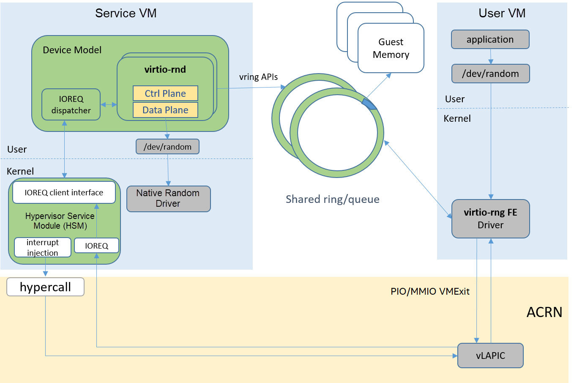

.. _virtio-rnd:

Virtio-rnd
##########

Virtio-rnd provides a virtual hardware random source for the UOS. It simulates a PCI device
followed by a virtio specification, and is implemented based on the virtio user mode framework.

Architecture
************

:numref:`virtio-rnd-arch` shows the Random Device Virtualization Architecture in ACRN.
The green components are parts of the ACRN solution while the gray
components are parts of Linux software or third party tools.

virtio-rnd is implemented as a virtio legacy device in the ACRN device
model (DM), and is registered as a PCI virtio device to the guest OS
(UOS). Tools such as :command:`od` (dump a file in octal or other format) can
be used to read random values from ``/dev/random``.  This device file in the
UOS is bound with the frontend virtio-rng driver. (The guest kernel must
be built with ``CONFIG_HW_RANDOM_VIRTIO=y``). The backend
virtio-rnd reads the HW random value from ``/dev/random`` in the SOS and sends
them to the frontend.

   Virtio-rnd Architecture on ACRN

How to Use
**********

Add a pci slot to the device model acrn-dm command line; for example::

   -s <slot_number>,virtio-rnd

Check to see if the frontend virtio_rng driver is available in the UOS:

.. code-block:: console

   # cat /sys/class/misc/hw_random/rng_available
   virtio_rng.0

Check to see if the frontend virtio_rng is currently connected to ``/dev/random``:

.. code-block:: console

   # cat /sys/class/misc/hw_random/rng_current
   virtio_rng.0

Read random values:

.. code-block:: console

   # od /dev/random
   0000000 007265 175751 147323 164223 060601 057377 027072 106352
   0000020 040765 045645 155773 111724 037572 152033 036001 056073
   0000040 057164 065021 024005 031500 156630 026635 022440 000127
   0000060 115071 046756 071656 106721 161340 106726 175275 072403
   0000100 011265 000420 061137 103723 001107 006430 061151 132766
   0000120 166216 015074 100505 015473 057324 102727 005126 051731
   0000140 003727 071115 167622 071407 120301 002616 047451 120733
   0000160 174117 133164 161231 035076 013700 164114 031627 001202
   0000200 011467 055650 016365 140074 060277 150601 043610 006403
   0000220 016170 071666 065540 026615 055073 162363 012002 112371
   0000240 000767 157121 125007 141671 000327 173741 056415 155463
   0000260 105504 066453 152754 136314 175213 063541 001420 053025
   0000300 047631 167425 044125 063176 171334 177234 050063 031640
   ...

.. note:: HW randomness is a precious resource of the system. The
   :command:`od` command will block and wait until randomness is
   available.
